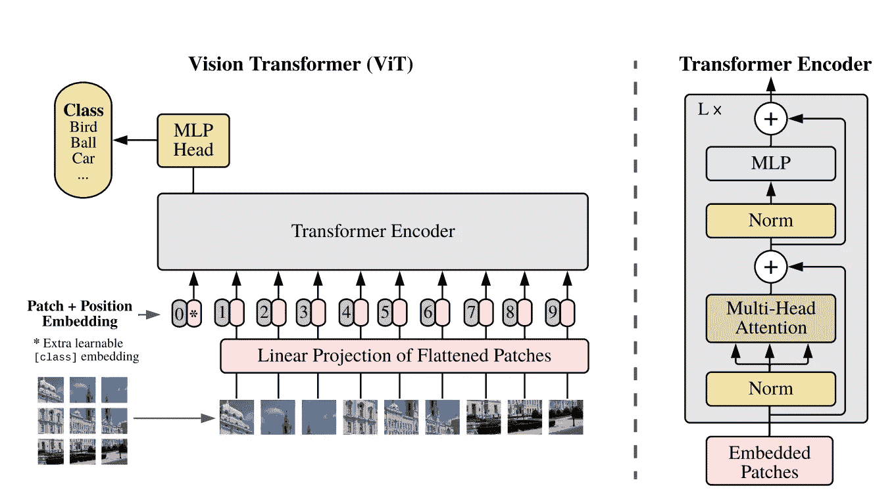
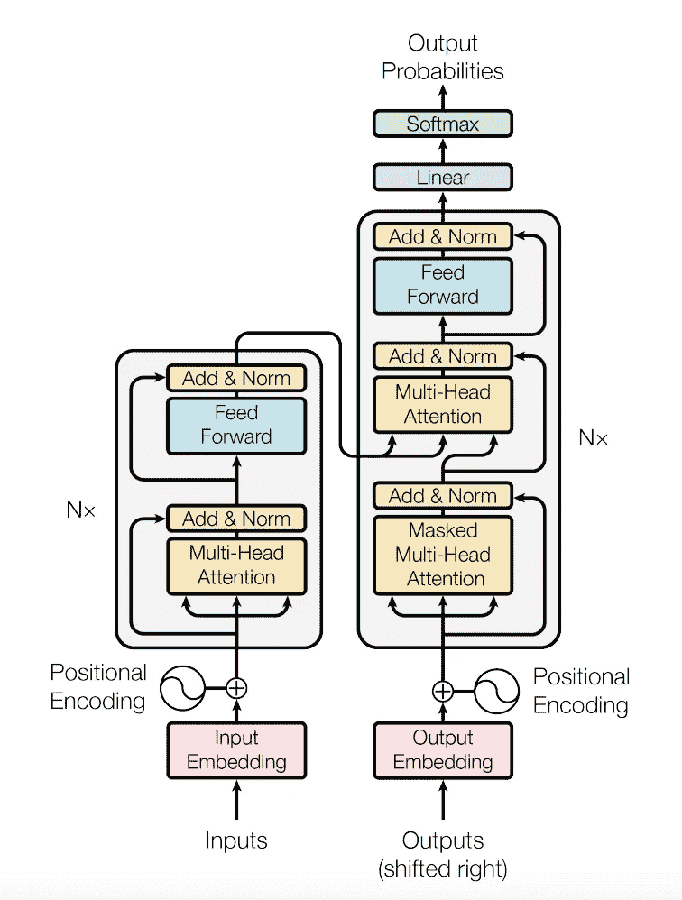

# 视觉转换器:“图像中的注意力”

> 原文：<https://medium.com/analytics-vidhya/vision-transformer-attention-in-images-a86d0a8adc1b?source=collection_archive---------7----------------------->

虽然 NLP 的大部分成功可以归功于 Transformer 架构“注意力是你所需要的”，但它的应用仍然局限于图像分析领域。就计算机视觉而言，CNN 架构仍然是最受欢迎的方法之一。在本文中，我将重点介绍使用图像块作为输入的视觉转换器，以及用于图像分类的转换器架构的编码器部分。最后，我将展示如何使用拥抱脸接口轻松实现这个架构。



一幅图像相当于 16x16 个字:大规模图像识别的变形金刚。arXiv 预印本 arXiv:2010.11929 (2020)。

# 内容:

*   变压器架构
*   视觉变压器
*   Python 实现
*   对比——CNN 与 ViT
*   前进的道路

# 变压器架构



你所需要的只是关注。*神经信息处理系统的进展*。2017.

在深入研究 Vision Transformer 之前，我们需要了解 Transformer 架构的基本概念及其工作原理。我不会深入探讨，但会提到几个对理解视觉转换器很重要的方面。

变压器架构由两部分组成——编码器和解码器。在本文中，我将重点关注转换器的编码器部分，因为这部分将在图像分类任务的视觉转换器中使用。

编码器将嵌入的文本作为输入，将其通过 6 个相同的层，每个层由 2 个子层组成。第一子层是多头自关注机制，第二子层是全连接前馈网络。注意机制可以被视为 3 个加权向量(k，q，v)的列表，每个向量基于输入文本中单词的重要性被分配不同的权重。要了解更多细节，我建议浏览这篇文章:

[](https://becominghuman.ai/attention-is-all-you-need-16bf481d8b5c) [## 你需要的只是关注

### 关于变压器的解释

becominghuman.ai](https://becominghuman.ai/attention-is-all-you-need-16bf481d8b5c) 

# 视觉转换器(ViT)

现在，我们已经了解了标准 transformer 架构是如何工作的，让我们看看如何将它用于图像分类任务。ViT 不是采用 1D 序列的记号嵌入，而是采用位置嵌入和面片嵌入的和，它们是展平的 2D 面片的线性投影的 D 维序列。视觉变换器学习在位置嵌入的相似性中对图像内的距离进行编码，即，更近的片趋向于具有更相似的位置嵌入。自我关注层帮助模型学习信息，甚至从图像的最低层学习信息。最后，编码的输入通过 MLP(多层感知)层，该层预测 K 个类别中的 1 个。

模型训练包括 2 个步骤:在第一步中，模型在大型数据集上进行预训练，然后为了在较小的下游任务上进行微调，预训练的预测头被移除并由 D x K 前馈层代替。

# Python 实现

现在我们已经了解了视觉转换器的工作原理，让我们使用流行的拥抱脸接口来实现一个用于图像分类的基本预训练 ViT 模型。

```
from transformers import ViTFeatureExtractor, ViTForImageClassification
from PIL import Image
import requestsurl = '[https://images.app.goo.gl/9TBrJ5JtD3qYNmQJ9](https://images.app.goo.gl/9TBrJ5JtD3qYNmQJ9)'
image = Image.open(requests.get(url, stream=True).raw)feature_extractor = ViTFeatureExtractor.from_pretrained('google/vit-base-patch16-224')
model = ViTForImageClassification.from_pretrained('google/vit-base-patch16-224')inputs = feature_extractor(images=image, return_tensors="pt")
outputs = model(**inputs)
logits = outputs.logits

predicted_class_idx = logits.argmax(-1).item()
print("Predicted class:", model.config.id2label[predicted_class_idx])
```

上述代码也可以从拥抱脸网站轻松找到:

[](https://huggingface.co/google/vit-base-patch16-224) [## google/vit-base-patch16-224 拥抱脸

### Vision Transformer (ViT)模型在 ImageNet-21k(1400 万张图像，21，843 个类别)上预先训练，分辨率为 224x224…

huggingface.co](https://huggingface.co/google/vit-base-patch16-224) 

上面的代码加载了 ViT 特征提取器和 ViT 图像分类函数，以使用 Google 开源的预训练模型。ViT 特征提取器将图像作为输入，并通过位置嵌入将其转换为 16x16 的面片，以使其适合于输入到模型中。模型“Google/vit-base-patch 16–224”在图像分辨率为 224x224 的 ImageNet 数据集上进行了预训练，用于预测 1000 个 ImageNet 类中的一个。

# 对比——CNN 与 ViT

尽管 Vision transformer 的表现令人难以置信，但它的大部分成功都要归功于大规模的预训练数据集。作者声称，在小数据集上，CNN 的表现仍然比 ViT 好得多，但随着训练数据样本的增加，ViT 优于所有其他状态的 art 模型。

# 前进的道路

现在，由于图像分类变换器模型的存在，可以做更多的探索来改进自监督训练方法。在序列到序列变换器模型中，也可以开发用于对象检测和图像分割任务的基于变换器的方法。最后，ViT 的进一步扩展可以减少微调时间并提高性能。