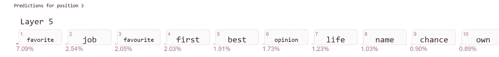
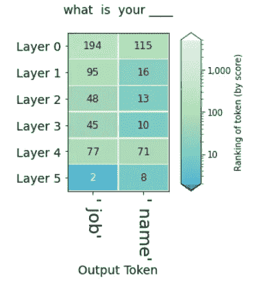
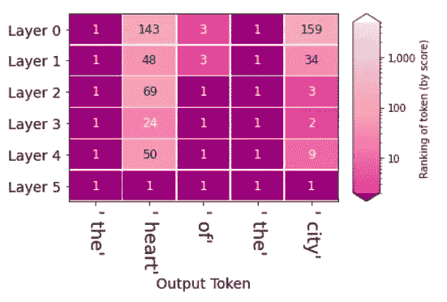
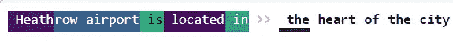
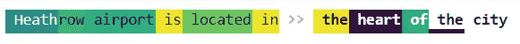

# GPT2 中间步骤的可视化显示

> 原文：<https://medium.com/analytics-vidhya/visual-display-of-intermediate-steps-of-gpt2-13764a5630ea?source=collection_archive---------12----------------------->

因此，在这里，我们首先必须安装 pytorch，然后我们必须安装 ecco。

```
!pip install eccoimport warningswarnings.filterwarnings('ignore')
```

现在我们必须导入我们最近安装的 ecco 库。之后，我们必须加载语言模型，我们可以加载它，有或没有神经元激活。这里我们加载 gpt2 作为我们的语言模型。

```
import eccolm = ecco.from_pretrained('distilgpt2', activations=True)
```

现在我们来看一个不完整的句子，看看 gpt2 如何完成这个句子。

```
text = " What is your "
output_1 = lm.generate(text1, generate=1, do_sample=False)**Output**what is your **>> favorite**
```

在这里，我们只对生成 1 个令牌感兴趣，因此我们提到 generate=1，我们提到 do_sample=False，因此它不会从前 20 个输出中随机给出任何输出，而是选择概率最好的一个作为输出。

```
output_1.layer_predictions(position=3, layer=5, topk=10)
```



这是输出

在这里，我们给出 3 个单词作为输入，它们分别被编号为 0、1 和 2。我们想生成第三个位置字。这里我们看到的是 gpt2 第 5 层的前 10 个概率最高的单词。

我们也可以通过使用下面提到的代码来找出令牌 id

```
lm.tokenizer(" job name")**Output**
{'input_ids': [1693, 1438], 'attention_mask': [1, 1]}
```

在 ecco 库的帮助下，我们可以比较不同级别的不同输出令牌的排名。

```
output_1.rankings_watch(watch=[1693, 1438], position=3)
```



在 watch 中，我们必须给出令牌列表的输入，还必须提到我们想要的输出令牌的位置。

在上面的输出中，我们可以看到 gpt2 模型如何在不同的层中给出不同的等级，在最后一层(即第 5 层)中，job 被给予第 2 等级，name 被给予第 8 等级。

在 gpt2 的帮助下，我们可以生成不止一个单词。让我们用另一个例子来验证一下，这里我们将生成 5 个单词。

```
text = " Heathrow airport is located in"output_2 = lm.generate(text, generate=5, do_sample=False)**Output** Heath row airport is located in **>> the heart of the city**
```

借助 rankings()函数，我们可以可视化所有层中每个输出的排名。

```
output_2.rankings()
```



`saliency()`可视化显示了哪些标记对生成每个输出标记贡献最大(使用渐变 X 输入法)。

```
output_2.saliency()
```



这是用于生成**的**令牌的贡献


这是生成**心脏**令牌的贡献


这是生成令牌**的贡献**



这是对生成**令牌**的贡献

深色表示贡献较大，浅色表示贡献较小。