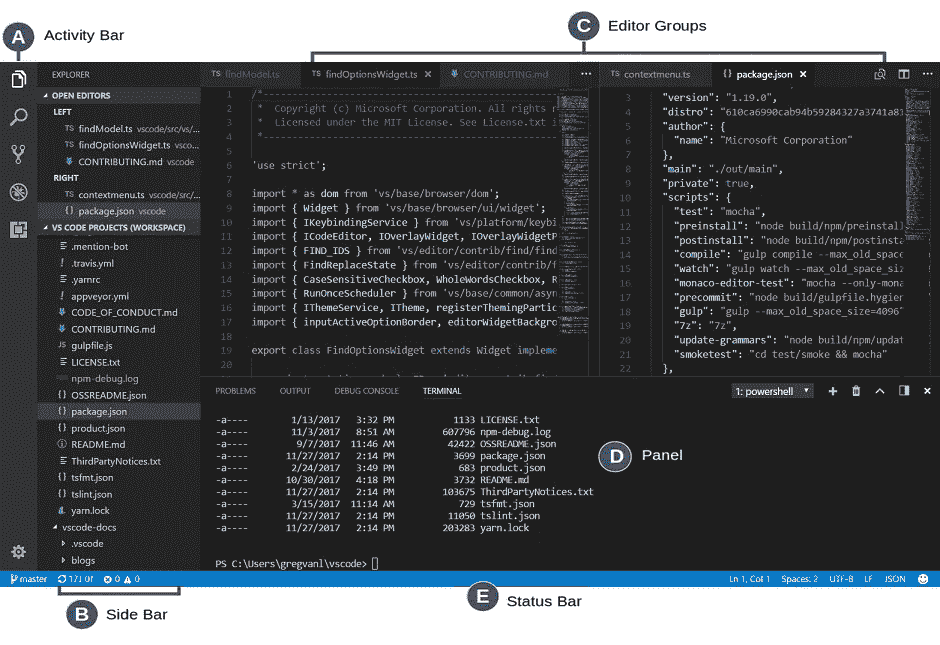
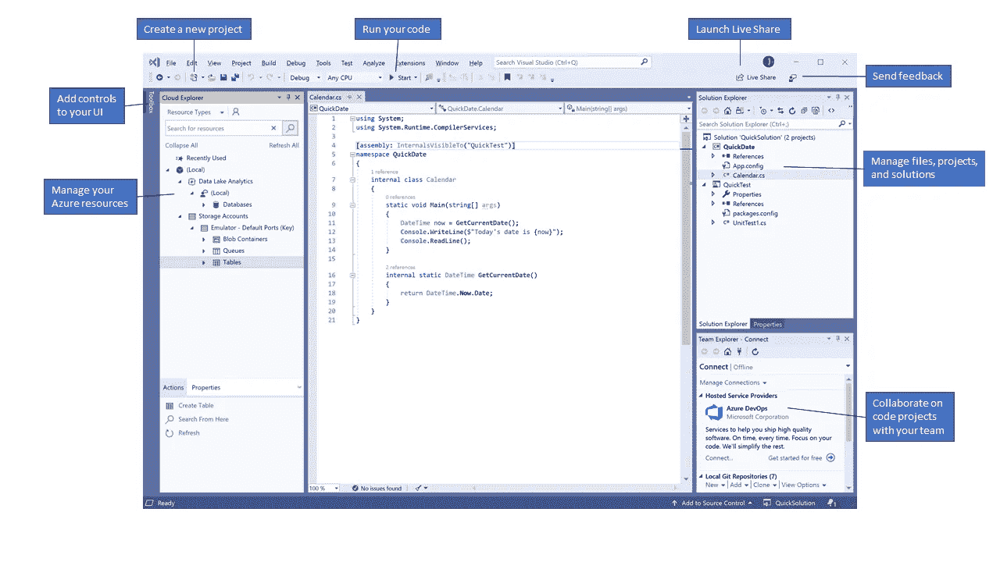

# Visual Studio v/s VS 代码？| IDE 还是编辑器？|找出你需要的！做出明智的选择👍

> 原文：<https://medium.com/analytics-vidhya/visual-studio-v-s-vs-code-ide-or-editor-find-out-what-you-need-make-an-informed-choice-5bb2a4f48ec2?source=collection_archive---------5----------------------->

您是否经常遇到这样一种情况:在编写代码时，您不知道应该使用什么。我们的环境在定义我们是谁以及我们作为一个人如何成长方面起着巨大的作用。因此，类似地，我们的编码环境也影响我们的编码体验，并在定义我们的编码潜力方面起着至关重要的作用。

> 您可能经常会遇到术语 IDE 和编码编辑器。但是你确定你知道它们之间的区别吗？

# IDE 还是代码编辑器？Visual Studio 还是 VS 代码？

如果你以前不知道，那么让我告诉你，VS 代码或 Visual Studio 代码是一个编辑器，而 Visual Studio 是一个 IDE(集成开发环境)。

我提出这个事实是因为 VS 代码感觉更像一个 IDE，而不仅仅是一个编辑器。Visual Studio 是一个 IDE，因为它内置了对编辑器、编译器、解释器、智能感知和许多其他功能的支持，但 VS 代码并不包含所有这些功能。

然而，就像 Visual Studio 允许安装扩展来扩展 IDE 的特性和功能一样，VS 代码也是如此。所以我们可以安装各种扩展来扩展 VS 代码的特性，通过安装不同类型的扩展来满足我们的需要。然而，在 VS 代码的情况下，令人痛苦或者必须单独完成的部分是安装和配置不同的语言支持。但是一旦你完成了，你将进入一个全新的编码体验世界。

# VS 代码

来源: [Visual Studio 代码用户界面](https://code.visualstudio.com/docs/getstarted/userinterface)

这就是我们的编辑器 VS 代码的样子。不要担心颜色，它们是高度可定制的。这就是 VS 代码的基本布局:编辑器、侧边栏、状态栏、活动栏和面板，就像其他现代代码编辑器一样。

# 可视化工作室

来源:[Visual Studio 概述|微软文档](https://docs.microsoft.com/en-us/visualstudio/get-started/visual-studio-ide?view=vs-2019)

这就是我们的 IDE Visual Studio 的样子。这里有不同的资源管理器来探索各种内置的特性集。它们是:

*   [解决方案浏览器](https://docs.microsoft.com/en-us/visualstudio/ide/solutions-and-projects-in-visual-studio?view=vs-2019)查看、导航和管理您的代码文件。
*   [编辑器窗口](https://docs.microsoft.com/en-us/visualstudio/ide/writing-code-in-the-code-and-text-editor?view=vs-2019)用于编写代码或设计界面。*设计界面不能做的就是 VS 代码。*
*   使用 [Git](https://git-scm.com/) 和其他版本控制工具，团队资源管理器跟踪工作项目并与其他人共享代码。

# 微软对 VS 代码有什么看法？

> [如果你喜欢以代码编辑器为中心的开发工具，或者正在构建跨平台的 web 和云应用程序，我们邀请你试用 Visual Studio 代码。](https://code.visualstudio.com/docs/editor/whyvscode) —微软

根据上面的陈述，我们可以得出这样的结论:对于从事 Web 开发的人来说，VS 代码是一个更好的软件工具。VS 代码内置了对使用 JavaScript 和 TypeScript 进行 Node.js 开发的支持。

除此之外，你应该考虑的 VS 代码的特性是它在资源消耗方面是轻量级的，比如 RAM 和处理器的使用。

# 微软对 Visual Studio 的评价？

> Visual Studio *集成开发环境*是一个创造性的发射台，您可以使用它来编辑、调试和构建代码，然后发布应用程序。
> 
> Visual Studio 包括编译器、代码完成工具、图形设计器和许多简化软件开发过程的功能。—微软
> 查看这里: [Visual Studio](https://docs.microsoft.com/en-us/visualstudio/get-started/visual-studio-ide?view=vs-2019)

根据上面的陈述，很明显 Visual Studio 是一个完整的包。它是您完成整个软件开发过程所需的一切，从编辑代码到调试代码，构建代码，甚至发布代码。

# **结论**

> Visual Studio 可以做几乎所有 VS 代码可以做的事情。记住 VS 代码只是一个编辑器，而 Visual Studio 是编辑器加上我们讨论过的其他东西。然而，大多数时候一切都是你所需要的。VS 代码和扩展不亚于一个 IDE。

> 总的来说，VS 代码更多的是一个个性化的 IDE。挑选你需要的，留下你不需要的。

因此，谁应该或不应该使用什么或什么不绝对是一个选择，这取决于某人必须完成的任务的要求或类型。然而，为了简单起见，我将试着把用户分为 VS 代码用户和 Visual Studio 用户。是的，如果你这么做了，你会认为这是对的！我所说的 VS 代码指的是现代的代码编辑器，我所说的 Visual Studio 指的是现代的 IDE。

如果你的系统没有高端规格，那么我宁愿你坚持使用 VS 代码。你可以通过 VS 代码中的扩展来扩展 VS 代码的功能，从而完成很多开发任务。

如果你的系统可以运行一个网页浏览器来阅读一篇文章，那么 VS 代码的最低硬件要求是你的系统绝对可以满足的。但是也要记住，最低要求并不总是执行我们的任务所需要的。最低要求是应用程序运行时只需要基本框架和骨架的要求。扩展也占用自己的内存。

> Visual Studio 代码是小下载(< 100 MB) and has a disk footprint of 200 MB.

> **微软推荐的 VS 代码最低硬件要求:**
> 
> 1.6 GHz 或更快的处理器
> 
> 1 GB 内存

Visual Studio 的最低硬件要求有时会让人不知所措，并给系统带来很大压力。由于 Visual Studio 给系统带来的沉重负担，多任务处理变得很困难。所以仔细分析你是否真的需要一个 IDE。

> 1.8 GHz 或更快的处理器。四核或更好的建议
> 
> 2 GB 内存；建议使用 8 GB 内存(如果在虚拟机上运行，最少 2.5 GB)
> 
> 硬盘空间:最少 800MB，最多 210 GB 的可用空间，具体取决于所安装的功能；典型安装需要 20–50gb 的可用空间。
> 
> 硬盘速度:为了提高性能，请在固态硬盘(SSD)上安装 Windows 和 Visual Studio。
> 
> 支持最低 720 p(1280 x 720)显示分辨率的显卡；Visual Studio 在 WXGA(1366 x 768)或更高的分辨率下效果最佳。

我希望我已经为您提供了足够的细节，以便您在进行一些开发或编程任务时，在 IDE 或编辑器之间做出明智的选择。

感谢您的阅读:)祝您愉快。