# 视觉化，不足以暗示关系；用统计测试来证实它

> 原文：<https://medium.com/analytics-vidhya/visualization-not-enough-to-assess-relationship-between-2-variables-combine-with-statistical-test-2a32a2c99153?source=collection_archive---------9----------------------->

## 视觉化永远不足以得出两个变量之间存在关系的结论。最好是统计确认。

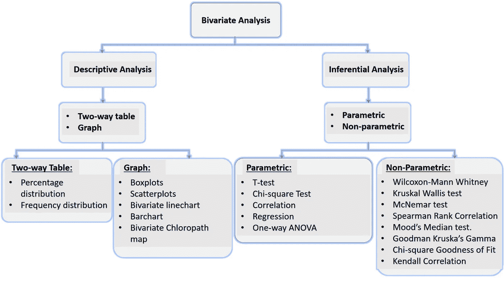

**双变量分析的概念框架。图片由 Akiode Ayobami 拍摄**

当准备用于建模或分析的数据时，一种已知的做法是，对目标特征(Y)和每个预测特征(X)进行数据可视化，这样我们可以**粗略地**查看它们之间是否存在任何关系/关联。事实是，仅使用可视化永远不足以得出任何两个变量之间存在关系/关联的结论。不，不是的。首选标准是将双变量可视化与统计测试相结合。

> ***黄金标准——“使用数据可视化工具(图表/双向表)来可视化两个特征之间可能存在的关系或关联，然后进行统计测试，以从统计上确认视觉模式所暗示的是真是假”***

在本文中，我将带您了解以下内容:

1.  二元分析的整体概念；
2.  双变量分析的类型；
3.  根据参数状态和变量类型选择适当的统计数据。

# 1.二元分析的概念

双变量分析是对两个变量的经验分析，以确定它们之间是否存在关系或关联。它结合使用视觉测试和统计测试，或者至少使用一种方法来完成这项工作。二元分析可以是多元分析的一部分，也可以是独立的。

作为多元分析的一部分，它是建模前预处理活动的关键组成部分。这是为了确保在插入预测建模(逻辑回归、支持向量机、决策树等)之前，插入到建模中的每个预测特征与目标特征具有关系或关联。如果在双变量分析评估期间发现任何预测特征与目标特征(Y)没有关系，则它们不包括在预测建模过程中。

作为一个独立的例子，你可能只想测试两个**变量之间的关联、关系、差异等。**

以下框架强调了双变量分析及其组成部分的概念表示:

**双变量分析的概念框架。图片由 Akiode Ayobami 拍摄**

# 2.双变量分析的类型

双变量分析有两个组成部分——描述性的和推断性的。

## 2.1 描述性双变量分析

这是双变量分析的可视化部分，可以用表格(频率分布、百分比分布)或图形(条形图、散点图、箱线图等)来表示。它暗示了基于视觉模式的两个变量之间的关系或关联。

**2.1.1 双向表双变量分析**是两个变量之间关系的表格(或矩阵)表示。双向表，也称为**列联表**，是一个矩阵形式的表，显示两个相互作用的变量/特征之间观察到的数字。该表有两组标题；第一排一个；另一个在第一列。其中一个头表示两个变量之一的响应类别，而另一个头表示另一个变量的响应类别。

下表显示了两个特征/变量(性别和经济地位)的双向表。可变性别(男性、女性)的响应类别在第一列，另一个可变经济阶层(下层阶级、中层阶级、上层阶级)的响应类别在表格的第一行。

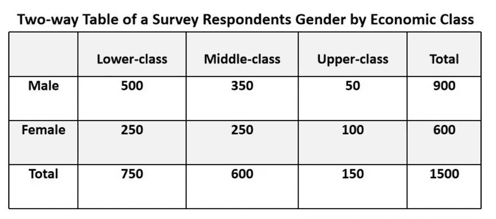

**表 2.1。性别与经济阶层双向表。图片由 Akiode Ayobami** 提供

**双向表的类型**

**频率&百分比分布—** 当一个双向的实际值如上表所示时，称为**频率分布**；当实际值用百分比表示时，称为**百分比分布。**

下面的三联双向表显示了两个变量的频率和百分比分布。表 1 突出了频率分布，而表 2 和表 3 突出了百分比分布。表 2 突出显示了值的列百分比分布，即所有值都转换为列中的百分比，因此每列的总值总和为 100%。表 3 突出显示了值的行百分比分布，即所有值都转换为行中的百分比，因此每行的总值总和为 100%。

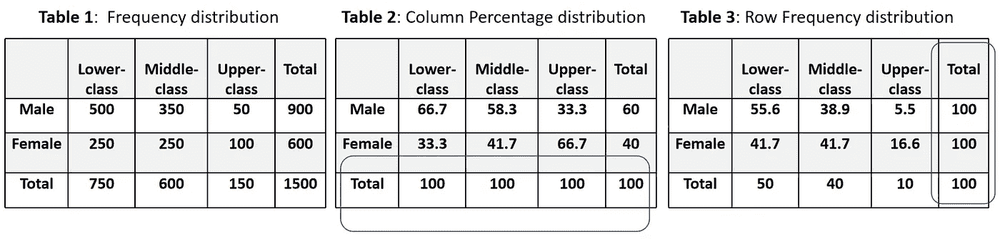

**表 2.2:性别和经济阶层的频率和百分比分布。图片由 Akiode Ayobami 拍摄**

**2.1.2 图形双变量分析**是两个特征(变量)之间关系的图形表示。图表的类型取决于特征的类型(数字、分类或顺序)。

**图形双变量分析的类型**

**箱线图**是分类变量和连续变量之间关系的图形表示。纵轴表示连续变量，横轴表示分类变量。

Boxplots 生成 5 个数字的汇总统计，即最小值(Q0，第 0 百分位)、下四分位数(Q1，第 25 百分位)、中值(Q2，第 50 百分位)、上四分位数(Q3，第 75 百分位)、最大值(Q4，第 100 百分位)，并指示异常值。它还有助于识别连续变量中的异常值。异常值是低于最小值或高于最大值的值。箱线图也可用于单变量(只有一个变量)分析。

> **在数据预处理过程中，识别出的异常值通常会从数据中移除，因为它们在您的分析中构成噪音，并且会通过帮助低估或高估来破坏您的预测模型的质量。**

**四分位数间距(IQR)** 在箱线图中，是上下四分位数之间的距离(Q3-Q1)。IQR 用作离差的一种度量，用于指示连续值的值在平均值附近的分散程度。较高的 IQR 意味着较高的方差，较低的 IQR 意味着较低的方差。

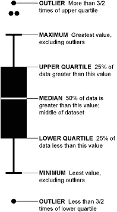

**图 2.1:箱线图的 5 个数字汇总。** [**图像来自流动数据**](https://flowingdata.com/2008/02/15/how-to-read-and-use-a-box-and-whisker-plot/)

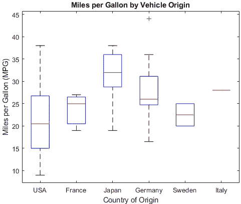

**图 2.2:车辆每加仑行驶英里数的箱线图。图片来自**[**MathWorks**](https://www.mathworks.com/help/stats/boxplot.html)

**散点图**是两个数值变量之间关系的图形表示。它用点来表示关系的模式。

如果它表明关系存在。该关系可以是**正相关关系(** **正相关关系)**或**负相关关系(逆相关关系)。**

正相关关系是指一个变量的增加会导致另一个变量的增加。此外，其中一项的减少会导致另一项的减少。在正关系中，两个变量具有相同的关系取向。负相关关系是指一个变量的减少会导致另一个变量的增加，反之亦然。在反向相关关系中，两个变量具有相反的关系取向。

来直观地评估一段关系是否存在，存在的方向是什么？最好在图表上使用一条**趋势线**。下图(来自 Khan Academy)显示了 X 和 Y 变量的关系方向。左起第一张图表示正相关，中间的图表示负相关，而最后一张图表示无相关。

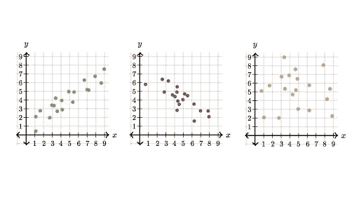

**图 2.3:散点图的模式。** [**图片来自可汗书院**](https://www.khanacademy.org/math/statistics-probability/describing-relationships-quantitative-data/introduction-to-scatterplots/a/scatterplots-and-correlation-review)

**折线图**是分类变量和数值变量之间关系的图形表示。它类似于箱线图，只是所有的点(定义为 x 轴值)都是有序的，并使用一条线按顺序连接在一起。从根本上说，它显示了与时间、季节等相关的分类变量的数值趋势线。

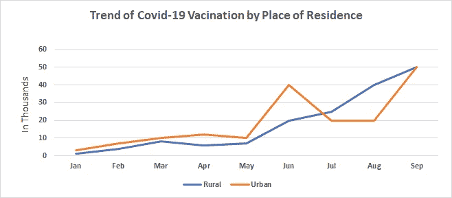

**图 2.4:按居住地类型划分的新冠肺炎疫苗接种趋势。图片由 Akiode Ayobami 拍摄**

**条形图**是两个分类变量之间关系的图形表示。条形用于表示关系的模式。条形图也可以用于单变量(只有一个变量)分析。有两种主要类型的双变量条形图—组条形图和堆积条形图。

**组条形图**是一个分类变量的响应类别分布的可视化表示，由其他使用条形图表示。

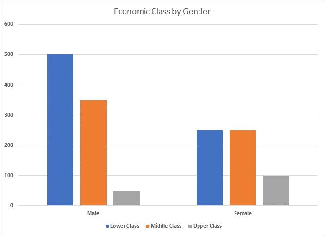

**图 2.5:按性别分列的经济阶层柱状图。图片由 Akiode Ayobami 拍摄**

**堆积条形图**使用单个条形图显示一个分类变量的响应类别在另一个分类变量的每个响应类别上的分布。

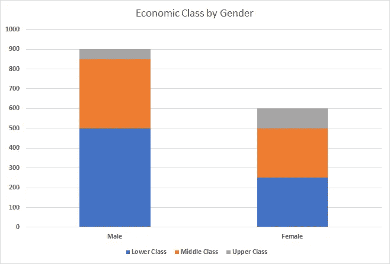

**图 2.6:按性别分列的经济阶层堆积条形图。图片由阿基奥德·阿约巴米**

**双变量等值线图**是两个变量之间关系的地理表示，它引用了两个变量相互作用的位置。它使用地理尺度(程度)和范围来比较两个变量之间的关系。双变量 choropleth 图使用颜色编码级数来表示两个变量的响应类别。

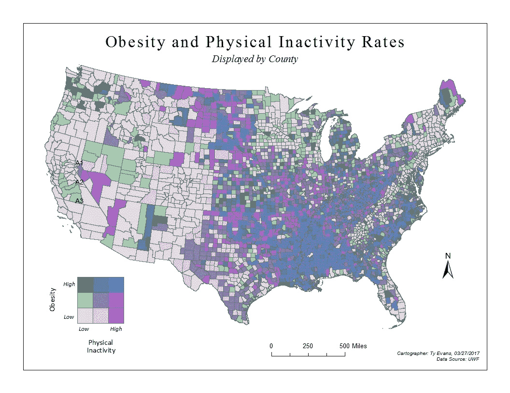

**表 2.7:肥胖和身体不活动率的氯路径分布。** [**图片来自泰的 GIS**](http://tae12uwf.blogspot.com/2017/03/gis-6005-lab-9-bivariate-choropleth.html)

## 2.2 二元推理分析

这是统计方法在确定两个变量之间是否存在关系、关联或差异方面的应用。它应该用来补充描述性双变量分析或单独使用。

> “在任何情况下，最好将描述性双变量分析与推断性双变量统计检验结合起来。”

通过顺序执行以下步骤，实现了推理性的双变量分析:

1.**创建**无效和替代假设。创建零假设，即两个被审查的变量/特征之间不存在关系/关联。此外，创建两个变量之间存在关系/关联的反向替代假设。

2.**选择并使用**适当的统计数据(卡方检验、t 检验、相关性等)及其附属的 p 值(以及置信区间),看看哪些假设应该被接受。

3.**计算**所选的统计数据及其 p 值。

4.**对假设做出决定选择**。根据 p 值决定要选择的假设。如果 **p 值** ≤ 0.05，则接受备选假设(H1)；如果 **p 值** >为 0.05，则接受零假设(Ho)

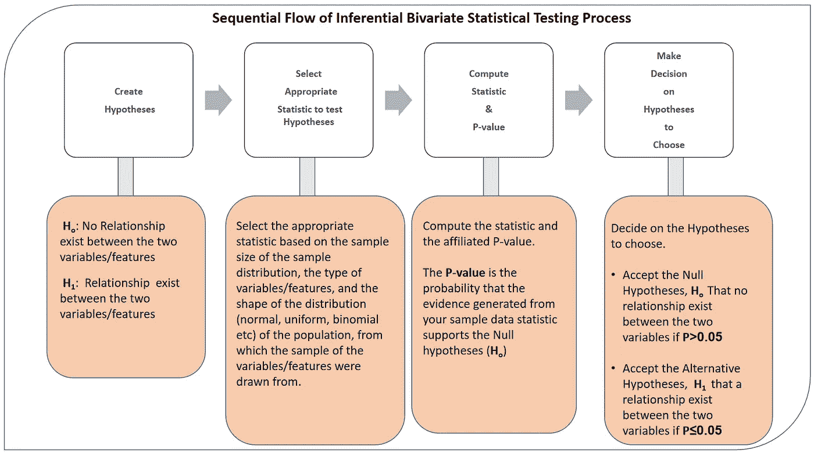

**图 2.8:推断二元统计检验的顺序流程。图片由 Akiode Ayobami 拍摄**

有两种类型的推断二元统计-参数和非参数推断二元分析。

> ***“实际上，要使用的合适的统计量是由被评估数据的参数状态(参数或非参数)以及所涉及的变量类型决定的。”***

**2.2.1 参数推断双变量分析**当两个变量所来自的总体的分布为正态分布或钟形时使用。要使用的参数推断统计取决于变量的类型。

> ***“不管分布如何，如果样本量大于或等于 30(应用中心极限定理)，可以使用参数推断统计。”***

**2.2.2 非参数推断双变量分析**是统计双变量分析方法，用于两个变量所属人群的分布未知或不呈正态分布的情况。当样本分布的样本量小于 30 时，也可以使用它。与参数检验类似，要使用的非参数统计的类型由变量的类型决定。

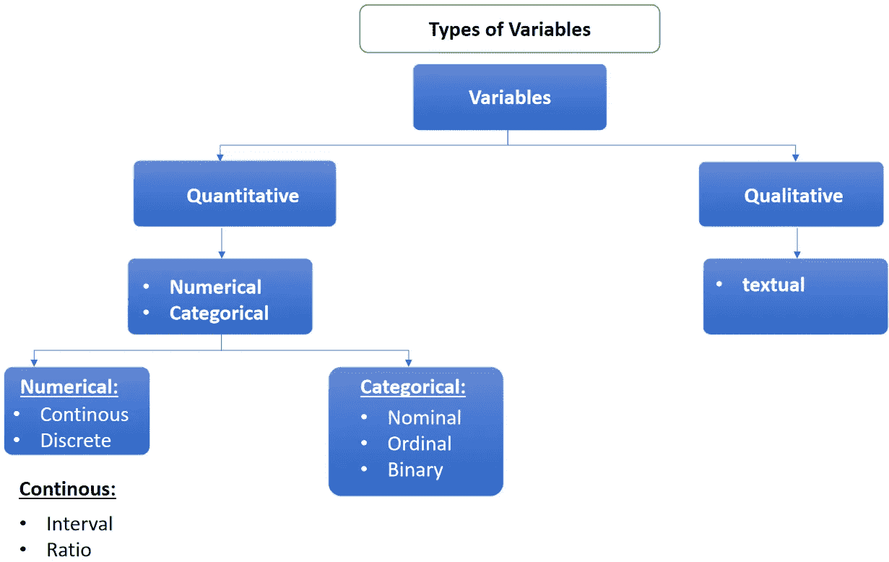

表 2.9:变量的概念框架。图片由 Ayobami Akiode 拍摄

**变量类型**

**定性** —是自然捕获的开放式变量和文本变量，可能有无限多个响应；也就是说，他们的回答自然不会被整理或分类。这些类型的变量主要在定性研究和无监督学习中处理。

**定量**——是自然捕获的封闭变量，具有有限的响应类别；也就是说，他们已经对一些响应类别进行了编码或分类。两种类型的定量变量是——数字变量和分类变量。

**数量变量的种类**

**数字变量—** 是自然捕获为数字的定量变量。例如年龄、国家数量、身高、体重、温度等

**分类变量** —是用有限的一组可能的反应类别自然捕获的定量变量。例如，性别的可能响应类别是男性、女性；经济阶层的可能反应类别是下层阶级、中产阶级和上层阶级。

**数值变量的类型**

**连续变量** —可以用小数自然捕捉的数值变量。它们接受实数值。它们的值通过测量获得。例如身高、体重、温度等。

**离散变量—** 是不能用小数自然捕捉的数值变量，即它们只接受整数值。它们的值是通过计数获得的。例如年龄，比赛次数，租借的阿森纳球员数量。

**分类变量的类型**

**名义变量** —是具有有限可能响应类别的分类变量，对类别没有自然排序。例如，居住地类型有两个响应类别——农村和城市、尼日利亚的州。

**序数变量—** 是具有有限的、自然有序的反应类别的分类变量。序数变量显示了每个类别的权重沿光谱的递增/递减，并用一个数字表示每个响应类别。也就是说，它使用数字来测量和指示定性现象(如满意度测量、学生在班级中的排名等)程度的减少或增加。被测量的定性现象的评级和排序是序数变量的核心基础。序数变量的每两个代理代表数之间的差异并不代表定性现象中的定量差异。有序变量的例子有李克特量表，语义差异量表。

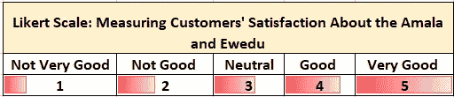

**表 2.10。顾客对 Amala 和 Ewedu 食品满意度的李克特量表。**

**二元变量—** 是具有两个有限响应类别的分类变量，没有自然排序。二元变量是一种只有两个响应类别的标称变量。例如，性别只有两种反应——类别(男性，女性)，居住地类型——农村，城市。

**区间变量—** 是一种特殊类型的**数字** **序数**变量，因为它们的值可以排序，但是，每两个代理值之间的距离已经标准化为相等，并且相同。此外，零值不是绝对的零，而是任意的，即当零值被指示时；这并不意味着这种现象不再存在；它只是在天平上表示一个值。也可以有低于零的值。示例—以摄氏度为单位的温度(2 C，1 C，0，-1 C，-2 C)，pH 刻度(0–6:酸度，7:中性，8-14:碱度)，时间。

**比率变量—** 是具有区间变量特征的数值变量，也以绝对值表示零值。也就是说，当指示为零时，意味着该现象不再存在。比如——体重、年龄、流量、金钱。

## 3.根据参数状态和变量兼容性类型选择适当的统计检验

下表根据参数状态和变量类型，指出了要使用的适当统计测试。

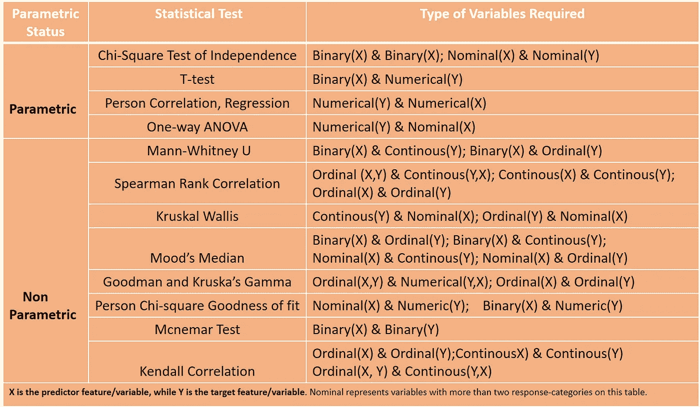

**表 3.1:统计检验参数和变量类型相容性表。图片由阿基奥德·阿约巴米**

## 摘要

在这篇文章中—

1.  我们概念化的双变量分析的不同组成部分。
2.  我们再次强调，双变量分析的黄金标准是— *使用数据可视化工具(图表/双向表)来可视化两个特征之间可能存在的关系或关联，然后进行统计测试，以从统计上确认视觉模式所暗示的是真是假”。*
3.  我们指出，选择正确的双变量统计检验取决于样本数据的参数状态，以及两个变量的变量类型。
4.  我们使用表格强调了不同的双变量统计检验的参数状态和变量类型。

**现在就这样**。希望你觉得这有用？请放下您的评论，在 LinkedIn 上关注我，地址是 [Ayobami Akiode LinkedIn](https://www.linkedin.com/in/ayobami-akiode-38528839/)