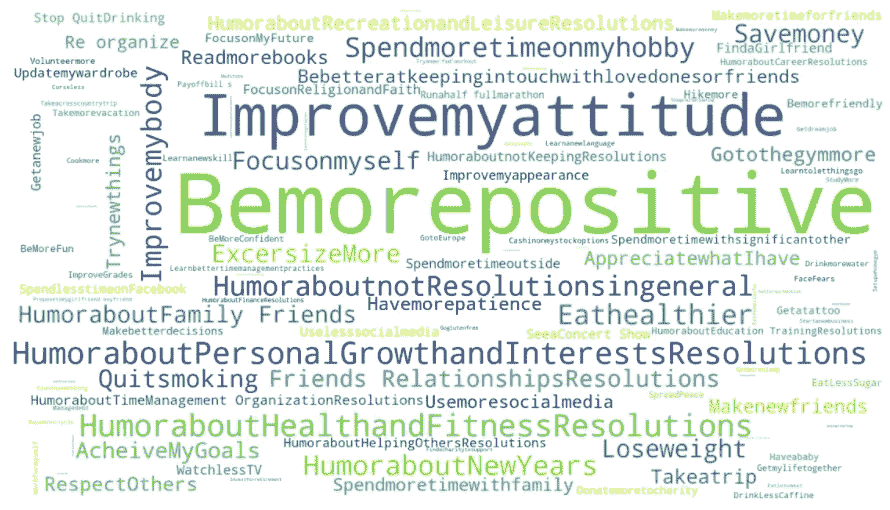
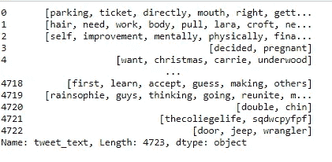

# 新年决心数据集上的可视化和自然语言处理

> 原文：<https://medium.com/analytics-vidhya/visualizations-and-nlp-on-new-year-resolution-dataset-c73a8876a327?source=collection_archive---------11----------------------->

可视化对于以图形、图表或任何其他可视格式的形式向人脑轻松传达洞察力是必不可少的。存在于一个视觉世界中，用图像交流数据是可靠的，以便于解释。

我决定对 Maven Analytics 提供的新年决心推文数据集进行可视化。每行包含一条推文、日期和时间、地理位置、类别、主题等。有了一个定义 tweets 的专栏，我决定也在 Python 中应用 NLP。

让我们从在 Jupyter 笔记本中导入必要的库开始:

```
import pandas as pd
from pandas import DataFrame
from pandas.plotting import scatter_matrix
import matplotlib.pyplot as plt
from matplotlib import rcParams
import plotly.express as px
from plotly.colors import n_colors
import numpy as np
import seaborn as sns
%matplotlib inline
from matplotlib import rc
import scipy.stats
from matplotlib.gridspec import GridSpec
from wordcloud import WordCloud, STOPWORDS 
from nltk.stem.wordnet import WordNetLemmatizer
from textblob import TextBlob
from nltk.sentiment import SentimentAnalyzer
from wordcloud import WordCloud
from nltk.stem import PorterStemmer
from nltk.corpus import stopwords
import plotly.graph_objects as go
```

以下是针对该分析和可视化给出的数据集:


给定的数据帧具有 4723 行和 10 列。为了探究 tweet 类别的流行程度，我用 matplotlib 包创建了一个饼图，并提供了大小、标签和颜色的值。

以下是相关的 python 代码:

```
labels = 'Career', 'Education/Training','Family/Friends/Relationships', 'Finance','Health & Fitness','Humor','Personal Growth','Philanthropic','Recreation & Leisure', 'Time Management/Organization'
sizes = [123,87,327,167,825,887,1678,83,461,85]
explode = (0, 0, 0, 0,0,0,0.1,0,0,0)plt.figure(1, figsize=(40,20))
the_grid = GridSpec(2, 2)
cmap = plt.get_cmap('Spectral')
colors = [cmap(i) for i in np.linspace(0, 1, 8)]
plt.subplot(the_grid[0, 1], aspect=0, title='Category of Tweets on NewYear Resolutions')
type_show_ids = plt.pie(sizes, labels=labels, autopct='%1.1f%%', shadow=True, colors=colors)
plt.show()
```


推文类别个人成长是最受欢迎的，其次是幽默、健康与健身、娱乐与休闲、家庭/朋友/关系、金融等。

让我们根据性别进一步检查类别的受欢迎程度:

```
newyear.user_gender.value_counts()
```


在 4723 条推文中，2367 条推文是女性推文，2356 条推文是男性推文。

为了按性别显示类别的受欢迎程度，我使用了堆积条形图。

```
tweetcategory_gender = newyear.groupby(by=['tweet_category','user_gender'],sort=False)['id'].agg([('count','count')]).reset_index().sort_values(by='count',ascending=False)list = ['Career', 'Education/Training','Family/Friends/Relationships', 'Finance','Health & Fitness','Humor','Personal Growth','Philanthropic','Recreation & Leisure', 'Time Management/Organization']category_gender = tweetcategory_gender[tweetcategory_gender.tweet_category.str.contains('|'.join(list))]

pivot_df = category_gender.pivot(index='tweet_category', columns='user_gender', values='count')colors = ["#8B0A50", "#EE1289","#1E90FF"]pivot_df.loc[:,['male','female']].plot.barh(stacked=True, color=colors, figsize=(10,7))
```

我已经使用 group by 函数过滤了类别和性别的值，并将其存储到一个变量中。然后，我使用该变量通过提供索引和列值来创建一个 pivot 数据框。然后，我使用了 barh 函数(用于水平条形图)来绘制我们的堆积条形图。

上述代码的输出如下:


女性对个人成长、健康和健身更感兴趣，而男性则更关注幽默和职业。为了从转发量的角度仔细检查 tweet 类别的受欢迎程度，我使用了一个简单的条形图来显示使用 matplotlib 库的类别的转发总量。其代码和输出如下:

```
fig = plt.figure(figsize = (10, 5)) 
# creating the bar plot 
plt.barh(newyear['tweet_category'], newyear['retweet_count'], color ='maroon') 

plt.xlabel("Sum of Retweet") 
plt.ylabel("Categories") 
plt.title("Sum of Retweets By Categories") 
plt.show()
```


转发量最高的是金融类、家庭/朋友/关系类和个人成长类。
让我们看看推文在不同地区的受欢迎程度:

```
sns.countplot(x='tweet_region',data=newyear,palette='viridis')
plt.title('Number of tweets by different region')
```


似乎南部地区的推文数量最多，其次是西部、东北部和中西部。
为了更详细地分析各个地区，我们也来看看受欢迎程度:

```
region_state = newyear.groupby(['tweet_region','tweet_state'],sort=False)['id'].agg([('count','count')]).reset_index().sort_values(by=['tweet_region','count'],ascending=[True,False])region_state['us'] = 'US' # in order to have a single root nodefig = px.treemap(region_state, path=['us', 'tweet_region', 'tweet_state'], values='count', color='tweet_state',color_continuous_scale='RdBu')fig.show()
```


南部地区拥有热门的德克萨斯州和佛罗里达州，西部地区拥有加利福尼亚州、华盛顿州和亚利桑那州，东北部地区拥有纽约州和宾夕法尼亚州，中西部地区拥有伊利诺伊州和俄亥俄州。

下一个可视化是关于 tweet 话题的流行度。我把 tweet_topics 一栏的文字去掉了空格，用词云来可视化。

```
newyear.tweet_topics = newyear.tweet_topics.str.replace(' ', '')
plt.subplots(figsize=(20,15))
wordcloud = WordCloud(
                          background_color='white',
                          width=1920,
                          height=1080
                         ).generate(" ".join(newyear.tweet_topics))
plt.imshow(wordcloud)
plt.axis('off')
plt.savefig('tweet_topics.png')
plt.show()
```



最受欢迎的推文主题是“Bemorepositive”、“Improvemyattitude”、“humorabopersonalgrowthandinterestresolutions”和“humorabonotresolutionsingeneral”。

由于我们已经在 tweet_created 专栏中给出了 tweet 的时间框架，我们将进行时间序列分析，并观察 tweet 的数量。为了处理这个列，我将数据类型更改为 DateTime，并存储在 date_time 列中。我还从 date_time 列中提取了日期和时间值，并将它们存储到 Date_hour 中。
代码如下:

```
newyear['date_time'] = pd.to_datetime(newyear['tweet_created'])
newyear['date_hour']  = newyear['date_time'].dt.strftime('%Y/%m/%d %H')
```

为了进行每日和每小时的分析，我使用 group by 函数创建了两个数据框 daily_df 和 daily_hour_df。对于每日分析，我从 date_time 中提取了日期，并将其存储在 date 列中。

```
daily_hour_count = newyear.groupby('Date_hour').agg('count')
daily_hour_df = pd.DataFrame(daily_hour_count)
newyear['date'] = newyear['date_time'].dt.date
newyear['Date'] = pd.to_datetime(newyear['date'])
daily_count = newyear.groupby('Date').agg('count')
daily_df = pd.DataFrame(daily_count)# Start and end of the date range to extract
start, end = '2014-12-21','2015-01-02'
# Plot daily and weekly resampled time series together
fig, ax = plt.subplots(figsize=(18,5))
ax.plot(daily_hour_df.loc[start:end, 'tweet_text'],
marker='.', linestyle='-', linewidth=0.5, label='Hourly')
ax.plot(daily_df.loc[start:end, 'tweet_text'],
marker='o', markersize=8, linestyle='-', label='Daily')
ax.set_ylabel('Number of Tweets')
ax.legend()
ax.set_facecolor("silver")
```

输出如下:


正如我们所观察到的，29 日、31 日和 1 日的推特量最高。小时模式和日模式遵循几乎相同的路径。

现在，作为自然语言处理的一部分，我们将对 tweet_text 列执行一些操作。
作为第一步，我将在**中删除带有空格的特殊字符**。其代码如下:

```
cleaned_words = newyear['tweet_text'].str.replace("[^a-zA-Z]", " ")
cleaned_words
```


第二步是**删除长度小于 3 的短词:**

```
removed_short_words = cleaned_words.apply(lambda x: ' '.join([w for w in x.split() if len(w)>3]))
removed_short_words
```


下一步是**为了方便起见，将所有字母转换成小写字母**:

```
lowercase_words = removed_short_words.str.lower()
```


下一步是**标记化**。我使用了单词标记化，我们将推文分解成一系列单词或小单元。这些小单位被称为代币。

```
tokenized_tweet = lowercase_words.apply(lambda x: x.split())
```


下一步是**移除停止字**。停用词是对正文没有什么意义的词。这些单词可能会给文本添加噪声，并且会花费较长的处理时间，因此删除这些单词是合适的。NLTK 库有一个用不同语言存储的停用词列表。我们在英语中使用了停用词。其代码如下:

```
tokenized_tweet = lowercase_words.apply(lambda x: x.split())stop = set(stopwords.words("English"))
stop.add("years")
stop.add("newyearsresolution")
stop.add("resolution")
stop.add("http")
stop.add("year")
filtered_words = tokenized_tweet.apply(lambda x: [item for item in x if item not in stop])
print(filtered_words)
```



我还添加了一些不必要的词作为停用词。
现在，在删除停用词后，我创建了一个词云来查看推文中最受欢迎的词。
其代码如下:

```
wordcloud = WordCloud(stopwords=stop).generate(filtered_words.to_string())
plt.figure( figsize=(20,10), facecolor='k')
plt.imshow(wordcloud)
plt.axis("off")
plt.tight_layout(pad=0)
plt.show()
```


推文中最受欢迎的词是“时间”、“停止”、“开始”、“开始”和“开始”、“进行”。

接下来的步骤是堵塞。我们通过将他们的单词转换成他们的词根来减小文本的大小。换句话说，这基本上是一个语言规范化的过程。

```
stemmer = PorterStemmer()
stemmed_tweet = filtered_words.apply(lambda x: [stemmer.stem(i) for i in x]) # stemming
```


下一步是词汇化。它是将一个单词缩减为其基本单词的过程。词根单独使用时可能有意义，也可能没有意义，而基本词单独使用时也有意义。

```
df = filtered_words.to_frame()
df['tweet'] = df['tweet_text'].astype(str)
lemmatizer = WordNetLemmatizer()
w_tokenizer = nltk.tokenize.WhitespaceTokenizer()
def lemmatize_text(text):
    return [lemmatizer.lemmatize(w) for w in       w_tokenizer.tokenize(text)]df['lemmatize_tweet'] = df.tweet.apply(lemmatize_text)
df['lemmatize_tweet'] = df['lemmatize_tweet'].astype('str')
```

我已经对 filtered_words 应用了词条化，filtered _ words 是去掉停用词后的文本。我首先定义了函数，然后将它应用于数据帧 df 的 tweet 列。词干化和词条化都是文本规范化技术，也是进一步处理的基础。对于词干，我在 nltk 包中使用波特·斯特梅尔的英语语言。
现在我们将对词条化的文本执行**情感分析**。情感分析是定义作者态度或情感的方法。它可以是积极的、消极的或中性的。TextBlob 包的情感函数返回分数，包括文本的主观性和极性。极性用于识别给定语言中的情感取向。极性给出的浮点值在-1 到 1 的范围内，其中-1 是负数，而+1 是正数。主观性检查文本上的主观表达(描述人们对特定主题或话题的感受的观点)。主观性也给出范围在 0 到 1 之间的浮点值。

```
df[['polarity', 'subjectivity']] = df['lemmatize_tweet'].apply(lambda Text: pd.Series(TextBlob(Text).sentiment))def senti(x):
    return TextBlob(x).sentiment  

df['senti_score'] = df['lemmatize_tweet'].apply(senti)
def getAnalysis(score):
    if score < 0:
          return 'Negative'
    elif score == 0:
          return 'Neutral'
    else:
          return 'Positive'
df['analysis'] = df['polarity'].apply(getAnalysis)
# Show the dataframe
df
```


出于可视化和分析的目的，让我们理解极性和主观性的散点图:

```
# Plotting 
plt.figure(figsize=(8,6)) 
for i in range(0, df.shape[0]):
      plt.scatter(df["polarity"][i], df["subjectivity"][i], color='Blue')   
plt.title('Sentiment Analysis') 
plt.xlabel('Polarity') 
plt.ylabel('Subjectivity') 
plt.show()
```


我们可以看到大多数推文的极性在 0.0 到 0.50 之间。这意味着大多数推文要么是中性的，要么是积极的。还有，推文是随着主观性的价值而增加的。

```
# Plotting and visualizing the counts
plt.title('Sentiment Analysis')
plt.xlabel('Sentiment')
plt.ylabel('Counts')
df['analysis'].value_counts().plot(kind = 'bar')
plt.show()
```


以上是情感分析的条形图。

以下是推特上的性别情感分析:

```
fc = sns.factorplot(x="gender", hue="analysis", 
                    data=df, kind="count", 
                    palette={"Negative": "#FE2020", 
                             "Positive": "#BADD07", 
                             "Neutral": "#68BFF5"})
```


女性比男性更沉迷于正面的推文。
让我们探索状态情感分析:

```
df['state'] = newyear['tweet_state']
df.analysis[df.analysis == 'Positive'] = 1
df.analysis[df.analysis == 'Negative'] = -1
df.analysis[df.analysis == 'Neutral'] = 0
fig = go.Figure(data=go.Choropleth(
    locations=df['state'], # Spatial coordinates
    z = df['analysis'].astype(float), # Data to be color-coded locationmode = 'USA-states', 
    colorscale = "Reds",
    text=df['state'],
    marker_line_color='white', # line markers between states
    colorbar_title = "Sentiments"

))fig.update_layout(
    geo_scope='usa',
)fig.show()
```


大多数持积极态度的州是华盛顿、蒙大拿、内布拉斯加、俄克拉荷马、德克萨斯、缅因、弗吉尼亚、北卡罗来纳和佐治亚。
负面情绪占多数的州是北达科他州、南达科他州、怀俄明州、阿肯色州和亚利桑那州，其余的州持中立态度。

我希望这篇博客对那些尝试接触 Python 中的数据分析、NLP 和可视化的人有所帮助。要获得更详细的代码，请访问我的 Kaggle 笔记本[这里](https://www.kaggle.com/anerisavani/visualizations-nlp-on-new-year-resolution-data)。