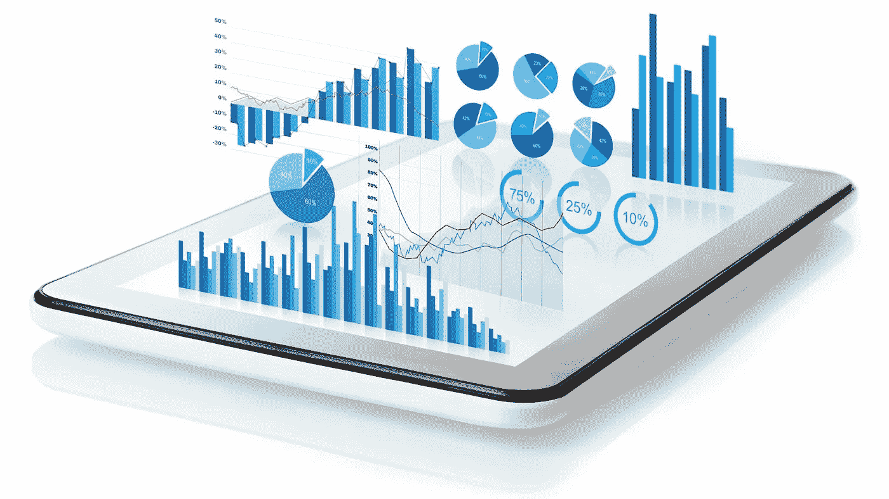
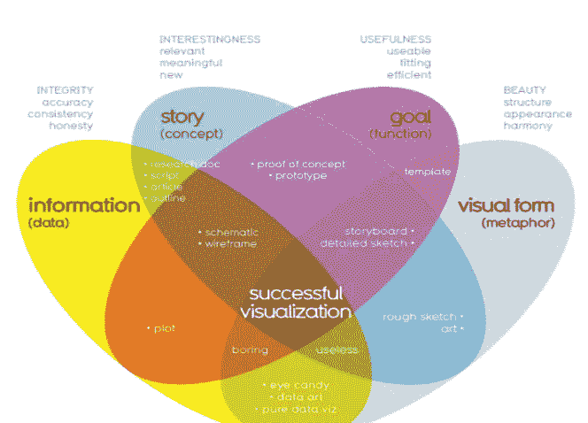
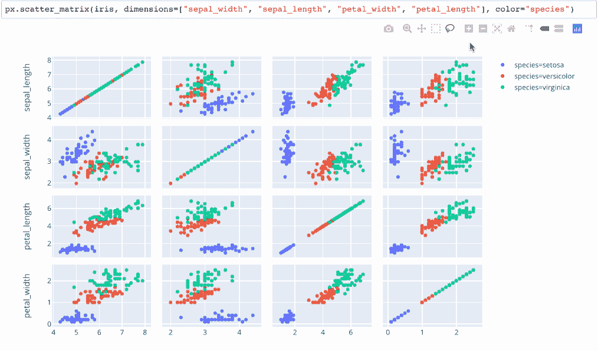
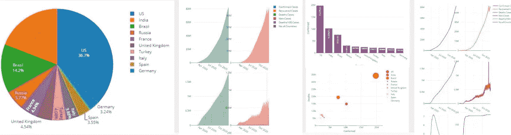

# 视觉效果会说话

> 原文：<https://medium.com/analytics-vidhya/visualizations-speak-77bb2f31611b?source=collection_archive---------9----------------------->

## **数据可视化** —数据的图形化表示

这是数据可视化的标准定义，你会发现它无处不在，但你有没有想过，它只是数据的图形表示，还是有更多。

**什么是数据可视化？**

我认为数据可视化是“**讲故事”**。数据可视化在很大程度上是为了帮助创建一个引人注目的故事。它在数据和目标之间产生通信。近年来，数据可视化变得非常引人注目，并且在几乎所有领域都获得了很大的意义。

**为什么数据可视化很重要？**

每天都会产生超过 2.5 万亿字节的数据！
从数据收集的第一步到做出决策的最后一步，涉及一系列步骤，其中数据可视化起着关键作用。数据可视化不仅仅是数据的图形化表示，还有更多的意义。
数据可视化帮助你分析数据****以及从中得出更好的预测。它也有助于做出良好的数据驱动决策，也使决策变得迅速。
它帮助您理解复杂的结构化或非结构化数据，并使其更加可访问和可用。它使信息的传播变得容易，增加了与每个人分享见解的机会。
它让任何一种数据都更加互动和直观。
简而言之，数据可视化是所有数据驱动问题和决策的关键/解决方案。****

******数据可视化用在哪里？******

******销售和营销:** 网上销售、购买和营销已经获得了很多意义。因此，公司必须关注他们的网络流量来源以及他们的网络资产如何产生收入。通过数据可视化，可以很容易地看到营销活动带来的流量趋势。它还有助于分析买家的购买趋势，并帮助找到这些问题的解决方案:
“他/她经常购买什么？”或者“他/她多久在网上购物一次？”****

******医疗:** 数据可视化广泛应用于医疗领域。
医疗保健专业人员经常使用 choropleth 地图来可视化重要的健康数据。例如，分析一个地理区域的死亡率或出生率，或者最好的例子是当前疫情的情况，其中每天都有数以千计的关于病例数、疫苗接种数等的可视化。
医疗保健领域的数据可视化帮助医疗保健专业人员分析每天收集的数据，并对未来做出预测。****

******科学家或研究人员:** 科学可视化，允许科学家和研究人员从他们的实验数据中获得更大的洞察力。任何领域的研究，无论是物联网，人工智能等。
，数据可视化帮助您了解解决方案的有效性和建设性。
例如，在物联网领域，当您连接多个传感器和设备时，收集到的数据如果用图形表示，会比仅仅读取随机数更容易理解。
如果你想到人工智能算法，当你绘制数据和结果时，它有助于理解你的模型的行为。****

******金融:** 这是数据可视化发挥非常重要作用的另一个领域。金融专业人士在选择购买或出售资产时，必须跟踪其投资决策的表现。蜡烛图被用作交易工具，帮助金融专业人士分析价格随时间的变化，显示重要信息，如证券、衍生品、货币、股票、债券和商品。通过分析价格随时间的变化，数据分析师和金融专业人士可以发现趋势。****

****数据可视化应用于更多的领域，如航空、物流等。
我个人认为，在这些领域，数据可视化在增强从事这些领域工作的组织或个人的功能方面发挥着至关重要的作用。****

******什么是好的可视化？******

********

******获得成功可视化的步骤******

****上图描述了获得成功可视化的不同步骤，我个人认为这是成功可视化的唯一途径。****

****第一步是收集“正确和必需的”数据/信息。你必须探索并收集适合你目标的数据。这是最重要的一步，因为所有其他步骤都取决于你是否收集到正确的数据。****

****第二步是关于数据故事，将信息/数据放入上下文中，并传达为什么它很重要以及必须采取什么行动。换句话说，数据故事将受众与数据联系起来。****

****第三步是您的数据可视化的目标或功能以及您如何处理它。即使在收集数据之前，你也必须清楚这一步。
这一步包括决定和选择你将用于数据分析和决策的正确工具、图表和技术。****

****第四步也是最后一步是呈现你的视觉化。****

****数据可视化的最佳工具？****

****选择正确的数据可视化工具对于实现您的目标、更好地分析数据、更快地做出决策和呈现图表起着至关重要的作用。数据可视化工具为数据可视化设计者提供了一种更简单的方法来创建大型数据集的可视化表示。
这些数据可视化可用于各种目的，仪表板、年度报告、销售和营销材料、投资者幻灯片，以及几乎任何需要解释信息的地方。****

****数据可视化中使用了许多工具，如****

*   ****维斯梅****
*   ****（舞台上由人扮的）静态画面****
*   ****信息图表****
*   ****计算机编程语言****
*   ****稀有****
*   ****数据包装器****
*   ****谷歌数据工作室****
*   ****功率 BI****
*   ****西森斯****
*   ****数据箱****

****还有更多…..****

****我想分享我个人最喜欢的！****

## ******1。表格******

****Tableau 是我第一次开始探索数据可视化的地方。
Tableau 是世界领先的分析平台之一。Tableau Public 是一个流行的可视化应用程序，允许您创建各种图表、图形、地图和其他图形。
您创建的可视化效果可以方便地插入到任何网页中，并且可以与您的朋友、组织、业内同行等共享。很好理解，也很容易呈现。
Tableau 支持各种类型的数据(整数、地理、字符串、日期、时间等。)并有一个神奇的仪表板，具有强大的功能，如过滤器，标记卡，措施，尺寸等。
它帮助你创建地图、条形图、饼图、折线图、热图、华夫饼图等。它还可以帮助您进行统计分析，如聚类、回归、相关等。
Tableau 的公共图库包含社区创建的各种可视化内容。
Tableau Public 专为科学家、学者或任何想要创造和探索数据可视化之旅的人而设计。
它通过全功能交互式图形提供无与伦比的数据可视化。它提供了大量的可视化和统计分析工具。****

********

******Tableau 工作簿******

## ****2.大蟒****

****Python 是一种非常流行的通用编程语言，它对数据科学家创建漂亮的可视化效果非常有用。Python 为数据科学家提供了各种包。
当数据可视化必须与其他应用程序集成时，我觉得 Python 是一个有用的工具。
例如，在包含传感器、微控制器和许多其他设备的物联网系统中，从传感器收集的数据可以用 Python 实时绘制。因此，Python 有助于从微控制器获取传感器数据，然后绘制值并进行分析。
Python 在数据挖掘、数据预处理、数据仓库、数据可视化、数据分析等方面有所帮助。
Python 是数据科学领域的最佳语言，因为与其他工具不同，Python 可以用于其他应用程序以及辅助数据可视化。当我们谈论数据可视化时，Python 提供了多个内置库，带有交互式图表。****

*   ******Matplotlib******
*   ******绘制******
*   ******海伯恩******
*   ******GGplot******
*   ******牛郎星******
*   ******Bokeh******
*   ******Pygal******
*   ******地质洛特利******

********

******剧情******

## ****3.稀有****

****r 是用于数据可视化的另一种编程语言。在这段时间里，R 的受欢迎程度有所下降……但我相信 R 仍然是一个很好的可视化工具。
除数据可视化外，R 编程还可用于假设、回归、聚类、相关等统计分析。
R 有多个数据可视化库，如 ggplot、dplyr、quantmod、dygraph、plotly 等。r 生成对数据分析有用的交互式和吸引人的图。r 生成基本图表，如条形图、方框图等。和高级图表，如热图、相关图等。****

********

******ggplot2******

****我相信在阅读本文后，您将会对数据科学领域有所了解。我希望您能很快开始您的数据科学之旅！！****