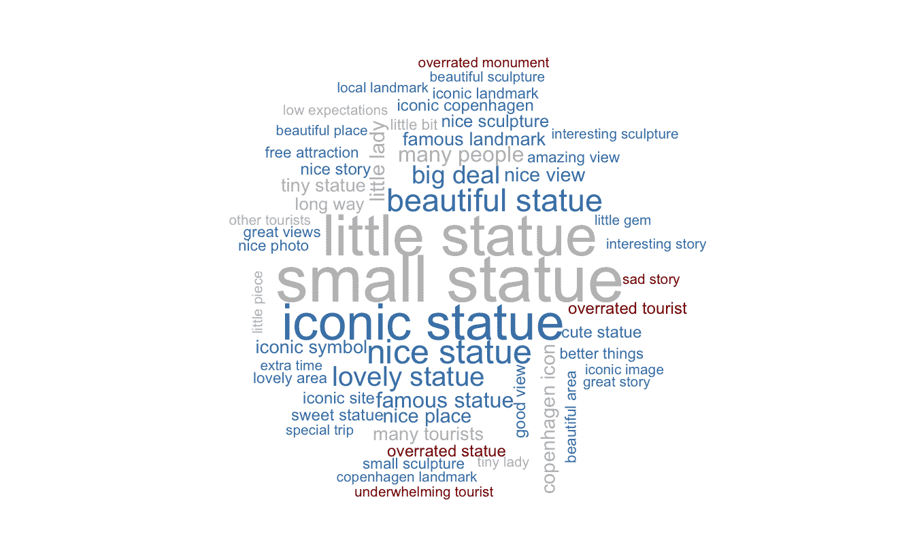

# 理解客户反馈的可视化效果

> 原文：<https://medium.com/analytics-vidhya/visualizations-to-make-sense-of-your-customer-feedback-7ce8c121ede5?source=collection_archive---------20----------------------->

信用:stockvault.net

## 如何利用 NLP 技术帮助揭示您的客户在说什么

评论网站和其他客户反馈来源为公司提供总体评级和计算分数，以跟踪客户的总体满意度。但这些基本上是汇总的数字，对于识别和量化客户体验方面的具体优势和劣势没有太大帮助。

在像 [Trustpilot](http://trustpilot.com) 、 [Tripadvisor](http://tripadvisor.com) 、[亚马逊](http://amazon.com)这样的网站上，消费者以文本的形式留下有价值的数据，让企业和其他消费者知道他们喜欢和不喜欢某个公司、服务或产品的什么。尽管人类不可能有效地总结成千上万的评论并提供可操作的见解，但*自然语言处理和* t *ext 挖掘技术为企业提供了量化工具，以倾听他们的客户，提出正确的问题并利用文本作为数据。*

在这篇短文中，我们将探索四种可视化方法，展示文本的量化方法如何能够提供对消费者意见的更清晰的理解。

# 超越简单的词频

单词云可能是可视化一个或多个文本中的词频的最常见方式。通常对文本进行预处理，使得云中只存在内容词。但是，在过滤数据时应用有根据的约束可能更有用。例如，可以搜索包含两个或更多单词的字符串，以及属于特定词类的目标单词。

在这个例子中，基于最近 5000 个访问者对哥本哈根小美人鱼雕像的评论，我制作了一个词云，由评论标题中的两个单词短语组成，后面跟着形容词和名词。应用情感分析，可以根据表达的态度给短语着色(红色是消极的，灰色是中性的，蓝色是积极的)，尽管一些“中性”词很可能被用来表达消极的观点(例如，“小”)。

这座雕像很小，很明显一些评论家对小美人鱼并不感兴趣。另一方面，许多评论家似乎欣赏它的文化意义和它在水边的位置。

# 共现词

量化和可视化评论的另一个有用的方法是测量内容词的相关程度，或者它们在评论中出现的频率。在这种情况下，679 个对 nike.com 的差评(n 颗星< = 2)在单词相关网络中被可视化。

在外围，我们发现科林·卡佩尼克——前 NFL 四分卫在国歌中下跪，以及相当爱国的词汇。这肯定与耐克在发起反对运动后推出一款美国主题鞋的事实有关。在很大程度上，差评似乎突出了送货时间长、退款和客户服务等问题。

# 揭示主题

主题建模是揭示客户体验优势和劣势的有力工具。除了探索目的，主题建模还有许多其他可能的应用，如监督机器学习算法的输入、客户细分、推荐系统、电子邮件路由和创建常见问题。

主题建模算法一般假设文本由一定数量的主题组成，主题由一定数量的词组成。在下面的条形图中，显示了 booking.com 六个主题的 1 星和 5 星评论模型(总计 5.197)，每个主题的流行程度由条形图表示。此外，还会显示每个主题的五个最重要的单词。

主题模型有时很难解释，有些主题看起来不如其他主题连贯。幸运的是，有许多预处理技术和诊断指标可以用来提高可解释性。

# 可能和不可能的单词

作为最后一个例子，我们将探究哪些词在好评和差评中出现得更多。这些数据由从亚马逊 Echo Dot(第三代)的 2500 篇评论中提取的形容词和词条化的名词(即转换为词典形式的单词)组成。我们计算每个单词属于任一类别的对数比率，并绘制具有最高绝对比率的单词。这告诉我们哪些词最有可能出现在好评或差评中。

正面评论似乎强调了 Echo Dot 的日常使用，而其他评论者似乎认为该设备或多或少没有用处。同样明显的是，一些买家想要退回设备。对负面评论的进一步研究可能会揭示为什么人们想要返回他们的回应点。

# 结论

有无数种方法可以将 NLP 和文本挖掘技术结合起来，并针对回答与客户体验相关的重要问题进行定制。

许多企业从调查和在线评论中获得了大量有价值的文本数据，这些数据正等待着超出人力所能及的探索。尽管 CX 的经理们在对文本材料进行小规模定性分析时可能会更关注评级，但利用快速成熟的技术来探索来自客户的大量宝贵反馈的时机已经成熟。

*最初发表于*[*【https://www.linkedin.com】*](https://www.linkedin.com/pulse/visualizations-make-sense-your-customer-feedback-peer-christensen/)*。*