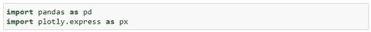
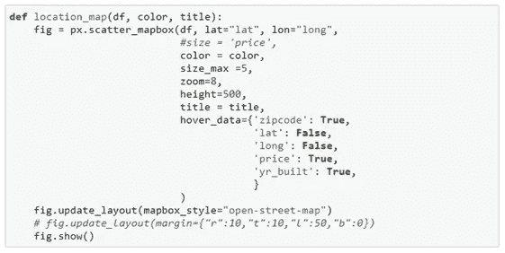
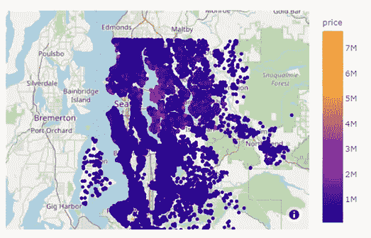
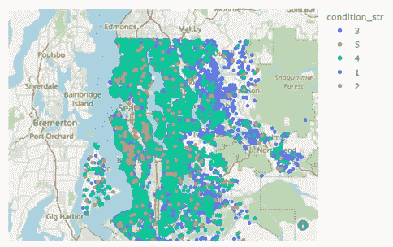
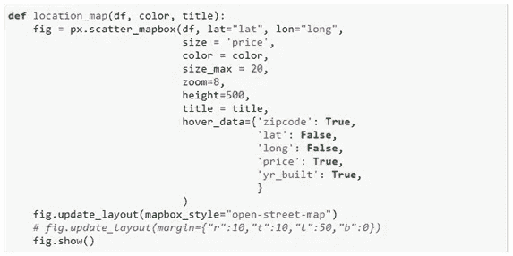
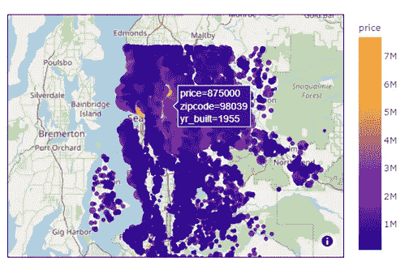
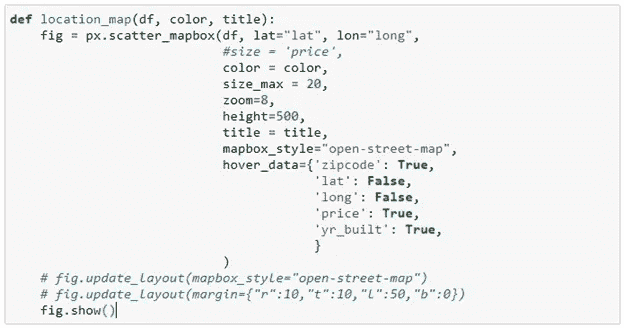

# 使用 Scatter_mapbox 在 Python 上可视化地理数据

> 原文：<https://medium.com/analytics-vidhya/visualize-geographic-data-on-python-using-scatter-mapbox-86f54341af85?source=collection_archive---------8----------------------->

图片来源:作者图片(冰川国家公园)

在任何与数据科学相关的项目中，我们都会在数据可视化上花费大量时间。通常包括散点图、直方图、箱线图等。但是有没有想过，如果我们将这些数据在地理环境中可视化，也许会有助于绘制一些空间关系。如果我们幸运地拥有纬度和经度信息，我们可以使用现有的库，如 *geopandas* 、 *plotly* 等，相对快速地创建这样的图。

在这篇文章中，我想讨论一个非常简单和有用的工具，叫做*'****scatter _ map box****'*，它利用*纬度*和*经度*信息将点集数据绘制到地图中。本练习是线性回归项目探索性数据分析的一部分，使用了华盛顿金县地区的公开住房数据集。

我们将从导入必要的库开始:

简而言之，下面的代码片段提供了该工具的基本功能和参数。

以下示例显示了地图上的房屋位置。我们可以做的一件显而易见的事情是对每个点进行颜色编码，这将允许我们快速可视化任何特征的空间分布。例如，我们可以使用“价格”作为颜色属性来定位房价较高的区域。

用“价格”特征进行颜色编码的房屋位置

***你能从上面的地图中注意到房价分布的模式吗？***

是的，人们可以观察到一些高价格的房子集中在北部和中部地区。

注意图例中的色标是连续的。对于任何数值数据集都是如此。如果我们有分类数据，我们将得到离散图例，如下例所示。

用“条件”特征编码的房屋位置颜色

scatter_mapbox 参数不言自明。这个库中几乎没有简洁的功能。我发现其中一个特别有用的是*‘hover _ data’*参数。我们可以在这个参数中传递尽可能多的特性，这些特性在我们的 pandas 数据框架中是可用的，并且可以立即获得各个数据点的信息。我们还可以使用*‘size’*参数来反映数据点的值，即较大的符号代表较高的值。

房屋位置用“价格”特征进行颜色编码(尺寸参数也增加到 20)

有一个很好的特性允许你在函数之外更新参数。注意，我们在底部有' *fig.update_layout()* '命令。这个可以放在 **px.scatter_mapbox()** 函数内部或者外部。例如:

最后，这个工具箱有一个限制，就是缺少对大范围地图的可访问性。目前，只有少数地图可供任何人使用。有一些整洁的底图可用，这将需要创建一个个性化的令牌。但在很大程度上，*“开放街道地图”*是我发现对我的目的最有用的，但它仍然没有视觉吸引力。

## **总结**

使用地理坐标可视化数据时，scatter_mapbox 是非常有用的工具。这也可以与*【geo pandas】*库结合使用，后者是另外一整章要讨论的。使用这个工具使我能够增强线性回归模型的特征工程。例如，从房价分布图中，我能够提取一个*“距离市中心的距离”*特征作为新特征之一，这有助于提高模型的可预测性。

*参考:*[*https://plotly.com/python/mapbox-layers/*](https://plotly.com/python/mapbox-layers/)