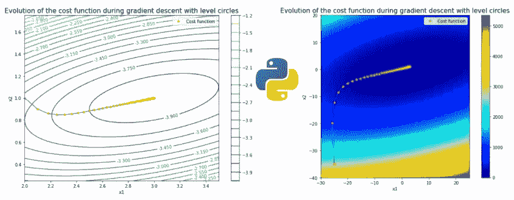
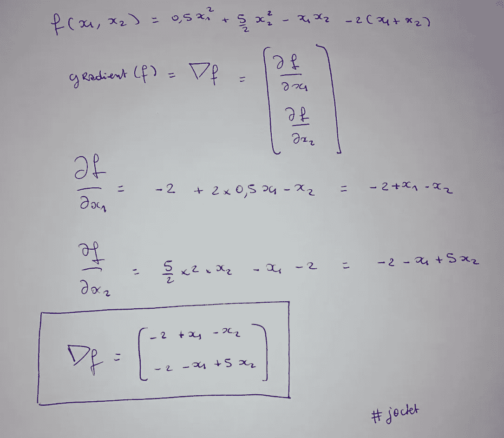
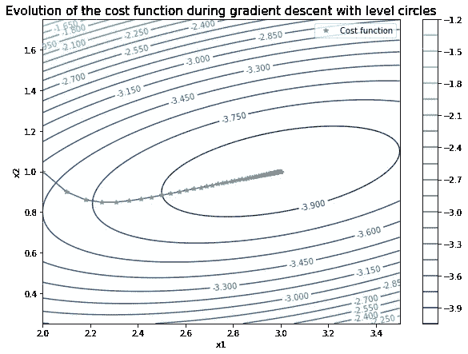
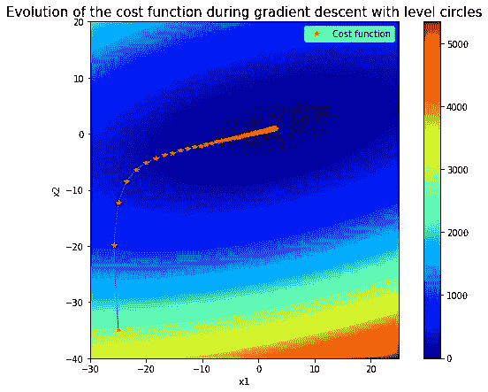

# 可视化带有水平圆的成本函数的梯度下降-Python

> 原文：<https://medium.com/analytics-vidhya/visualize-the-gradient-descent-of-a-cost-function-with-its-level-circles-python-d8c850731b0a?source=collection_archive---------4----------------------->

嗨！在这里，我们将计算任意成本函数的梯度，并显示其在梯度下降过程中的演变。所有的代码都可以在我的 GitHub 上的这个链接中找到。



作者图片

## 装置

```
pip install numpy
pip install matplotlib
```

## 进口

```
import numpy as np
import matplotlib.pyplot as plt
import math
from math import *
```

首先，我们定义我们的成本函数:

```
def f(x1, x2):
    return 0.5*x1**2 + (5/2)*x2**2 - x1*x2 - 2*(x1 + x2)
```

然后，我们手动计算函数的梯度:



作者图片

我们必须定义两个函数:

*   返回我们上面计算结果的梯度函数，
*   范数函数将有助于了解我们在梯度下降的每次迭代中走了多远，

```
def gradient(x1, x2):
    return np.array([-2 + x1 - x2, -2 - x1 + 5*x2])def norm(matrice_1x2):
    n_line = matrice_1x2.shape[0]
    N = 0
    for i in range(n_line):
        N += matrice_1x2[i]**2
    return math.sqrt(N)
```

我们用任意值初始化变量 **x1** 和 **x2** :

```
x1, x2 = 2, 1
```

我们为我们的步骤 **t** 设置一个值(t 越大，我们的算法收敛得越快，但是如果 **t** 太大，我们的算法可能会发散，所以要小心并为该步骤测试几个值)。

```
t = 0.1
```

我们还为“ **epsilon** ”阈值设置了一个值:一旦在梯度下降期间行进的距离小于设置的阈值，我们将停止迭代。

```
epsilon = pow(10,-6)
```

然后，我们为其余变量赋予初始值:

```
grad_f = gradient(x1, x2)
n_grad = norm(grad_f)
i = 1
evolution_X1_X2 = [[x1, x2]]
```

## 梯度下降

```
while n_grad > epsilon:

    direction = -grad_f
    x1, x2 = x1 + t*direction[0], x2 + t*direction[1] 
    evolution_X1_X2 = np.vstack((evolution_X1_X2, [x1, x2]))
    grad_f = gradient(x1, x2)
    n_grad = norm(grad_f)
    i +=1
```

我们在 evolution_X1_X2 数组中检索我们的两个变量 **X1** 和 **X2** 的演化:

```
evolution_X1 = evolution_X1_X2[:, 0]
evolution_X2 = evolution_X1_X2[:, 1]
```

## 可视化 1

```
x1 = np.linspace(2, 3.5, 150)
x2 = np.linspace(0.25, 1.75, 150)
X1, X2 = np.meshgrid(x1, x2)
Z = f(X1, X2)fig = plt.figure(figsize = (10,7))
contours = plt.contour(X1, X2, Z, 20)
plt.clabel(contours, inline = True, fontsize = 10)
plt.title("Evolution of the cost function during gradient descent with level circles", fontsize=15)plt.plot(evolution_X1, evolution_X2)
plt.plot(evolution_X1, evolution_X2, '*', label = "Cost function")plt.xlabel('x1', fontsize=11)
plt.ylabel('x2', fontsize=11)
plt.colorbar()
plt.legend(loc = "upper right")
plt.show()
```



作者图片

# 另一个版本更加丰富多彩——让我们疯狂吧

```
x1, x2 = -25, -35
grad_f = gradient(x1, x2)
n_grad = norm(grad_f)
t = 0.1
epsilon = pow(10,-6)
n_grad = norm(grad_f)
i = 1
evolution_X1_X2 = [[x1, x2]]while n_grad > epsilon:

    direction = -grad_f
    x1, x2 = x1 + t*direction[0], x2 + t*direction[1] 
    evolution_X1_X2 = np.vstack((evolution_X1_X2, [x1, x2]))
    grad_f = gradient(x1, x2)
    n_grad = norm(grad_f)
    i +=1evolution_X1 = evolution_X1_X2[:, 0]
evolution_X2 = evolution_X1_X2[:, 1]
```

## 可视化 2

```
x1 = np.linspace(-30, 25, 150)
x2 = np.linspace(-40, 20, 150)
X1, X2 = np.meshgrid(x1, x2)
Z = f(X1, X2)fig = plt.figure(figsize = (10,7))plt.imshow(Z, extent = [-30,25,-40,20], origin = 'lower', cmap = 'jet', alpha = 1)plt.title("Evolution of the cost function during gradient descent with level circles", fontsize=15)plt.plot(evolution_X1, evolution_X2)
plt.plot(evolution_X1, evolution_X2, '*', label = "Cost function")plt.xlabel('x1', fontsize=11)
plt.ylabel('x2', fontsize=11)
plt.colorbar()
plt.legend(loc = "upper right")
plt.show()
```



作者图片

## 我希望你觉得这很有趣！