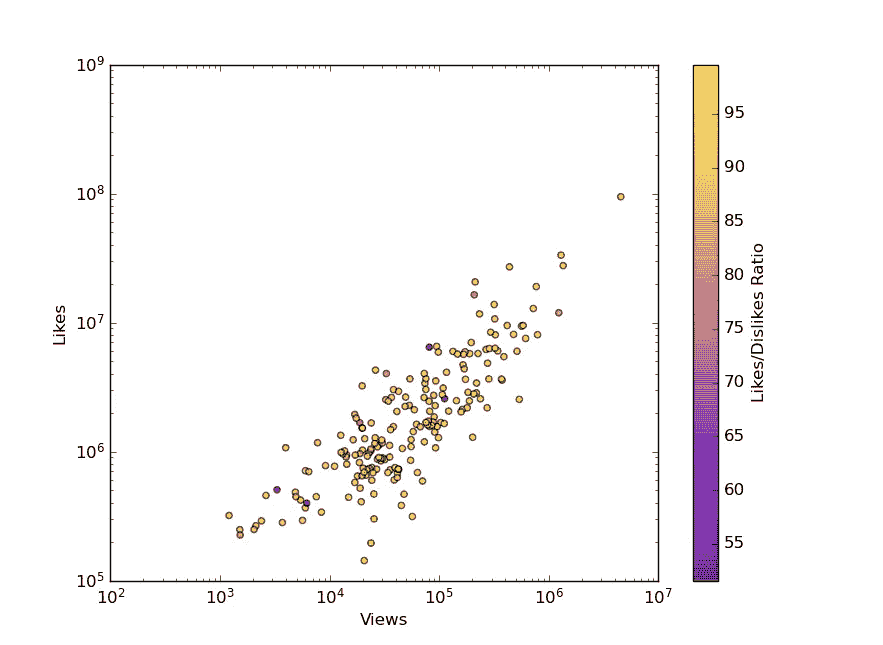
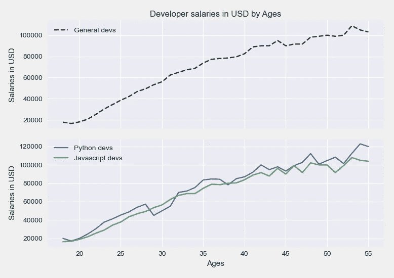
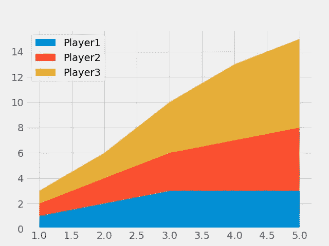
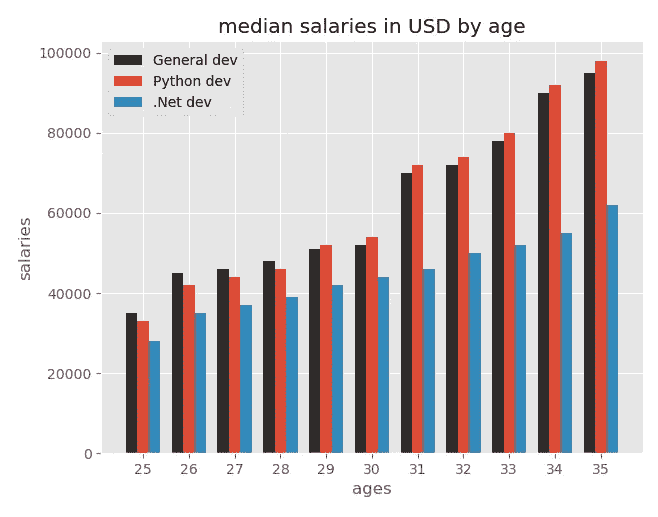

# 数据可视化

> 原文：<https://medium.com/analytics-vidhya/visualizing-data-c74682c123b7?source=collection_archive---------20----------------------->

## Matplotlib 拯救世界

数据可视化是当今处理数据时所期望的关键技能之一。它有助于将复杂的数据简化为可理解的格式，并据此做出决策。

公司正在收集各种类型的数据，包括气候数据、用户数据、交易数据、医疗数据等。所有这些数据被进一步分析和可视化，以做出一些非常重要的商业决策。

> 可视化从人类的角度来看是可行的，因为我们对视觉数据的反应和处理比任何其他类型的数据都要好。事实上，人类大脑处理图像的速度比文本快 60，000 倍，传输到大脑的 90%的信息是视觉信息。由于我们天生是视觉型的，我们可以利用这种技能来提高数据处理和组织效率。

如果你对 python 有点熟悉的话，入门会很容易。



用于样本数据可视化的不同类型的图

我们将讨论 [**Matplotlib**](https://matplotlib.org/) ，这是一个二维绘图库，有助于以更好的方式可视化数据。

安装它相当容易。我是说很多！！！

```
# on your jupyter notebook simply enter
!pip install matplotlib
```

然后导入所需的包模块，现在就可以开始绘制一些图了。

```
import matplotlib.pyplot as plt
%matplotlib inline
```

绘制数据时，我们遵循的大多数步骤都是相似的，例如:

*   pd.readcsv()使用熊猫导入数据集
*   plt.plot()、plt.bar()、plt.stackplot()、plt.pie()、plt.scatter()等。所有这些都可以通过将数据作为参数传递给它们来绘制。类似地，直方图，散点图，绘制时间序列也可以完成，我将在另一篇文章中介绍。
*   plt.legend()来提及观察变量。
*   plt.xlabel 和 plt.ylabel 来命名我的 x 轴，y 轴
*   plt.title 为您的地块指定一个标题
*   plt.show()用于显示绘图

您也可以将样式应用于地块。

```
# This command will list all different kinds of styles available
print(plt.style.available)
```

**输出:**

```
['Solarize_Light2', '_classic_test_patch', 'bmh', 'classic', 'dark_background', 'fast', 'fivethirtyeight', 'ggplot', 'grayscale', 'seaborn', 'seaborn-bright', 'seaborn-colorblind', 'seaborn-dark', 'seaborn-dark-palette', 'seaborn-darkgrid', 'seaborn-deep', 'seaborn-muted', 'seaborn-notebook', 'seaborn-paper', 'seaborn-pastel', 'seaborn-poster', 'seaborn-talk', 'seaborn-ticks', 'seaborn-white', 'seaborn-whitegrid', 'tableau-colorblind10']
```

现在你所要做的就是在绘制任何数据之前输入***PLT . style . use(" style _ name ")****。*

下面的命令显示了普通开发人员、py 开发人员和 js 开发人员的 ***按年龄*** 划分的美元中值工资之间的折线图比较。

```
plt.style.use('ggplot')plt.xlabel('ages')
plt.ylabel('salaries')
plt.title('median salaries in USD by age')# label them to differentiate
plt.plot(age_x, dev_y, label="General dev")
plt.plot(age_x, py_dev_y, label="Python dev")
plt.plot(age_x, net_dev_y, label=".Net dev")plt.tight_layout()
plt.legend()
plt.show()
```

你可以找到我的 jupyter 笔记本，它展示了如何从零开始构建所有上述的图，以及一些用于实践的样本数据集。

只需访问我的 GitHub repo[**https://github.com/rahulkapoor253/Notebooks**](https://github.com/rahulkapoor253/Notebooks)**下载并开始练习。**

**如果你发现有什么困难，欢迎在下面评论。干杯！**