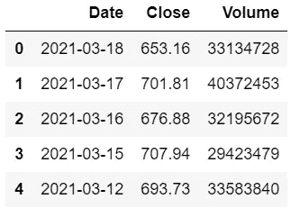
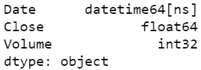
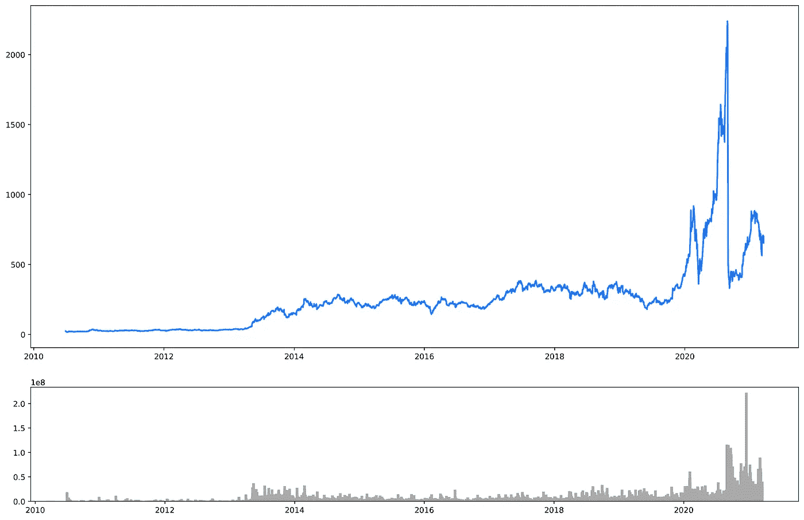
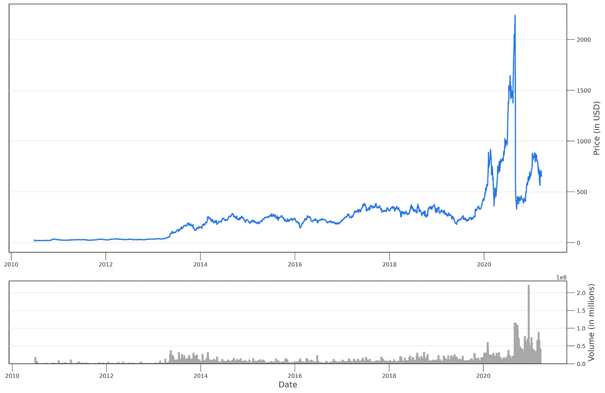
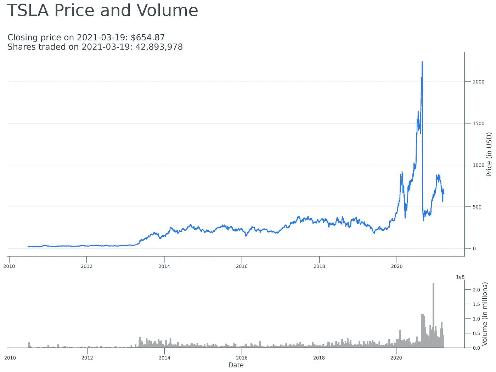
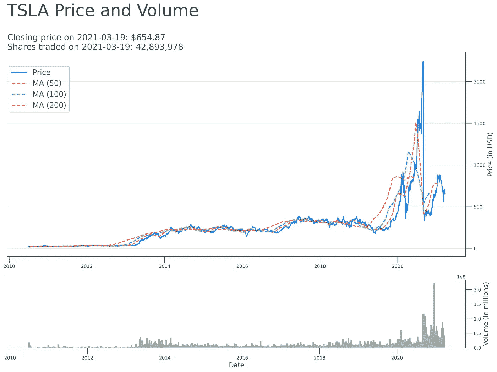
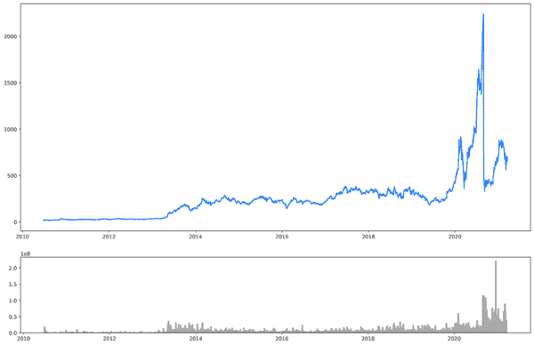

# 从头开始可视化历史股票价格和交易量

> 原文：<https://medium.com/analytics-vidhya/visualizing-historical-stock-price-and-volume-from-scratch-46029b2c5ef9?source=collection_archive---------1----------------------->


[M. B. M.](https://unsplash.com/@m_b_m?utm_source=medium&utm_medium=referral) 在 [Unsplash](https://unsplash.com?utm_source=medium&utm_medium=referral) 上拍摄的照片

一个主要的投资原则是，过去的表现不是未来表现的指标。然而，最好看看历史价格和成交量图，以了解股票的交易范围，注意趋势和模式，并找到投资者特别活跃的价格水平。

本文提供了使用 [Jupyter Notebook](https://jupyter-notebook.readthedocs.io/en/stable/) 和 Python 的 [requests](https://requests.readthedocs.io/en/master/) 、 [pandas](https://pandas.pydata.org/docs/) 和 [matplotlib](https://matplotlib.org/) 库可视化历史股票价格和交易量的分步指南。点击查看安装 Jupyter Notebook 和使用所列库的详细说明。

当你读完这篇文章时，你将知道如何:

*   使用 web API 获取历史股票数据
*   为分析准备数据
*   可视化价格、成交量和移动平均线

首先，我们导入所需的库，并为它们分配标准别名。

```
import requests
import pandas as pd
import matplotlib.pyplot as plt
```

我们首先编写一个函数，它将一个符号作为输入，并返回一个股票信息字典，如日期、收盘价和成交量。要使用 Alpha Vantage API 获取数据，您需要获得一个免费的 API 密钥。这很简单，您可以通过填写这个[链接](https://www.alphavantage.co/support/#api-key)上的几个字段来立即完成。

该职能细分如下:

*   首先，我们将链接传递给 Alpha Vantage 网站，并将其存储为“ *url* ”
*   其次，我们创建了" *params* "字典，我们将把它作为获取 API 数据的请求的一部分进行传递。字典指定我们对给定符号的所有历史每日股票价格感兴趣。记住将变量“ *apikey* ”的值更改为您的 API 键。
*   现在我们已经有了 URL 和参数，我们使用 API 请求 Alpha Vantage 数据。我们还初始化了一个空字典来存储我们方便地称之为“ *stock_dict* 的数据
*   我们的请求返回一个响应，我们使用一个“ *for* 循环来迭代这个响应。该循环跳过我们不感兴趣的元数据，并关注历史信息。对于响应中的每一条记录，循环都会相应地更新" *stock_dict* "字典。
*   一旦循环完成，该函数将返回一个字典，其中包含我们请求的股票信息。

```
def get_daily_stock_info(symbol):
    url = '[https://www.alphavantage.co/query?'](https://www.alphavantage.co/query?') params = {                                                 
        'function' : 'TIME_SERIES_DAILY_ADJUSTED',             
        'symbol' : symbol,                                     
        'outputsize' : 'full',                                 
        'apikey' : 'YOUR API KEY'                              
    } response = requests.get(url, params=params)
    stock_dict = {'Date': [], 'Close': [], 'Volume': []} for key,value in response.json().items():
        if key != 'Meta Data': 
            stock_dict['Date'] = list(value.keys())
            for info in value.values():
                stock_dict['Close'].append(info['4\. close'])
                stock_dict['Volume'].append(info['6\. volume'])

    return(stock_dict)
```

然后，我们让用户输入感兴趣的股票代码。默认情况下，“*输入”*函数返回一个字符串，upper 方法确保我们以行业标准的大写字母存储股票代码值。

```
symbol = input('Input a ticker:\n').upper()
stock_df = pd.DataFrame(get_daily_stock_info(symbol))
```

接下来，我们调用函数，将符号作为参数传递，并将结果存储在 pandas 数据帧中。因此，数据将被很好地格式化在类似 Excel 电子表格的表格框架中。



stock_df 数据帧的前五行

此时，问题是我们的数据不是合适的数据类型，因为所有的列都是" *object* "类型我们用下面一行代码来解决这个问题。" *copy=False* "参数对原始数据框进行变换，而不是对其进行复制和更改。

```
stock_df = stock_df.astype({'Date': 'datetime64[ns]', 'Close': 'float', 'Volume': 'int'}, copy=False)
```

我们确认我们的数据是正确的格式，并准备好可视化。



stock_df.dtypes 的输出

绘制多个图表可能会导致对每个图表重复一些步骤。因此，最好将一些步骤存储在字典中或创建一个函数。下面，我们在几个变量中存储了我们将用于绘图的颜色以及滚动条和标题的格式。 [Colorhexa](https://www.colorhexa.com/) 是找到你喜欢的颜色的十六进制代码的一个不错的选择。挑选你最喜欢的，把它们储存在字典里，并在你的视觉效果中使用它们。

```
colors = {'red': '#ff207c', 'grey': '#42535b', 'blue': '#207cff', 'orange': '#ffa320', 'green': '#00ec8b'}config_ticks = {'size': 14, 'color': colors['grey'], 'labelcolor': colors['grey']}config_title = {'size': 18, 'color': colors['grey'], 'ha': 'left', 'va': 'baseline'}
```

现在我们已经准备好可视化历史价格和股票交易量数据。

```
def get_charts(stock_data):
    plt.rc('figure', figsize=(15, 10))

    fig, axes = plt.subplots(2, 1, 
                gridspec_kw={'height_ratios': [3, 1]})
    fig.tight_layout(pad=3)

    date = stock_data['Date']
    close = stock_data['Close']
    vol = stock_data['Volume']

    plot_price = axes[0]
    plot_price.plot(date, close, color=colors['blue'], 
    linewidth=2, label='Price')

    plot_vol = axes[1]
    plot_vol.bar(date, vol, width=15, color='darkgrey')
```

上面的函数将我们的股票数据框架作为输入，并绘制股票价格和交易量数据。

*   首先，它创建一个图形来放置地块。它调整图形大小，并将价格图的高度设置为成交量图的三倍。
*   第二，它从股票数据框架中提取日期、收盘价和成交量数据，并将它们存储在变量中以供进一步参考。
*   第三，它创建一个价格图，x 轴是日期，y 轴是收盘价。此外，它还可以调整线条的颜色和大小。
*   第四，它创建了一个条形图，x 轴上是日期，y 轴上是灰色条。



由于历史价格和交易量从左边最早的日期开始，到右边最近的日期，因此将 y 轴标签位置移到右边是有意义的。此外，我们通过添加浅灰色网格线并调整其刻度、标签和颜色，使价格图表更加清晰。然后，我们对体积图重复该过程，同时对标签和轴进行必要的更改。

```
def get_charts(stock_data):
    ... plot_price.yaxis.tick_right()
    plot_price.tick_params(axis='both', **config_ticks)
    plot_price.set_ylabel('Price (in USD)', fontsize=14)
    plot_price.yaxis.set_label_position("right")
    plot_price.yaxis.label.set_color(colors['grey'])
    plot_price.grid(axis='y', color='gainsboro', 
    linestyle='-', linewidth=0.5)
    plot_price.set_axisbelow(True)
```

结果，我们得到了下面的图表。



左侧和顶部边框是不必要的，我们删除它们，使视觉更清晰。因为我们对几个图表都这样做，所以我们创建了一个负责边框格式的函数。该功能将允许我们轻松设置任何未来地块的边界格式。此外，我们可能希望只在一个地方进行任何更改，而不是对每个图表进行多次更改。

```
def format_borders(plot):
    plot.spines['top'].set_visible(False)
    plot.spines['left'].set_visible(False)
    plot.spines['left'].set_color(colors['grey'])
    plot.spines['bottom'].set_color(colors['grey'])
```

然后，我们向“get_charts”函数添加“format_borders”函数调用。

```
def get_charts(stock_data):
   ... format_borders(plot_price)
    format_borders(plot_vol)
```

现在图表更整洁了，我们通过调用先前定义的 figure 对象上的“suptitle”方法来命名它们，并设置其格式。

```
fig.suptitle(symbol + ' Price and Volume', size=36, color=colors['grey'], x=0.24, y=1.10)
```

此外，第一眼看到最后一个交易日的收盘价和交易的股票数量也很有帮助。我们从" *stock_df* "中提取信息，并将其用作价格图表的标题。

```
def get_prev_day_info(plot):
    previous_close='$' + str("{:,}".format(stock_df['Close'][0])) 
    previous_volume=str("{:,}".format(stock_df['Volume'][0]))
    previous_date=str(stock_df['Date'][0].date()) plot.set_title(
        'Closing price on ' + previous_date + ': ' + 
         previous_close  + '\nShares traded on ' + previous_date +
         ': ' + previous_volume, fontdict=config_title, loc='left'
    )def get_charts(stock_data):
    ... get_prev_day_info(plot_price)
```

这些调整让我们得到了下面的图表。



从这里开始，可能性是无穷的。例如，我们可以绘制我们感兴趣的任何技术指标，或者放大到特定的时间段。移动平均线平滑了急剧的上涨或下跌，最常用的是 50、100 和 200 日均线。我们添加一个函数来计算这些，并将它们添加到价格图中。

```
def plot_ma(plot, x, y):
    mov_avg = {
        'MA (50)': {'Range': 50, 'Color': colors['orange']}, 
        'MA (100)': {'Range': 100, 'Color': colors['green']}, 
        'MA (200)': {'Range': 200, 'Color': colors['red']}
    }

    for ma, ma_info in mov_avg.items():
        plot.plot(
            x, y.rolling(ma_info['Range']).mean(), 
            color=ma_info['Color'], label=ma, linewidth=2, ls='--'
        )def get_charts(stock_data):
    ... plot_ma(plot_price, date, close)
```

最后，我们向价格图表添加一个图例，告诉一条线显示来自 50、100 和 200 天移动平均线的价格。

```
def format_legend(plot):
    plot_legend = plot.legend(loc='upper left', 
    bbox_to_anchor= (-0.005, 0.95), fontsize=16) for text in plot_legend.get_texts():
        text.set_color(colors['grey'])def get_charts(stock_data):
    ... format_legend(plot_price)
```

结果，我们得到了最终的图表，它可视化了一只股票的历史价格、成交量和移动平均线。



下面的[链接](https://github.com/uros-trifunovic/Visualizing-historical-stock-prices-and-volume/blob/main/Visualizing%20Stock%20Price%20and%20Volume.ipynb)提供了用于生成图表的代码。尝试一下，阅读文档，发挥创造力。探索不同的技术指标，并尝试以最适合您的方式将它们添加到视觉效果中。



如有任何问题和评论，请随时联系 [LinkedIn](https://www.linkedin.com/in/urostrifunovic/) 。

感谢您的阅读。