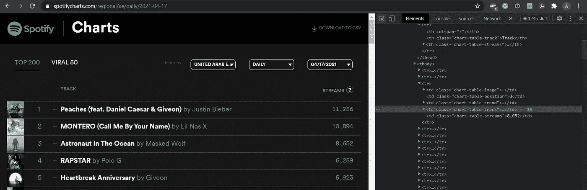

# 在 Tableau 中可视化 Spotify 前 200 名数据&实现一个快速 Python web-scraper

> 原文：<https://medium.com/analytics-vidhya/visualizing-spotify-top-200-data-in-tableau-implementing-a-fast-python-web-scraper-88a562495ad8?source=collection_archive---------3----------------------->


作者图片:作者的 Spotify 账户

在音乐流媒体平台诞生之前很久，像大多数印度人一样，我也是通过在一些随机网站上盗录或盗版歌曲，或者在 Youtube 上合法观看歌曲来获得歌曲修复( *Napster 在我居住的地方并不流行*)。苹果音乐当时确实存在，但作为一个主要使用 Windows 的青少年，我几乎不知道如何使用苹果音乐，更不知道它实际上是一项付费服务。现在，除了苹果，你还有亚马逊、Youtube、Pandora、Soundcloud 和其他多家竞争音乐流媒体行业的公司。

但自成立以来，Spotify 在流媒体音乐方面已经成为手机和电脑用户的主要选择。它在苹果和安卓用户中广受欢迎，不像亚马逊音乐或苹果音乐，有些人可能会说卡特更倾向于苹果或亚马逊产品。

> 音乐本身就是一种世界语言，它将世界各地的人们联系在一起&歌曲只是艺术家用旋律描述的故事。

作为一名 Spotify 的老用户，我想到了分析音乐故事背后的数据并将这个数据驱动的故事可视化该有多有趣。

# 通过 webscraper 自动收集数据


图片来自 [Webharvy](https://www.webharvy.com/articles/what-is-web-scraping.html)

F 首先，什么是**网页抓取**？网络抓取是一种技术，用于从网站或网站的一部分提取或抓取数据，然后以可读格式保存，如数据库或 JSON 文件。当某个网站没有 API 或者您对 API 的访问受到限制时，它是 API 的一个很好的替代品。Web 抓取工具有助于利用网站上的丰富数据，这些数据可以用来获取新数据或增强现有数据。网页抓取可以通过网页抓取软件轻松完成，这使任务变得简单，或者可以通过编写一段代码以编程方式完成，这有时会非常复杂，具体取决于网站结构和要抓取的数据。Web scrapers 本质上帮助从具有相同结构的网页中重复收集相似结构数据的过程自动化。web 抓取的好例子包括:从电子商务商店提取产品数据，或者提取股票价格数据以进行更好的预测。

> 网络抓取是一种技术，用于从网站或网站的一部分提取或抓取数据，然后以可读格式保存，如数据库或 JSON 文件。

## 合法吗？


图片来自 [Prowebscraper](https://prowebscraper.com/blog/is-web-scraping-legal/)

当你 ***利用*** 或 ***滥用数据用于商业目的或商业用途或经济利益*** 时，网络抓取被视为**非法**。

*   所有网站都有一定的指导方针，规定网站的哪些部分可以废弃，哪些部分不可以废弃。只要网页抓取是在网站所有者允许或允许抓取的部分进行的，你就是安全的。
*   此外，只要你留在公共领域，不回避被禁止的数据，刮被认为是合法的。
*   作为一个人，你大概可以在一分钟内访问或点击 10 页左右。但是软件或程序有能力在一分钟内访问 100 或 1000 个页面。所以，重要的是要注意你的抓取率，也就是说，你不希望频繁地重复请求网站，以至于服务器无法处理它们，从而导致拥塞或使其认为有攻击正在进行。

## 我如何访问网站的指南？

阅读每个网站提供的 **robots.txt** 文件是一个很好的做法。该文件包含网站的哪些部分可以访问，哪些部分不可以访问，以及可以以什么速度访问的数据。
如何访问 **robots.txt** 文件？在您的浏览器的 URL 框中键入您想要抓取的网站 URL，并将一个 **/robots.txt** 附加到 URL 的末尾。 ***为* *例***——https://google.com/robots.txt

robots.txt 通常返回像用户代理、不允许、允许和爬行延迟这样的字段。


作者图片:Buzzfeed 的 robots.txt 示例

例如，见上图。Buzzfeed 希望 msnbot 在抓取每个页面之前等待 120 秒，并禁止 msnbot 抓取列出的任何 URL 字符串。

**以下是 robots.txt 结果的几个例子及其含义:**

*   *阻止所有网络爬虫抓取所有内容*

```
User-agent: * Disallow: /
```

*   *允许所有网络爬虫访问所有内容*

```
User-agent: * Disallow:
```

*   *阻止特定文件夹中的特定网络爬虫*

```
User-agent: Googlebot Disallow: /example-subfolder/
```

现在我想收集和可视化的数据是 Spotify Charts 网站。

L ***对我来说很幸运的是，Spotify 排行榜的 robots.txt 允许所有爬虫访问所有内容！！所以我没有做任何违法的事情！***


作者图片:Spotify Charts robots.txt 文件的结果—合法快乐

## 网页抓取过程

我刮到的数据是[**Spotify 200 强排行榜**](https://spotifycharts.com/regional/) 。


作者图片:Spotify 200 强排行榜

我从 Spotify charts 网站上搜集了所有地区和该地区所有日期的数据。构建我的 web scraper 的两个基本库是:

1.  [*【bs4】*](https://pypi.org/project/beautifulsoup4/)用于处理从网页源代码(HTML 和 CSS)中提取文本的库
2.  [*请求*](https://pypi.org/project/requests/) 库用于处理与网页的交互(使用 HTTP 请求)


作者图片:网页抓取过程

## **自动收集地区和日期**

Spotify 提供每日和每周图表，我想为每日数据制作一个仪表板。

此外，我想收集所有地区和该地区所有可能日期的数据。 ***现在我该怎么做？***


作者图片:不同日期的印度(左)和阿拉伯联合酋长国(右)

Spotify 图表网站有许多不同的地区和日期，你可以根据这些地区和日期过滤数据。
从上面两张图片可以看出，URL 会根据您选择的地区和日期而变化。地区甚至有特定的代码，*印度*有代码*在*阿联酋有代码 *ae。所以我需要所有地区和日期的代码来访问所有地区和日期的数据。*

现在，我可以很容易地用 Python 硬编码一个包含所有地区和日期名称的列表。但是这里有大约 60 个地区，这意味着我需要浏览全部 60 页才能看到每个国家的地区代码。此外，值得注意的是，每个地区都有不同的数据可用日期。例如，美国有截至 2017 年 1 月 1 日的可用数据，但另一方面，印度只有截至 2017 年 2 月 27 日的可用数据。我可以创建一个循环，收集从今天到一年前的数据。

但是为什么要手动创建列表呢？你可以通过抓取网站的 HTML 代码，以编程的方式获取所有区域、它们的代码以及这些区域可用的日期。

如果在浏览器中单击鼠标右键并按“检查元素”,然后使用浏览器检查器单击区域过滤器，则可以在该下拉列表中看到所有可用的区域。


作者图片:使用浏览器的 inspect 元素查看网站 HTML 代码

从上图中，您可以看到下拉列表中所有可用区域的名称，甚至它们对应的标记为 data-value 的代码。您也可以使用 Inspect 元素来查看日期列表。现在我们知道了我们想要从哪些 HTML 标签中提取数据。

首先，我为我的剪贴簿提供了一个基本的 URL，这将帮助我抓取所有地区名称及其代码的网站，并将其保存到一个列表中，并将代码和地区名称压缩为一个字典。将这个压缩的字典保存到一个 CSV 文件中，在可视化过程中使用别名时会很有用。

```
###get all content on home_page 
home_page='[https://spotifycharts.com/viral/global/daily'](https://spotifycharts.com/viral/global/daily')
hsession = requests.Session() 
hresponse = hsession.get(home_page)
soup=BeautifulSoup(hresponse.content.decode('utf-8'),"html.parser")###parse through the home_page to get all the region names and their codes
regions=[item['data-value'] for item in soup.find('div', {'data-type':'country'}).find_all('li', attrs={'data-value' : True})] 
region_fullname=[]
for li in soup.find('div', {'data-type':'country'}).find_all('li', attrs={'data-value' : True}): #run alone no probs
    region_fullname.append((li.get_text()))
region_dictionary=dict(zip(regions, region_fullname))
```

接下来，我想提取每个地区的所有日期。为此，我需要每个地区的主要网址。正如您所记得的，URL 中只有一部分根据地区而变化，其余部分保持不变。为此，我创建了一个列表来存储每个地区的所有基本 URL。

```
#create a list of URLS for the landing page of each region collected earlier
URLS=['[https://spotifycharts.com/viral/'+region+'/daily/'](https://spotifycharts.com/viral/'+region+'/daily/') for region in regions]
```

现在，我们希望访问 URL 列表中的每个 URL，获取该 URL 的所有可用日期，并创建一个新列表，该列表将区域 URL 和日期附加在一起，以形成每个区域的新 URL 和我们希望访问的区域的可用日期组合。

```
####function for getting all dates avalilable for each region
new_URLS=[]
def downloadPage(URL):                                                       #pass the landing page of a region
  s1 = requests.Session() 
  response1 = s1.get(URL)       
  soup_region=BeautifulSoup(response1.content.decode("utf-8"),"html.parser")  #get content of that page
  time.sleep(0.25)
  all_dates=[]                                                               #list for holding all dates on that region's page
  for li in soup_region.find('div', {'data-type':'date'}).find_all('li'):   
    all_dates.append((dt.datetime.strptime(li.get_text(), '%m/%d/%Y').date()))  
  [new_URLS.append(URL+str(date)+'/download') for date in all_dates] 
```

## 要收集的实际数据


作者图片:抓取表格数据

现在我们有了所有地区及其相应日期的列表，我们可以前进到实际的 web 抓取，提取 web 浏览器上显示的前 200 个表。上图显示的是我们实际想要抓取的数据。我们要刮高光表。



作者图片:抓取表中的表数据标签

上图显示了表格中所有可用的数据。它包含歌曲图像、歌曲位置、歌曲趋势图标、歌曲所属曲目以及歌曲已接收的流数量的数据。

现在，这里有一个巧妙的小骗局。我们可以直接从 ***【下载到 CSV】***按钮提取数据，而不是抓取表格中的每个单元格。CSV 文件以 CSV 格式提供浏览器中显示的整个表格数据；浏览器上显示的图像和趋势图标除外。

## 构建 web 刮刀

现在我们可以解析每个 HTML 页面(*每个唯一的区域和日期组合*)来获取 CSV 数据，并将其存储在一个临时数据帧中。我们甚至将 URL 附加到数据框中，因为我们的 CSV 文件不提供区域和日期数据，而且在可视化时必须知道数据属于哪个日期和区域。这是收集数据进行分析的实际 web 抓取代码。

```
#function to get actual top 200 data from new_URL having date and region
def downloadData(new_URL):
    s2 = requests.Session() 
    response2 = s2.get(new_URL)   
    soup_data=BeautifulSoup(response2.content,"html.parser")     #get page content for that particular date and region
temp_df = pd.read_csv(io.StringIO(soup_data.decode("utf-8"))) #save csv data to a temporary data frame
    temp_df['region_date'] = new_URL      

#add a new column for date(so we can extact later) and save the URL of that page
    return temp_df 
```

## 通过多线程实现更快的网页抓取

但每个地区都有大约 2 到 3 年的数据，这意味着每个地区都有大约 1000 个日期可供选择。*这意味着我们需要去* ***70 个地区 X 1000 个日期= 70000 页*** *！*

解析 70，000 页可不是闹着玩的，因为你的计算机需要那么大的计算能力。由于这不是一个商业项目，我没有巨大的计算能力。一个接一个地逐个解析每个链接非常耗时！从 ***到*******100 或更多的网页*** *，web 解析器将花费大约 2-3 个小时或更多的时间。*这意味着 70，000 页需要一天或更长时间。*

> *我需要一个更快的网络刮刀。**回车，多线程。***

*想象一下，在你的浏览器上打开了多个标签，你同时在所有的标签上下载数据。这就是多线程。*

*您有多个并行执行同一任务的线程，而不是顺序执行同一任务，这意味着等待时间更长。由于我们正在执行相同的任务，但只有我们的 URL 发生了变化，多线程就派上了用场。我已经使用了 **concurrent.futures** 线程库来执行多线程。*

```
*#use concurrent.futures threading to simultaneously obtain data for all days in a region
executor=concurrent.futures.ThreadPoolExecutor(max_workers=1510)          #max webpages being downlaoded simultaneously is 1510
futures = [executor.submit(downloadData, new_URL) for new_URL in new_URLS] #save the data in a list
wait(futures, timeout=60, return_when=ALL_COMPLETED)* 
```

*本质上，上面的代码块传递函数(一个我们想要再次执行的*任务&再次*)和我们想要执行任务的 URL 列表。执行器并行运行线程。运行多个线程时，wait 函数的超时时间为 60 秒。该函数在后台持续运行您的线程，只有在检索到所有线程/网页的数据后才会停止。未运行的线程保持挂起模式。*

****多线程显著减少了 1000 个网页的抓取时间，从 2-3 小时减少到大约 15-20 分钟！****

*接下来，只需将临时数据框中的所有数据合并到最终数据框中，即可获得所有地区和日期的前 200 个数据，并将其保存在 CSV 或 Excel 文件中，以备可视化使用。*

# *使用 Tableau 可视化数据*

**

*图片由作者提供:Spotify 每日流媒体仪表盘，显示前 200 名数据(点击此处查看功能齐全的仪表盘)*

*通过 Tableau 可视化是超直观的。*

## *数据清理*

*将存储的 CSV/Excel 文件导入 Tableau。接下来，分解我们通过自定义拆分附加的 new_URL 字段，以获得区域和日期字段。并删除由于拆分而创建的所有不必要的字段，并隐藏 URL 字段。*

*我决定制作 4 张图表:*

1.  *随时间推移的流*
2.  *最受欢迎的曲目*
3.  *最受欢迎的艺术家*
4.  *按区域划分的河流图*

*下面是如何创建它们的快速分解。*

## *随时间推移的流*

*在新的工作表中，将连续的**周(日期)**拖到列中，将**和(流)**拖到行中，并过滤出**全局**数据。根据需要设置工作表的格式。*

**

*作者图片:时间长河*

## *热门曲目-嵌入 Spotify URL*

*在新的工作表中，将 **SUM(Streams)** 拖到列中，将 **Track URL** 拖到行中。对行进行排序并添加**轨道名称**。现在你可以在图表上看到相邻的曲目名称和曲目 URL，但是我们不需要**曲目 URL** ，所以隐藏它。*

*Spotify 曲目链接的格式为:https://open.spotify.com/track/**0 a1 hocfmlkiagvhwkkucja***

*我们只需要 track/之后的字符，即 **0A1hoCfMLkiAgvhWkkucJa***

*要嵌入 Spotify URL，格式如下:https://embed.spotify.com/?uri=spotify%3Atrack%3A**PASTEHERE。**所以我们只需要将/track 之后的部分粘贴到这个虚拟嵌入 URL。如果你需要嵌入一个播放列表，你需要做的就是把*% 3A 音轨%3A* 改成*% 3A 播放列表%3A**

*现在创建一个名为**的计算字段，嵌入 URL** 。我们将使用该字段在最终仪表板中嵌入一个播放器，该仪表板显示在该图表中选择的歌曲。将此公式添加到嵌入的 URL:***"https://embed.spotify.com/？uri = Spotify % 3A Track % 3A "+SPLIT([Track URL]，'/'，5)****

*因为我们只需要 track/之后的部分，所以我们使用 split 函数来拆分 Track URL，使用“/”作为分隔符。根据需要设置工作表的格式。*

**

*作者图片:流行曲目*

## *流行艺术家*

*在新表单中，将**曲目 URL** 拖至列，并将度量值更改为计数(Distinct)，然后将**艺术家**字段拖至行。根据需要设置工作表的格式。*

**

*作者图片:流行艺术家*

## *按区域映射的流-批量重新混淆*

*首先，如果您直接在工作表中添加国家代码。你会看到它给出了 18 个未知数。你可以手动编辑这些未知数并修正它们，但我们甚至可以自动修正它们。*

**

*作者图片:图表中的国家代码-给出 18 个未知数*

*打开 CSV 文件，其中包含我们之前在 Tableau 中进行 web 抓取时创建的区域代码和区域名称的压缩字典。*

*现在转到**数据> >编辑混合关系**，点击自定义并从两个数据源中选择国家代码进行混合。*

**

*作者图片:数据混合*

*现在，从原始数据集中拖动国家代码**到行中，从压缩的国家代码数据集中抓取国家名称**到行中。然后右键点击**国家名称**字段，点击**编辑主要别名**并点击确定。现在，所有的国家代码将被映射到网站上的实际国家名称。*

**

*按作者分类的图像:批量创建主要别名*

*现在在一个新的工作表中拖动，**国家代码**到空白处，你应该只看到 ***1 未知-全局*** 。通过将**国家代码**添加到过滤卡中将其过滤掉。将 **SUM(Streams)** 添加到颜色中，创建一个填充的贴图。根据需要设置工作表的格式。*

**

*按作者分类的图像:按区域分类的流图*

*最后，创建一个仪表板和其中的所有工作表，并为每个图表添加操作过滤器。向仪表板添加一个 web 页面对象，并向其添加一个 URL 操作，选择 source sheet 作为常用跟踪表，选择 action 作为 select，URL 作为计算字段:**嵌入的 URL** ，这是我们之前创建的。*

**

*作者图片:向对象添加嵌入的 Spotify URL*

*对我有帮助的资源:
1。受点播网上研讨会启发:[如何可视化自己对音乐的热爱](https://www.tableau.com/learn/webinars/how-visualize-your-love-music) **2。** [如何将 Spotify 嵌入你的 Tableau Vizzes](https://www.thedataschool.co.uk/louise-le/how-to-embed-spotify-in-your-vizzes)
**3。** [如何在 Tableau 中使用不同的数据源](https://www.tableau.com/learn/tutorials/on-demand/cleaning-data-bulk-re-aliasing)
**4** 。[Python 中更快的网页抓取](https://beckernick.github.io/faster-web-scraping-python/)*