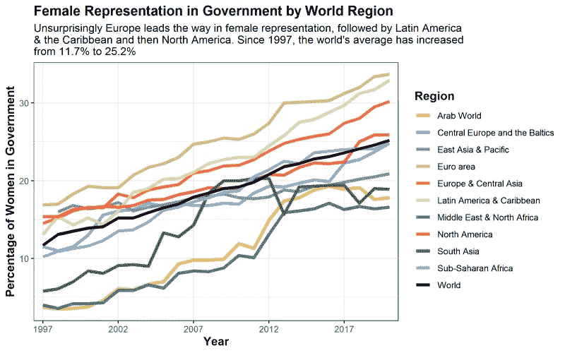
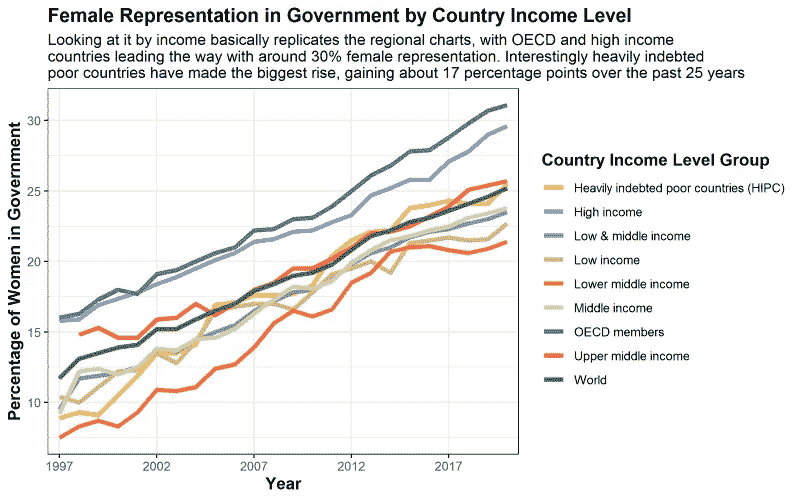
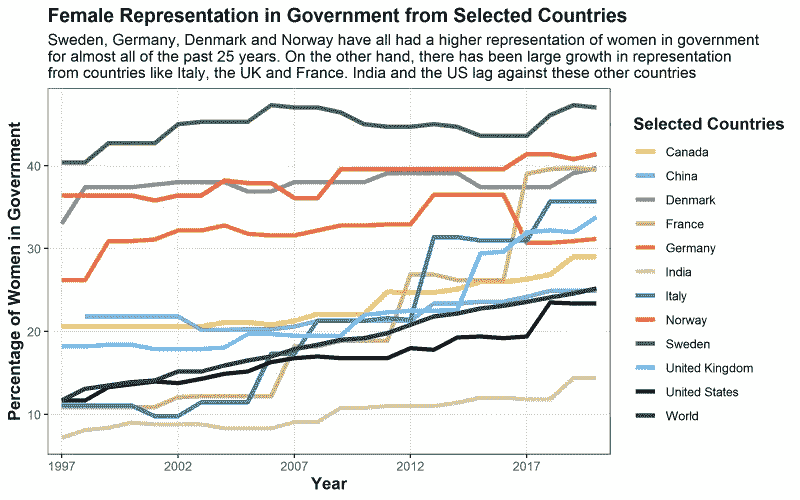
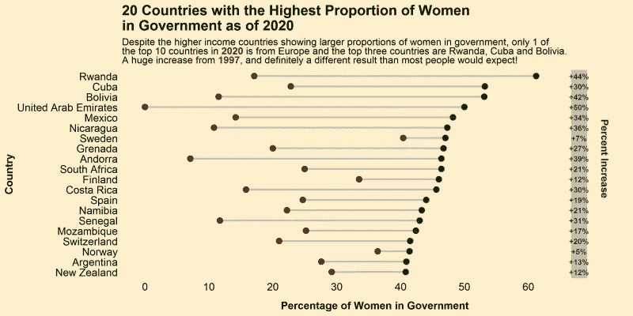
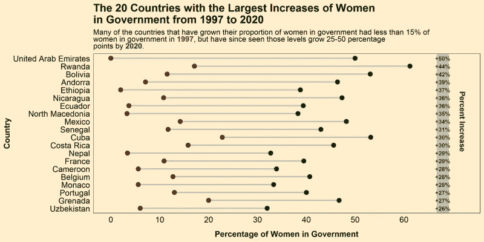

# 可视化世界各国政府中女性的比例

> 原文：<https://medium.com/analytics-vidhya/visualizing-women-in-government-for-international-womens-day-fe9f10dd4450?source=collection_archive---------15----------------------->

## 为庆祝国际妇女节，用 R 来描绘过去 24 年中女性在政府中的代表性是如何增加的。提示，还不够！

**国际妇女节快乐！**

本着这一天的精神，我想写一篇文章**来赞美这个世界上许多优秀的女性。为了与我的政治分析主题保持一致，我认为按国家来看女性在政府中的比例会很有趣，以及这在过去几十年中是如何变化的。幸运的是，世界银行有这样一个数据集，测量全世界每个国家女性在政府中所占的比例。让我们来看看这些数据吧！**

**总的来说，我将带你经历 5 次可视化:**

1.  图 1——按世界区域分列的政府中的女性比例
2.  图 2——按国家收入水平分列的女性在政府中的代表性
3.  图 3——选定国家政府中的女性代表
4.  图表 4–截至 2020 年，政府中女性比例最高的 20 个国家
5.  图表 5——从 1997 年到 2020 年，政府中女性人数增加最多的 20 个国家

# 步骤 1 —下载并清理数据

首先，让我们清理数据。你可以在我的 GitHub 上找到原始的 csv 文件[。要清理数据，有三个步骤。首先，使用`substring()`将年份名称去掉几个字符，使用`janitor`包中的`make_clean_names()`函数清除其他名称，修改列名，使它们更容易阅读。然后更改所有缺失的数据(".."在原始数据集中)到 NAs，同时用`sapply()`将所有年份列转换成数字。这就是了，一个相对干净的主数据框架！](https://github.com/danderson222/women-in-government)

```
# Load the necessary packages
# Tidyverse is our rock in data analysis (includes ggplot2)
if(!require("tidyverse")) install.packages("tidyverse") 
# Janitor cleans data like the best janitor out there!
if(!require("janitor")) install.packages("janitor")
# ggsci has my favourite color palettes
if(!require("ggsci")) install.packages("ggsci")
# ggalt is necessary for the dumbbell chart
if(!require("ggalt")) install.packages("ggalt") 
# ggtext allows for great text to include for charts
if(!require("ggtext")) install.packages("ggtext") # Load the csv data file
df <- read_csv("WomenInGovernment_Data.csv")# Change the column names to account for each year of the data 1997-2020
names <- colnames(df)[4:27]
names <- substring(names, 7,12)
colnames(df)[4:27] <- names
colnames(df) <- janitor::make_clean_names(colnames(df))# Change all the ..s in the data to NAs and then convert the columns to numeric
df[,4:27] <- na_if(df[,4:27], "..")
df[,4:27] <- sapply(df[,4:27],as.numeric) %>% 
  round(digits = 1)
```

在这之后，我想让读者更容易理解，所以我**将大数据集分成 5 个独立的数据集，每个数据集对应我们正在创建的一个地块**。为此，我们使用`filter()`功能，该功能允许我们按照自己想要的方式进行切割。我还使用了`pivot_longer()`函数来重新创建数据帧，并使它们更加*整齐*以便于我们的分析。这是一个我几乎总是忽略的好习惯…

最后，对于哑铃图，我们创建一个**列，计算 1997 年和 2020 年**之间的变化。然后，我们根据女性在政府中的比例(第四张图表)或从 1997 年到 2020 年的变化(第五张图表)对这些国家进行排名。

```
# Create a dataset for each chart, just to make it .
# For this we filter the data for the region, income or country, then make the graph longer using the pivot_longer() function
# Regional chart dataset
df.region <- df %>% 
  filter(category == "Region" | category == "World") %>% 
  pivot_longer(cols = starts_with("yr"), names_to = "year", names_prefix = "yr",
               values_to = "value", values_drop_na = TRUE)# Income chart dataset
df.income <- df %>% 
  filter(category == "Income" | category == "World") %>% 
  pivot_longer(cols = starts_with("yr"), names_to = "year", names_prefix = "yr",
               values_to = "value", values_drop_na = TRUE)# Selected Countries chart (Chose countries that are either near and dear to me or where my readers tend to be)
selected_countries <- c("World", "Canada", "China", "Denmark", "France", "Germany", "India", 
                        "Italy", "Norway", "Sweden", "United Kingdom", "United States")
df.country <- df %>% 
  filter(country_name %in% selected_countries| category == "World") %>%
  pivot_longer(cols = starts_with("yr"), names_to = "year", names_prefix = "yr",
               values_to = "value", values_drop_na = TRUE)# Top Female representation by country dumbbell chart
df.top.dumbbell <- df %>% 
  filter(category == "Country") 
df.top.dumbbell$change <- df.top.dumbbell$yr2020 - df.top.dumbbell$yr1997
df.top.dumbbell <- head(arrange(df.top.dumbbell, desc(yr2020)), n = 20) %>% 
  droplevels()
df.top.dumbbell$country_name <- factor(df.top.dumbbell$country_name, levels = as.character(df.top.dumbbell$country_name))  # to retain the order in plot.# Top Female Increase in representation dumbbell chart
df.change.dumbbell <- df %>% 
  filter(category == "Country") 
df.change.dumbbell$change <- df.change.dumbbell$yr2020 - df.change.dumbbell$yr1997
df.change.dumbbell <- head(arrange(df.change.dumbbell, desc(change)), n = 20) %>% 
  droplevels()
df.change.dumbbell$country_name <- factor(df.change.dumbbell$country_name, levels = as.character(df.change.dumbbell$country_name))  # to retain the order in plot.
```

# 步骤 2 —绘制图表的时间

好了，现在我们已经创建了五个独立的数据框架，每一个都将讲述一个不同的故事，关于女性在国家政府中的代表性在过去的 24 年中是如何变化的。

# 图 1——按世界区域分列的政府中的女性比例

在开始之前，我们用`theme_set()`创建设置基本主题，并用`dir.create()`为所有的情节创建一个文件夹。我在代码中非常详细地解释了我是如何创建每个情节的，所以没有必要用更多的文本来烦你。第一张图涉及全球的**地区。**

```
# Let's set the theme and create a folder to store your output
theme_set(theme_bw())
dir.create("plots")

# First create a plot of all the regional representation of women in government
region.plot <- ggplot(df.region, aes(x=year,y=value,group=country_name,color=country_name)) +
  geom_line(size = 1.5) +

  # My top color palette
  scale_color_simpsons() +

  # Set the x-axis scale
  scale_x_discrete(breaks=c(1997,2002,2007,2012,2017)) +

  # Update the labels of the axes
  labs(x = "Year",
       y = "Percentage of Women in Government",
       title = "Female Representation in Government by World Region",
       subtitle = "Unsurprisingly Europe leads the way in female representation, followed by Latin America \n& the Caribbean and then North America. Since 1997, the world's average has increased \nfrom 11.7% to 25.2%",
       color = "Region")  +

   #Adjust the axes
  theme(plot.title = element_text(face="bold", size =14), 
        axis.title.x = element_text(face="bold", size = 12),
        axis.title.y = element_text(face="bold", size = 12),
        legend.title = element_text(face="bold", size = 12))
region.plot
# Save the plot!
ggsave("plots/RegionalPlot.png", region.plot, height = 5, width = 8)
```



第一个情节很有趣。正如我们所看到的，欧洲和美洲的女性比例最高，而中东、北非和东南亚则相对落后。我们能从中得出的最积极的消息是，在过去的 25 年里，女性代表的世界平均水平已经翻了一倍多，达到大约四分之一。然而，这个数字仍然很低，希望我们能看到这个数字继续上升。**按照目前的斜率，我们要到 2065 年左右才能看到 50/50 的比例，这对平等代表权来说太晚了……**

# 图 2 -按国家收入水平分列的女性在政府中的代表性

是时候绘制第二张图了，这一次是根据各国的收入水平。

```
# Next comes all the countries by income level
income.plot <- ggplot(df.income, aes(x=year,y=value,group=country_name,colour=country_name)) +
  geom_line(size = 1.5) +
  scale_color_simpsons() +
  scale_x_discrete(breaks=c(1997,2002,2007,2012,2017)) +
  labs(x = "Year",
       y = "Percentage of Women in Government",
       title = "Female Representation in Government by Country Income Level",
       subtitle = "Looking at it by income basically replicates the regional charts, with OECD and high income \ncountries leading the way with around 30% female representation. Interestingly heavily indebted \npoor countries have made the biggest rise, gaining about 17 percentage points over the past 25 years",
       color = "Country Income Level Group")  +
  theme(plot.title = element_text(face="bold", size =14), 
        axis.title.x = element_text(face="bold", size = 12),
        axis.title.y = element_text(face="bold", size = 12),
        legend.title = element_text(face="bold", size = 12))
income.plot
ggsave("plots/IncomePlot.png", income.plot, height = 5, width = 8)
```



就像第一个图一样，在欧洲或美洲的富裕国家，女性在政府中的比例更高。**排名按照收入划分得很清楚，前三行都是从中上到较富裕的国家**，所以如果你做进一步的分析，这两者之间肯定有关联。

# 图 3 -按国家收入水平分列的女性在政府中的代表性

是时候对几个著名的国家(以及一些我更喜欢的国家)做一些分析了。

```
# Third comes my selected countries
country.plot <- ggplot(df.country, aes(x=year,y=value,group=country_name,colour=country_name)) +
  geom_line(size = 1.5) +
  scale_color_simpsons() +
  scale_x_discrete(breaks=c(1997,2002,2007,2012,2017)) +
  labs(x = "Year",
       y = "Percentage of Women in Government",
       title = "Female Representation in Government from Selected Countries",
       subtitle = "Sweden, Germany, Denmark and Norway have all had a higher representation of women in government \nfor almost all of the past 25 years. On the other hand, there has been large growth in representation \nfrom countries like Italy, the UK and France. India and the US lag against these other countries",
       color = "Selected Countries")  +
  theme(plot.title = element_text(face="bold", size =14), 
        axis.title.x = element_text(face="bold", size = 12),
        axis.title.y = element_text(face="bold", size = 12),
        legend.title = element_text(face="bold", size = 12))
country.plot
ggsave("plots/CountryPlot.png", country.plot, height = 5, width = 8)
```



从这个情节中最大的收获是看到**在德国、丹麦、挪威和瑞典，女性的比例稳定在 40%左右。看看他们是否能达到 50%将会很有趣。与此同时，一些国家，如意大利、英国和法国，在过去十年中迅速崛起。你真的可以看到 2015 年英国的飞跃，当时工党(前两名之一)做出了巨大的努力，增加了更多的女性议员，使女性在议会中的代表性提高了约 7 个百分点！对于更好的代表性和多样性来说，这无疑是一个积极因素。**

# 图 4 -按国家收入水平分列的女性在政府中的代表性

**现在我想绘制一些哑铃图，**这是一种真正比较历史上两个不同时间点或两个不同组之间的数据的方法。为了绘制这些图表，我们使用了`ggalt`包中的`geom_dumbbell()`函数，它允许您添加哑铃状图标来绘制您最初在`ggplot()`函数中调用的数据。这需要更多的格式，正如你看到的，我使用了像`geom_text()`、`geom_rect()`和`annotate()`这样的函数来添加一些很酷的边框和语言。我真的很想对 GitHub 的 tessa eagle 大喊一声，感谢她在 Twitter 上找到的最近一期 TidyTuesday 的哑铃图代码，这真的帮助我获得了制作下面两张图表的基本代码！

所以在第一张哑铃图中，我想看看政府中女性比例最高的 20 个国家。我还在右边展示了每个国家从 1997 年到 2020 年的增长百分比。

```
# Okay now for the pretty dumbbell charts
# The first dumbbell chart shows
top.dumbbell.plot <- ggplot(df.top.dumbbell, aes(y = country_name, x = yr1997, xend = yr2020, group=country_name)) +
  geom_dumbbell(size= 1, size_x = 3, size_xend = 3, colour_x = "darkred", colour_xend = "darkgreen", colour = "grey") +
  labs(
    y = "Country",
    x = "Percentage of Women in Government",
    title = "20 Countries with the Highest Proportion of Women \nin Government as of 2020",
    subtitle = "Despite the higher income countries showing larger proportions of women in government, only 1 of <br>the top 10 countries in <span style = 'color:darkgreen'><b>2020</b></span> is from Europe and the top three countries are Rwanda, Cuba and Bolivia. <br>Definitely different than most people would expect!"
  )+
  scale_x_continuous(breaks = seq(from = 0, to = 60, by = 10)) +
  scale_y_discrete(limits = rev(levels(df.top.dumbbell$country_name))) +
  theme(
    panel.background = element_rect(fill = "#FFEFCB", color = NA),
    plot.background = element_rect(fill = "#FFEFCB", color = NA),
    panel.grid = element_blank(),
    axis.ticks = element_blank(),
    axis.text = element_text(size = 12, color = "black"),
    axis.title.x = element_text(face = "bold", size = 12, margin = margin(t = 10, r = 0, b = 0, l = 0)),
    axis.title.y = element_text(face = "bold", size = 12),
    plot.title = element_text(size = 16, face = "bold"),
    plot.subtitle = element_markdown()
  ) +
  geom_rect(data = df.top.dumbbell, aes(xmin = max(yr2020) * 1.09, xmax = max(yr2020) * 1.13, ymin = -Inf, ymax = Inf), fill = "grey") +
  annotate(geom="text", x = 72, y= df.top.dumbbell$country_name[9], angle = 270,
           label=c("Percent Increase"), color="darkgreen", size = 4, fontface = 'bold') +  
  geom_text(data = df.top.dumbbell, aes(label = paste0("+", round(change), "%"), y = country_name, x = max(yr2020) * 1.11), fontface = "bold", size = 3, color = "darkgreen")
top.dumbbell.plot
ggsave("plots/TopdumbbellPlot.png", top.dumbbell.plot, height = 5, width = 10)
```



这个图表很能说明问题，因为**尽管取得了所有的进步，你可以看到只有三个国家在代表性方面真正突破了 50%的障碍**:卢旺达、古巴和玻利维亚。显然，246 个国家中有 3 个国家的女性代表比例超过了 50%,这还远远没有达到平等，所以世界还有很长的路要走。从这张图表中值得注意的一件有趣的事情是前十名中没有欧洲和北美国家，这表明**也许收入并不总是代表性的最佳指标**！

# 图 5 -按国家收入水平分列的女性在政府中的代表性

最后，我的妇女节帖子的最后一张图表。这张哑铃图展示了各个国家代表人数的最大增幅。

```
# The second dumbbell chart
change.dumbbell.plot <- ggplot(df.change.dumbbell, aes(y = country_name, x = yr1997, xend = yr2020, group=country_name)) +
  geom_dumbbell(size= 1, size_x = 3, size_xend = 3, colour_x = "darkred", colour_xend = "darkgreen", colour = "grey") +
  labs(
    y = "Country",
    x = "Percentage of Women in Government",
    title = "The 20 Countries with the Largest Increases of Women \nin Government from 1997 to 2020",
    subtitle = "Many of the countries that have grown their proportion of women in government had less than 15% of <br>women in government in <span style = 'color:darkred'><b>1997</b></span>, but have since seen those levels grow 25-50 percentage <br>points by <span style = 'color:darkgreen'><b>2020</b></span>."
  )+
  scale_x_continuous(breaks = seq(from = 0, to = 60, by = 10)) +
  scale_y_discrete(limits = rev(levels(df.change.dumbbell$country_name))) +
  theme(
    panel.background = element_rect(fill = "#FFEFCB", color = NA),
    plot.background = element_rect(fill = "#FFEFCB", color = NA),
    panel.grid = element_blank(),
    axis.ticks = element_blank(),
    axis.text = element_text(size = 12, color = "black"),
    axis.title.x = element_text(face = "bold", size = 12, margin = margin(t = 10, r = 0, b = 0, l = 0)),
    axis.title.y = element_text(face = "bold", size = 12),
    plot.title = element_text(size = 16, face = "bold"),
    plot.subtitle = element_markdown()
  ) +
  geom_rect(data = df.change.dumbbell, aes(xmin = max(yr2020) * 1.09, xmax = max(yr2020) * 1.13, ymin = -Inf, ymax = Inf), fill = "grey") +
  annotate(geom="text", x = 72, y= df.change.dumbbell$country_name[9], angle = 270,
           label=c("Percent Increase"), color="darkgreen", size = 4, fontface = 'bold') +  
  geom_text(data = df.change.dumbbell, aes(label = paste0("+", round(change), "%"), y = country_name, x = max(yr2020) * 1.11), fontface = "bold", size = 3, color = "darkgreen")
change.dumbbell.plot
ggsave("plots/ChangedumbbellPlot.png", change.dumbbell.plot, height = 5, width = 10)
```



这张图表中的领导者是阿拉伯联合酋长国，这让我感到非常惊讶和奇怪。稍多一点的研究表明，阿联酋不是一个民主国家，所以这些妇女不是民选的，而是由君主任命的。所以在我看来这并不是真正的平等。

但是其他国家的增长超过了 35 个百分点，比如卢旺达、玻利维亚、安道尔、埃塞俄比亚等等，这确实令人鼓舞。这些国家中有很多从几乎没有女性代表发展到相当数量，所以还有很多工作要做。但至少现在你知道了政界女性的世界是什么样的，希望在未来的几年里，女性能有更多的收获！祝所有出色的女士们国际妇女节快乐！

**参考资料:**
[1]世界银行数据库，[世界发展指标=妇女在国家议会中所占席位的比例](https://databank.worldbank.org/reports.aspx?source=2&series=SG.GEN.PARL.ZS&country=#)(2021 年)

*我是 Monitor Deloitte 的模拟&战略顾问，我使用统计数据和分析为数字双胞胎模型提供信息，这些模型重新发明了公司进行战略决策的方式。在我的空闲时间，我痴迷于政治和政策，一直在数字* *的* [*政策上写博客。你可以在那里或者在我的*](https://www.policyinnumbers.com/)[*LinkedIn*](https://www.linkedin.com/in/dylansjanderson/)*和*[*Twitter*](https://twitter.com/dylansjanderson)*账号找到我(随意连接或者给我一个关注)。*