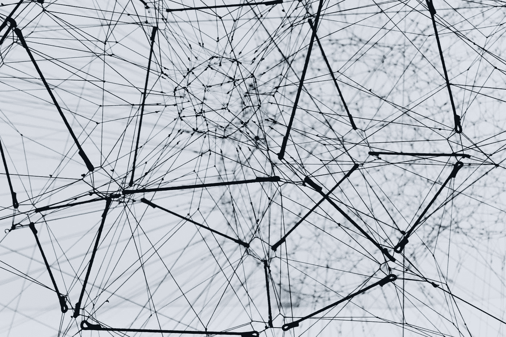

# 卷积神经网络中的漏洞

> 原文：<https://medium.com/analytics-vidhya/vulnerabilities-in-convolutional-neural-network-11edfa36a38b?source=collection_archive---------13----------------------->

## 婴儿的脚步:)



艾莉娜·格鲁布尼亚克在 [Unsplash](https://unsplash.com?utm_source=medium&utm_medium=referral) 上的照片

## 放弃

在这篇博文中，我们将讨论**快速梯度符号方法(FGSM)，**一种可以用来对付 CNN 的特定攻击媒介。如果你是一个像我一样的安全研究人员，是 AI / ML 领域的新手，我强烈建议你去读一下先决条件部分。如果你是那个机器学习向导，请随意跳过同样的问题

## 先决条件

令人高兴的是，我们不需要设置任何环境来执行下面的代码。相反，我们可以直接运行 Google 的合作实验室或 Colab 中的代码片段。
但是要理解攻击，你需要对机器学习概念和术语有一个基本的了解，像**卷积神经网络，梯度下降，损失函数，MobileNetV2，ImageNet，Tensorflow，Keras。**

**系好安全带，然后……** 首先，我们从一个攻击者的角度来看待 CNN，在这个案例中，他可以完全访问模型的架构、输入和输出。简而言之，FGSM 可以被归类为白盒攻击，我们的目标是欺骗图像分类器对输入图像做出错误的预测。

分类图像。现在我们需要理解梯度下降和损失函数。当涉及到训练神经网络时，梯度是你如何确定轻推你的权重的方向，以减少损失值，从而获得准确的预测。

在 FSGM 中，我们做的与:D 相反..FSGM 通过使用神经网络的梯度来创建一个对立的例子。对于输入图像，该方法使用损失相对于输入图像的梯度来创建使损失最大化的新图像。这个新形象被称为敌对形象。这可以用下面的表达式来概括:


在哪里

*   adv_x:对抗性的形象。
*   x:原始输入图像。
*   y:原始输入标签。
*   ϵ:确保扰动小的乘数。
*   θ:模型参数。
*   j:损失。


> 在上图中，为了理解左边的方程，你需要有梯度下降。

嗯，就是这个概念。让我们开始编码吧。请随意将下面的代码片段复制粘贴到 Colab 来运行并观察结果。

```
import tensorflow as tf
import matplotlib as mpl
import matplotlib.pyplot as plt

mpl.rcParams['figure.figsize'] = (8, 8)
mpl.rcParams['axes.grid'] = False
pretrained_model = tf.keras.applications.MobileNetV2(include_top=True,
                                                     weights='imagenet')
pretrained_model.trainable = False

# ImageNet labels
decode_predictions = tf.keras.applications.mobilenet_v2.decode_predictions
# Helper function to preprocess the image so that it can be inputted in MobileNetV2
def preprocess(image):
  image = tf.cast(image, tf.float32)
  image = tf.image.resize(image, (224, 224))
  image = tf.keras.applications.mobilenet_v2.preprocess_input(image)
  image = image[None, ...]
  return image

# Helper function to extract labels from probability vector
def get_imagenet_label(probs):
  return decode_predictions(probs, top=1)[0][0]
image_path = tf.keras.utils.get_file('YellowLabradorLooking_new.jpg', 'https://storage.googleapis.com/download.tensorflow.org/example_images/YellowLabradorLooking_new.jpg')
image_raw = tf.io.read_file(image_path)
image = tf.image.decode_image(image_raw)

image = preprocess(image)
image_probs = pretrained_model.predict(image)
plt.figure()
plt.imshow(image[0]*0.5+0.5) # To change [-1, 1] to [0,1]
_, image_class, class_confidence = get_imagenet_label(image_probs)
plt.title('{} : {:.2f}% Confidence'.format(image_class, class_confidence*100))
plt.show()
```

现在让我们休息一下，你在 Colab 上执行代码了吗？好吧，如果是的话，你应该已经看到程序以 41.82%的置信度将拉布拉多犬的图像分类为拉布拉多犬本身。没什么好惊讶的，这是一个普通的图像分类程序。无论如何，让我们分解代码。所以程序从导入 TensorFlow 和其他需要的库开始。之后加载 MobileNetV2 模型。接下来定义`preprocess`功能。这么说吧，在机器学习中，我们需要在输入模型之前对输入进行预处理。每个模型可能需要以不同的方式对输入进行预处理，以便特定的模型可以有效地预测输出。现在我们给程序提供一张拉布拉多的图片。程序获取该图像，对其进行预处理(`image = preprocess(image)`)并对预处理后图像进行预测(`image_probs = pretrained_model.predict(image)`)。最后，程序将预测与图像一起显示。

是啊，是啊，所以这都是机器学习 101。所以让我们通过编写对抗性的东西来使事情变得有趣一点。

```
loss_object = tf.keras.losses.CategoricalCrossentropy()

def create_adversarial_pattern(input_image, input_label):
  with tf.GradientTape() as tape:
    tape.watch(input_image)
    prediction = pretrained_model(input_image)
    loss = loss_object(input_label, prediction)

  # Get the gradients of the loss w.r.t to the input image.
  gradient = tape.gradient(loss, input_image)
  # Get the sign of the gradients to create the perturbation
  signed_grad = tf.sign(gradient)
  return signed_grad
```

上面的代码只是一个函数，它返回 FSGM 方程的一部分，即


让我们来想象一下上面的结果/ `perturbations`

```
# Get the input label of the image.
labrador_retriever_index = 208
label = tf.one_hot(labrador_retriever_index, image_probs.shape[-1])
label = tf.reshape(label, (1, image_probs.shape[-1]))

perturbations = create_adversarial_pattern(image, label)
plt.imshow(perturbations[0]*0.5+0.5); # To change [-1, 1] to [0,1]
```


现在我们有了扰动(输入图像的损耗 w.r.t .的有符号梯度)，我们可以在与梯度方向相反的方向上轻推图像像素。这意味着我们必须在最大化损失的方向上推动图像像素，以便 CNN 对图像进行错误的分类。为此，我们将对不同的ε值运行攻击，ε= 0 表示没有运行攻击。请注意，随着ε值的增加，欺骗网络变得更加容易。然而，这是一种折衷，导致扰动在输入图像中变得更容易识别。

```
def display_images(image, description):
  _, label, confidence = get_imagenet_label(pretrained_model.predict(image))
  plt.figure()
  plt.imshow(image[0]*0.5+0.5)
  plt.title('{} \n {} : {:.2f}% Confidence'.format(description,
                                                   label, confidence*100))
  plt.show()epsilons = [0, 0.01, 0.1, 0.15]
descriptions = [('Epsilon = {:0.3f}'.format(eps) if eps else 'Input')
                for eps in epsilons]

for i, eps in enumerate(epsilons):
  adv_x = image + eps*perturbations
  adv_x = tf.clip_by_value(adv_x, -1, 1)
  display_images(adv_x, descriptions[i])
```

让我们看看结果


还有瓦拉！！:MobileNetV2 模型被欺骗了，它不能准确地预测/分类图像。

感谢您浏览博客。直到下一次，测试呈阴性并保持阳性。

## 参考

*   [解释和利用对立的例子](https://arxiv.org/abs/1412.6572)
*   [使用 FGSM 的对抗示例](https://www.tensorflow.org/tutorials/generative/adversarial_fgsm)