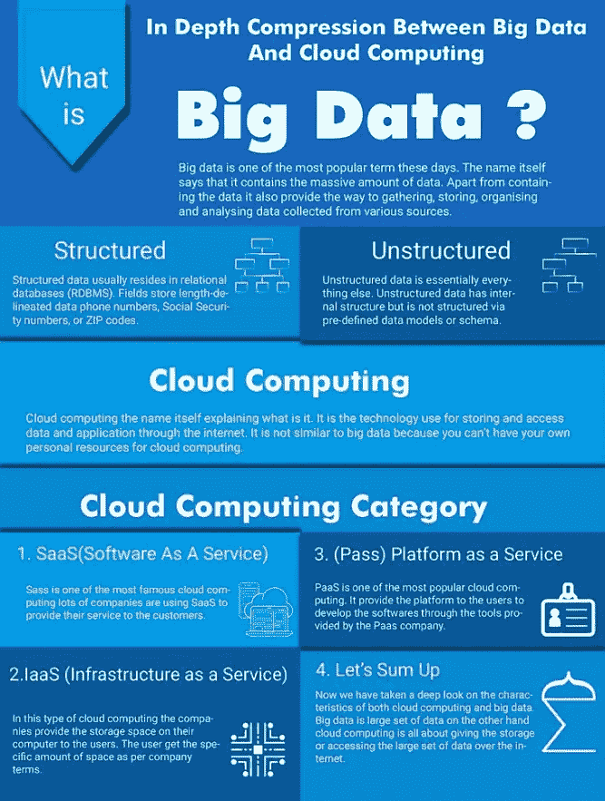

# 演练 AZ-900 考试的内容和流程:Microsoft Azure 基础知识

> 原文：<https://medium.com/analytics-vidhya/walkthrough-the-contents-and-process-of-az-900-exam-microsoft-azure-fundamentals-9ca5b196a256?source=collection_archive---------10----------------------->

图片来自谷歌图片

我最近通过了微软 Azure 基础认证(AZ-900 ),发现许多人对考试的整个过程和体验提出了疑问。因此，我把整个过程放在这里，我希望它可以帮助任何人。

首先，我对云计算的兴趣是我数据科学课程的一部分，这促使我尝试这个考试。对于数据科学领域的任何人来说，了解 Azure 服务提供的运行和部署模型的机器学习和认知服务都是一种很好的体验。我是在阅读考试 DP-100:在 Azure 上设计和实现数据科学解决方案时意识到这一点的😊。

我们都知道，云迁移正日益发展壮大。无论你想投资哪一个 IT 行业，了解云基础知识及其应用都是一种优势。

数据科学和云(图片来自谷歌图片)

这篇文章将分为两部分:

a)微软 Azure 基础课程(AZ-900)

b)登记和程序

我们开始吧！！

a) *微软 Azure 基础课程(AZ-900)* :

Azure 基础考试(AZ-900)是基础考试，帮助任何人对 Azure 中的云操作有一个整体的看法。Azure 简化了对云及其操作的理解，以及云是如何在网络中分布的。这样做可以给任何初学者一个关于云的基础。

首先，您需要在下面的路径中有一个学员帐户。

**学员账号**:【https://docs.microsoft.com/en-us/learn/】T4

以下学习路径中提供的 Microsoft 文档有助于熟悉考试的基础知识:

**学习路径**:[https://docs . Microsoft . com/en-us/learn/certificates/exams/az-900](https://docs.microsoft.com/en-us/learn/certifications/exams/az-900)

***我考的怎么样？***

我的考试持续了一个小时，有 40 个问题，但问题的数量可能从 40 到 60 不等，但不用担心，获得的分数总是标准化的，以给予公平的对待。😊

注意:所有问题都是选择题；因此，相比较而言，它使任务变得容易一点。:)

***考试重点是什么？***

帐户设置完成后，用户可以使用提供的选项预订考试。现在回到考试上来。考试基于以下几点:

a) **云计算概念**:IaaS、PaaS、SaaS 之间的区别，以及在特定区域提供哪些服务或应用。例如，Azure 虚拟机是 IaaS 的一部分，而 Skype 是 SaaS 的一部分。这部分包含了我考试中大约 10-15%的问题。

b) **Azure 云服务**:这部分占了我试卷上问题的 35%左右。但它可能不同于 25-30%。这一部分主要由微软 Azure 的服务组成，包括角色、订阅、网络和各种 Azure 监控工具。如何建立网络，在建立过程中需要记住哪些工具和目标，包括连接层及其职责和对任何攻击的防范。主要是学习路径的第 2-3 部分中包含的解释。

c)下一大块问题来自 **Azure Security** 、**隐私、合规**部分，其中包括另外 30- 35%的考试问题。我们试图测试你对 Azure 中的安全挑战、隐私政策和合规活动以及角色的了解程度。该模块指出，数据隐私是一个关键点，需要最大限度地关注。

d)其余 10-15%的问题是关于涵盖 AZ-900 学员课程学习路径第 6 部分的 **Azure 定价和支持**。本模块重点介绍 Azure 订阅、其变体、有效性和支持活动。

更准确地说，大多数问题描述了一个现实生活中的场景问题，应该在提供的多个选项中选择一个合适的解决方案。

*b)报名参加考试:*

作为一名研究生，我通过“认证端口”安排了我的 AZ-900 考试。“Certiport”提供在线监考形式。

考试前，您必须在 Certiport 门户网站注册，并提供您的个人资料详情。请记住，同样的证书将用于考试本身。当您点按“带证书的时间表”时选择下面的“选择您想要参加的考试”部分，以获得微软的任何认证，如云、数据科学、数据分析等。

我们将为您指派一名监考人，该监考人将在您考试前 2-3 天与您沟通，向您提供有关您的虚拟机链接的信息，以便您访问考试以及需要进行哪些验证。过程很简单！

该链接只会在您预定的时间被激活。如果有任何超过 5 分钟的延迟加入链接，您可能无法参加考试。在考试期间，监考人将指导您完成各个步骤，同时在记事本上进行交流。

然后监考老师会解锁你的考试，之后你就可以开始考试了！！！希望这有帮助！！

干杯！！！