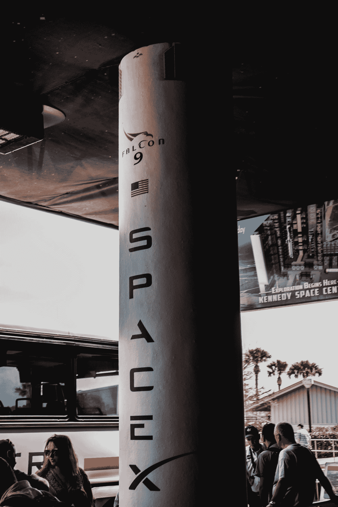

# 我们分析了埃隆·马斯克的推文，以下是我们对 Space X 和特斯拉的了解

> 原文：<https://medium.com/analytics-vidhya/we-analyzed-elon-musks-tweets-and-here-s-what-we-learned-about-space-x-and-tesla-d8e837687e47?source=collection_archive---------8----------------------->

## 用自然语言处理技术

劳伦茨·海曼在 [Unsplash](https://unsplash.com?utm_source=medium&utm_medium=referral) 上拍摄的照片

## 马斯克，永远发微博的技术

2019 年，埃隆·马斯克(Elon Musk)因使用 Twitter 而与美国证券交易委员会(SEC)陷入麻烦，当时他在推特上表示，他计划将特斯拉私有化。