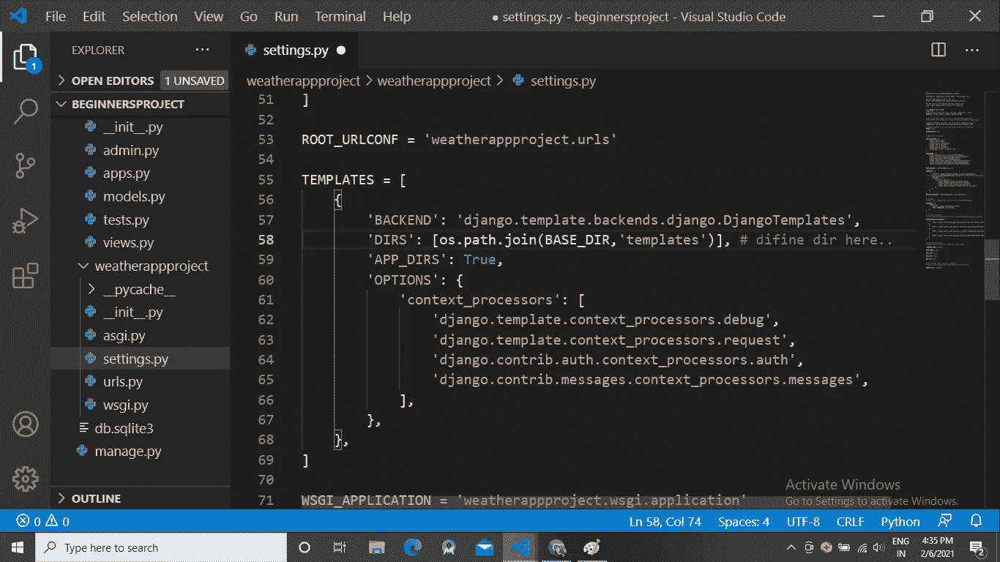

# Django 的天气应用

> 原文：<https://medium.com/analytics-vidhya/weather-app-in-django-1a12b1fbf52c?source=collection_archive---------4----------------------->

欢迎初学者，

今天我们将使用 Django 后端创建一个简单的天气应用程序。如果你是初学者，那么这篇文章只适合你！！！

开始吧，首先确定你已经下载了 Django！Django 可以使用 pip 轻松安装。pip 是 Python 的一个包管理器，它使用 [Python 包索引](https://pypi.python.org/)来安装 Python 包。在命令提示符下，执行以下命令:`**pip install django**`。这将下载并安装 Django。

cmd 安装 Django

安装完成后，您可以通过在命令提示符下执行`**django-admin --version**`来验证您的 Django 安装。

检查 Django 版本

我用的是 Visual studio 代码。让我们继续…打开 Visual studio 代码，进入查看> >终端现在点击它。

> 为了启动 django 项目，我们使用以下命令(cmd 的语法): **django-admin startproject 项目名称**

现在输入命令**“django-admin start project weatherappproject”**并回车，在当前目录下创建一个新的 Django 项目。您可以为项目取任何名称，而不是“weatherappproject”。

创建新项目

您可以看到在您的文件夹中创建了一个新项目(这里我的文件夹名称是“beginnersproject”)，所以只需单击 EXPLORER 图标。它显示了目录中的所有文件。

> 要更改当前目录或进入项目，请运行以下命令(语法): **cd 项目名称**

现在只需激活您当前的目录，就可以开始下一步的工作了。运行命令**“CD weather appproject”**

进入项目

> 要在项目中创建应用程序，您需要运行以下命令(语法):**python manage . py startapp project appname**

在“weatherappproject”中创建一个应用程序只需运行命令**“python manage . py startapp weather app”**该应用程序就会添加到您的当前目录中，即您的项目检查浏览器中

创建应用程序

项目的结构

当我们创建一个应用程序时，它只是刚刚创建，但实际上不包括在项目中，因此，要考虑项目中的应用程序，我们必须在 INSTALLED_APPS 列表中添加应用程序名称。所以进入项目 weather app project > > weather app project > > weather app > > settings.py 双击打开 settings . py 向下滚动你得到 INSTALLED_APPS 列表，添加应用名称。

将应用程序添加到列表中

> 要运行 Django 项目，您必须运行以下命令(语法):**python manage . py runserver**

之后，你会看到下面的网页，因为到目前为止我们还没有创建前端，所以要设置前端，我们必须创建前端。

默认页面

让我们在您的应用程序文件夹中创建一个模板文件夹，确保文件夹名称应为“模板”。按照路径创建模板文件夹:weatherapp >>右键>>新建文件夹> >点击它> >键入模板

创建模板

现在我们要做一些设置，只需在 settings.py 导入操作系统模块中指定模板的目录，以设置目录和时区。如果你不是印度人，那么使用这个[链接](https://en.wikipedia.org/wiki/Time_zone)正确设置你的时区

模板目录

设置时区

在模板文件夹中创建一个 weather.html 文件。这里我们关注后端，所以我创建了一个简单的页面。

这是一个简单的 Html 页面

现在转向 weatherapp 中的 views.py 文件。使用天气 API，我们可以检索当前和预测的天气数据。有关天气预报的详细信息，请访问[链接](https://openweathermap.org/api)

现在开始写 views.py 导入重要模块的主代码。

**“导入 URL lib . request”**要打开 URL 并检索数据，实际上该 URL 是用于调用 API 的参数组合。有关更多详细信息，请遵循以下步骤:

1.  单击 API 文档查看 API 调用的详细信息

2.现在，您可以看到下面的 API 调用信息页面。

> 要调用天气 API，请使用以下语法:**http://api.openweathermap.org/data/2.5/weather?q={city 名称} &单位=公制& appid={API 关键字}**

我们可以通过城市名称、城市 ID、地理坐标、邮政编码来获取天气数据，但是城市名称对于用户来说更容易获取天气数据。这里我们从用户那里获取城市名称，并给出天气数据作为输出。现在的问题是如何得到一个 API 密匙？

获取 API 密钥

**“导入 json”**用于将 JSON 文件转换成 python 字典。您可以从下图中获得 JSON 文件和天气字段的信息。

现在定义一个将请求作为参数的函数。

现在，通过添加一些代码来更新您的 HTML 页面

在 urls.py 文件中设置 URL

weather appproject > > weather appproject > > URLs . py

我们没有创建任何模型，也没有使用任何内置模型，所以没有创建数据库表，但默认情况下会创建一些表。

> 要更新数据库更改，我们必须运行以下命令(语法):
> 
> **python manage . py make migrations**(创建查询是 django 的 sql)
> 
> **python manage.py 迁移**(创建数据库表)

现在，每当您在模型中进行更改时，请逐一运行上面的命令，然后运行上面的两个命令来更新数据库表，这一点很重要

使用命令**“python manage . py runserver”**运行 Django 项目

复制链接并粘贴到浏览器上

只需扩展/home 然后运行…

最后，在搜索栏上输入你的城市名，获得天气数据！我正在进入奥兰加巴德...

在这里，我们了解了一些命令，安装 pip，Django，最重要的是了解是否 API，如何调用 API，并获得不同的天气领域，如压力，湿度，日落，日出等。希望这对你有帮助:)