# 使用 Streamlit 在 10 分钟内完成 Web 应用程序

> 原文：<https://medium.com/analytics-vidhya/web-application-in-10-minutes-with-streamlit-99685e3350e0?source=collection_archive---------4----------------------->

## 在本文中，我将介绍我最喜欢的 Python web 应用程序库 Streamlit。它允许你在一瞬间创建漂亮的数据科学或机器学习(或者其他一些)应用程序。


多梅尼科·洛亚在 [Unsplash](https://unsplash.com?utm_source=medium&utm_medium=referral) 上拍摄的照片

向不了解编码的同事或朋友展示数据应用程序可能是一件棘手的事情。大多数业外人士不知道如何将他们的值输入到机器学习管道中，或者使用提供的代码生成图表。在这种情况下，你需要开发应用程序和用户界面，让每个人都可以使用你的发现。然而，大多数数据科学家和机器学习工程师不知道如何自己创建一个 web 应用程序。

本文将教你如何通过使用纯 Python 代码和 [Streamlit](https://streamlit.io/) 库来创建一个 web 应用程序。当然，为了理解 Streamlit 的潜力，我们需要看看用它开发的例子。你可以在这里访问其中的一些[。植物病害分类 App 就是其中一个例子。](https://streamlit.io/gallery)

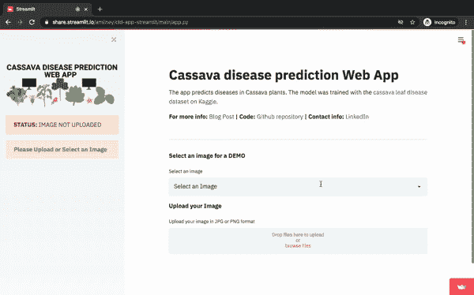

Amin Yamlahi 在 Streamlit 网站[上发布的 GIF 图片](https://discuss.streamlit.io/t/my-computer-vision-app-to-predict-diseases-in-plants/10589)

正如你所看到的，阿明的应用程序相当先进，可以由一个对分类如何工作一无所知的人使用。他只需上传图片就能看到结果！

在本教程中，我将通过构建一个简单的应用程序来展示 Streamlit 的一些基本特性。如果您希望更深入地了解 Streamlit，请使用[文档](https://docs.streamlit.io/en/stable/api.html)，其中包含所有的库特性。我们开始吧！

# 简化安装

首先，您需要安装 Streamlit。您可以通过在终端中运行以下命令来使用 PIP 实现这一点:

```
pip install streamlit
```

您的 Python 版本可能会有问题，所以一定要将 Streamlit 安装到 Python 3.6+中。

要创建应用程序，您需要将 Streamlit 导入到 Python 文件中，并在终端中使用特定的命令。

对于我们的应用，我们将创建一个文件夹 **streamlit_app** 和一个文件 **app.py** 。在这。py 文件，我们需要把命令:

```
import streamlit
```

然后，我们将以下命令输入终端:

```
cd streamlit_app
streamlit run app.py
```

运行这些命令时，应用程序会出现在浏览器中，您可以继续实时构建应用程序，因为 Python 文件中的更改会自动出现在应用程序页面上(只需使用应用程序设置中的重新运行即可查看这些更改)。

# 应用程序描述

我将构建一个非常人工的应用程序，没有特定的目的，向您展示 Streamlit 中的不同功能。本质上，将创建一个表单来询问用户一些输入。

让我们来看看上一步中的应用程序。

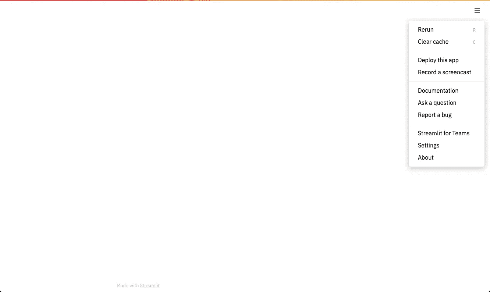

空应用程序

现在，它是一个全空的 app 然而，在本文中，我们将用元素填充它。

# 添加标题和描述

让我们在表单中添加标题和描述。为此，我们将编写以下代码:

现在，我们的应用程序看起来像这样。使用 **st.write()** 方法，你可以在应用程序的任何地方写文本(也可以用于不同的图形(plotly，altair 等。)等内容)。

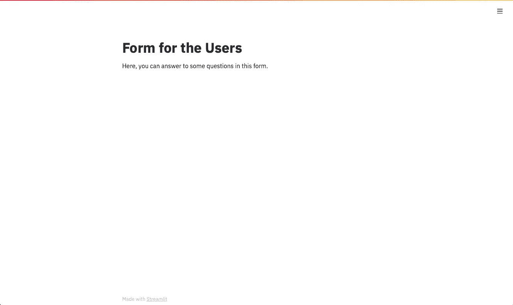

现在，App 有了标题和描述

# 添加输入

**正文**

让我们在应用程序中添加一些漂亮的输入。我们将从文本输入开始。使用方法 **st.text_input()** 可以添加单行文本输入。您还可以为该输入字段使用标签以及最大字符数。例如，如果您希望一个人填写他的 ID，最多由 5 个字符组成，您可以使用它。此外，我们可以添加一个占位符(值，默认情况下会显示)。

**还有一个细节**:我们需要将输入保存在变量中以备后用！

同样，我们可以使用 **st.text_area()** 方法创建一个多行文本输入。还可以添加参数**帮助**。它将为用户提供详细的输入信息，在左侧有一个问题图标。

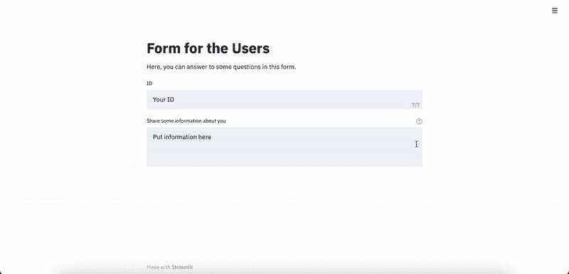

带有文本输入的应用程序

**数字**

要将数字输入添加到您的应用程序中，我们可以使用 **st.number_input()** 方法。我们可以添加最小和最大的数字来选择，以及一个数字部件的步骤。

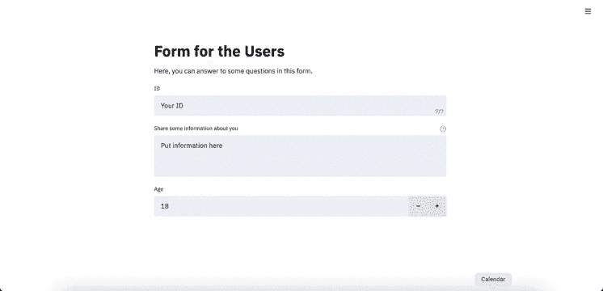

带数字输入的应用程序

**日期**

有时候，你需要邀请一个人约会。在收集了自由格式的日期后，很难使日期格式通用。因此，最好使用特定的小部件。您还可以设置最小和最大日期。

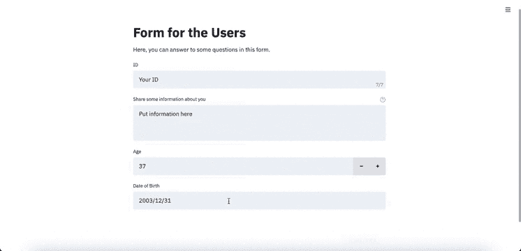

带日期输入的应用程序

**复选框和单选按钮**

让我们添加其他流行的输入类型:复选框和单选按钮。

可以使用 **st.checkbox()** 方法添加复选框。该输入的返回要么为真(如果有人选中了该框)，要么为假。

单选按钮可以通过 **st.radio()** 方法添加。您需要为这种类型的输入提供选项。

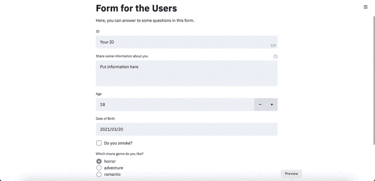

带有复选框和单选按钮的应用程序

**滑块**

我们添加的下一个元素是一个滑块。对于有限的输入范围，直观地了解特定值的选择是一种非常有用的技术。滑块可以用 **st.slider()** 方法创建。有趣的是，滑块不仅可以用于整数或浮点数，还可以用于日期和时间！

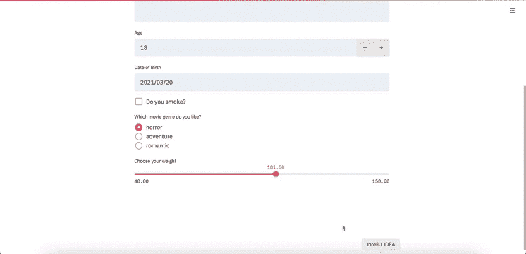

带滑块的应用程序

**选择框**

有时候，我们需要给用户很多选项来选择(所以单选按钮并不合适)。在这些情况下，选择框是一个很好的选择。我们可以创建一个选择框，能够只选择一个选项(用 **st.selectbox()** 方法)或多个选项(用 **st.multiselect()** 方法)。

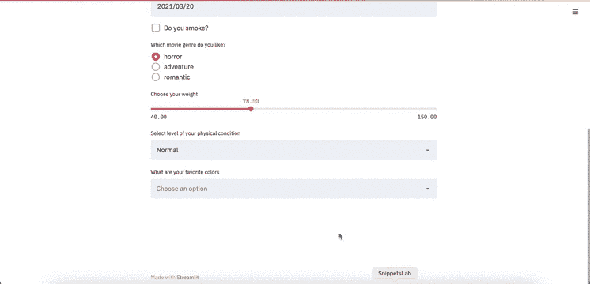

带有选择框的应用程序

**文件**

文件是一种相对高级的输入类型；然而，你怎么能要求一个人的照片而不要求一个图像文件呢？Streamlit 允许我们使用方法 **st.file_uploader()** 从用户那里请求任何文件。但是，为该方法提供适当的文件格式(您的代码支持)是非常重要的。

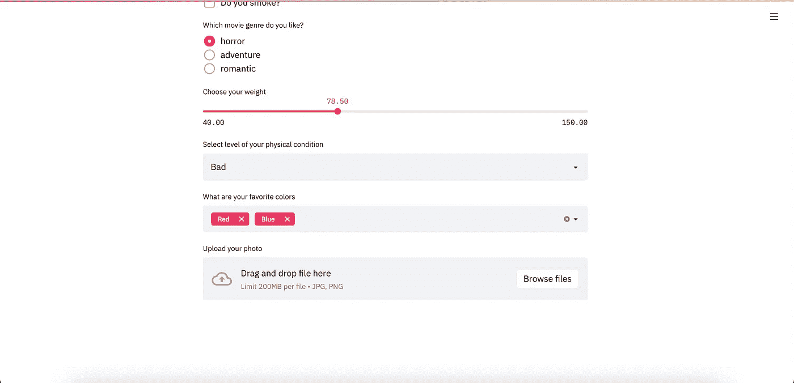

带文件上传器的应用程序

# 提交意见

要提交输入，您可以使用按钮。要添加一个按钮，我们将使用 **st.button()** 方法。由于按钮在被按下后本身并不智能，所以我们需要使用 if-else 语句来提交表单。例如，现在，我们将写信给用户，如果他们按了按钮，表单就提交了。

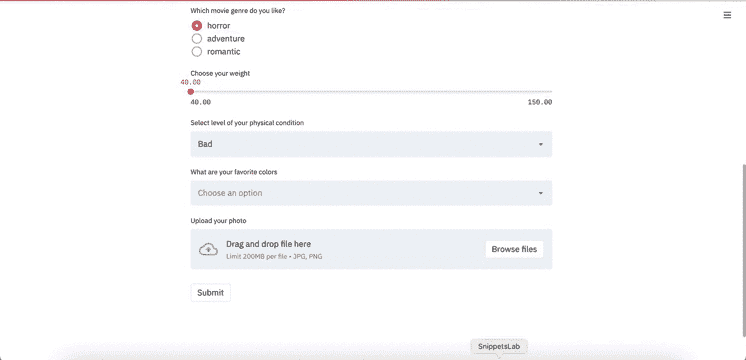

带按钮的应用程序

# 添加边栏

正如你可以从我最初展示的应用程序中看到的，有机会添加带有一些设置或任何你想要的内容的侧边栏。要做到这一点，只需使用**ST . sidebar .[element_name]**，其中 element _ name 是你要添加的元素的名称，比如按钮、选择框等。来补充一下吧！

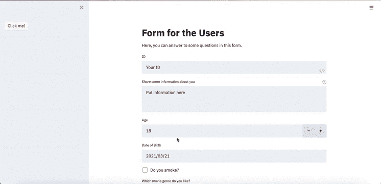

带侧边栏的应用程序

# **添加列**

您还可以在应用程序中添加栏，使布局看起来更漂亮。我们可以使用 **st.beta_columns()** 方法添加列。您需要在方法声明中指定列数。

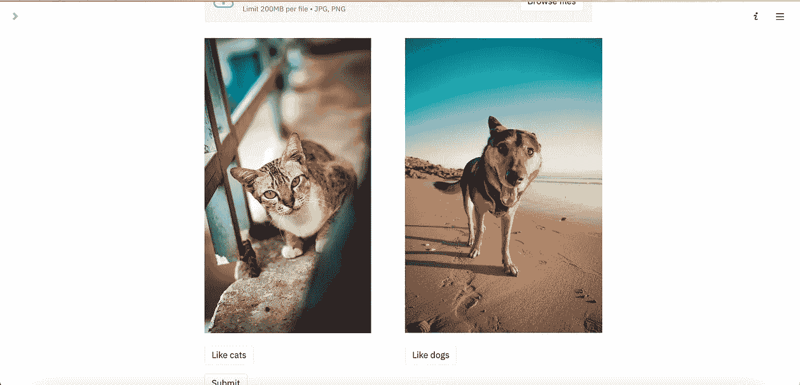

带列的应用程序

# 结论

这是我的 Streamlit 教程的结尾。我希望你喜欢它，现在可以自己创建漂亮的应用程序了！本文的完整代码如下:

如你所见，我们的应用程序只用了 38 行代码。是不是很神奇？☺️

感谢您阅读本文！实际上关于 Streamlit 还有很多要学的，所以如果你想要更多关于它的教程，请在评论中说出来！我希望你能给我一些掌声，并提出许多问题！