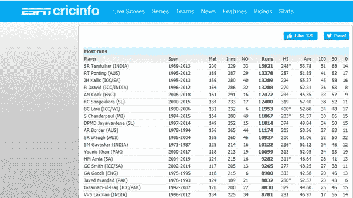
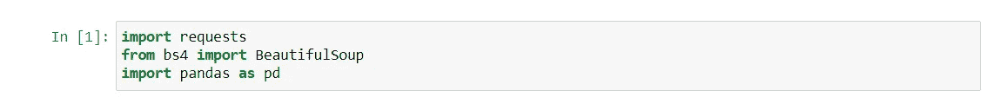
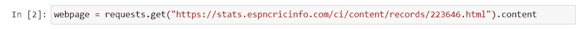
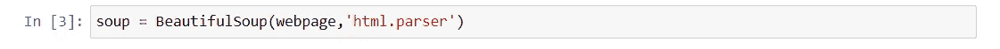
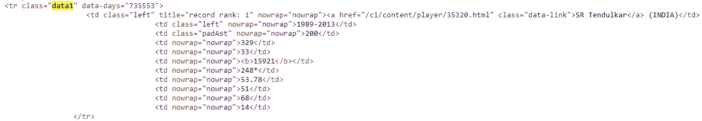
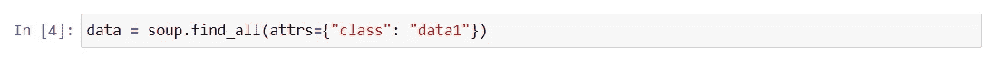
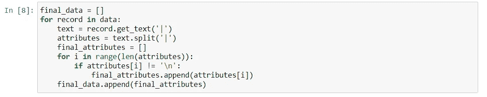
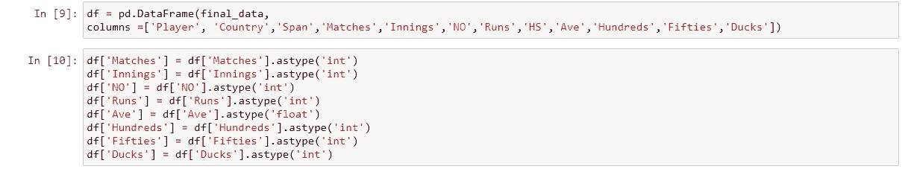
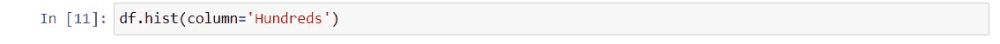
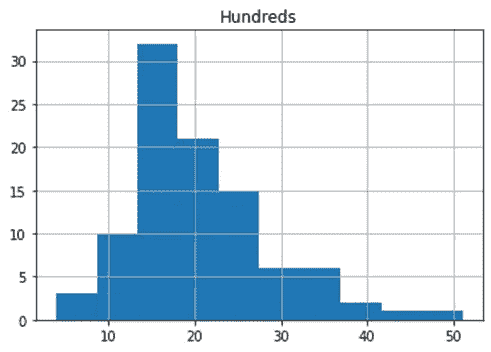

# 网页抓取—美丽的声音

> 原文：<https://medium.com/analytics-vidhya/web-scraping-beautifulsoup-2e4676cdf76c?source=collection_archive---------9----------------------->

图片由 Corinne Kutz 在 Unsplash 上提供

你并不总是有你需要的数据，有时候你需要去获取。

Web 抓取是一种有效的工具，可以获取网页背后的公共可用数据。这种数据可以有多种用例。

我们举个例子。

下面是一个 ESPNcricinfo 页面，显示了顶级击球手的测试职业统计数据。

[https://stats . espncricinfo . com/ci/content/records/223646 . html](https://stats.espncricinfo.com/ci/content/records/223646.html)

将所有这些数据加载到 python 程序中进行分析，而不是手动复制并清理电子表格中的数据，这不是很好吗？这就是网络抓取所能做到的。

让我们看看怎么做。

我们将需要以下库

1.请求—向网站发送 http 请求以获取其内容

2.beautiful soup——完成所有漂亮的网页抓取工作

3.熊猫——用于分析

导入库

以下是我们需要的步骤。

1.  ***请求网页的全部 html 内容***

请求内容

***2。创建一个 BeautifulSoup 对象，将上面提取的内容*** 传递给它

创建美丽组对象

***3。查找所需数据所在的 html 标签或元素。你需要知道网站的结构，“查看页面源代码”选项会有所帮助。***

在这种情况下，数据驻留在 class = data1 中。

查看页面源 class = data1

我们需要做的就是找到上述标签的所有实例。这可以使用 BeautifulSoup 中的 find_all 方法来完成。它会将所有这些标签存储到一个列表中。

查找 class = data1 的所有实例

***4。提取数据***

正如您在上面看到的，数据在每个标签中。下面的代码从每个标签中提取数据值，并将它们存储在另一个列表中。

提取数据

a.Get_text 方法将所有数据值提取到用“|”分隔的字符串中

b.内部循环只是删除换行符

c.外部循环创建一个名为 final_data 的列表，该列表又包含一个数据点列表，即每个玩家的 final_attributes

***5。将数据打包成一个数据帧***

创建熊猫数据框架

***6。*分析数据**

您已经准备好使用抓取的数据。让我们创建一个玩家得分数的直方图。

创建直方图

柱状图

40 以上的玩家没几个考几百的。嗯…

注意:虽然 web 抓取在静态 html 页面上运行良好，但我还没有在动态页面上尝试过。

**关于网络抓取的一句警告(Credits-Codecademy)**

*   在刮之前总是检查网站的条款和条件
*   阅读关于合法使用数据的声明(你可能会有麻烦)
*   不要给网站发太多垃圾邮件，因为这会破坏网站

> **你在哪里用过网页抓取？**