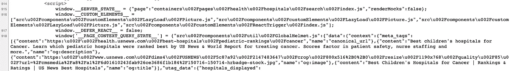
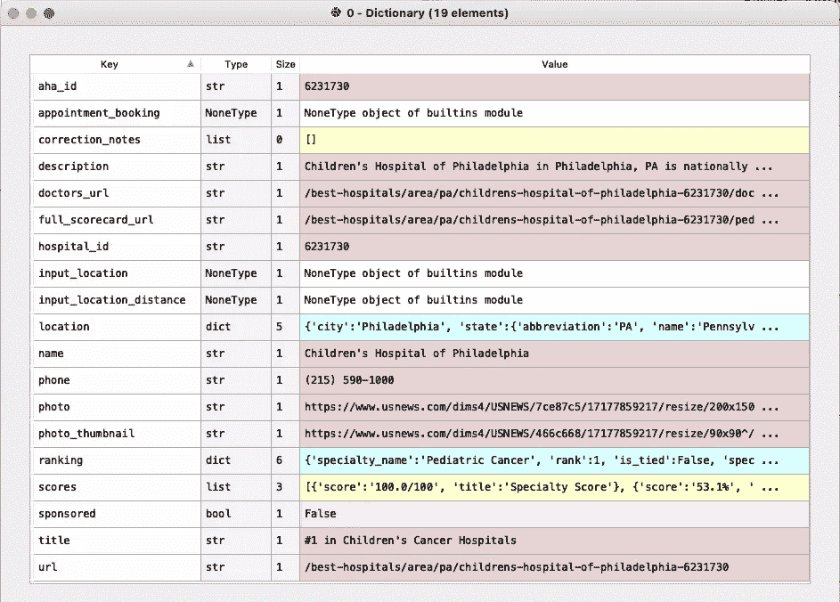
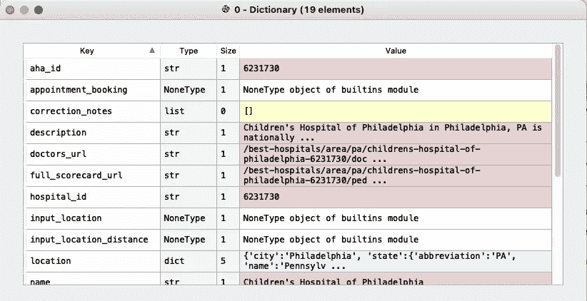

# 癌症最佳儿童医院

> 原文：<https://medium.com/analytics-vidhya/web-scraping-best-childrens-hospitals-for-cancer-5574db6d4090?source=collection_archive---------13----------------------->

## Python vs 鼠标

当所需的结构不容易下载时，Web 抓取是从在线来源获得结构化数据集的好方法。我试过几个 Python 包，最喜欢的是[美汤](https://www.crummy.com/software/BeautifulSoup/bs4/doc/)。我将用这篇文章来记录我是如何利用它来刮美国新闻网站的一角的，这是各种排名(学校，医院等)的来源。).我的目标数据集是儿科肿瘤医院的详细排名，这里列出了。我将在代码中布置构建模块，到最后，我将整个脚本以及抓取的数据集放在电子表格中。


照片由 [Pankaj Pate](https://unsplash.com/@pankajpatel?utm_source=medium&utm_medium=referral) l 在 [Unsplas](https://unsplash.com?utm_source=medium&utm_medium=referral) h 上拍摄

# **为什么要刮网**

我的一个医生朋友，住在另一个国家，最近询问了美国的儿童医院。不久前，我偶然发现了美国大学排名新闻，当然，这也是我搜索它时谷歌建议的第一件事。

我本可以花几分钟打一份 Excel 电子表格并分享它。但是，当我浏览网站时，我意识到《美国新闻》不仅提供了基于专业评分、专家意见和患者数量三项指标的综合排名(T10)，还提供了不同类别的详细评分(或分组(T16)，以排名第一的费城儿童医院(T12)为例，它构成了总分)。

我意识到这将增加我点击每个排名医院的链接、在屏幕间切换、打字和反复检查的时间。这也是一个很好的机会来解决一些网络抓取代码，而不是手工完成。所以我们开始吧。

# **刮排名和总分**

通常，抓取一个相当简单的网站的工作流程包括:

1.  启动 BeautifulSoup 对象
2.  找到嵌入数据的标签
3.  如有必要，使用正则表达式或一些字符串操作来提取数据
4.  将数据放入熊猫数据帧作为输出

要做 2，我们需要先考察网页的源代码。我是这样做的

1.  在谷歌浏览器中打开网页
2.  右键单击任何空白区域，然后单击“查看页面源代码”

对于[综合排名](https://health.usnews.com/best-hospitals/pediatric-rankings/cancer)页面，这将我们带到一个充满 html 代码的页面(在您的浏览器中，url 应该是 view-source:[https://health . us news . com/best-hospitals/pediatric-rankings/cancer)](https://health.usnews.com/best-hospitals/pediatric-rankings/cancer)。但是我们可以通过搜索排名最靠前的医院:费城儿童医院来快速定位这些数据。而且，数据似乎是放在银盘上，在网页的最后一个`script`标签中，作为`window`变量的值提供给我们的。



包含数据的

在 Python 中，让我们首先设置导入:

```
from bs4 import BeautifulSoup
import requestsimport json
import pandas as pdimport pprint
```

然后几行字引发了`soup`对象

```
url = '[https://health.usnews.com/best-hospitals/pediatric-rankings/cancer'](https://health.usnews.com/best-hospitals/pediatric-rankings/cancer')
prefix = '[https://health.usnews.com/'](https://health.usnews.com/')
user_agent = {'User-agent' : 'Mozilla/5.0'}page = requests.get(url, headers=user_agent)
soup = BeautifulSoup(page.text, 'lxml')
```

接下来，我们将定位`script`标签，提取其文本，并使用`json`的`loads`将文本读入字典。从那里我们可以很容易地读取数据的结构，我们在这里称之为`matches`。

```
script_tags = [d for ld in soup.find_all('script')]
script_text = script_tags[-1].text
script_data = json.loads(script_text.split("window['__PAGE_CONTEXT_QUERY_STATE__'] = ")[1].rstrip().rstrip(';\n'))matches = script_data.get('src/containers/pages/health/hospitals/search/index.js').get('data').get('matches')
```

`matches`是 10 个字典的列表，其中每个字典包含一家医院的数据(如下所示)。我们将提取`name`、`ranking`和`scores`，并将它们存储在一个数据帧中。



匹配列表的一个元素，其中医院的各种数据点被组织在一个字典中

我们将通过编写一个函数来实现

```
def extract_overall_scores(match):
    name = match.get('name')
    rank = int(match.get('ranking').get('rank'))
    score_specialty = convert_score(match.get('scores')[0].get('score'))
    score_expert = convert_score(match.get('scores')[1].get('score'))
    score_volume = convert_score(match.get('scores')[2].get('score'))
    cols = ['Rank', 'Hospital', 'Specialty Score', 'Expert Opinion', 'Volume Score']
    data = [rank, name, score_specialty, score_expert, score_volume]
    return pd.DataFrame(columns=cols, data=[data])
```

这里，我们使用另一个函数`convert_score`将 string 转换成期望的类型，整数、浮点或布尔。我们看到《美国新闻》使用百分比格式(如 99%)和分子/分母(如 14/15)来计算分数，因此我们逐个编写代码来进行适当的计算。

```
def convert_score(s):
    if s is None:
        return None
    if type(s) is bool:
        return s
    elif s.endswith('%'):
        return float(s.rstrip('%')) / 100
    elif '/' in s:
        return float(s.split('/')[0]) / float(s.split('/')[1])
    else:
        return float(s)
```

到目前为止，我们可以简单地执行以下操作来获得排名前 10 的医院的总体得分。

```
df_score = pd.concat([extract_overall_scores(i) for i in matches]).reset_index(drop=True)
```

# **刮取详细记分卡**

我们现在继续刮详细的记分卡。对于每个医院，可以通过列表`matches`中每个元素的`full_score_url`中的 url 找到完整的记分卡。这导致了一个专门针对一家医院的网页，其中的类别，如“结果和经验”和“专业认可”，以及子类别，如“结果和经验”下的“在整个医院预防感染的能力”，不仅有“优秀”和“高于平均水平”等分数，还有数字分数。对于想详细研究和比较这些医院的人来说，这可能会很有趣。

我们只需要将我们之前定义的`prefix`和这个`full_score_url`字符串连接起来，就可以得到完整的 URL。



在匹配列表的一个元素中，我们找到了 full_scorecard_url

我们再次在其中一个完整的页面上“检查页面源”,发现数据同样以字典的形式放在最后一个`script`标签中。通过仔细搜索我们想要的数据，我们发现它被深深地埋藏在一串字典中:`data`->-`context`->-`hospital`->-`scorecard`->-`measure_groups`。为了提取数据，我们需要遍历一系列列表，其中每个元素都是一个字典，包含实际的分数。我们编写了一个函数来一步一步地做这件事。为了能够与总分数据帧合并，我们还提取了医院的`name`,作为合并的关键。

```
def extract_full_scores(match):
    full_scorecard = match.get('full_scorecard_url')
    page_scorecard = requests.get(prefix+full_scorecard, headers=user_agent)
    soup_scorecard = BeautifulSoup(page_scorecard.text, 'lxml')

    script_tags = [d for d in soup_scorecard.find_all('script')]
    script_text = script_tags[-1].text
    script_data = json.loads(script_text.split("window['__PAGE_CONTEXT_QUERY_STATE__'] = ")[1].rstrip().rstrip(';\n'))
    script_data = script_data.get('src/containers/pages/health/hospitals/profile/scorecard/index.js').get('data').get('context')
    name = script_data.get('hospital').get('name')
    script_data1 = script_data.get('hospital').get('scorecard')['measure_groups']

    cols = ['Hospital'] + [measure.get('title') for measures in script_data1 for measure in measures.get('measures')]
    data = [name] + [convert_score(measure.get('score').get('value')) for measures in script_data1 for measure in measures.get('measures')]
    return pd.DataFrame(columns=cols, data=[data])
```

# 把它放在一起

到目前为止，我们已经构建了提取总体分数和详细分数的部分代码。使用下面的代码行，我们将能够抓取这些分数，并将它们放入一个数据帧中

```
df_score = pd.concat([extract_overall_scores(i) for i in matches]) \
    .merge(pd.concat([extract_full_scores(i) for i in matches]), on='Hospital') \
    .reset_index(drop=True)
```

# 超越前 10 名

如果你回到最初的排名[页面](https://health.usnews.com/best-hospitals/pediatric-rankings/cancer)，排名中会出现更多的医院，并且只有当你滚动到页面底部时，它们才会出现在网页上。到目前为止，这段代码只找到了前 10 位。我们要怎么做才能得到剩下的？

结果是，您可以通过在 url 的末尾添加一个参数来访问第二组(第 11-20)医院，就像，而不是使用下面的和滚动，

```
[https://health.usnews.com/best-hospitals/pediatric-rankings/cancer](https://health.usnews.com/best-hospitals/pediatric-rankings/cancer)
```

使用以下命令直接访问:

```
[https://health.usnews.com/best-hospitals/pediatric-rankings/cancer](https://health.usnews.com/best-hospitals/pediatric-rankings/cancer)?page=2
```

同样的，你用`page=3`、`page=4`等等来访问后面/更低的排名。在 Python 中，除了我们之前使用的参数之外，我们需要做的是给`requests.get()`的`params`参数输入一个字典。在上面第二个 10 家医院的 URL 示例中，我们将执行以下操作，其余的提取代码保持不变。

```
page = requests.get(url, headers=user_agent, params={'page': 2})
```

现在，我们可以编写一个函数来指向任何一个`page`，并将所有的分数收集到一个数据帧中。

```
def extract_page_data(page):
    page = requests.get(url, headers=user_agent, params={'page': page})
    soup = BeautifulSoup(page.text, 'lxml')

    script_tags = [d for d in soup.find_all('script')]
    script_text = script_tags[-1].text
    script_data = json.loads(script_text.split("window['__PAGE_CONTEXT_QUERY_STATE__'] = ")[1].rstrip().rstrip(';\n'))

    matches = script_data.get('src/containers/pages/health/hospitals/search/index.js').get('data').get('matches')
    df_score = pd.concat([extract_overall_scores(i) for i in matches]) \
        .merge(pd.concat([extract_full_scores(i) for i in matches]), on='Hospital') \
        .reset_index(drop=True)return df_score
```

假设我们对排名前 50 的医院感兴趣。我们可以执行以下操作来获取所有这些数据。

```
df_score_all = pd.concat([extract_page_data(page) for page in range(1, 6)]).reset_index(drop=True)
```

# 数据集

现在，我们已经构建了代码片段，我们可以将它们放在一起，收集排名前 50 位的医院的数据，如下所示。

```
#%% Imports
from bs4 import BeautifulSoup
import requests
import json
import pandas as pd#%% Define parameters and extract "matches"url = '[https://health.usnews.com/best-hospitals/pediatric-rankings/cancer'](https://health.usnews.com/best-hospitals/pediatric-rankings/cancer')
prefix = '[https://health.usnews.com/'](https://health.usnews.com/')
user_agent = {'User-agent' : 'Mozilla/5.0'}#%% Definition to convert string to score
def convert_score(s):
    if s is None:
        return None
    if type(s) is bool:
        return s
    elif s.endswith('%'):
        return float(s.rstrip('%')) / 100
    elif '/' in s:
        return float(s.split('/')[0]) / float(s.split('/')[1])
    else:
        return float(s)#%% Definition to extract overall scores
def extract_overall_scores(match):
    name = match.get('name')
    rank = int(match.get('ranking').get('rank'))
    score_specialty = convert_score(match.get('scores')[0].get('score'))
    score_expert = convert_score(match.get('scores')[1].get('score'))
    score_volume = convert_score(match.get('scores')[2].get('score'))
    cols = ['Rank', 'Hospital', 'Specialty Score', 'Expert Opinion', 'Volume Score']
    data = [rank, name, score_specialty, score_expert, score_volume]
    return pd.DataFrame(columns=cols, data=[data])#%% Definition to extract full data
def extract_full_scores(match):
    full_scorecard = match.get('full_scorecard_url')
    page_scorecard = requests.get(prefix+full_scorecard, headers=user_agent)
    soup_scorecard = BeautifulSoup(page_scorecard.text, 'lxml')

    script_tags = [d for d in soup_scorecard.find_all('script')]
    script_text = script_tags[-1].text
    script_data = json.loads(script_text.split("window['__PAGE_CONTEXT_QUERY_STATE__'] = ")[1].rstrip().rstrip(';\n'))
    script_data = script_data.get('src/containers/pages/health/hospitals/profile/scorecard/index.js').get('data').get('context')
    name = script_data.get('hospital').get('name')
    script_data1 = script_data.get('hospital').get('scorecard')['measure_groups']

    cols = ['Hospital'] + [measure.get('title') for measures in script_data1 for measure in measures.get('measures')]
    data = [name] + [convert_score(measure.get('score').get('value')) for measures in script_data1 for measure in measures.get('measures')]
    return pd.DataFrame(columns=cols, data=[data])#%% Definition to extract overall and full scores
def extract_page_data(page):
    page = requests.get(url, headers=user_agent, params={'page': page})
    soup = BeautifulSoup(page.text, 'lxml')

    script_tags = [d for d in soup.find_all('script')]
    script_text = script_tags[-1].text
    script_data = json.loads(script_text.split("window['__PAGE_CONTEXT_QUERY_STATE__'] = ")[1].rstrip().rstrip(';\n'))

    matches = script_data.get('src/containers/pages/health/hospitals/search/index.js').get('data').get('matches')
    df_score = pd.concat([extract_overall_scores(i) for i in matches]) \
        .merge(pd.concat([extract_full_scores(i) for i in matches]), on='Hospital') \
        .reset_index(drop=True)return df_score#%% Extract top 50 hospitals
df_score_all = pd.concat([extract_page_data(page) for page in range(1, 6)]).reset_index(drop=True)#%% Export to a CSV
df_score_all.to_csv('pediatric_cancer_2021.csv', index=False)
```

最后，如果你有兴趣，数据集可以在这里下载[。你可以随意摆弄这些数据。](https://drive.google.com/file/d/1tkIcMs1bJLvp9F2Es4h-FMKLp22txcjD/view?usp=sharing)