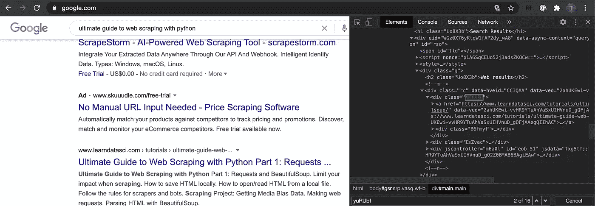
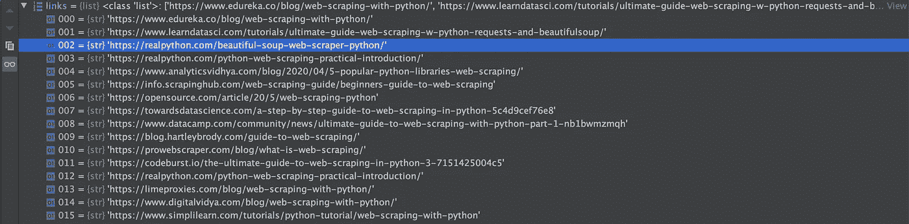

# 网络抓取:带 Selenium 和 BeautifulSoup 的谷歌搜索结果

> 原文：<https://medium.com/analytics-vidhya/web-scraping-google-search-results-with-selenium-and-beautifulsoup-4c534817ad88?source=collection_archive---------3----------------------->

越来越多的数据科学项目(不仅仅是)需要额外的数据，这些数据可以通过网络搜集的方式获得。谷歌搜索并不是一个不寻常的起点。

在本指南中，我们将浏览从 google 搜索结果中获取链接的脚本。

让我们从导入开始，为了从 google 搜索结果的前 n 页获得链接，我使用了 selenium 和 BeautifulSoup。

```
from bs4 import BeautifulSoup
from selenium import webdriver
from webdriver_manager.chrome import ChromeDriverManager
```

我也在使用 webdriver_manager 包，它有时非常方便。使用这个包，没有必要下载一个 web 驱动到你的本地机器，如果你没有的话，它也有助于避免手动输入 web 驱动的自定义路径。该软件包支持大多数浏览器。

接下来，我们为 web 浏览器设置一些首选项。为了避免运行代码时浏览器弹出，我使用了“headless”参数。还有一些其他选项，允许定制网络浏览器，以适应手头的任务。

```
chrome_options = webdriver.ChromeOptions()
chrome_options.add_argument("--headless")
```

我们现在可以启动 ChromeDriver 了。第一个输入参数需要驱动程序的路径，但是通过 webdriver_manager，我们可以使用 installation 来代替。

```
driver = webdriver.Chrome(ChromeDriverManager().install(), chrome_options=chrome_options)
```

一旦建立了 web 驱动程序，我们就可以进入代码的主要部分，在那里我们可以获得 google 搜索结果的 web 链接。

```
# Query to obtain links
query = 'comprehensive guide to web scraping in python'
links = [] # Initiate empty list to capture final results# Specify number of pages on google search, each page contains 10 #links
n_pages = 20 
for page in range(1, n_pages):
    url = "http://www.google.com/search?q=" + query + "&start=" +      str((page - 1) * 10)
    driver.get(url)
    soup = BeautifulSoup(driver.page_source, 'html.parser')
    # soup = BeautifulSoup(r.text, 'html.parser')

    search = soup.find_all('div', class_="yuRUbf")
    for h in search:
        links.append(h.a.get('href'))
```

该代码需要两个输入，感兴趣的查询和谷歌搜索的页数。每页包含 10 个搜索结果。

一旦参数就绪，我们使用 selenium webdriver 加载 url，然后使用 BeautifulSoup，我们使用 html.parser 解析网站数据。网站数据以 html 格式出现，我们可以通过检查网页来查看网站背后的脚本。



我们对存储在

容器中的搜索结果的超链接感兴趣。使用 BeautifulSoup 命令找到所有元素。find_all()，其中我们指定元素和类作为输入。

```
search = soup.find_all('div', class_="yuRUbf")
```

对于我们获得的每个搜索结果，我们需要提取超链接，并将其存储为元素的 href 属性。

```
for h in search:
        links.append(h.a.get('href'))
```

我们现在已经拥有了获取 google 搜索结果链接所需的所有代码块。

