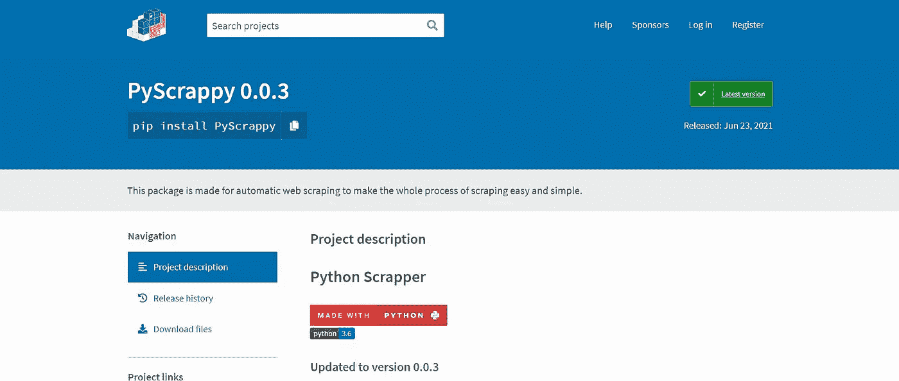
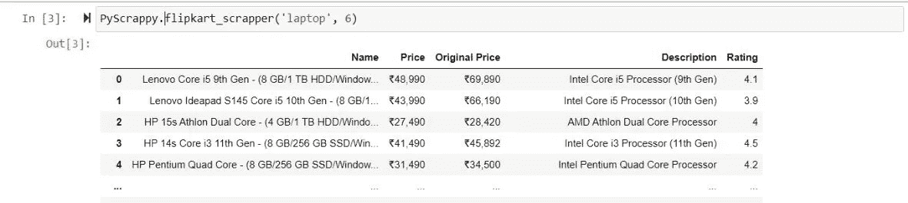
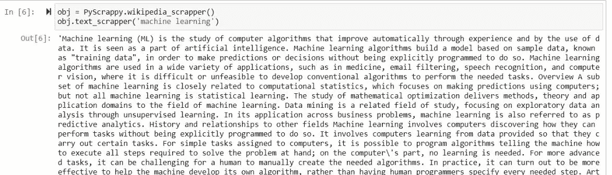

# 使用全新的 PyScrappy 在 Python 中进行 Web 抓取

> 原文：<https://medium.com/analytics-vidhya/web-scraping-in-python-using-the-all-new-pyscrappy-5c136ed6906b?source=collection_archive---------3----------------------->

> “**数据**是一种珍贵的东西，将比系统本身持续更久。”

# 概观

*   本文简要介绍了使用 PyScrappy 进行 web 抓取，PyScrappy 是一个使用 Python 抓取数据的库。
*   了解如何使用 PyScrappy 废弃数据。

# 介绍

网络抓取可能是从互联网上收集大量数据的最强大的技术。当谈到机器学习或深度学习时，高质量的数据至关重要。

需要越来越多的数据来准备我们的机器学习模型，这是一个永恒的问题。嗯，机器学习就是捕捉数据中的模式，并对其进行很好的表征或分类，以便不明显的数据在未来也能很好地发挥作用。

克服数据匮乏的最好和最基本的方法很可能是执行 web 抓取。

今天通过网络可以获得的信息种类和数量对大多数数据科学家来说是一个福音。但随之而来的是从互联网上搜集大量数据的繁琐任务。

# PyScrappy 是什么？

您将会在 Python 中遇到多个用于 web 抓取的库和框架。一个这样的库有效且可靠地完成了令人生畏的任务，它就是 ***PyScrappy。***

PyScrappy 是一个 Python 库，用于大量的网络抓取。它完成了从几个不同的数据源抓取数据的全部任务，并将抓取的数据存储在一个数据帧中。



PyScrappy 的官方 PyPI 页面。

## 设置您的系统

PyScrappy 支持 Python 的版本 3。要在 Windows、Mac OSX 或 Linux 上安装 PyScrappy，请运行:

```
pip install PyScrappy
```

你已经准备好了。

## PyScrappy 的用法

PyScrappy 基本上是一个全面的 web scrapper，它使从几个不同来源收集数据的艰巨任务变得更加容易和更加令人鼓舞。

首先使用下面的命令导入包。

```
import PyScrappy
```

导入包后，可以检查 PyScrappy 的不同功能。

```
obj = PyScrappy.ECommerceScrapper()obj1 = PyScrappy.SocialMediaScrapper()
```


PyScrappy 提供的不同刮刀

*PyScrappy 的功能:*

1.  ***报废电子商务网站:*** PyScrappy 目前允许用户从 Flipkart、阿里巴巴、Snapdeal 等不同的电子商务网站上抓取数据。
2.  ***从 Instagram、Twitter 等社交媒体网站报废数据:*** PyScrappy 的 InstagramScrapper 包括从公共个人资料、标签中报废数据，并打印关于个人资料的所有基本信息，并在 DataFrame 中返回上传图片的标题。
3.  ***从 Google、Yahoo 和 Bing 中抓取并下载图片:*** PyScrappy 的 image_scrapper 允许用户抓取任何图片，以任何所需的格式下载，并将其存储在本地存储中任何所需的路径或位置。
4.  ***从维基百科中删除数据:*** PyScrappy 的 WikipediaScrapper 帮助用户从维基百科中删除“文本”、“标题”和“段落”。
5.  ***从 youtube 中抓取数据:*** PyScrappy 的 youtube_scrapper 从任何 Youtube 频道的‘视频’部分抓取数据，并以 DataFrame 的形式返回所有被抓取的信息。
6.  ***从新闻网站上删除数据:*** PyScrappy 还引入了 news_scrapper 函数来删除新闻文章，并在 DataFrame 中返回它们以及附加信息。
7.  ***刮削股票数据:*** PyScrappy 还有一个叫 StockScrapper 的功能，可以让用户从雅虎财经刮削数据。
8.  ***报废歌曲数据:*** PyScrappy 最近增加了从 SoundCloud 报废数据的功能。
9.  ***来自美食网站的报废数据:*** 如 Swiggy、Zomato 等。

PyScrappy 为用户完成了大部分工作，它将数据废弃、分类，并存储到数据帧、列表或字典中以备将来分析，从而使抓取数据的整个过程变得简单快捷。

## 工作示例



Flipkart Scrapper 工作原理的一个片段。



Wikipedia Scrapper 如何工作的一个片段。

请随意进一步探索这个库和它提供的所有不同的功能。

# 尾注

在本文中，我们仅仅触及了 PyScrappy 作为网络抓取工具的皮毛。即使它是一个简单的网络抓取工具，目前正在开发中。它肯定会在规定的时间内给我们带来有希望的结果。这个软件包是在牢记一个人必须付出的努力，从互联网上收集和搜集数据的基础上开发出来的。

本软件包仅用于教育和研究目的。

在[***PyPI***](https://pypi.org/project/PyScrappy/)和[***piwheels***](https://www.piwheels.org/project/pyscrappy/)查看 PyScrappy 的官方包。

[***py scrappy***](https://pyscrappy.netlify.app/)官方文档。

*制作人:维达安·辛格、维达安·蒂布鲁瓦尔*