# Uipath 中的网页抓取

> 原文：<https://medium.com/analytics-vidhya/web-scraping-in-uipath-467a168ec3bb?source=collection_archive---------3----------------------->

所以先说什么是 Uipath？这是一个机器人流程自动化的低代码平台。我们可以创建具有不同功能的机器人，并将其部署使用，以减少由人类完成的手动、结构化和预测性工作。

说到网络抓取，这是我们部署机器人从网络上获取内容的过程。有不同的工具如 *beautifulsoup* 来提取数据，但是 Uipath 在几秒钟内就完成了同样的过程

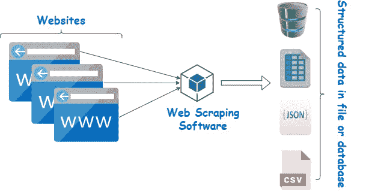

*网页抓取:*

***目的:从亚马逊网站上抓取手机名称和价格，并存储在 excel*** 中

步骤 1:在 Uipath studio 中创建一个流程，并将其命名为 Recording_Amazon

第二步:进入录音->点击网络，你会得到一个弹出屏幕，就像这样

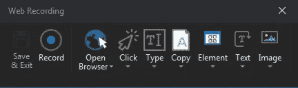

第三步:在你的浏览器中进入谷歌搜索([www.google.co.in](http://www.google.co.in))

第 4 步:打开浏览器活动，并指出网址

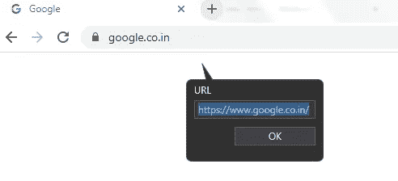

第五步:然后点击输入活动并显示搜索栏，输入 ***亚马逊***

步骤 5.1:勾选 ***空字段*** 按钮，删除之前的所有搜索，并相应输入搜索内容

第 5.2 步:一旦你输入了亚马逊，按下键盘上的回车键

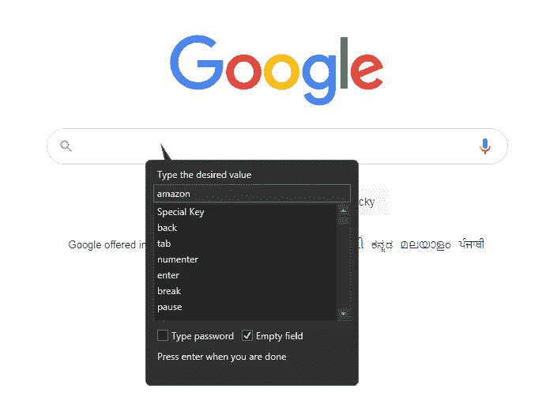

第六步:一旦你输入亚马逊进入 ***点击*** 活动并指示**谷歌搜索**按钮

步骤 6.1:一旦你完成了这些，你将进入这个页面(注意:如果你还没有登录亚马逊，在记录下面的步骤之前)

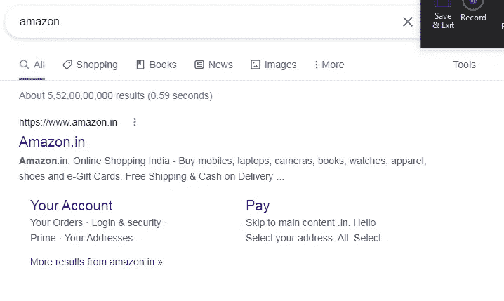

第 6.2 步:进入 ***点击*** 活动，点击 ***amazon.in***

第 6.3 步:输入 ***红米手机*** 并点击回车

第 6.4 步:转到点击活动，并指出搜索栏

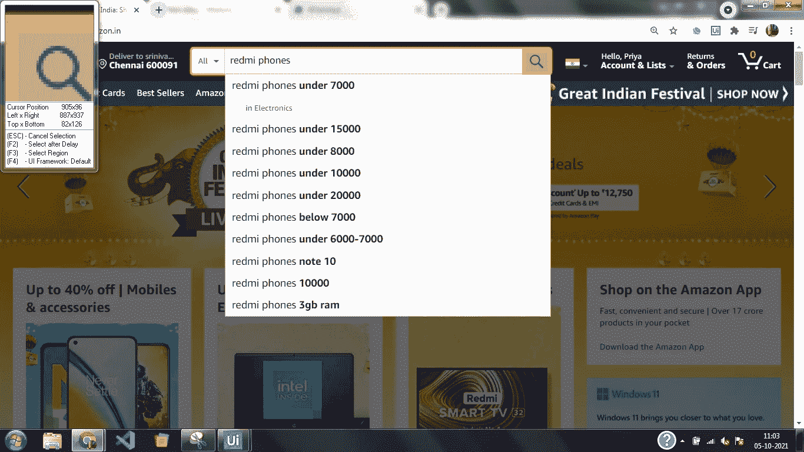

第七步:现在是非常有趣的部分刮。进入文本->抓取->抓取数据，你将进入一个提取向导

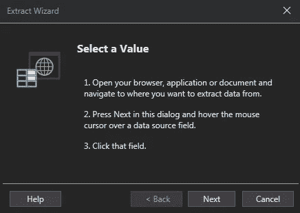

步骤 7.1:指出第一部电话的名称

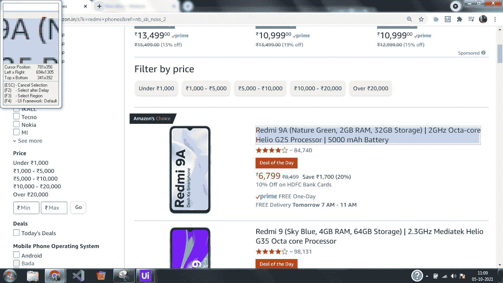

第 7.2 步:你会得到另一个提取向导点击下一步，并指出下一个电话的名称

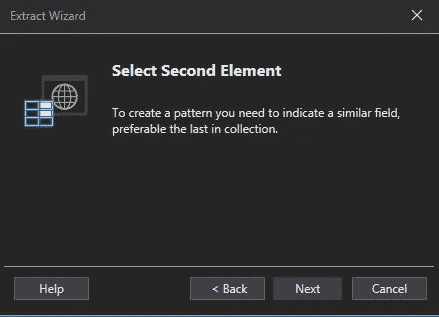

第 7.3 步:现在你已经指出，你会得到这样一个弹出窗口

步骤 7.3.1:分别重命名“电话名称”、“电话链接”列，并检查“提取 url”列

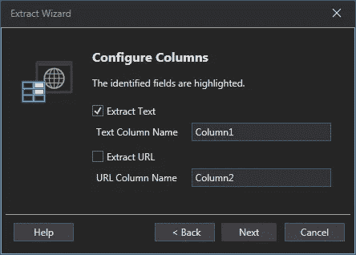

第 7.3.2 步:你将得到预览数据，你将有最大数量的结果作为默认的 100 你可以给它任何

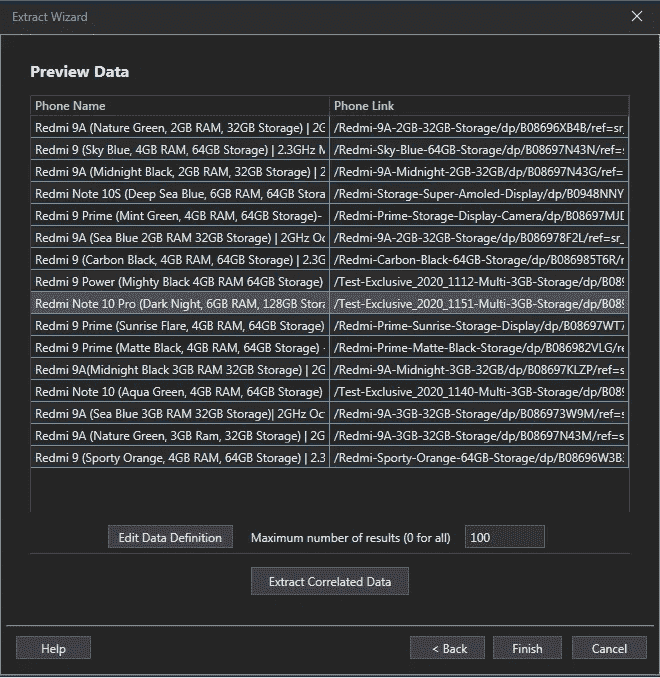

第 7.4 步:提取相关数据并指明价格，步骤与您对电话名称所做的相同，提取向导如下所示

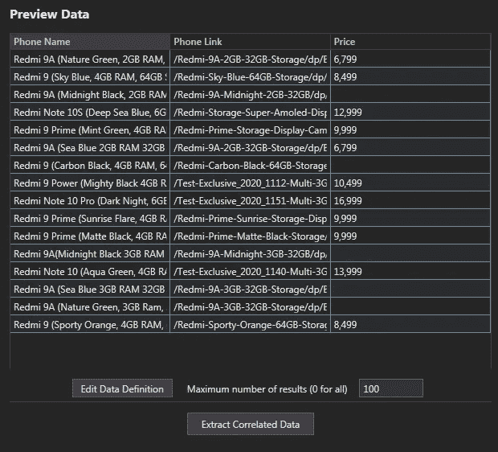

步骤 7.5:单击完成

第 7.6 步:我们要扫描的不仅仅是一页，而是多页，就像 1-126 页那样，以表明在你点击完成后，你会得到一个这样的向导。所以答应吧

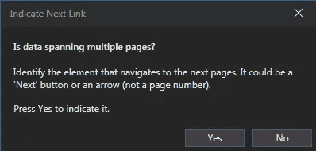

步骤 7.6.1:在亚马逊网站中显示下一步按钮

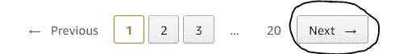

第八步:保存并退出网络录音。保存后，工作流看起来像这样

步骤 9:在提取结构化数据“DIV 搜索”活动中检查属性，您将看到详细信息以行和列的形式存储在数据表中，默认为变量 ***ExtractDataTable***

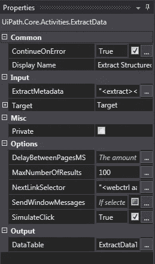

步骤 9.1:转到变量面板，将它的范围从 web 改为 sequence

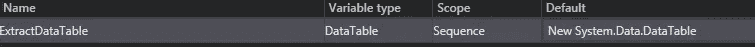

步骤 10:在 activities 面板中搜索 write range(文件->工作簿-> Write Range ),并将其放在 extract activity 之后

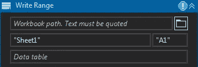

步骤 10.1:给出 excel 名称或通过单击文件夹图标浏览 excel，并在数据表中填充数据表变量— ExtractDataTable。

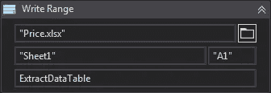

步骤 10.2:保存并运行工作流。excel 最终会是这个样子

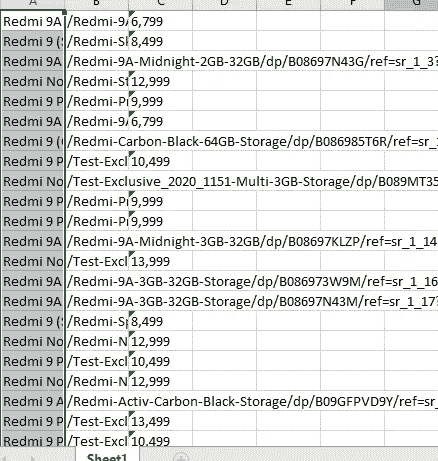

***提示:如果你想在录制时向下或向上移动自己按 F2 或 esc 键使活动转到你想做活动的点然后录制***

用 Uipath 快乐录音