# 用 Selenium Python 进行网页抓取 Instagram

> 原文：<https://medium.com/analytics-vidhya/web-scraping-instagram-with-selenium-python-b8e77af32ad4?source=collection_archive---------0----------------------->

Selenium 是众多可以用来抓取网站的工具之一。现在我想解释一下我们如何从网站上抓取 Instagram 账号。


# **为什么使用硒？**

正如我们所知，许多工具可以用来从网站上收集数据，其中最受欢迎的三个工具是 Scrapy、Beautifulsoup 和 Selenium。然而，他们每个人都有特殊的能力为他们的行动刮一个网站。

你可以搜索一下 Scrapy，Beautifulsoup，还有很多其他地方可以用来刮痧的工具，但是现在我想在这里解释一下我们这次是怎么选择 Selenium 来刮痧的。

硒是刮痧的有力工具。它能以复杂的方式处理自动化。例如，我们需要登录我们的 Instagram 帐户来抓取 Instagram 的网站。令人惊讶的是，selenium 可以自动登录我们的 Instagram 帐户。

其次，selenium 可以使用我们可以根据需要设置的计时器来抓取网站。这非常有帮助，因为 Instagram 的团队已经在其网站上禁止自动刮刀机器人。是的，我们可以为我们的自动刮刀设置计时器。因此，我们的刮刀没有迅速行动，这可以减少被 Instagram 的团队禁止的风险。

# **要求**

1.  你必须先读完这篇文章，然后在技术上做练习。
2.  熟悉 python 编程语言，尤其是 OOP 理论。
3.  我们需要一个代码编辑器和 python 已经安装在您的 PC/笔记本电脑上。
4.  在这种情况下，浏览器是 Google Chrome，因此本文中提到的选项在 Google Chrome 上都是可用的。

# **你将学到什么**

你会有 selenium python 理论的知识(自动登录，自动点击，自动向下滚动页面，自动下载)。

# 下载 webdriver 或 geckodriver

运行 selenium 程序我们必须准备的工具之一是 webdriver(针对 Chrome)或 geckodriver(针对 Firefox)。你可以从[这里](https://chromedriver.chromium.org/downloads)(Chrome 用户)或者[这里](https://github.com/mozilla/geckodriver/releases)(Firefox 用户)下载。

# **安装所需的库**

首先，我们必须在我们的终端上安装一个 selenium 库，如下所示:

```
pip install selenium
```

完成后，我们必须安装一些所需的 python 库，如时间和请求，如下面的代码:

```
pip install time
```

和

```
pip install requests
```

太好了！我们的抓取环境已经准备好了，开始编码吧！

# **导入库**

下面是使用 selenium 导入抓取所需库的代码:

```
from selenium import webdriver
from selenium.webdriver.common.keys import Keys
import time, urllib.request
import requests
```

在本教程中，我使用铬刮。所以，我们必须像上面的代码一样从 selenium 导入 webdriver 库。

# **设置路径代码**

路径代码是旨在将我们的代码与浏览器连接起来的代码。下面是关于路径的代码逻辑:

```
PATH = r"C:\download\chromedriver_win32\chromedriver.exe"
driver = webdriver.Chrome(PATH)
```

上面的代码表示已经下载的 chromedriver 包在下载文件夹中。然后路径变量代码必须和 PC 中的 chromedriver 包目录相同。

# **获取 Instagram 的网站**

编码完 PATH 变量之后，那么我们就必须得到 Instagram 的网站，也就是我们的抓取目标。因此，代码如下:

```
driver.get("https://www.instagram.com/")
```

然后你可以保存这段代码，并运行它！看看…..

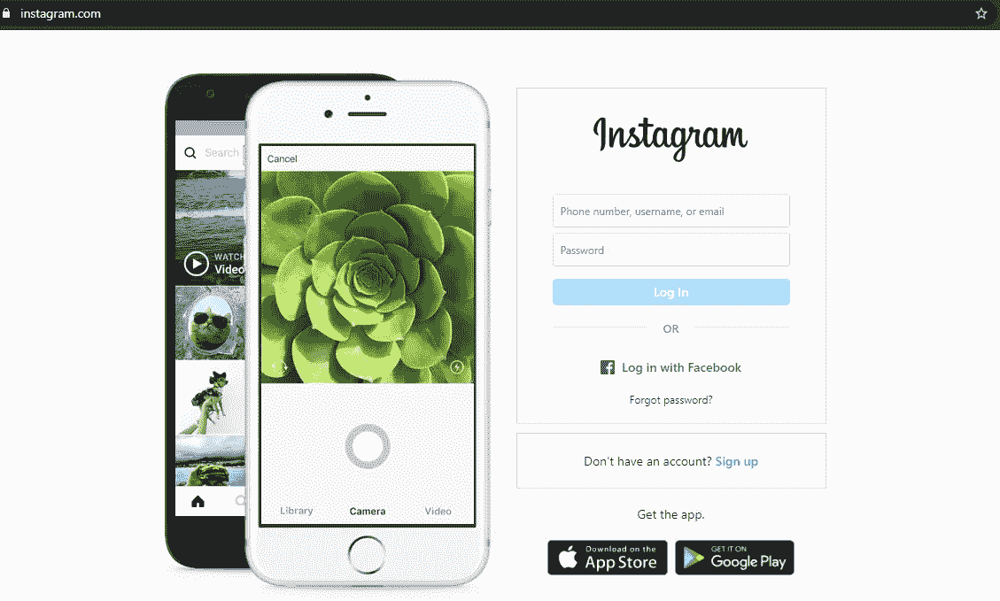

干得好！我们的自动机器人成功地自动访问了 Instagram 的网站。

# **登录我们的 Instagram 账号**

下一步是登录我们的 Instagram 账户。在这种情况下，我推荐你使用你的第二个 Instagram 账号来尝试这个活动。我觉得这样会降低你失去 Instagram 账号的风险。

首先，我们必须从时间库中设置睡眠时间，然后我们创建关于登录 Instagram 帐户的代码，如下所示:

```
#login
time.sleep(5)
username=driver.find_element_by_css_selector("input[name='username']")
password=driver.find_element_by_css_selector("input[name='password']")
username.clear()
password.clear()
username.send_keys("xxxxxx")
password.send_keys("123456")
login = driver.find_element_by_css_selector("button[type='submit']").click()
```

然而， **5** 是等待下一个代码运行的时间。时间用秒来表示。

然后，我们必须了解用户名框的元素，该元素用于通过检查元素(CTRL+SHIFT+I)登录我们的 Instagram 帐户，如下图所示:

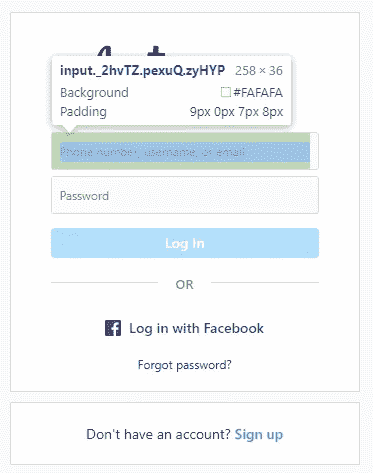

而元素列如下图所示:

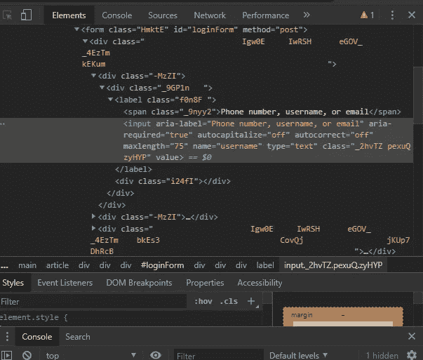

众所周知，创建自动登录代码的第一步是搜索用户名框。它旨在用我们的 Instagram 用户名帐户自动填充空白用户名。

根据上图，用户名框的选择器是**输入**。而用户名框的名称是**用户名。**然后代码是***username = driver . find _ element _ by _ CSS _ selector(" input[name = ' username ']"****)。*

下图所示的密码变量也是如此:

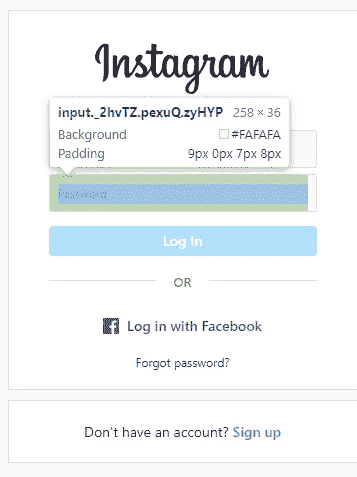

元素列在下面:

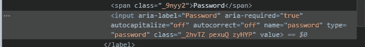

这样我们就可以得到密码框的 CSS 类型选择器，即**输入**，并将其命名为**密码**。然后我们必须把代码输入到***password = driver . find _ element _ by _ CSS _ selector(" input[name = ' password ']"***)。

之后，我们必须通过这些行中的 send_keys 选项输入我们 Instagram 帐户的用户名和密码。在这种情况下，我使用我的用户名即“xxxxxx”，我的密码是“123456”。

下一步是自动点击登录。可以打成***log in = driver . find _ element _ by _ CSS _ selector(" button[type = ' submit ']")。点击()*** 这里的事情跟之前创建用户名和密码变量差不多。但是对于这个动作，我们必须在自动命名为**T5 的点击行的最后添加点击选项。点击()** 。

好吧，让我们运行代码，看看！

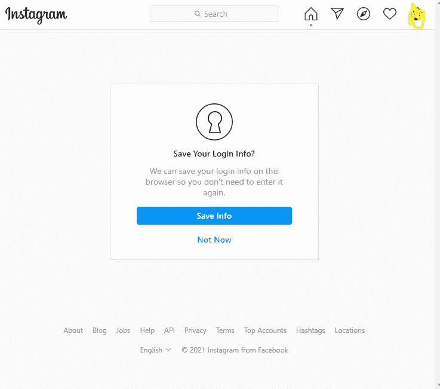

干得好！我们做到了！

# **自动跳过弹出窗口**

然后，登录我们的 Instagram 帐户后的下一步是点击名为**而不是现在**或**保存信息**的文本。在这种情况下，我使用 **Not Now** 选项。实际上，如果您愿意，您可以选择**保存信息**选项。

然后，就像创建用户名、密码和登录变量一样，我们必须键入代码来创建下面的**而不是**变量:

```
#save your login info?
time.sleep(10)
notnow = driver.find_element_by_xpath("//button[contains(text(), 'Not Now')]").click()
#turn on notif
time.sleep(10)
notnow2 = driver.find_element_by_xpath("//button[contains(text(), 'Not Now')]").click()
```

上面的代码解释了我们必须编码跳过名为**保存您的登录信息**的弹出窗口的第一步是创建 **Not Now** 变量，例如***Not Now = driver . find _ element _ by _ XPath("//button[contains(text()，' Not Now')]")。点击()*** 。

在这种情况下，我们试图通过 **find_element_by_xpath** 获得 **Not Now** 变量的元素，如 selenium python 网站[这里](https://selenium-python.readthedocs.io/locating-elements.html)中所解释的。当我们使用 xpath 方法搜索元素的位置时，我们可以使用 text targetted。例如，当我们希望通过 xpath 方法获得弹出通知中元素 **Not Now** 的位置时，我们使用名为 **Not Now** 的文本，如下图所示:

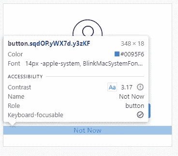

而元素列则如下图所示:

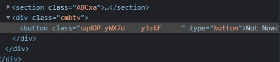

让我们运行它！如果您已经这样做了，那么您可以找到第二个弹出通知，如下图所示:

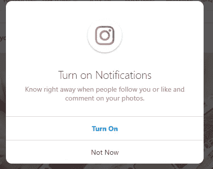

上图是弹出通知的第二部分。点击第一个名为**保存您的登录信息**的弹出通知时出现。然后我们将这个弹出通知的名称命名为第二部分，即**打开通知**弹出。

所以，我们必须创建一个名为 **notnow2** 变量的变量**打开通知**弹出窗口。我们必须做同样的事情来获得变量 **notnow2** 通过搜索其元素的位置，如下图所示:

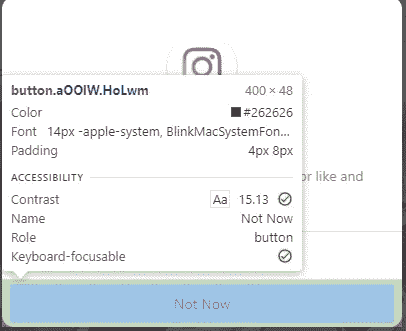

元素列如下所示:

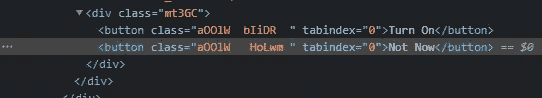

所以，代码是***Not Now 2 = driver . find _ element _ by _ XPath("//button[contains(text()，' Not Now')]")。点击()*。**

让我们检查代码！运行它，看看！(如果这一步已经完成，你会发现你的 Instagram 账户的主页面)。

# **搜索框处理**

既然我们已经找到了名为 **home** 的 Instagram 账户主页，那么我们必须进入 Instagram 账户目标，在位于显示屏顶部的搜索框中键入 Instagram 账户目标的名称，如下图所示:

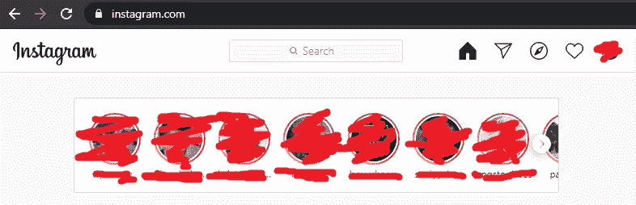

然后，我们必须获取搜索框的元素来自动填充空白框。本例中，我们使用名为 [host.py](https://www.instagram.com/host.py/) 的 Instagram 账号 public。(点一下就能看到账号)

因此，我们可以通过在上一步中自动处理弹出窗口来创建代码，如下图所示:

```
#searchbox
time.sleep(5)
searchbox=driver.find_element_by_css_selector("input[placeholder='Search']")
searchbox.clear()
searchbox.send_keys("host.py")
time.sleep(5)
searchbox.send_keys(Keys.ENTER)
time.sleep(5)
searchbox.send_keys(Keys.ENTER))
```

上面的代码解释了创建**搜索框**变量是我们自动处理搜索框必须做的第一步。因此，我们只需要做同样的事情，就是创建我们在上一步中完成的变量。

我们必须用代码***Search box = driver . find _ element _ by _ CSS _ selector(" input[placeholder = ' Search ']"***创建 **searchbox** 变量，在这里输入这个框的类型。而选择器的类型是**占位符**名为**搜索** *，*如下图所示(可以通过检查元素找到):

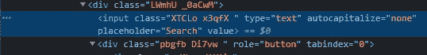

之后，我们必须使用库中的 **send_keys** 选项，将 Instagram 帐户目标自动键入搜索框，如***search box . send _ keys(" host . py ")*。**

然后，我们必须通过用**键填充代码来自动创建输入按钮。进入**选项。(注意:一定要创建两次，要在 Instagram 账号网站上查看调试)

最后，如果我们已经完成并成功运行代码，那么我们会发现 Instagram 个人资料目标如下图所示:

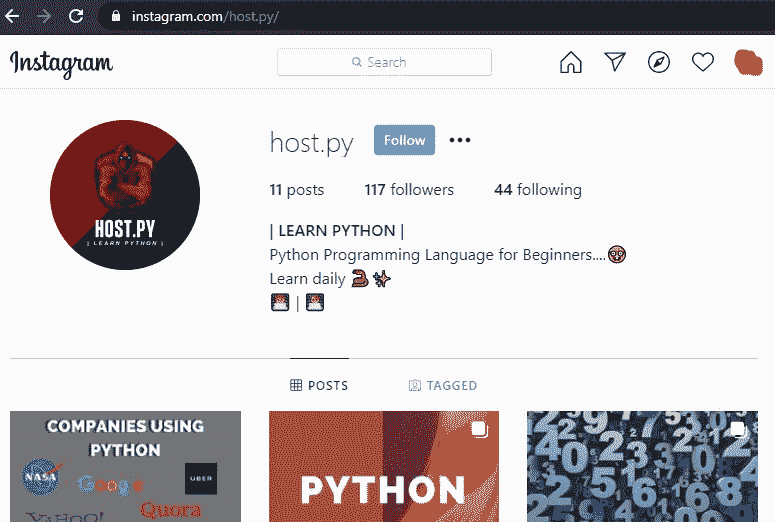

干得好！你猜对了！

# **向下滚动档案**

既然我们有了目标用户的个人资料页面，那就一定认为我们已经很快刮到这个页面了。但是，我们必须先自动向下滚动页面。代码如下:

```
#scroll
scrolldown=driver.execute_script("window.scrollTo(0, document.body.scrollHeight);var scrolldown=document.body.scrollHeight;return scrolldown;")
match=False
while(match==False):
    last_count = scrolldown
    time.sleep(3)
    scrolldown = driver.execute_script("window.scrollTo(0, document.body.scrollHeight);var scrolldown=document.body.scrollHeight;return scrolldown;")
    if last_count==scrolldown:
        match=True
```

然后让我们通过运行它来检查代码，看看！(如果成功，它必须自动向下滚动页面)

# **获取 URL 帖子**

现在，是时候获取这些张贴在[https://instagram.com/host.py/!](https://instagram.com/host.py/!)的 URL 帖子了

正如我们所知，有 11 个职位的图像在那里。因此，我们可以创建如下图所示的代码:

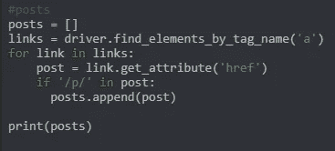

根据上图，我们必须创建一个空框，用于容纳所有名为 ***帖子*** 的 URL 帖子，我们可以键入如下代码:

```
posts = []
```

然后，我们创建 links 变量来获取所有标签名为**“a”**的元素。因此，创建 for 循环函数，按照上图所示的代码获取所有的 URL 帖子，并打印！

现在，已经创建了获取所有 URL 帖子的代码。我们可以去看看！(只需等待几分钟)

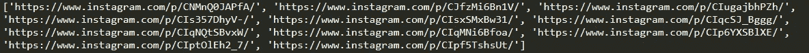

没错。上面的图像代表了页面上所有的 URL 帖子，其中显示了 11 个 URL。干得好！

# **下载所有帖子**

最后，我们必须下载那里的所有帖子，并将它们保存到我们保存脚本的目录中。所以，代码在下面:

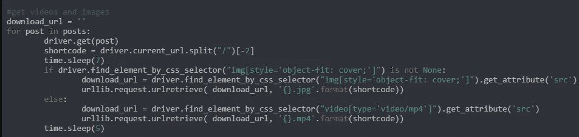

上面的图片解释了我们必须创建一个变量来容纳所有我们想要下载的图片名称，首先命名为**short code**first**。**例如，当第一篇文章的 URL 名称是[**https://www.instagram.com/p/CNMnQ0JAPfA/**](https://www.instagram.com/p/CNMnQ0JAPfA/)时，我们可以将名称**CNMnQ0JAPfA.jpg**赋予该文件。那么它必须应用于其他文件。

我假设我们已经理解了如何获取上图中所写的 download_url 变量的选择器。

# **结论**

最后，我们在这里得到了所有的代码。那么我们还在等什么呢？代码如下:

我们跑去看看吧！

希望这有所帮助！