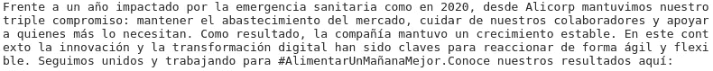

# 网刮 LinkedIn 公司与硒和美丽的汤

> 原文：<https://medium.com/analytics-vidhya/web-scraping-linkedin-companies-with-selenium-and-beautiful-soup-8d8c28ebcc2a?source=collection_archive---------5----------------------->


当你想开始你的项目时，你可以使用像 [Kaggle](https://www.kaggle.com/datasets) 这样的网站提供的数据集，但是你也可以通过网络搜集来获得数据。

你想从每个公司提取一定数量的帖子，然后应用机器学习技术。

这段代码的实现可以直接在我的 GitHub 页面找到:https://github.com/anthoguille/web_scraping_linkedin

# 你想从网站上搜集什么信息

1.  名字
2.  日期
3.  邮政
4.  喜欢

注意:您也可以添加“文章数量”，在这种情况下，我们将。

# 检查页面

按 F12 或右键单击页面，然后转到检查。


你需要一个关于“HTML”的基础知识。然而，你可以点击网站上任何你感兴趣的信息，你就会知道 HTML 代码行的确切位置。


# Python 代码

这两个 Python 库(BeautifulSoup 和 Selenium)将发挥神奇的作用。你可以按照[文档](https://www.selenium.dev/documentation/en/webdriver/)安装 Selenium 和 web 驱动。

首先将库导入 Python。

```
from selenium import webdriver
from bs4 import BeautifulSoup
from time import sleep
import pandas as pd
```

我们将创建一个实例，以匿名模式打开浏览器，并最大化窗口。

```
options=webdriver.ChromeOptions()
options.add_argument('--incognito')
driver=webdriver.Chrome(options=options)
driver.get('[https://www.linkedin.com/uas/login'](https://www.linkedin.com/uas/login'))
driver.maximize_window()
```

我们将发送凭据(用户名和密码)进行登录。

```
username = driver.find_element_by_id('username')
username.send_keys('[y](mailto:avyllesca@gmail.com)our_username')
password = driver.find_element_by_id('password')
password.send_keys('your_password')
log_in_button = driver.find_element_by_class_name('from__button--floating')
log_in_button.click()
```

注意:你需要把你想抓取的公司的网址添加到列表中。

```
urls = [
'[https://www.linkedin.com/company/alicorp-saa/posts/?feedView=all'](https://www.linkedin.com/company/alicorp-saa/posts/?feedView=all'),'[https://www.linkedin.com/company/backus/posts/?feedView=all'](https://www.linkedin.com/company/backus/posts/?feedView=all')
]
```

我们将创建一个字典来保存数据。

```
data = {
    "name": [],
    "date": [],
    "post": [],
    "likes": [],
    "count_posts":[]
}
```

在这里，你需要调整，看看你到底需要多少滚动，我们还需要添加动态延迟来加载页面。

```
for i in range(max(0,40)):
        driver.execute_script('window.scrollBy(0, 500)')
        sleep(1)
```

当驱动程序完成上述动作后， [BeautifulSoup](https://www.crummy.com/software/BeautifulSoup/bs4/doc/#find-all) 将解析 HTML，我们可以抓取我们需要的内容。例如，如果我们需要帖子的内容。

```
posts=soup.find_all('div',{'class':"occludable-update ember-view"})post = posts[2].find('div',{'class':"feed-shared-update-v2__description-wrapper ember-view"}).span.get_text()
if post:
    print(post)
```

结果:



将数据放入数据帧

```
df = pd.DataFrame(data)
df.head(10)
```

结果:


厉害！现在我们有了一个可以用于机器学习或任何分析的数据集。

如果你想看完整的代码，你可以访问我的库( [GitHub](https://github.com/anthoguille/web_scraping_linkedin) )。