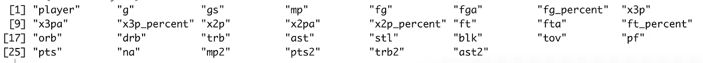
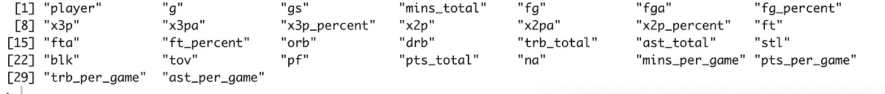
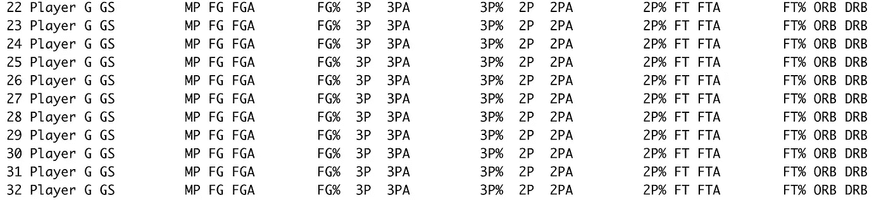
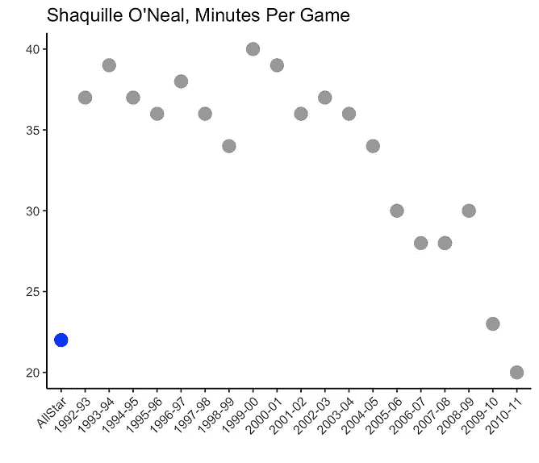
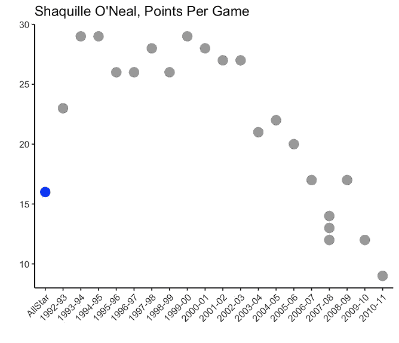
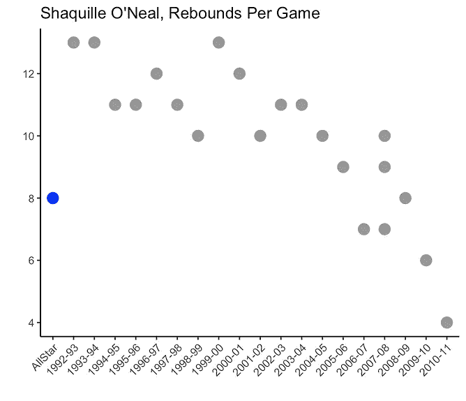

# 网络搜集 NBA 全明星数据

> 原文：<https://medium.com/analytics-vidhya/web-scraping-nba-all-star-data-8788a7136727?source=collection_archive---------16----------------------->

了解如何在 R 中使用 rvest、gateway 和 hablar 包来抓取、清理和合并数据帧。


马库斯·斯皮斯克在 [Unsplash](https://unsplash.com?utm_source=medium&utm_medium=referral) 上的照片

随着 2021 年 NBA 全明星首发阵容的公布，以及 3 月 7 日 NBA 全明星赛的到来，你可能会有兴趣探索历届全明星的统计数据。

本文将介绍使用 R 中的 rvest 包从 Basketball-Reference.com 收集数据集的步骤，然后在将数据用于分析之前使用看门人包清理数据。

提取和清理数据后，我们将组合以下数据集进行进一步分析:

1.  [**全明星球员:**](https://www.basketball-reference.com/allstar/NBA-allstar-career-stats.html) 列出了所有 NBA 全明星球员以及他们在所有全明星赛中的平均数据。
2.  [**奥尼尔:**](https://www.basketball-reference.com/players/o/onealsh01.html) 列出了奥尼尔各个赛季的平均数据。

# 为什么是网络抓取？

虽然单个数据集可以很容易地从 [Basketball-Reference](https://www.basketball-reference.com/allstar/NBA-allstar-career-stats.html) 下载，但网络抓取的真正价值是随着更多可用信息更新数据集的能力。

例如，在之前的一篇文章《NBA 大个子》中，尼古拉·武切维奇的球员数据在他每场比赛后都会在篮球参考上更新。通过使用 web-screwing 方法，更新代码中的数据框非常简单。重新运行代码和网站上的额外游戏包括在内。

相比之下，通过从 Basketball-Reference 下载 CSV 格式的数据，然后将其导入到 R 中，Vucevic 每次玩新游戏时，都需要重新下载数据集并导入到 R 中。如果连接多个数据集并定期更新，这将变得越来越麻烦。

# 安装软件包

在 RStudio 中，首先加载以下软件包:

```
library(ggplot2) #version 3.3.3 Graphics 
library(hablar) #version 0.3.0 Converts Data Types
library(janitor) #version 2.1.0 Data Cleaning 
library(rvest) #version 0.3.6 Web Scraping 
library(tidyverse) #version 1.3.0 Allows for Piping
```

# 使用 rvest 进行网页抓取

web 抓取的第一步是为数据集确定一个网站，并将其赋给一个变量。这里我们使用一个数据集，每行代表一名球员和他们在所有 NBA 全明星赛中的平均数据。上的页面如下所示:

在 R 中，我们为 AllStarPlayers 创建一个变量，然后创建一个包含站点数据的数据框。

```
#NBA All-Star Career Stats by Player  
AllStarPlayers <- "[https://www.basketball-reference.com/allstar/NBA-allstar-career-stats.html](https://www.basketball-reference.com/allstar/NBA-allstar-career-stats.html)"#After importing the html site, transform to data table
url <- AllStarPlayers
pageobj <- read_html(url, as.data.frame=T, stringsAsFactors = TRUE)#Here, we indicate that this is the table we want to extract.
pageobj %>%  
  html_nodes("table") %>% 
  .[[1]] %>% 
  html_table(fill=T) -> AllStarPlayers
```

注意全明星球员的数据在我们指定的的[网站上有一个单独的数据表。因此，如上所示，我们将 page 对象引用为[[1]]，表示它是站点上的第一个(仅在本例中)数据表。其他网页可能在一个页面上有多个数据集。例如，典型的](https://www.basketball-reference.com/allstar/NBA-allstar-career-stats.html)[玩家游戏日志](https://www.basketball-reference.com/players/v/vucevni01.html)是相应篮球参考页面上的第八个数据表。在这种情况下，页面对象应该是[[8]]。

有更复杂的方法来确定数据集在网站上的哪个表，但大多数时候最简单的方法就是计数。

# 数据清理:更新变量名

虽然高度准确，但是来自 Basketball-Reference 的数据需要进行一些清理，然后才能在我们的模型中使用。对于这个数据集，我们需要更新变量名并删除副标题。

看门人软件包提供了两个有助于清洁过程的功能:

*   **row_to_names()** 指定数据集中用作可变列名的行。
*   **clean_names()** 将列名转换为标准的命名约定。默认值是 snake_case，但是您可以指定其他值。

```
#Convert Row One to Variable Column Names 
AllStarPlayers <- row_to_names(AllStarPlayers, 1, remove_row = TRUE, remove_rows_above = FALSE)#Converts Column names to follow tidyverse style guide 
AllStarPlayers <- clean_names(AllStarPlayers)
names(AllStarPlayers)
```

使用 row_to_names()和 clean_names()函数后更新的变量名如下:



作者在 RStudio 中创建的图像

稍后，我们将收集沙奎尔·奥尼尔的球员数据，将他每个赛季的平均表现与他在全明星赛中的平均表现进行比较。虽然“ast”和“ast2”遵循整齐的数据原则，但在将 AllStarPlayer 数据与我们称之为 ONeal 数据集的数据合并时，更具描述性的变量名将被证明是有帮助的。

下面是使用 clean_names()函数时分配的默认变量定义。

*   **all star players ast:**是所有比赛的助攻总数
*   **在全明星球员 ast2:** 是场均助攻数
*   **在奥尼尔 ast:** 是场均助攻数

通过在 AllStarPlayers 中创建更具描述性的变量名，我们可以避免在 AllStarPlayers 和 ONeal 数据中意外比较“ast”。实际上，我们应该比较目前被称为“ast2”和“ast”的产品。

```
#More Descriptive Names, for the 4 Variables with Duplicate Names 
names(AllStarPlayers)[names(AllStarPlayers) == "mp"] <- "mins_total"
names(AllStarPlayers)[names(AllStarPlayers) == "pts"] <- "pts_total"
names(AllStarPlayers)[names(AllStarPlayers) == "trb"] <- "trb_total"
names(AllStarPlayers)[names(AllStarPlayers) == "ast"] <- "ast_total"#Renaming Additional Columns 
names(AllStarPlayers)[names(AllStarPlayers) == "mp2"] 
      <- "mins_per_game"
names(AllStarPlayers)[names(AllStarPlayers) == "pts2"] 
      <- "pts_per_game"
names(AllStarPlayers)[names(AllStarPlayers) == "trb2"] 
      <- "trb_per_game"
names(AllStarPlayers)[names(AllStarPlayers) == "ast2"] 
      <- "ast_per_game"
names(AllStarPlayers)
```



作者在 RStudio 中创建的图像

# 数据清理:删除副标题

AllStarPlayers 数据集有多个重复变量标题名称的行。当在线滚动大型数据集时，这是一个有用的特性，因为屏幕上总是显示一行供参考。

在 R 数据框中，这些副标题将数据行作为字符值，并阻止我们使用数字和整数类类型。消除这些行将允许我们转换数据类型和执行计算。

```
#Janitor Function, That Shows Rows with Duplicate Values 
get_dupes(AllStarPlayers)
```



作者在 RStudio 中创建的图像

```
#Removes Rows with subheadings
AllStarPlayers <- AllStarPlayers[!(AllStarPlayers$player ==" Player"),]#Removes Rows without values for player variable 
AllStarPlayers <- AllStarPlayers[!(AllStarPlayers$player ==""),]
```

# 创建新变量

用 rvest 包收集的数据作为字符值导入。在使用数学运算符创建新变量之前，需要转换当前变量的数据类型。这里我们将指定的列转换为整数和数字数据类型。

```
#Use hablar Package to Convert Data Types 
names(AllStarPlayers)
AllStarPlayers <- AllStarPlayers %>% convert(
  int("g", "gs", "mins_total", "fg", "fga", "x3p", "x3pa", "x2p",   
      "x2pa", "ft", "fta", "orb", "drb", "trb_total", "ast_total", 
      "stl", "blk", "tov", "pf", "mins_per_game", "pts_per_game",   
      "trb_per_game", "ast_per_game"), 
  num("fg_percent", "x3p_percent", "x2p_percent", "ft_percent"))
```

AllStarPlayer 中的大部分数据都是作为所有全明星赛的总数据来计算的。其他数据集，尤其是那些针对单个球员的数据集，计算的是平均每场比赛的数据。将变量放在同一个尺度上可以让我们合并和比较数据。

使用传统的数学运算符可以将总数转换成每场比赛的平均值。下面是一个计算平均投篮命中率、投篮命中率和每场三分球的例子。

```
#Create New Variables Per Game
AllStarPlayers$fg_per_game <- AllStarPlayers$fg / AllStarPlayers$g
AllStarPlayers$fga_per_game <- AllStarPlayers$fga / AllStarPlayers$g
AllStarPlayers$x3p_per_game <- AllStarPlayers$x3p / AllStarPlayers$g#Rename Exisiting Variables 
names(AllStarPlayers)[names(AllStarPlayers) == "fg"] <- "fg_total"
names(AllStarPlayers)[names(AllStarPlayers) == "fga"] <- "fga_total"
names(AllStarPlayers)[names(AllStarPlayers) == "x3p"] <- "x3p_total"
```

# 创建和清理奥尼尔数据框

可以遵循类似的步骤来清理奥尼尔球员统计表。由于这是一个不同的数据集，因此可能需要执行两个略有不同的清理步骤。例如，需要删除底部的行，并创建一个新的玩家列。

```
#Removed Rows 22 to 29 
ONeal <- ONeal[-c(22:29),]#Add Player column to Oneal 
ONeal$player <- "Shaquille O'Neal"#Add Season Column to AllStarPlayers 
AllStarPlayers$season <- "AllStar"
```

# 准备要合并的数据

一旦两个数据集，AllStarPlayers 和 ONeal，都被清理干净，我们就可以将它们合并在一起进行进一步的分析。要合并文件，它们需要有相同的变量，并且这些变量需要有相同的数据类型。

我们可以使用看门人函数 compare_df_cols_same()来代替单独比较文件。

```
#Compare AllStarPlayer to ONeal 
compare_df_cols_same(AllStarPlayers, ONeal, bind_method = "rbind")
```

根据输出，我们可以通过删除在两个数据集中都没有的变量并根据需要更新数据类型来清理文件。

```
#Remove Variables from AllStarPlayer not in ONeal Data
AllStarPlayers <- AllStarPlayers %>% 
  select(-ast_total, -blk_total, -drb_total, -fg_total, -fga_total, 
         -ft_total, -fta_total, -orb_total, -pf_total, -stl_total, 
         -tov_total, -x2p_total, -x2pa_total, -x3pa_total,
         -x3p_total, -mins_total, -pts_total, -trb_total)
```

对于兼容的文件，我们使用 rbind()将两个集合合并在一起，并使用 filter()为沙奎尔·奥尼尔选择数据

```
#Combine AllStarPlayer and ONeal Datasets 
AllStarONeal <- rbind(AllStarPlayers, ONeal)#Subset to ONeal Games 
AllStarONeal <- filter(AllStarONeal, player == "Shaquille O'Neal")
```

# 结论



作者在 RStudio 中创建的图像

配备了经过清理和合并的数据集，我们现在准备处理 r 中的众多项目。从使用 ggplot 的数据可视化(如上图所示)，到构建机器学习模型，所有项目都从良好的数据开始。下面是我们今天使用的步骤的总结:

1.  使用 rvest 抓取在线数据集。在这种情况下，AllStarPlayer 数据和 ONeal 数据集。
2.  使用看门人& hablar 包来清理数据。特别是 row_to_names()、clean_names()和 get_dupes()函数。
3.  在使用 compare_df_cols_same()函数后，使用 rbind()合并两个或多个数据集。

我鼓励您使用上面讨论的步骤，以创新的方式组合多个数据集。虽然全明星球员统计是一个很好的起点，但当与来自多个来源的指标相结合时，洞察力变得更加强大。

我很期待看到你的分析带给你什么。

[](https://towardsdatascience.com/how-to-predict-nba-double-doubles-f4c30be08ca0) [## 如何预测 NBA 的两双

### 学习在 R 中建立一个逻辑回归模型，预测 NBA 全明星球员尼古拉·武切维奇是否会取得两双。

towardsdatascience.com](https://towardsdatascience.com/how-to-predict-nba-double-doubles-f4c30be08ca0)