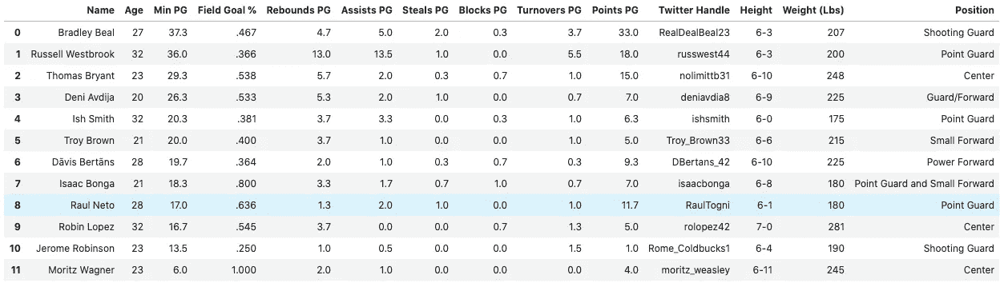
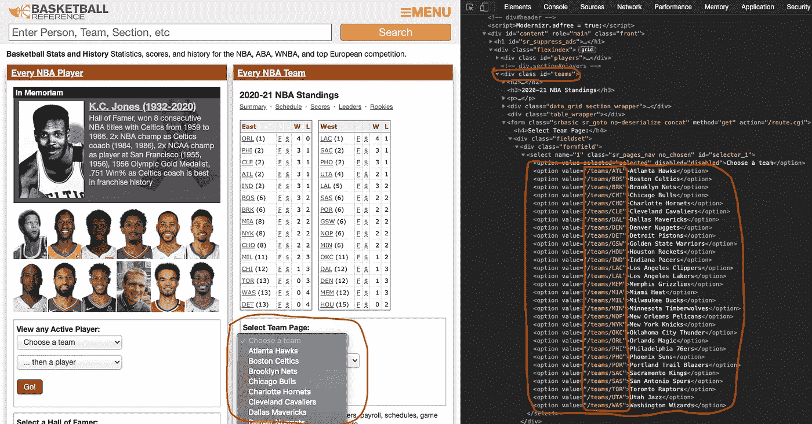
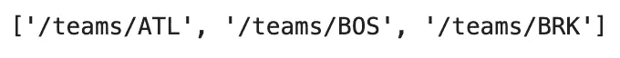
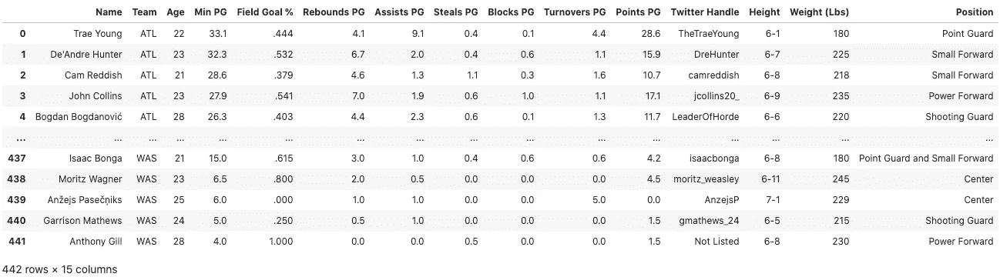
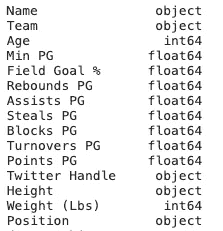
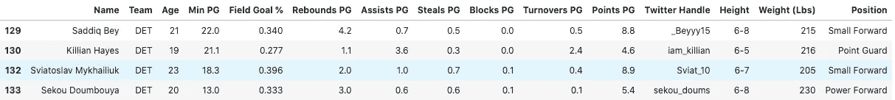
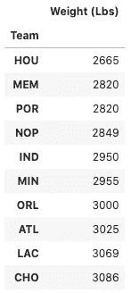
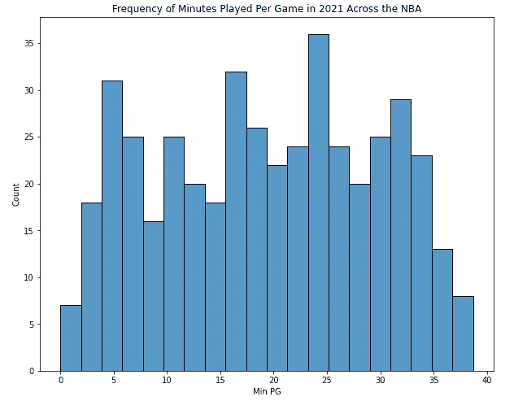
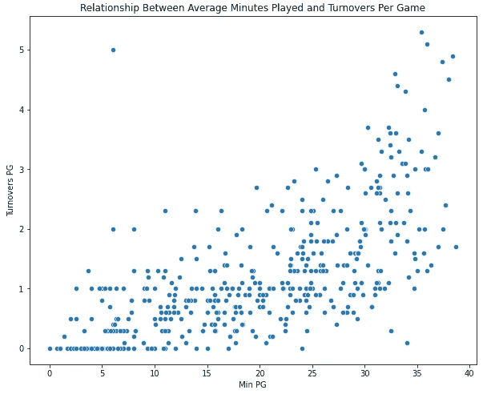

# 用熊猫、BeautifulSoup 和 RegEx (Pt。2)

> 原文：<https://medium.com/analytics-vidhya/web-scraping-nba-data-with-pandas-beautifulsoup-and-regex-pt-2-fa0e4c1a16fa?source=collection_archive---------10----------------------->

在开始阅读这篇文章之前，如果你还没有阅读过，我推荐你阅读一下这个系列的第一部分。在第一部分中，我解释了我从 [Basketball-Reference](https://www.basketball-reference.com/) 中为 2020–2021 华盛顿奇才队收集数据并将其重组为 Python 中可操作的数据框架的过程。下面是我结束时的代码和输出:

上述代码的输出—2020–2021 华盛顿奇才队的熊猫数据框架

在这篇文章中，我将扩展上述数据框架，以包括所有现役 NBA 球员。然后，我将创建一个函数，用户输入年份，该函数输出该赛季所有 NBA 球员的数据帧。最后，我将对我们的新数据进行一些探索性的数据分析。

第一步是将必要的库导入 Python，如下所示(我在[第一部分](https://gabe-cano.medium.com/web-scraping-nba-data-with-pandas-beautifulsoup-and-regex-pt-1-e3d73679950a)中简要解释了这些库的功能)。

为了获得每个 NBA 球队的球员数据，而不仅仅是奇才队，我需要每个球队网页的 URL 结尾。幸运的是，这些 URL 结尾可以在 [Basketball-Reference 主页](https://www.basketball-reference.com/)的一个名为“Select Team Page”的下拉菜单中找到，如下图所示。人们可以从 HTML(在第一个绘制的红色框内)中看到，团队名称在带有`id="teams"`的`div`标签下。

为了分离出我想要关注的 HTML 文本，我将使用`requests`和`BeautifulSoup`从主页获取并解析所有的 HTML。然后我将创建一个变量`select_team`，用`id = "teams"`将 HTML 缩小到`div`，如下面的代码所示。

在`select_team`中，每个团队都包含在一个`option`标签中，我们想要的 URL 结尾在`value`属性中(参考上面截图中的红框)。为了获得所有这些 URL 结尾，我将创建一个名为`team_list`的列表，并从选项 2 到 31 迭代追加`value`属性(第一个选项只是下拉菜单的‘Choose a team’标题)。

`team_list[0:3]`(列表中的前三个元素)的输出如下所示:

亚特兰大老鹰队，波士顿凯尔特人队和布鲁克林篮网队篮球的 URL 结尾-参考页面

回想一下我们在上一篇[帖子](/analytics-vidhya/web-scraping-nba-data-with-pandas-beautifulsoup-and-regex-pt-1-e3d73679950a)中留下的代码，它涉及到从 Basketball-Reference 的向导 URL 中抓取数据，隔离每场比赛的表格(名为`wiz_per_game`)，并在一个`for`循环中迭代地添加每个球员的数据。要包含所有 NBA 球队，我们所要做的就是将这个`for`循环嵌套在另一个`for`循环中，该循环遍历每个球队的 URL。一种进一步发展这一概念的方法是将代码变成一个函数，用户输入年份，函数输出该特定赛季的球员信息。

在下面的代码中，第一个`for`循环为`team_url`分配了 [Basketball-Reference](https://www.basketball-reference.com/) 基本 URL，只是现在它插入了以`team_list`结尾的球队 URL，以及函数中的`year`参数。接下来的嵌套`for`循环添加了每个玩家的信息，就像之前向导代码所做的一样。一旦嵌套的`for`循环完成了一次迭代，函数就从最初的`for`循环开始，继续下一个团队。

用' 2021 '调用上面的函数应该会输出下面的数据帧，其中包含当前赛季网站上列出的所有 442 名 NBA 球员的数据:

`all_nba_players_2021 = get_stats(2021)
all_nba_players_2021`

太神奇了！在我们对所有这些统计数据进行数据分析之前，需要将数字列从`object`类型更改为`float`或`int`类型。运行下面的函数为我们完成了这一转换工作，并打印出每一列的 dtype，以确保它得到了适当的更改。

根据格式，高度是一个对象，即“6–10”。人们可以创建一个函数，将符号转换成只有英寸或厘米的整数。

# **探索性数据分析**

现在我们已经有了 2020-2021 赛季每一位 NBA 球员的信息，我们可以检查一些数据了！`pandas`、`matplotlib`和`seaborn`是强大的数据操作/可视化工具，提供了本质上无限的探索途径。下面是一些将它们用于`all_nba_players_2021`的例子。

使用一些简单的`pandas`过滤，我可以找到所有活塞球员投篮命中率在 40%或以下的信息:

现在说基利安·海耶斯破产还为时过早吗？？

比方说，我想根据球员的总重量以及球队的总重量，找出前十名最轻的 NBA 球队。来自`pandas`的`groupby`方法完成了这个请求:

火箭喜欢他们的小球阵容！

为了更好地了解联盟中玩家每场比赛的上场时间，我可以使用`seaborn`和`matplotlib`用直方图来可视化这个指标:

最后，`seaborn`还包括一个散点图，有助于观察不同变量之间的关系。让我们试着用“最小 PG”和“失误 PG”做一个散点图:

这两个变量之间有一个稍微正的线性关系，这在直觉上是有一定道理的——一个人上场时间越长，失误的机会就越多。请注意，存在某些异常值！

显然，我只是触及了在`all_teams_2021`上利用这些 Python 库所能获得的洞察力的表面。人们还可以使用我的`get_stats`功能来制作多个 NBA 赛季的数据帧，并将它们合并在一起，以确定多年的趋势，甚至创建一些预测模型。

除了[篮球参考](https://www.basketball-reference.com/)之外，互联网显然掌握着深不可测的大量数据。配备了现代网络抓取和数据分析/建模工具，数据科学家真正受到限制的只是他们的好奇心和创造力的天花板。