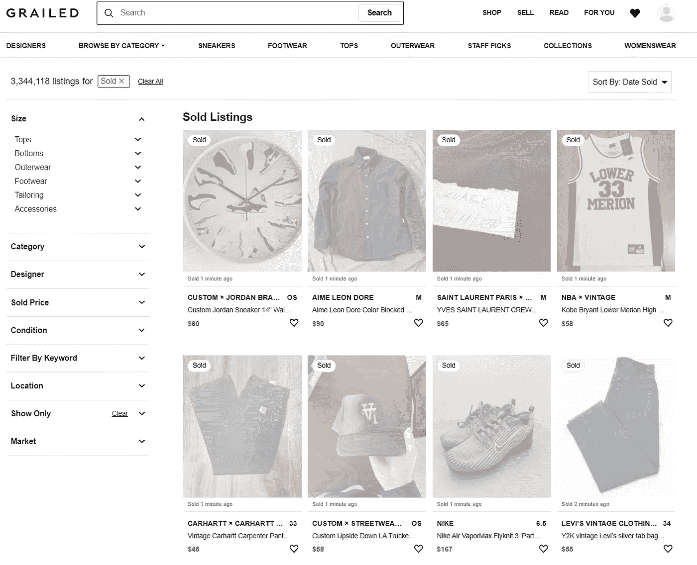

# 网上销售的衣服含有硒

> 原文：<https://medium.com/analytics-vidhya/web-scraping-sold-clothing-on-grailed-with-selenium-2514cbe6855e?source=collection_archive---------14----------------------->

# 介绍

在整个高中和大学期间，我一直使用 Grailed 的平台来销售我从日本进口的二手服装。对于那些可能不知道的人来说，Grailed 本质上是一个男装易贝，用户可以在那里列出他们用过的物品。

最终，我的目标是创建一个工具来改善 Grailed 体验，让用户可以获得他们将要发布的物品的准确价格预测。这个工具可以让用户更好地了解他们张贴的物品的价值。

为了创建这个工具，我首先需要一个数据集。这种对海量数据的需求是我的网络抓取冒险开始的地方。Grailed 绝不是一个容易刮的网站。我最初担心的是处理弹出窗口、无休止的滚动和下拉菜单，然而，随着我对 web scrapping Grailed 的深入研究，更多的困难变得明显起来。

为了创建一个准确的价格预测模型，我需要已售出的物品而不是已上市的物品，但不是已售出的物品。不幸的是，与未售出的物品相比，Grailed 使得抓取已售出的物品更加困难。

我将利用 python 和 Selenium 包来抓取已售出的列表。

我首先要感谢 Mike Liu 在网上搜集未售出商品清单的帖子，他为我的大部分代码提供了基础。

# 抓取已出售的 Grailed 列表的困难:

1.  导航无限滚动
2.  弹出窗口
3.  下拉菜单

这三个初始问题只是冰山一角。我原本希望从 https://www.grailed.com/sold 的[搜刮到所有最近售出的房源。然而，这个想法被放弃了，因为我发现从这个地址出售的物品只能加载前 20 页。这意味着从标准销售页面只能收集到大约 800 个列表。](https://www.grailed.com/sold)

标准 Grailed 销售页面。

我的解决办法是从 6，000 个特定于设计师的页面中收集售出的商品。在 6000 个特定设计师售出的页面中，每一页都没有滚动限制。这意味着我可以通过循环浏览每个设计师页面和收集售出商品信息来收集更多的数据。

设计师特定销售页面示例(古驰)。

# 正在收集 Grailed 设计器页面链接:

我首先收集了 Grailed 上所有设计师页面的链接。总共 Grailed 主机 6028 独特的设计师，我需要收集。为此，我收集了 Grailed 上[设计师页面的链接。](https://www.grailed.com/designers)

Grailed 设计师的网页。

用于收集设计器页面链接的代码。

# 收集每位设计师的售出页面:

接下来，我需要获得每个特定设计师页面的已售出列表，而不是当前未售出的列表。这最初似乎是一个简单的过程。我怀疑出售的页面只需要在每个链接的末尾添加“/sold”即可。这不是真的。

例如，在查看设计师古驰时，我发现设计师页面是[https://www.grailed.com/designers/gucci](https://www.grailed.com/designers/gucci)，而进入古驰销售页面的 URL 是【https://www.grailed.com/sold/kZ4iDqlEsQ】T2。这意味着 Grailed 上出售的设计师页面的 URL 没有明确的顺序。为了解决这个问题，我使用 Selenium 在每个 designer 页面链接中循环，单击“show only”下拉菜单，关闭登录弹出窗口，然后单击 sold 框。一旦加载了售出页面，Selenium 就会在 ItemDF 数据框架中为每个设计者收集售出页面的链接。

对于每个设计师来说，最终需要选择什么才能到达售出页面。

为每个设计者收集售出页面的代码。

# 收集特定物品出售链接:

接下来，我收集了上一节中收集的所有设计师的售出页面，并收集了各个项目的链接。由于时间限制，我决定不收集少于 25 件商品的设计师的作品，我也收集最多 4 页卷轴的作品。

我需要收集的链接的例子。

收集物品售出链接的代码。

# 正在收集项目信息:

最后，我使用 selenium 遍历每个商品链接，收集我首先寻找的基本商品信息。对于每个项目，我收集了以下信息:

1.  发帖人用户名
2.  海报设计者
3.  帖子的副标题
4.  发布的大小
5.  发布的颜色
6.  发布条件
7.  发布类别
8.  海报的反馈计数
9.  过帐的销售价格
10.  过帐的描述
11.  帖子中的图片数量

从每个项目链接收集的内容示例。

用于收集个别项目信息的代码。

# 结论:

在出售的列表被删除后，我清理了数据。最后，Grailed 销售数据集总共有 103，537 个列表。上面的代码可以很容易地通过增加滚动限制来抓取 Grailed 上的每一篇售出的文章。然而，问题是，即使收集大约 100，000 个列表也需要大约 2 周的运行时间，因此更大的数据收集需要耐心。

以下是最终的数据框架:

请随意在我的 Github 上下载完整的数据框架，在这里找到。