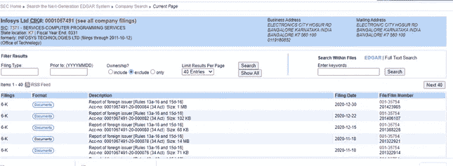
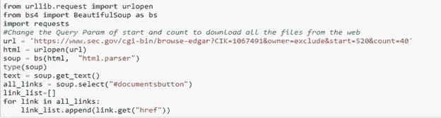
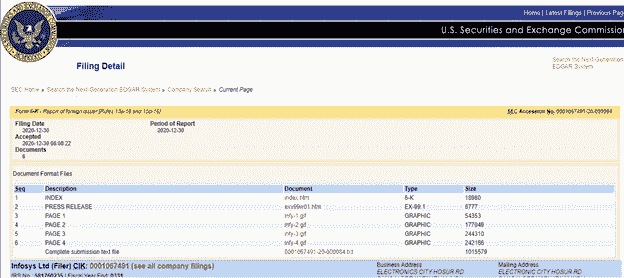
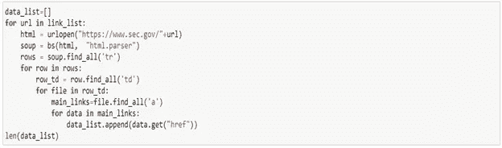
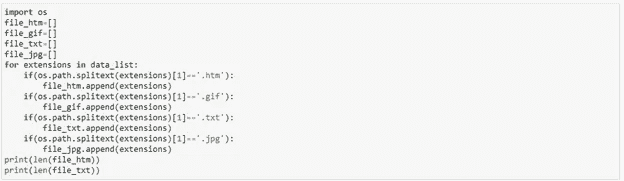
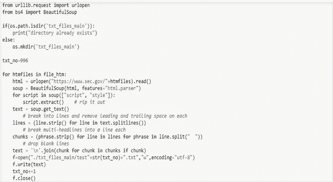

# 使用 Python 中的 BeautifulSoup 进行网页抓取

> 原文：<https://medium.com/analytics-vidhya/web-scraping-using-beautifulsoup-in-python-b444add3496d?source=collection_archive---------15----------------------->

考虑一个场景，您必须从网站上收集关于表单或一些文档的数据，以便使用机器学习进行分析或导出一些统计数据。在这种情况下，您可以使用 python 库 BeautifulSoup 从网页中抓取数据。以下是下载 EDGAR 数据集的步骤，该数据集包含美国证券交易委员会的备案信息，公众可通过互联网免费获取。在这里，你必须找到刮掉所有的数据，从公司档案页，并保存它，为进一步的处理。数据以不同的文件格式呈现，如 gif、jpg、txt、HTML。我们还需要将它转换成一种常见的形式，以便进一步处理。

第一步: **:** 使用 urllib 库中的 urlopen 和 BeautifulSoup 打开网站，提取网页上的数据，这些数据是从按钮中提取的点击**图 1.1** 中给出的 documents 按钮，并追加到一个包含所有 ahref 链接的数组 link_list[]中。在**中，图 1.2** 是给它的代码。

**图 1.1**[**https://www.sec.gov/cgi-bin/browse-edgar?CIK=1067491&所有者=排除**](https://www.sec.gov/cgi-bin/browse-edgar?CIK=1067491&owner=exclude)**【1】**

**图 1.2 从网页**中的按钮提取数据 ahref 链接的代码

第二步: **:** 在**图 2.1** 列名文档中包含所有不同文件类型 URL 的网页出现。在**图 2.2** 中，遍历数组 link_list[]中的每个 URL，打开每个 URL 找到所有行，从包含不同文件的行中获取 ahref 链接，并将其附加到数组 data_list[]中。

**图 2.1 https://www . sec . gov/Archives/Edgar/data/1000106749120000084/0001067491-20-000084-index . htm[2]。**

**图 2.2 为每个文档提取链接的代码**

步骤 3:在**图 3.1** 中，每个文件扩展名类型被分离到不同的数组中，以便进一步处理。以便只有有用的文件类型才能用于进一步的分析。

**图 3.1 分隔不同文件扩展名链接的代码**

第四步:在**图 4.1** 中，它在包含所有。htm 文件 URL，它使用 urllib 库中的 urlopen 打开每个 URL，并使用 BeautifulSoup 提取文本，剥离所有不需要的 html 标签，并将其写回到 txt 文件中，并将文件保存在目录中。

**图 4.1 转换代码。htm 链接到 txt 文件**

参考

1)[https://www.sec.gov/cgi-bin/browse-edgar?CIK=1067491&所有者=排除](https://www.sec.gov/cgi-bin/browse-edgar?CIK=1067491&owner=exclude)

2)https://www . sec . gov/Archives/Edgar/data/106749120000084/0001067491-20-000084-index . htm