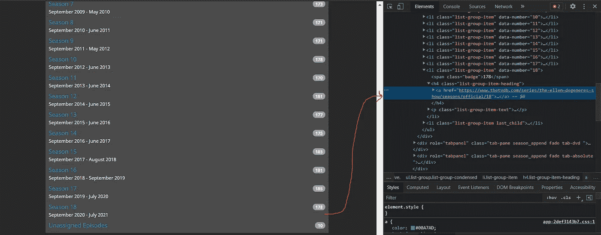

# 使用 Python 和 Selenium(XPATH)的 Web 抓取

> 原文：<https://medium.com/analytics-vidhya/web-scraping-using-python-and-selenium-xpath-f315f63ac229?source=collection_archive---------4----------------------->

本文使用的网站是[***Ellen _ show***](https://www.thetvdb.com/series/the-ellen-degeneres-show)，本文以教育为目的，是一个使用 selenium 学习网页抓取的项目。我选择上述网站是因为我爱 **Ellen DeGeneres 秀…所以！！**而这里提取的数据属于节目的拥有者。这篇文章是一个让我们做吧，对于理论请阅读 [**这里**](https://www.javatpoint.com/selenium-tutorial) 。

现在让我们开始，首先使用 **pip** 安装**selenium**并在您的笔记本中导入以下库。

```
**import** **pandas** **as** **pd**
**from** **selenium** **import** webdriver
**from** **selenium.common.exceptions** **import** NoSuchElementException

**from** **selenium.webdriver.support** **import** expected_conditions **as** EC
**from** **selenium.webdriver.support.ui** **import** WebDriverWait
**from** **selenium.webdriver.common.by** **import** By
**from** **IPython.display** **import** Image
**import** **datetime**
```

添加 Chrome 驱动路径但是在那次下载之前，最新版本的 **chrome 驱动**从这个 [**链接**](https://sites.google.com/a/chromium.org/chromedriver/downloads) 和**路径**就是下载的地方。exe 文件的位置)

```
PATH ="C:\Program Files\chromedriver.exe"
```

下面的代码将打开 chrome 浏览器

```
driver = webdriver.Chrome(PATH)
```

添加我们想要抓取的网站的链接

```
driver.get('https://www.thetvdb.com/series/the-ellen-degeneres-show')
```

**注意**:如果你只是为了代码而来，向下滚动到**最终报废代码**或者跟我来**。**


来源:[https://www.thetvdb.com/series/the-ellen-degeneres-show](https://www.thetvdb.com/series/the-ellen-degeneres-show)

在网站上向下滚动，你会看到这个


来源:[https://www.thetvdb.com/series/the-ellen-degeneres-show](https://www.thetvdb.com/series/the-ellen-degeneres-show)

**看到小箭头**那是第一季数据的链接，然后是总共 18 季的列表。

> 我想让我的 scraper 代码自动进入该季列表的每个链接，然后抓取每一季的数据(所有剧集)，并将数据追加到一个表中。这样，我们就有了一个包含所有季节及其剧集的数据集。听起来很有趣对吧！！！


**右键单击- > inspect - >在 RHS 顶栏上单击元素选项卡- >右侧的箭头，然后选择季节 1 - >您将看到一个以蓝色突出显示的部分- >右键单击- > COPY - > copy XPATH - >您将获得下面提到的路径，**将它复制到一个单元格中，现在不要接触它。

第一季 XPATH://*[@ id = " page-series "]/div[3]/div[2]/div[2]/div[6]/div[1]/ul/Li[3]/H4/a



这次完全按照我们之前为第 18 季所做的来做。你会被跟踪的

**第十八季 XPATH**://*[@ id = " page-series "]/div[3]/div[2]/div[6]/div[1]/ul/Li[20]/H4/a

所以我们想从**第一季的 XPATH** 迭代到**第 18 季的 XPATH**

现在，什么是 XPATH？XPath 是一种用于从 XML 文档中选择节点的查询语言。因此 Selenium 使用这种方法和许多其他方法来浏览 HTML 或 XML 文档，XPATH 就是其中之一。选择节点的其他方法是使用 id、类等。但是我发现 XPATH **并不令人头痛**，如果那是一个词的话。

现在让我们回到任务上来，你能看出 Season1_XPATH 和 Season18_XPATH 之间的区别吗？

如果没有，答案是这样的——在 XPATH 中，直到 **ul/** 、**、**都是一样的，然后在李**之后，h4/a** 在这两者中也是一样的。

这里的主局在**李【3】**到**李【20】**，差= 20–3+1 = 18，等于赛季总数。所以我们的循环将从 **3 到 21**(python 中不包括范围的结尾)，我们将得到每个季节。

好了，我们可以访问每一季的链接了太好了！！，但现在呢？

现在，我们的代码应该能够访问每个季节的链接，并单击它打开包含该季节所有数据的页面


使用 XPATH 单击网页元素的代码片段

上面的代码可以点击网页的元素(这些元素的路径是使用我们之前看到的 XPATH 给出的)。所以这样可以一个一个的打开各个环节。

**可以吗？**

不，它不能，因为在访问一个链接后，你应该再次回到主页面，然后它才能选择赛季列表的下一个链接。


循环显示季节的代码片段

# 做些有用的事情

现在，就像之前一样，单击第 1 集的行，并为 **S01E01，Name，First Aired** 收集 XPATH，就像我们为季节所做的那样，并将它们复制到单独的单元格中以供参考。


第一集:

*   **季节指数**://*[@ id = " page-Season "]/div[4]/div[2]/div[1]/table/tbody/tr[1]/TD[1]
*   **客人(姓名)**://*[@ id = " page-season "]/div[4]/div[2]/div[1]/table/tbody/tr[1]/TD[2]/a
*   **日期(首播)**://*[@ id = " page-season "]/div[4]/div[2]/div[1]/table/tbody/tr[1]/TD[3]/div


第 166 集:

*   **季节索引**://*[@ id = " page-Season "]/div[4]/div[2]/div[1]/table/tbody/tr[166]/TD[1]
*   客人(姓名)://*[@ id = " page-season "]/div[4]/div[2]/div[1]/table/tbody/tr[166]/TD[2]/a
*   **日期(首播)**://*[@ id = " page-season "]/div[4]/div[2]/div[1]/table/tbody/tr[166]/TD[3]/div

现在让我们找出第一集和最后一集的区别-( **Season_index，Guests，Date** XPATH)

*   Season_index XPATH 从 tr[1]更改为 tr[166]其余都是一样的
*   Guest(Name) XPATH 从 tr[1]更改为 tr[166]其余都是一样的
*   日期(首次播出)XPATH 从 tr[1]更改为 tr[166]其余一切都一样

不是每一季都有 166 集，所以我们可以每一季取 1 到 200 集以防万一。现在你可能会想，如果我们超出了任何一季剧集数量的限制，代码就会出错。**是的！！，它将给出** NoSuchElementException **，但是我们将使用 try-except，**来处理它，因此如果出现异常，我们**将从同一个循环的下一次迭代开始继续(** python 关键字 **)** ，直到它完成所有迭代(不给出任何错误)。看到代码你会明白更多。

好了，我们可以访问每集的每个数据栏，接下来呢？

现在我们的代码应该能够读取与每个 XPATH 相关的文本，这样我们就可以存储它们了。让我们也在那上面努力


循环播放所有剧集并阅读相关文本的代码片段

# 最终报废代码:

```
Date = [] #to store date data
Season_ep = [] #to store season data
Guests = [] #to store Guests list

**for** i **in** range(3,21):

    element=WebDriverWait(driver,20).until(EC.visibility_of_element_located((By.XPATH ,'//*[@id="page-series"]/div[3]/div[2]/div[2]/div[6]/div[1]/ul/li['+str(i)+']/h4/a')))
    element.click()

    **for** j **in** range(1,200):
        **try**:

            Season_ep.append(driver.find_element_by_xpath('//*[@id="page-season"]/div[4]/div[2]/div[1]/table/tbody/tr['+str(j)+']/td[1]').text)
            Guests.append(driver.find_element_by_xpath('//*[@id="page-season"]/div[4]/div[2]/div[1]/table/tbody/tr['+str(j)+']/td[2]/a').text)
            Date.append(driver.find_element_by_xpath('//*[@id="page-season"]/div[4]/div[2]/div[1]/table/tbody/tr['+str(j)+']/td[3]/div').text)

        **except** NoSuchElementException:

            **continue**  
    print('Season:'+str(i-2)+' done') 

    element=WebDriverWait(driver,20).until(EC.visibility_of_element_located((By.XPATH ,'//*[@id="page-season"]/div[3]/div/a[3]')))
    element.click()
```

保持这款笔记本推出的 chrome 浏览器打开，在你面前，你会看到 selenium 和 python 的神奇。

**将所有内容组合在一起，形成最终的数据帧**

```
d = zip(Season_ep,Date,Guests)
mapped = list(d)
df = pd.DataFrame(mapped, columns =['Season', 'Date','Guests'])
```

**让我们验证数据集，看看它是否准确**

我记得迪皮卡·帕度柯妮去看了艾伦的演出。如果这是一个完整的数据库，我相信。它应该包含该条目。让我们看看那天还有哪些客人。

```
df[df['Guests'].str.contains('Deepika Padukone')]
```


第 14 季第 84 集于 2017 年 1 月 18 日上映，这是她在好莱坞的首部电影 **XXX:史云光·凯奇与范·迪塞尔的回归**。

```
*#Converting date to a much favourable format*

df['Date'] = df['Date'].apply(**lambda** x: datetime.datetime.strptime(x, '%B **%d**, %Y').date())
df['Date'] = pd.to_datetime(df['Date'])
df.tail(10)
```


**Github 链接**:[Code _ and _ Extracted _ Dataset](https://github.com/Shubham-253/Web-Scraping/tree/main/Ellen%20Show%20(2013-2021)%20web%20scraping%20using%20Selenium)

**如同几乎所有事情的情况一样，上述结果可以通过多种方式获得，这是其中的一种方式。最后，我只希望你学到了一些东西，这是我的第一篇文章，我很高兴能够为这个社区做出贡献。请给我宝贵的反馈，我一定会改进我的错误。**