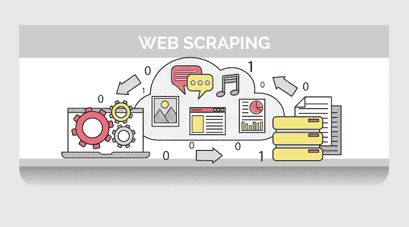
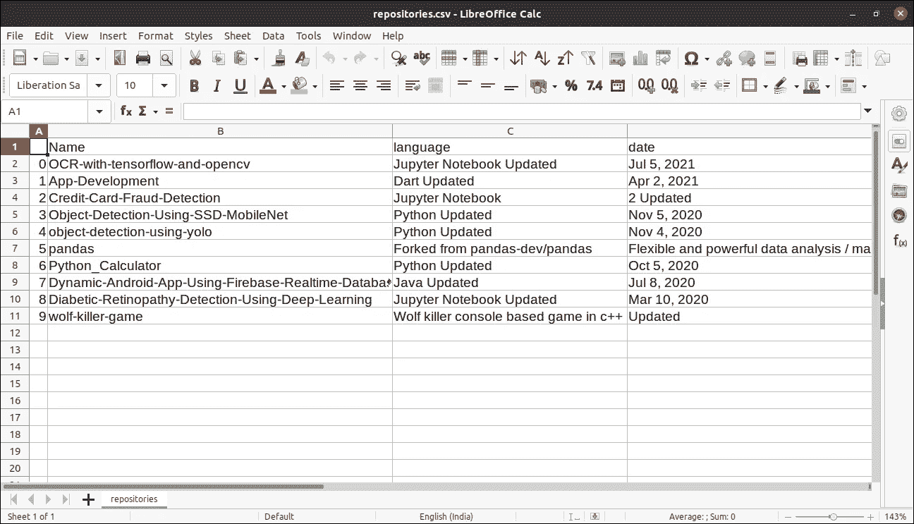

# 用 Python 进行 Web 抓取:初学者到高级。

> 原文：<https://medium.com/analytics-vidhya/web-scraping-with-python-beginner-to-advanced-10daaca021f3?source=collection_archive---------1----------------------->

## 更多的数据更多的机器学习。



[来源](https://www.smallbizdaily.com/7-ways-how-web-scraping-helps-retailers/)

副标题引用是一个事实，如果你有更多关于你的问题的数据，你可以提取更多关于问题的信息，可以更准确地解决它。所以网络抓取是一种从网络中提取数据的技术。

# 目录

1.  什么是网页抓取？
2.  我们如何从网站上删除数据？
3.  在 python 中执行 web 抓取

*   使用硒和美丽素的网刮
*   使用 request_html 的 Web 抓取
*   使用 scrapy 进行网页抓取

# 1.什么是网页抓取？

形式定义

> **网络抓取是一种用于从网站中提取大量数据的自动化方法。**

网站上的数据通常是非结构化的。Web 抓取是一种收集非结构化数据并将其以结构化形式存储的技术。

# 2.现在的问题是我们如何从网站上获取数据？

当运行任何 web 抓取代码时，请求会被发送到您提到的 URL。网站通过发送数据来响应请求，并允许它读取 XML 或 HTML 页面。然后，代码将从 XML 或 HTML 页面中提取所需的数据。

任何网页抓取代码都需要遵循基本步骤:

1.  找到你想要抓取的网页的 URL(地址)
2.  检查页面并找到要提取的数据
3.  编写提取数据的逻辑
4.  将提取的数据存储为结构化形式(例如熊猫数据帧)

现在我们将使用各种库和框架来执行 web 抓取。

# 3.使用多个库执行 web 抓取

## 网刮使用硒和美丽的汤

让我来介绍一下每个库

*   **Selenium:** Selenium 是一个 web 测试库。它用于自动化浏览器活动。
*   **Beautiful Soup:**Beautiful Soup 是一个解析 HTML 和 XML 文档的 Python 包。它创建解析树，有助于轻松提取数据。
*   Pandas: Pandas 是一个用于数据操作和分析的库。它用于提取数据并以所需的格式存储数据。

让我们从 flipkart 网站获取关于笔记本电脑的信息。


Flipkart 网页

假设我们需要笔记本电脑名称和价格等信息

让我们通过导入所需的库来开始编写代码

```
from selenium import webdriver
from bs4 import BeautifulSoup
import pandas as pd
```

要配置 webdriver 使用 Chrome 浏览器，我们必须设置 chromedriver 的路径

```
driver = webdriver.Chrome('/usr/lib/chromium-browser/chromedriver')
```

现在让我们列出一些存储数据和获取内容的列表

```
products=[] #List to store name of the product
prices=[] #List to store price of the product
driver.get('[https://www.flipkart.com/search?q=Laptops&otracker=search&otracker1=search&marketplace=FLIPKART&as-show=off&as=off&as-pos=1&as-type=HISTORY&as-backfill=on'](https://www.flipkart.com/search?q=Laptops&otracker=search&otracker1=search&marketplace=FLIPKART&as-show=off&as=off&as-pos=1&as-type=HISTORY&as-backfill=on'))
content = driver.page_source
soup = BeautifulSoup(content)
```

现在我们有了网页的内容，所以我们需要从中获取有用的数据。

这里要注意的是，我们需要类名来从网页中找到特定的内容，我们可以通过检查网页来找到它


正在查找类 ID

在上面的图像中，显示了特定笔记本电脑内容的 id，类似地，您可以找到所有的 id，即名称和价格。

```
for a in soup.findAll(attrs={'class':'_1fQZEK'}):
    name=a.find('div', attrs={'class':'_4rR01T'})
    price=a.find('div', attrs={'class':'_30jeq3 _1_WHN1'})
    products.append(name.text)
    prices.append(price.text)
```

在这里，循环在所有类别 id 为 **_1fQZEK** 的

标签上迭代，在那个< div >中，它们是名称和价格的其他子< div >标签。此外，我们会将该内容添加到我们的受尊重列表中。

现在，为了使这些数据成为结构化的形式，我们将它存储到 pandas dataframe 中，并进一步保存为 csv 文件。

```
df = pd.DataFrame({'Product Name':products,'Price':prices})
df.to_csv('products.csv', index=False, encoding='utf-8')
```


数据

## 使用 requests_html 的 Web 抓取

我们可以通过使用单个库从网站抓取数据，即我们将使用 request_html 抓取数据

假设我们想从 github repositories 页面获取存储库名称、使用的语言和日期。


Github 页面

让我们直接进入代码

```
import requests_html
from requests_html import HTMLSession
import pandas as pd
```

这些只是我们需要的进口货。

现在让我们创建 html 会话对象，设置 URL 并获取内容

```
session = HTMLSession()
url = '[https://github.com/kamlesh11?tab=repositories'](https://github.com/kamlesh11?tab=repositories')
response = session.get(url)
```

现在我们需要从网页中找到对我们真正有用的数据。

```
container = response.html.find('#user-repositories-list',first=True)
# #user-repositories-list represents id of <div> tag
```

所以我们提取 id = user-repositories-list 的

标签中的所有内容。

此外，我们只需要 Li 标签

```
list = container.find('li')
```

现在让我们创建存储信息的列表。

```
name = [] # for storing name of repository
lang = [] # language used in code
date = [] # date updated
for item in list:    
    tmp = item.text.split('\n')
    name.append(tmp[0])
    lang.append(tmp[1])
    date.append(tmp[2])
```

现在创建数据框来组织数据，并进一步保存为 csv 文件。

```
df = pd.DataFrame({'Name':name,'language':lang,'date':date})
df.to_csv('repositories.csv')
```

已创建 csv 文件



存储库 csv 文件

现在我们将学习 Scrapy 一个网页抓取框架。

## 使用 scrapy 进行网页抓取

Scrapy 是一个用于大规模网页抓取的 [Python](http://courses.analyticsvidhya.com/courses/introduction-to-data-science-2?utm_source=blog&utm_medium=WebScrapinginPythonarticle) 框架。它为您提供了高效地从网站中 ***提取*** 数据所需的所有工具， ***根据您的需要处理*** ，并以您喜欢的 ***结构*** 和格式存储它们。

**设置您的系统**

Scrapy 支持 Python 2 和 3 两个版本。如果你使用的是 Anaconda，你可以从 conda-forge 频道安装这个包，那里有针对 Linux、Windows 和 OS X 的最新包。

要使用 conda 安装 Scrapy，请运行:

```
conda install -c conda-forge scrapy
```

或者，如果你使用的是 Linux 或 Mac OSX，你可以通过以下方式直接安装 scrapy:

```
pip install scrapy
```

现在我们已经设置好了我们的系统，让我们用 scrapy 来执行网页抓取。

## 用 Scrapy 刮网

我们再从 flipkart 中提取一些数据。这次我们将提取 iphones 的数据。


Flipkart iphone 页面

我们将提取 iphones 的名称和评级。

为了提取数据，我们必须启动 scrapy shell，我们可以通过以下命令启动它

```
scrapy shell
```

现在我们需要添加我们想要提取的网页的 URL。在这种情况下，我们希望提取 Flipkart iphone 页面。


取得

现在让我们看看回应

```
response.text
```

以上代码将以 XML 或 HTML 格式打印页面内容。现在我们有了所有的内容，让我们开始收集所需的数据。让我们先刮一下 iphones 的名字。

```
response.css('._4rR01T::text').extract()
```

给你。_ 4rR01T 是具有 phones 标题的类名。你可以通过检查得到这个东西。您可以在本文的第一部分了解这些信息。

## 输出:-


Iphone 名称

现在让我们提取所有 iphones 的评级。

```
response.css('._3LWZlK::text').extract()
```


同样，我们也可以提取其他数据。

现在，我们已经在 shell 中完成了所有这些工作，但是我们实际上需要 csv 文件中的数据，而不是 shell 中的数据。为此，我们需要开始新的项目。

让我们开始新的项目。

```
scrapy startproject Iphone
```

现在我们需要编写抓取数据的蜘蛛。

## 等等，蜘蛛是什么？

蜘蛛是一种从网站或给定的 URL 下载内容的程序。当提取大规模的数据时，你需要为不同的网站编写定制的蜘蛛，因为由于网站设计的多样性，没有“一刀切”的方法。您还需要编写代码，将提取的数据转换为结构化格式，并将其存储为可重用的格式，如 CSV、JSON、excel 等。那要写很多代码，幸运的是 ***scrapy 自带了*** 中内置的大部分功能。

## 创造一只蜘蛛

```
scrapy genspider iphone [www.flipkart.com/search?q=iphone](http://www.flipkart.com/search?q=iphone)
```

在这里，我们正在创建 iphone 蜘蛛。


创建 iphone 蜘蛛

现在你会看到一个名为 Iphone 的文件夹，里面有很多文件，你还会发现一个名为 spiders 的文件夹，蜘蛛就存储在那里。在我们的例子中，我们只创建了一个名为 iphone 的蜘蛛。因此，这里的 iphone.py 文件将被发现，为每一个新的蜘蛛，它将创建新的蜘蛛文件。

现在我们来看看 iphone spider 里面有哪些代码。


Iphone 蜘蛛

在这里，每次我们抓取项目蜘蛛将运行，数据将从网站或网站刮。现在我们将编写一些代码来收集数据。

现在我们需要从 flipkart 页面提取 iphones 的名称和评级。


添加的代码

在这里，我们抓取的名称和评级与我们在 scrapy shell 中编写的相同，并添加了一些以 csv 格式保存数据的代码。

请注意，在抓取数据时，我们可能会获得或多或少的内容，因为数据是非结构化形式的，所以我们会获得 24 个 iphone 名称和 39 个评级。这可能会发生，因为该类也可能在其他一些地方使用，所以数量会有所不同。

现在让我们看看 csv 文件


Iphone CSV

如果你想获得更多关于刺儿头的信息，我建议你阅读这篇 [***文章***](https://www.analyticsvidhya.com/blog/2017/07/web-scraping-in-python-using-scrapy/#:~:text=Scrapy%20is%20a%20Python%20framework,your%20preferred%20structure%20and%20format.) 。

祝贺你走了这么远，我希望你在这篇文章中获得了很多信息。

感谢阅读。😃