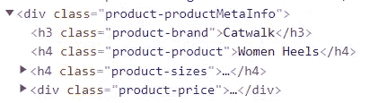
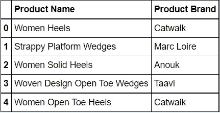

# 使用 Python 进行 Web 抓取

> 原文：<https://medium.com/analytics-vidhya/web-scraping-with-pythonweb-scraping-with-python-c8e6ec5021f5?source=collection_archive---------5----------------------->

在这一系列的博客中，作为我学术研究的一部分，我将会写一些关于我将要执行的数据科学主题的各种实际实现。在这个系列中，我的第一篇文章是关于用 Python 进行 Web 抓取的。在这篇文章中，我使用了网络抓取来获取 Myntra 网站上关于产品及其品牌的数据。在详细介绍网络抓取之前，让我们先了解一下什么是网络抓取，以及它的用途。

**什么是网页抓取？**

简而言之，网络抓取指的是从特定网站提取数据。网络抓取软件可以使用超文本传输协议或网络浏览器直接访问万维网。虽然 web 抓取可以由软件用户手动完成，但该术语通常指的是使用 bot 或 web crawler 实现的自动化过程。这是一种复制形式，从 web 上收集并复制特定数据，通常复制到本地中央数据库或电子表格中，以供以后检索或分析。(来源:维基百科)

**使用网页抓取**

Web 抓取是一种流行的技术，数据科学家大量使用它来提取大量数据，这些数据用于研究，并基于提取的数据创建新产品或改进现有产品。例如，股票市场应用程序通常会收集不同市场公司的股票数据，以预测潜在趋势。

在我的这个实际实现中，我通过 web 抓取 Myntra 网站来获取 Myntra 网站上的产品名称及其品牌信息。

**实现**

为了实现，我使用了 **Selenium WebDriver** 通过程序访问 web 抓取链接。使用的另一个库是 **BeautifulSoup** ，它用于从 HTML 或 XML 文件中提取数据。使用的最后一个库是**熊猫**。Pandas 库用于将给定的数据转换为数据帧，然后将提取的数据导出为 csv 文件。

**执行网页抓取的步骤**

1.  找到您要执行网页抓取的 url。我使用了 Myntra url，它可以在我的 github 代码中看到。

```
URL: "https://www.myntra.com/women-heels?f=Heel%20Height%3A4**%20i**nches&plaEnabled=false"
```

2.下一步是检查给定的 url，在您想要提取其数据的网页中找出合适的标签。对于我使用的 url，我想要访问的数据在具有类属性'**product-product metainfo**'的 **div 标签**下。



页面检查中的 div 标签

3.在执行代码之前，如果您的计算机上没有安装 bs4、selenium 和 pandas，请安装上述库。

4.接下来，创建空列表来存储数据，并使用 selenium web driver 打开 url。

```
driver = webdriver.Chrome()
product_brand=[]
product = []
driver.get("https://www.myntra.com/women-heels?f=Heel%20Height%3A4**%20i**nches&plaEnabled=false")
```

5.获取网页内容，开始使用 BeautifulSoup 提取数据，并将数据添加到创建的列表中。

```
content = driver.page_source
soup = BeautifulSoup(content)
**for** element **in** soup.findAll('div', attrs={'class':'product-productMetaInfo'}):
    brand=element.find('h3', attrs={'class':'product-brand'})
    pname=element.find('h4', attrs={'class':'product-product'})
    **try**:
        product_brand.append(brand.text)
        product.append(pname.text)
    **except**:
        **continue**
```

6.从创建的列表中创建一个熊猫数据框架，然后将数据导出到 csv 文件中。



最终输出

这就是如何使用 python 来执行 web 抓取。希望这篇博客对你有所帮助。这方面的完整代码可在下面提供的链接。

密码

[](https://github.com/nidhi2802/DataScience/blob/master/Practical1-WebScraping/DS_Practical1.ipynb) [## 主机 nidhi2802/DataScience 上的 data science/DS _ practical 1 . ipynb

### 数据科学中各种实用实现的存储库——Data Science/DS _ practical 1 . ipynb at master…

github.com](https://github.com/nidhi2802/DataScience/blob/master/Practical1-WebScraping/DS_Practical1.ipynb)