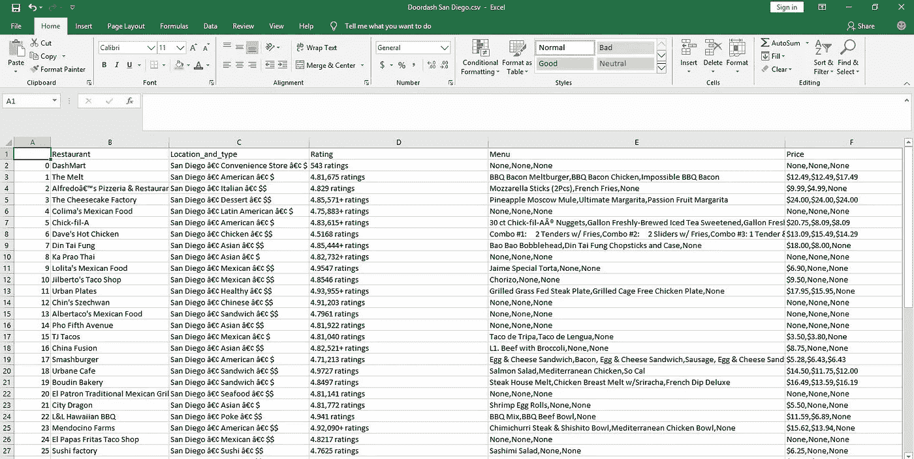

# 用 Selenium 进行 Web 抓取:为什么您的代码可以工作，但仍然返回一个空列表。

> 原文：<https://medium.com/analytics-vidhya/web-scraping-with-selenium-why-your-code-works-but-returns-an-empty-list-still-f736cbe761a2?source=collection_archive---------3----------------------->

scrapingexpert.com

在这篇文章中，我将展示我是如何从圣地亚哥网站 Doordash 的一个页面上搜集餐馆、类型、评级、受欢迎的项目和价格细节的。同时保持数据完整性，使得餐馆 A 不会以餐馆 B 的菜单或餐馆 D 的价格结束。本文陈述并解决了为什么即使代码是正确的，你的列表仍然返回空值的一些原因。这可能是因为:

1.  菜单和价格是隐藏的，直到点击一个下拉按钮。该算法需要点击这个按钮，以便收集细节，并由美丽的汤解析。
2.  与餐馆等其他参数不同，对于一个商店，每个标记有一个值，菜单和价格在一个商店的一个标记中各有两到三个值。
3.  菜单和价格的每个标签的多个值创建了嵌套列表，使得不可能使用 get_text()函数来获取这些值。

硒是万能钥匙，你想有当谈到刮网站。因为它的过程是类似人类的，所以它可以绕过大多数防火墙来阻止像美丽的汤这样的库。关于网站的事情是，它们就像人脸，它们有自己独特的特征，所以当你使用 Selenium 来抓取时，你真的需要认真对待 html/元素检查方面，否则你会陷入兔子洞，变得比疯帽子自己还疯狂。

我通过以下方式处理菜单和价格值:

1.  将它们存储在单独的列表中，而不调用 get_text()函数
2.  然后，我将每个列表转换成单独的数据帧
3.  对每个数据框中的所有列应用了一个函数，以获取带有 if 条件的文本值，从而绕过 None 值。
4.  每个数据框中的列被合并为一列
5.  两个处理后的数据帧通过索引与包含其余参数的数据帧合并。

下面是完整的代码。

洛巴丹！(翻译过来就是‘都搞定了！“在约鲁巴语中)

将最终的 df 转换成 csv 文件后，下面是我的 csv 文件截图，可以看到餐厅，类型，位置，评分，菜单和对应的价格。

Doordash csv 文件屏幕截图。

 [## GitHub-oluwatobij 4/we b-scraping-with-selenium:处理嵌套标签列表和隐藏参数…

### 使用 selenium 来 webscrape - GitHub 时处理嵌套标签列表和隐藏参数…

github.com](https://github.com/oluwatobij4/Web-scraping-with-selenium.git)