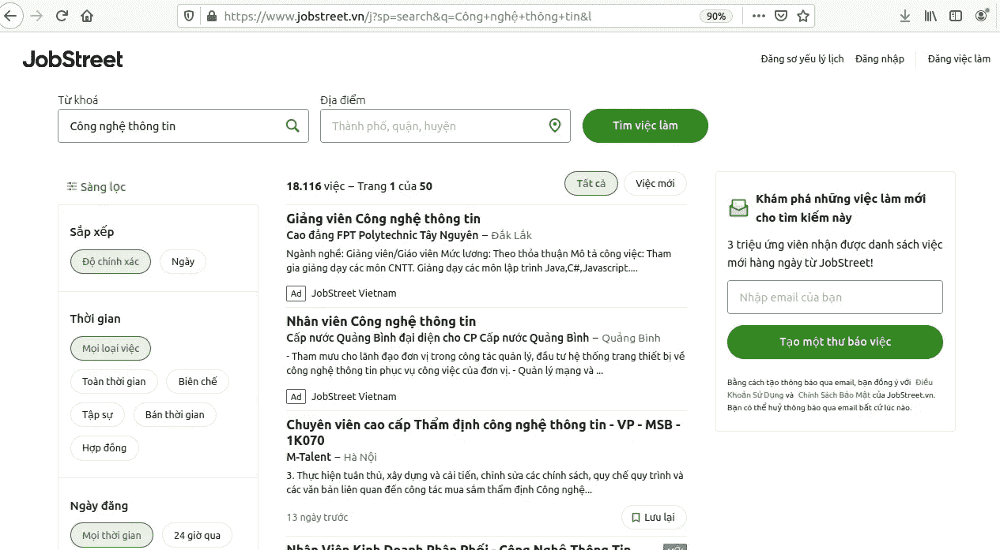
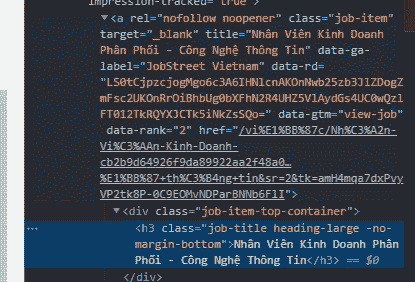

# 使用 Scrapy Python 的 Web 抓取(HTML 解析和 JSON API)

> 原文：<https://medium.com/analytics-vidhya/web-scrapping-html-parsing-and-json-api-using-python-spider-scrapy-1bc68142a49d?source=collection_archive---------2----------------------->

# **简介**

网络抓取是一种从网站提取数据的技术。很多工具都可以用来刮一个网站。现在我想解释我们如何使用 scrapy python 从网站中提取数据。
现在我们将使用来自 https://www.jobstreet.vn/j?sp=search[**的 scrapy 数据&q = C % C3 % B4ng+NGH % E1 % BB % 87+th % C3 % B4ng+tin&l**](https://www.jobstreet.vn/j?sp=search&q=C%C3%B4ng+ngh%E1%BB%87+th%C3%B4ng+tin&l)。



我们将采取每个职位的 URL，如 **Giang vien…**、**仁安 vien …** 等等。之后，我们可能需要从每个页面中提取数据。

# **要求**

1.  必须了解关于刺儿头的理论([https://docs.scrapy.org/en/latest/index.html](https://docs.scrapy.org/en/latest/index.html))。
2.  必须了解 python 编程语言(尤其是 OOP 理论)。
3.  当然，我们需要一个已经安装在你的 PC/笔记本电脑上的代码编辑器和 python。
4.  在这种情况下，浏览器是 Google Chrome，因此本文中提到的选项在 Google Chrome 上都是可用的。

# **你将学到什么**

1.  使用 spider scrapy 的网络爬行技术。
2.  基于 HTML 解析方法的抓取技术。
3.  JSON API 的抓取技术。
4.  终端芯片调试技术。

# **项目的步骤**

下面是这个项目的抓取步骤。

*   你必须先读完这篇文章，然后在技术上做练习。
*   抓取主页，并获得所有职位的网址。
*   抓取所有的网址页面。
*   抓取带有广告张贴标签的页面上的文本。
*   抓取带有非广告文章标签的页面上的文本。

主页面上的职位名称分为两类，有**广告-职位**和**非广告-职位**。嗯，广告职位是有赞助商的职位名称和他们每个人的广告标志。

这才是重点！我们可以使用 HTML 解析方法从**非广告发布**中抓取数据。但是它并不适用于 **ads-post** ，因为在这种情况下，来自 **ads-post** 的数据只能使用 JSON API 方法获得。

在这种情况下，我假设你之前已经看过或者理解过刺儿头理论[这里](https://docs.scrapy.org/en/latest/index.html)。

# **为环境做准备**

首先，我们必须创建一个项目正在处理的新文件夹。例如，我的新文件夹的名称是 **myscrapproject** 。
打开我们的终端，键入:

```
mkdir myscrapproject
```

然后键入以切换到目标目录:

```
cd myscrapproject
```

在这种情况下，我假设 python 虚拟环境已经安装在您的 PC 上。如果您的电脑上没有安装 python 虚拟环境，您可以搜索关于安装 python 虚拟环境的教程。然后创建一个新的虚拟环境。

例如，我有一个名为 **scrapy_env** 的新虚拟环境。我们可以键入:

```
python3 -m venv scrapy_env
```

然后我们必须激活虚拟:

```
source scrapy_env/bin/activate
```

所以我们可以看到虚拟已经被激活了。现在，安装 scrapy:

```
pip install scrapy
```

让我们创建一个新的 scrapy 项目来代表我们的项目。例如，我们新的 scrapy 项目的名称是 **jobstreetvn** 。

```
scrapy startproject jobstreetvn
```

然后键入:

```
cd jobstreetvn
```

而现在，目录已经使用然后最小化终端。从而打开 VSCode 或另一个代码编辑器。将文件夹 jobstreetvn 和其中的所有文件导入代码编辑器。

然后我们必须创建一个包含**的新文件。py** 扩展名在**蜘蛛**文件夹中。例如，我们的新文件是 **posts_spider.py** 。
然后在那里创建如下代码:

```
import scrapy #to import the scrapy module
import json #to import the JSON module
```

# **HTML 解析方法**

(对于详细的步骤，在这种情况下，您可以在这之后的**从 HTML** 部分中看到。向下滚动。)
既然我们选择获取每个职位的链接的步骤是获取 URL，那么我们就必须获取主页面上每个职位的 HTML 代码。

我们可以通过在主页面上点击右键来检查元素，然后在 Google Chrome 上选择 inspect 元素(或者按 Ctrl+Shift+I)。我们已经看到了主页上所有数据的 HTML 代码。

在这种情况下，我们必须通过从页面中选取元素来获取每个职位的 HTML 代码。
让我们点击:


然后在那里选择一个职位名称(这一步我们必须点击带有**非广告职位**标签的名称)，然后点击如下:


在 inspect 元素端，我们将得到 HTML 代码。之后，我们必须为那里的每个职称选择父母元素代码。此外，我们可以检查表示父元素代码的类。

现在我们得到了名为 **job-item** 的类，带有一个 **<和一个>** 元素。在 scrapy 脚本的一个规则中，我们必须键入使用的类，例如 **a.job-item** ，它代表所有带有**非广告发布**标签的职位。

只是提醒一下，对于详细的步骤，在这种情况下，你可以在这之后的**从 HTML** 获取文本部分看到。
所以，代码是:


现在，打开终端(停留在 jobstreetvn 目录)。让我们按类型检查代码的结果:

```
scrapy crawl posts -o mainpage.json
```


现在，我们可以在代码编辑器中检查结果。在代码编辑器中打开文件夹，搜索名为 **mainpage.json** 的文件。
让我们看看！嘣！


我们可以在那里看到 10 个网址和职位。但是等等。为什么只抓取了 10 个网址？而主页上有 15 个职位。是的，因为只有 10 个职位带有**非广告职位**标签，5 个职位带有广告职位。

因此， **post_spider.py** 中的代码现在只能使用**非广告帖子**获取职位的 URL。其他的呢(T9 广告贴 T10 标签)？

# **JSON API**

在这种情况下，我们可以通过 JSON API 解析获得带有广告发布标签的职位的 URL。

(对于这部分，我就不做详细描述/解释了。如果有任何问题，请发邮件至 ma.arryanda@gmail.com。

现在，为了获得主页面中广告张贴标签的 URL，我们必须拥有名为[**https://jupiter.jora.com/api/v1/jobs?的 URL 链接关键词= C % C3 % B4ng % 20 NGH % E1 % BB % 87% 20% C3 % B4ng % 20 tin&page _ num = { page _ number }&session _ id = 1 f 4498 b 9 C 6 F2 ebda 3c D5 dcdf 8 ef 6 b 15 f&search _ id = 3 yakpixvhshokfunnesz-1 f 4498 b 9 C 6 F2 ebda 3c D5 dcdf 8 ef 6b 15 f-x86 gxly 3 tulx 42 PSU 59 a&**](https://jupiter.jora.com/api/v1/jobs?keywords=C%C3%B4ng%20ngh%E1%BB%87%20th%C3%B4ng%20tin&page_num={page_number}&session_id=1f4498b9c6f2ebda3cd5dcdf8ef6b15f&search_id=3yAkpixVHSHokFUnNESz-1f4498b9c6f2ebda3cd5dcdf8ef6b15f-X86gxLy3TuLx42PSU59a&session_type=web&user_id=3yAkpixVHSHokFUnNESz&logged_user=false&mobile=false&site_id=1&country=VN&host=https://jupiter.jora.com&full_text_only_search=true&ads_per_page=5&callback=_jsonp_0)

因此，我们可以通过实际检查元素(在主页上，右键单击并选择 inspect 选项)来获得广告帖子的 URL。在 inspect element 端，选择 network 选项卡，并重新加载/刷新页面。然后选择 API 链接(jobs？关键词=……..)如下图:


并复制链接地址(右键单击->复制链接地址)并将其粘贴到窗口的选项卡上。我们来看下图:


上图是关于所有广告的字典。如果我们检查 URL，我们可以看到关于代表页码的网站的 **page_number** 。而每页的广告张贴数量是五个。

# 从 HTML 获取文本

在这一节中，我们将学习如何从每个废弃的页面中获取文本，我将只解释一种情况。例如，现在我们尝试如何在主页上获得 URL 的 CSS 响应。如果我们检查报废的代码，那么我们可以看到 URL 的 CSS 响应是**(“。job-item ::attr(href)")** 。那么如何获得呢？

我们去[https://www.jobstreet.vn/j?sp=search&q = C % C3 % B4ng+NGH % E1 % BB % 87+th % C3 % B4ng+tin&l。然后右键单击并选择 inspect 选项，按 Ctrl+Shift+C 选择页面上的一个元素。](https://www.jobstreet.vn/j?sp=search&q=C%C3%B4ng+ngh%E1%BB%87+th%C3%B4ng+tin&l)

之后，我们点击其中一个职位。(记住！这个步骤只适用于非广告文章，不适用于广告文章。)

然后，我们可以点击没有广告标签的职位。例如，让我们点击名为**韩尹渭渭健的职位…..**如下图:


现在我们可以看到，职位已经被点击，有一个 HTML 元素，即 h3.job-title.heading-large。-无边界底部在那里。然后检查元素侧边栏，并对下图进行同样的操作:



上图向我们解释了如何通过查找所需的父元素来获取职位的元素。

例如，**韩尹渭渭剑指…..**有元素，即 **h3.job-title.heading-large。-无边距底部**与上图相同。这意味着我们只能在名为**韩尹渭渭健的职位中获得一个职位的元素…..**。但是等等，不要忘了有非广告职位标签的职位数量。

主页上有 10 个职位。因此，我们必须找出父元素，因为我们已经得到了职称的子元素。现在，让我们检查上面的图像。

正如我们所知，具有名为**job-title heading-large-no-margin-bottom**的类的 h3 元素是 div 元素的子元素，div 元素具有名为 **job-item-top-container** 的类。同时，具有名为 **job-item-top-container** 的类的 div 元素是一个仅表示一个职位及其相关信息的元素。

因此，我们必须寻找一个元素，它的类名代表所有非广告文章的职位。

如果我们向上滚动到图片的顶部，会出现一个元素，它有一个名为 **job-item** 的类。似乎我们已经找到了所需的母公司元素，它代表了所有职位的要求。

现在，我们有了作为 CSS 响应的类名，用于获取所有带有非广告文章标签的工作标题的 URL(它有 10 个 URL)。

因为我们知道获取 CSS 响应文本的步骤是通过在最后一个命令中为每个 CSS 响应添加**……text**，现在我们必须在最后一个命令中添加**……attr(href)**来获取 CSS 响应的 URL。

# 获取下一页分页 HTML 的 URL

本节解释了我们如何通过查看 CSS 响应的必需元素来获取下一个页面 URL。无论如何，第一步与前一节中获取文本的步骤没有什么不同。我们必须从每个页面中寻找一个表示下一页分页的元素。

例如，我们必须只在第一页尝试。下图解释了下一页分页的元素:


下一页的标记在下面(它位于底部页面区域):


根据图片，现在我们知道下一页分页有一个名为**下一页按钮**的元素类。所以，代码是:

```
next_page = response.css("a.next-page-button::attr(href)").get()
```

# **如何在终端中进行刺儿式调试？**

此外，我们必须采用该技术来获取我们必须拥有的项目的 CSS 响应。例如，我们在这里取了许多情况中的一个来调试它。

现在，作为试验，我们将从下一页分页**得到 CSS 响应**，因为上一节已经解释过了。

因此，打开终端，如下图所示:


那么我们必须键入:

```
scrapy shell "[https://www.jobstreet.vn/j?sp=search&q=C%C3%B4ng+ngh%E1%BB%87+th%C3%B4ng+tin&l](https://www.jobstreet.vn/j?sp=search&q=C%C3%B4ng+ngh%E1%BB%87+th%C3%B4ng+tin&l)"
```

如果成功，会出现如下图所示的情况:


然后，我们必须键入 CSS 响应代码，如下所示:

```
response.css("a.next-page-button::attr(href)").get()
```

如果成功，我们将具备如下条件:


恭喜你！！！我们得到了诀窍。所以我们必须为这个项目中需要的所有变量或项目做同样的技巧。

# **结论**

由于我们已经在第一页上获得了所有的 URL，这意味着我们也可以从所有页面上获得所有的 URL。因此，抓取所有页面的代码如下:

```
import scrapy
import jsonclass PostsSpider(scrapy.Spider):
    name = "posts"start_urls = {
        "[https://www.jobstreet.vn/j?sp=search&q=C%C3%B4ng+ngh%E1%BB%87+th%C3%B4ng+tin&l](https://www.jobstreet.vn/j?sp=search&q=C%C3%B4ng+ngh%E1%BB%87+th%C3%B4ng+tin&l)"
    }

    #NON ADS
    def parse_item(self, response):
        item = {}
        company_name1 = response.css("#company-location-container > span.company::text").get()
        company_name2 = response.xpath("//*[[@id](http://twitter.com/id)='job-description-container']/div/div/p[17]/b/text()").get()
        company_name3 = response.css("#job-description-container > div > div > strong ::text").get()
        company_ads = response.css(".job-title::text").get()
        if company_name1:
            #no ads
            #top
            item["type"] = "no ads",
            item["jobtitle"] = response.css("h3.job-title.heading-xxlarge ::text").get(),
            item["company_name"] = company_name1,
            item["location"] = response.css("#company-location-container > span.location ::text").get(),
            item["site"] = response.css("#job-meta > span.site ::text").get(),
            #desc
            item["desc"] = ''.join(response.css("#job-description-container ::text").getall()),
        elif company_name2:#company in bottom
            #no ads
            #top
            item["type"] = "no ads, company name at the bottom side",
            item["jobtitle"] = response.css("h3.job-title.heading-xxlarge ::text").get(),
            item["company_name"] = response.xpath("//*[[@id](http://twitter.com/id)='job-description-container']/div/div/p[17]/b/text()").get(),
            item["location"] = response.css("div #company-location-container > span.location ::text").get(),
            item["site"] = response.css("div #job-meta > span.site ::text").get(),
            #desc
            item["desc"] = ''.join(response.css("#job-description-container ::text").getall())
        else: #no description
            item["type"] = "no ads, no desc",
            item["jobtitle"] = response.css("h3.job-title.heading-xxlarge ::text").get(),
            item["company_name"] = company_name3
            item["location"] = response.css("#company-location-container > span.location ::text").get(),
            item["site"] = response.css("#job-meta > span.site ::text").get(),
            item["desc"] = "no desc"
        return item 

    #ADS
    def parse_item_ads(self, response):
        item={}
        company_ads = response.css(".job-title::text").get()
        if company_ads:
            item["type"] = "ads"
            item["jobtitle"] = response.css(".job-title::text").get()
            item["company_name"] = company_ads
            item["location"] = response.css(".location::text").get()
            item["site"] = response.css(".site::text").get()
            item["desc"] = ''.join(response.css("#job-description-container ::text").getall())
        return itemdef parse_item_json(self, response):
        text_clean = response.text.replace("/**/_jsonp_0(", "")
        text_clean = text_clean.replace(")", "")
        result_json = json.loads(text_clean)
        for data in result_json['ads']:
            url = data['url']
            yield scrapy.Request(url = url, callback = self.parse_item_ads)

    def parse(self, response):
        page_number = 1
        for post in response.css('a.job-item'):
            data = {
                #total = 15, ads = 5, non ads = 10
                #non ads
                "url" : post.css(".job-item ::attr(href)").get()
            }
            linkads = f"[https://jupiter.jora.com/api/v1/jobs?keywords=C%C3%B4ng%20ngh%E1%BB%87%20th%C3%B4ng%20tin&page_num={page_number}&session_id=1f4498b9c6f2ebda3cd5dcdf8ef6b15f&search_id=3yAkpixVHSHokFUnNESz-1f4498b9c6f2ebda3cd5dcdf8ef6b15f-X86gxLy3TuLx42PSU59a&session_type=web&user_id=3yAkpixVHSHokFUnNESz&logged_user=false&mobile=false&site_id=1&country=VN&host=https://jupiter.jora.com&full_text_only_search=true&ads_per_page=5&callback=_jsonp_0](https://jupiter.jora.com/api/v1/jobs?keywords=C%C3%B4ng%20ngh%E1%BB%87%20th%C3%B4ng%20tin&page_num={page_number}&session_id=1f4498b9c6f2ebda3cd5dcdf8ef6b15f&search_id=3yAkpixVHSHokFUnNESz-1f4498b9c6f2ebda3cd5dcdf8ef6b15f-X86gxLy3TuLx42PSU59a&session_type=web&user_id=3yAkpixVHSHokFUnNESz&logged_user=false&mobile=false&site_id=1&country=VN&host=https://jupiter.jora.com&full_text_only_search=true&ads_per_page=5&callback=_jsonp_0)"
            link = "[https://www.jobstreet.vn/](https://www.jobstreet.vn/)" + data.get("url")
            page_number +=1
            if link is not None:
                yield scrapy.Request(url = link, callback = self.parse_item)
            yield scrapy.Request(url = linkads, callback = self.parse_item_json)next_page = response.css("a.next-page-button::attr(href)").get()
        if next_page is not None:
            next_page = response.urljoin(next_page)
        yield scrapy.Request(next_page, callback=self.parse)
```

不要忘记如何获得每个条目的 CSS 响应的步骤。我们可以通过检查 inspect 元素并检查所需文本的 HTML 代码来获得它。然后我们必须在终端中调试它们。

(对于这部分，我就不做详细描述/解释了。如果有任何问题，你可以发电子邮件到 ma.arryanda@gmail.com 找我)

编码快乐！