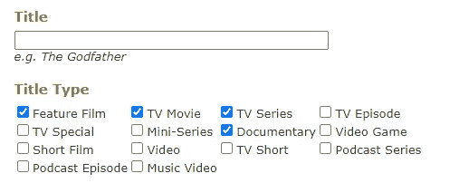
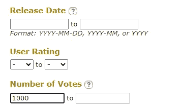
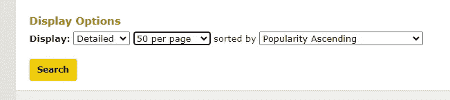
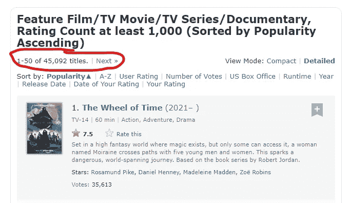
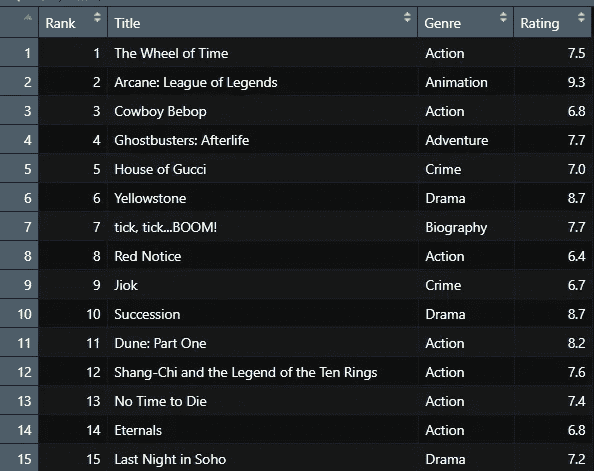

# 网页报废 IMDb 使用 R

> 原文：<https://medium.com/analytics-vidhya/web-scrapping-imdb-using-r-e00016a627ce?source=collection_archive---------2----------------------->

## 我讨厌静态数据！

在这篇博客中，我们将学习如何使用 r 从 IMDb 收集数据。最好是专注于如何编写 URL 逻辑和如何处理多页，我将提取标题，IMDB 评级和流派。

# 构建 URL

第一步:访问网站—[https://www.imdb.com/search/title/](https://www.imdb.com/search/title/)

第二步:根据你的需求选择你要搜索的东西。

我选择了以下内容:

选择标题类型

最低 1000 票

点击搜索

第三步:点击搜索按钮后，记下你找到了多少本书。—在我的例子中，我有 45092 个标题。

第四步:复制你的网址。

我的网址是

【https://www.imdb.com/search/title/? title_type=feature，tv_movie，tv_series，纪录片& num_votes=1000 ，

当我们进入下一页时，仔细观察 URL 会发生什么变化。

 [## 故事片/电视电影/电视剧/纪录片(按人气升序排列)- IMDb

### 动画，动作，冒险|后期制作当正义联盟被超人的狗莱克斯·卢瑟抓住…

www.imdb.com](https://www.imdb.com/search/title/?title_type=feature,tv_movie,tv_series,documentary&num_votes=1000,&start=51&ref_=adv_nxt) 

所以逻辑是我们必须写一个逻辑来迭代基于这个粗体数字的页面-> "，& start =**51**&ref _ = adv _ NXT "

# 让我们编码

步骤 1:安装并加载包 rvest 和 xml2

步骤 2:生成页面列表

你会看到我们的 scrapper 将要访问的页面。

步骤 3:遍历所有页面，提取数据。

运行代码后，我们的数据框将如下所示。

注意:要理解内部抓取逻辑是如何编写的，请参考参考资料中这篇精彩的文章。

我们在这个博客中的重点是使用 URL 操作抓取多个页面。

# 结论

我们已经从网站上提取了标题、IMDB 评分和类型。这段代码需要一段时间来运行。我希望你喜欢它。会很乐意和你联系。

你可以通过 [LinkedIn](https://www.linkedin.com/in/prakshaal-jain/) 或[电子邮件](mailto:prakshaaljain27@gmail.com)联系我

参考资料:

 [## 使用 RStudio 进行 IMDb 刮擦和可视化

### 你好，未来数据科学家！^^It's，回来真好！

medium.com](/@shaulaandreinnaa/imdb-scraping-and-visualization-with-rstudio-4fc8d386585c)