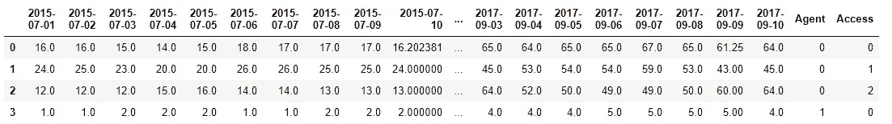
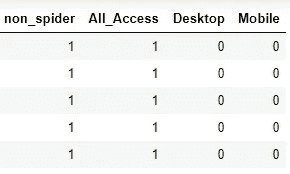

# 网络流量时间序列预测—预测维基百科页面的未来流量

> 原文：<https://medium.com/analytics-vidhya/web-traffic-time-series-forecasting-forecast-future-traffic-for-wikipedia-pages-92c06454dd7?source=collection_archive---------12----------------------->

## 我的第一个媒体博客。希望你们都喜欢阅读它。


封面

这个问题是我几天前解决的 2017 年 Kaggle 比赛的一部分。

因此，在这篇博客中，我将向你介绍我的解决方案。

# 目录

*   **业务问题**
*   **数据概述**
*   **将现实世界问题映射到最大似然问题**
*   **现有解决方案和相关研究论文**
*   **第一次切割方法**
*   **探索性数据分析**
*   **功能开发**
*   **数据处理**
*   **模型开发**
*   **结果比较**
*   **预测**
*   **部署视频**
*   **未来作品**
*   **参考文献**

# **商业问题**

## 说明

**网络流量**是网站访问者发送和接收的数据量。这通常是由页面上的访问者数量决定的。网站监控传入和传出的流量，以查看其网站的页面是否受欢迎，以及是否有任何明显的趋势，例如某个特定页面在某个特定国家/地区被大多数人查看。如今，网络流量预测是一个主要问题，因为这可能会导致主要网站的工作受挫。

大多数人可能都遇到过当有很多人在使用一个网站时，这个网站崩溃或者加载速度非常慢的情况。这极大地影响了用户体验，他们可能会给这个网站留下不好的评价。因此，网站所有者最好制定一个交通管理计划来处理繁忙的交通。这就是需要预测的地方。

## 目标

*   通过建立模式来识别现象的性质
*   预测未来价值。
*   没有低延迟要求，但不应花费数天时间。

# 数据概述

数据来源:[https://www . ka ggle . com/c/we B- traffic-time-series-forecasting/data](https://www.kaggle.com/c/web-traffic-time-series-forecasting/data)

您只需从上述链接下载即可获得数据。

总共有 6 个数据文件。


来自 Kaggle 的数据

*   train_* —包含页面列和特定日期范围的页面命中率值的训练数据。
*   key_* —密钥文件包含每页的短代码。
*   Sample_submission _* —提交格式这个问题是 Kaggle 竞赛的一部分。

比赛分为两个阶段。第一阶段的数据从 2015 年 7 月 1 日到 2016 年 12 月 31 日。第二阶段的训练数据截止到 2017 年 9 月 1 日。train_*页面有列，其余是与阶段相对应的日期。页面列包含页面名称，日期列包含该日期的页面命中率值。

# 将现实世界问题映射到最大似然问题

这是一个时间序列预测问题，我将从过去的日期预测未来日期的页面点击量。因为我预测的是数值，所以这是一个回归型预测建模问题。

像 **LSTM** 和 **CNN** 这样的深度学习方法被用来为这个问题建模。使用的性能指标是 **SMAPE** 。

# 现有解决方案和相关研究论文

## 卡格尔解决方案

**先解**

[*链接为*](https://www.kaggle.com/screech/ensemble-of-arima-and-lstm-model-for-wiki-pages)

这个 Kaggle 解决方案是以下内核的扩展。

[*现有内核*](https://www.kaggle.com/muonneutrino/wikipedia-traffic-data-exploration)


来自 Kaggle 的解决方案截图

**概要:**

*   将列车数据加载并读取到 train_df 中
*   探索性数据分析
*   每种语言的平均浏览量。
*   从页面名称中提取每个页面的语言。创建字典 lang_sets 来存储对应于作为关键字的每种语言的训练数据。
*   然后，对应于每种语言的每个日期的平均浏览量值存储在名为 sum 的字典中。
*   绘制每种语言的总值。
*   从这个情节中，我了解到英语的平均浏览量很高。
*   为每种语言绘制了 ACF 和 PACF。
*   从 ACF 图中，我们发现大多数语言都有一个周趋势。根据 PACF 图，根据置信区间之外的滞后计算 AR 值。
*   建模—准备了两个模型— ARIMA 和 LSTM
*   ARIMA——每种语言的模型都是根据 ACF 和 PACF 图中的 p，d，q 值建立的。模型根据存储在 sums 字典中的每种语言的平均值进行定型。提到了来自该模型的预测将被用作集合模型的输入。
*   使用具有 8 个神经元的一层的 LSTM-香草 LSTM。
*   使用的优化器是 RMSProp，损失度量是 MSE。
*   第一个 549 天的值用于预测下一个 549 天的值。例如，2015 年 7 月 1 日至 2016 年 12 月 30 日的数据用于预测 2015 年 7 月 2 日至 2016 年 12 月 31 日的值。

**第二种解决方案**

[](https://github.com/Arturus/kaggle-web-traffic/blob/master/how_it_works.md) [## arturus/ka ggle-web-交通

### TL；DR 这是 seq2seq 模型，增加了一些内容，以利用数据中的年度间和季度间季节性…

github.com](https://github.com/Arturus/kaggle-web-traffic/blob/master/how_it_works.md) 

这是本次比赛的第一名。我刚刚浏览了本文档的特征工程和特征处理部分。生成的特征是来自页面名称的国家、代理和站点名称。此外，还会生成年度间和季度间的自相关值。另一个称为页面流行度的特征是作为每个页面的页面浏览量的中间值而生成的。页面视图值被转换为 log1p 值。国家、代理和站点名称是一次性编码的。所有特征都被归一化。每个页面的浏览量值都是单独标准化的。

## 研究论文和视频

**论文名称:利用 ARIMA 和 LSTM RNN 进行网络流量时间序列预测**

[论文链接](https://www.itm-conferences.org/articles/itmconf/pdf/2020/02/itmconf_icacc2020_03017.pdf)

本文结合 ARIMA 和 LSTM 发展了一种新的预测方法。本文中讨论的方法步骤如下:


*   将时间序列数据加载到输入向量中。
*   通过应用单级离散小波变换将向量分解成两部分。这种分解提供了两种数据成分，一种是近似(A)成分，另一种是详细(D)成分。
*   ARIMA 模型应用于详细部分，LSTM 模型应用于近似部分，以获得两个独立的预测。
*   然后，使用逆 DWT 将这两个预测组合在一起，以得到最终预测。

**小波变换视频**

我只是想对小波变换有一个想法，所以我看了下面的视频。

这是一个解释小波和小波变换的视频。小波让我们对给定时间间隔内的频率大小有一个概念。在小波变换的情况下，信号被分解成一组相互正交的小波基函数。有一个母小波ψ(t)。较小的小波是从母小波中导出的

ψ (t) 1/ ((t )/a) a，b =(√a)*ψb

其中 a 是刻度，b 是位置。

# 首次切割方法

在这一节中，我将讨论我计划用来解决这个问题的最初方法。

首先，我想找到所有页面上每个日期的平均浏览量。这些平均浏览量值将用于 EDA，而不是所有页面的绘图。

**EDA**

*   绘制平均浏览量与工作日的关系图，以了解浏览量随工作日的变化情况。如果不同的工作日有一个模式，那么它将被用作一个特征。
*   绘制平均浏览量与天数的关系图，根据工作日和周末进行着色，以了解周末的流量是否比工作日高，反之亦然。如果有区别，那么周末也将包括在内。
*   绘制平均浏览量与月份的关系图，了解浏览量随月份的变化。同样，如果有任何模式，它将被添加为一个功能。
*   找到每一页的语言，并将语言的分布绘制成直方图。
*   找到每个页面的代理，并将代理类型的分布绘制成直方图。
*   找出每个页面的访问类型，并将访问类型的分布绘制成直方图。
*   绘制平均浏览量与代理商以及平均浏览量与访问量的关系图，看看是否存在某种模式。如果有一个模式，它们将作为特性包含在内。
*   找到每个页面的浏览量百分比，并绘制每种语言的平均浏览量百分比直方图。
*   根据浏览百分比绘制前 5 页的 acf 图。获取 LSTM 的时间步长值。

**功能开发**

*   根据 EDA，将决定特性，只有那些显示某种模式的特性才会被包括在内。
*   目标功能将是日期的浏览量值。
*   所有的特征都将被标准化。

**模型开发**

**LSTM 车型**

*   双向 LSTM 模型将用于捕捉过去和未来的趋势。
*   我想使用时间步长为 7，因为我在参考内核中看到，有一个周趋势。
*   我想在一个具有高查看百分比的页面上训练模型。
*   训练数据将有前 70%的日期，白色测试数据将有接下来的 30%的日期。
*   我想用 SMAPE 作为评价的衡量标准。

经过几次实验，我找到了最终的解决方案，我将在下面的部分详细讨论。

# 探索性数据分析

## 了解数据集

在我开始解释 EDA 之前，让我给你一个数据集的概念。


问题的数据集

这里我们可以看到，我们有栏页和几个日期。因此，对于每一个维基页面，页面点击值都是在给定日期记录的。你也可以看到一些值是 **NAN。很有可能那些页面在那一天并不存在。**

**我用向前线性插值填补了缺失的值。这将确保某个实数值之前的所有 NAN 值将被填充为 0，而剩余的 NAN 值将使用线性插值来填充。**

现在我有两个数据集，一个是原始值，另一个是估算值。


页面名称

如果您仔细观察页面名称，您会看到它包含编写页面的语言、访问类型和代理类型。所以从每一页我们都可以很容易地得到这些特征。

我还找到了每个页面的活跃天数和

**浏览量百分比=一个页面的总浏览量/该页面的活跃天数**

## 形象化

为了可视化数据，我根据日期生成了以下特征:

```
from datetime import datetime
date_list=[]
for i in train.columns[1:]:
    date_list.append(datetime.strptime(i, '%Y-%m-%d'))weekday=[]
for i in date_list:
    weekday.append(i.weekday())
weekday=pd.Series(weekday)
weekend=[]
for i in weekday:
    if i in range(5):
        weekend.append(0)
    else:
        weekend.append(1)
weekend=pd.Series(weekend)
month=[]
for i in date_list:
    month.append(i.month)
month=pd.Series(month)month_start=[]
month_start=pd.Series(date_list).dt.is_month_startmonth_end=[]
month_end=pd.Series(date_list).dt.is_month_endquarter_start=[]
quarter_start=pd.Series(date_list).dt.is_quarter_startquarter_end=[]
quarter_end=pd.Series(date_list).dt.is_quarter_endweek=[]
week=pd.Series(date_list).dt.weekquarter=[]
quarter=pd.Series(date_list).dt.quarterdays_in_month=[]
days_in_month =pd.Series(date_list).dt.days_in_monthyear=[]
year=pd.Series(date_list).dt.year
```

*   工作日
*   周末
*   月
*   月 _ 开始
*   月末
*   季度开始
*   季度末
*   四分之一
*   周
*   一个月中的天数
*   年

## **单变量分析**

我已经根据查看百分比绘制了前 15 页的原始数据和估算数据的页面点击量与上述创建的特征。

**页面点击量对比工作日**


一个页面的页面点击量与工作日

*   该图显示，在周日或周一，平均浏览量会增加。
*   每个工作日都有不同。
*   在大多数情况下，从周一到周六，页面点击量逐渐下降，然后在周日上升，并持续到周一。
*   因此，我将把这个工作日作为一个特征，还包括另一个特征，即周日或周一，因为它们的平均值似乎比其他日子高。

**点击量对比周末**


一个页面的点击量与周末

*   工作日和周末的箱线图差别不大。
*   IQR 大致相同，在某些情况下，周末的中位数更高。
*   但是周末的天数较少，所以 IQR 和中位数应该小于工作日。
*   这表明与工作日相比，周末的交通流量更高

**页面点击量与月份**


页面点击量与页面月份

*   每个月的箱线图彼此有些不同。
*   IQR 要小得多，上半年的几个月要小得多，下半年则相当高。
*   在某些情况下，八月份的 IQR 要高得多
*   所以月数和半年可以作为一个特征。

**页面点击量对比周**也显示了与上述图类似的趋势。

**页面点击量对比月初**


页面点击量与页面月初

*   很少有几天落在一个月的第一天，但是我们看到箱线图的均值和 IQR 在一个月的开始日和其他日子都大致相同。
*   这表明，与其他日期相比，月初的流量相当高。
*   所以把这个作为一个特性包含进来是很重要的。

**页面点击量对比月终**


每页的页面点击量与月末

*   我在 month_start 特性中看到了类似的趋势
*   月末日期的箱线图实际上具有更高的 IQR 和与其他日期相似的中值
*   这告诉我们，与其他日子相比，连接这几个月的日子具有显著更高的流量。

因为 quarter_start 和 quarter_end 是 month_start 和 month_end 的一部分，所以页面点击与 quarter_start 和页面点击与 quarter_end 具有类似的特征，如 month_start 和 month_end 特征。

**页面点击量与月内天数的对比**


页面点击量与页面的月天数

*   在某些情况下，与其他月份相比，二月份的页面点击量要高得多。
*   有更多的月份有 30 天和 31 天。
*   然而，二月的平均值比其他月份高得多

**页面点击量与年份**


页面点击量与页面年份

*   在大多数情况下，页面点击量在 2015 年有所增加，而在随后几年有所下降
*   同样，从 2015 年开始出现下降趋势，并持续到接下来的几年
*   因此，我们可以得出结论，随着年份的增加，页面点击值在大多数情况下会下降，这使得年份成为一个重要的特征。

**页面点击量对比季度**


页面点击量与页面的四分之一

*   对于不同的季度，页面点击量是不同的。
*   这与 quarter_start 和 quarter_end 功能一起可以给我准确的流量概念。

## 双变量分析

现在是双变量分析，我将在单个图中找到页面点击量和多个特征之间的关系。

**工作日、月份和点击量之间的关系**


月份和工作日与页面的点击率

*   这张图显示了每月几天的交通变化。
*   由此我了解到上半年 IQR 的流量值较少。
*   IQR 逐渐增加，直到年中。
*   然后它再次下降，直到年底
*   上半年和下半年也有所不同。
*   因此，我可以创建一个 year_half 特性，上半年和下半年的值分别为 1 或 2。
*   我还将创建另一个特性 is_august，因为对于大多数页面来说，八月的 IQR 最高。

**周、年和点击量的关系**


周和年与页面点击量

*   观察到在大多数情况下，2015 年的周具有更高的页面点击值。
*   此外，在接下来的几年中，页面点击量有持续下降的趋势。

从上面的情节，我希望包括以下培训功能。分别是**工作日、周日或周一、月、八月、半年、季度、月、季度开始、季度结束、月开始、月结束、月中日、周。**

现在来看一下页面名称的可视化特征，如语言、访问类型和代理类型。在接下来的部分，我将描绘出前 15 页的页面特征。

**语言情节**


前 15 页中每种语言的图表。

*   我们看到，只有对于 en 语言，页面点击率值相当高。
*   其余的情节彼此相似。

**访问图**


每种访问类型的页面点击量

*   对于访问类型 1，页面命中值的峰值为 20000。大多在 10000 以内。
*   对于访问类型 0，页面点击值有多个超过 10000 的峰值。
*   访问类型 2 达到大约 110000 的峰值，尽管它的大部分范围在 5000 以内。
*   页面命中率值因访问类型而异。

**代理图**


前 15 页的代理图

正如我们所看到的，没有代理类型为 1 的页面。这表明所有具有高页面命中率值的页面都具有代理类型 0。

所以我决定在最后 15 页也画代理人的情节。


最后 15 页的代理图

这里我们看到没有代理 0 图，因为所有查看百分比低的页面都有代理类型 1。

从上面的页面特性图中，我得出结论，我将在特性集中包含**代理和访问类型**。

## 自相关图

自相关图是时间序列滞后值之间线性关系的图形表示。我绘制了前 15 页的自相关图。

在这里，我将展示前 15 页中不同语言的图表。


自相关图

如果你仔细观察，你会发现对于所有的语言，相关性以 7 为间隔增加。

因此，我们可以得出结论，我们的数据有一个**周趋势。**

这就是这个问题的全部 EDA 解决方案。现在我们将继续进行**功能开发。**

# 功能开发

我开发了两种类型的特性集。一个对所有页面通用的功能，也称为**全局功能。**另一个功能集是基于页面创建的，因此也被称为**页面特定功能。**

## 全局功能集

该特征集是基于必须预测页面点击的日期范围而生成的。它包含以下功能:

**工作日，是星期天还是星期一，月，是八月，半年，季度，月，季度开始，季度结束，月开始，月结束，月中的日子和星期**


全局功能集

## 特定于页面的功能集

为此，我计划为每个访问和代理类型的组合创建一个数据集。但我想说得更详细些。所以我把它分成两部分。

*   **第 75 百分位组:**为此，我计算了每个代理和访问类型的页面点击量的第 75 百分位值。


每个代理和访问类型的页面点击量的第 75 百分位值

*   **第 25 百分位组:**为此，我计算了每个代理和访问类型的页面点击的第 25 百分位值。



每个代理和访问类型的页面点击量的第 25 个百分位数

这些页面点击值将作为目标值。代理和访问类型将与全局功能组合在一起。**总共将创建 8 个数据集——4 个用于第 75 百分位，4 个用于第 25 百分位**。

让我带你详细了解其中一个:

此数据集用于访问和代理类型 0


访问类型 0 和代理类型 0 的页面特定功能

现在，全局功能集和页面特定功能集将结合在一起，形成以下总功能集。



集合 1 的总功能


目标值

这些是集合 1 的目标值。

因此总共生成了 8 个特征集。每个特征集将用于训练模型。

现在我们的特征已经生成，让我们继续数据处理。

# 数据处理

首先，我将特征集分为训练和测试数据，其中前 70%的数据用于训练，其余 30 %用于测试。我在分割时没有打乱数据，因为它本质上是时间性的。

正如我们在上面看到的，我们的特征集既有数值也有分类值，所以需要将这些分类值编码成数值。

## 分类值编码

为此，我使用了标签编码器。标签编码是一种简单的方法，我们将每个类别转换成一个数字。

```
from sklearn.preprocessing import LabelEncoder
le1=LabelEncoder()
X_train['month_start']=le1.fit_transform(X_train['month_start'])
X_test['month_start']=le1.transform(X_test['month_start'])le2=LabelEncoder()
X_train['month_end']=le2.fit_transform(X_train['month_end'])
X_test['month_end']=le2.transform(X_test['month_end'])le3=LabelEncoder()
X_train['quarter_start']=le3.fit_transform(X_train['quarter_start'])
X_test['quarter_start']=le3.transform(X_test['quarter_start'])le4=LabelEncoder()
X_train['quarter_end']=le4.fit_transform(X_train['quarter_end'])
X_test['quarter_end']=le4.transform(X_test['quarter_end'])
```

## 数据的对数变换

我已经使用 log(1+x)函数转换了数据，以处理 0 值。

```
X_train=np.log1p(X_train)
X_test=np.log1p(X_test)
y_train=np.log1p(y_train)
```

## 时间步长创建

正如我们在自相关图中看到的，几乎所有页面都有每周的页面点击量相关性，我们需要将这种滞后特征纳入我们的数据集中。为此，我用时间步来重塑我的数据。

时间步长是我在预测输出时应该考虑的内存量。

例如:我们在上面的图中观察到相关性为 7。所以我需要考虑过去 7 天的数据来预测输出。在这里，时间步长开始发挥作用。我已经将我的数据重新整理为**【n _ 样本，特征，时间步长】**

其中 n_sample 是数据的长度，features 是要素的总数，timestep 是滞后值 7。

```
def create_dataset(X,y,timestep=1):
    Xs,ys=[],[]
    for i in range(len(X)-timestep):
        v=X[i:i+timestep]
        Xs.append(v)
        ys.append(y[i+timestep])
    return np.array(Xs),np.array(ys)
train_x,train_y=create_dataset(X_train.values,y_train.values,7)
test_x,test_y=create_dataset(X_test.values,y_test.values,7)
```

这样我的整个数据处理就完成了。现在我们将转向建模。

# 模型开发

## 基线模型

这就是这个问题的均值模型或者基本模型。这里，训练数据的页面点击的平均值被用作预测值。

```
mean_forcast = np.mean(eda_train_imp.iloc[:,1:train.shape[1]].values.flatten())
y_pred=[[mean_forcast]]*X_test.shape[0]
```

基线模型的 Kaggle 得分为 141.17。


Kaggle 分数

我们的目标是得到一个比基线模型得分更高的模型。

## LSTM 模型

LSTM 是一种 RNN，旨在处理长期依赖。在这里，我们已经看到，点击率是自相关的间隔为 7。所以考虑到依赖性，我用了 LSTM。

特定一天的页面点击值既受过去几天的影响，也受未来几天的影响。为了解决这个问题，我使用了**双向 LSTMs。**

我开发了两种类型的 LSTM 模型:

*   **辍学者堆积的 LSTM**

我开发了 2-3 个双向 LSTM 层，每个功能集都有遗漏。因此总共有 8 个模型，每个模型被训练到 100 个时期。下面是模型的代码片段。

```
from keras import Sequential
import keras
from keras.layers import LSTM
from keras.layers import Dropout
from keras.layers import Bidirectional
from keras.layers import Dense
from keras.optimizers import Adam
model1=Sequential()
model1.add(Bidirectional(
            LSTM(units=256,
                 activation='relu',
                 input_shape=(train_x.shape[0],train_x.shape[1],),
                 return_sequences=True
                )
        )
         )

model1.add(Dropout(0.5))
model1.add(Bidirectional(
            LSTM(units=32,
                 activation='relu',

                )
        )
         ) model1.add(Dense(1))
opt=Adam(learning_rate=0.001)
def customLoss(y_true, y_pred):
    epsilon = 0.1
    summ = K.maximum(K.abs(y_true) + K.abs(y_pred) + epsilon, 0.5 + epsilon)
    smape = K.abs(y_pred - y_true) / summ * 2.0
    return smapemodel1.compile(loss=customLoss,optimizer=opt)
history=model1.fit(train_x,train_y,epochs=100,batch_size=64,verbose=1,validation_split=0.2,shuffle=False,callbacks=callbacks_list)
```


Kaggle 分数

这一模型得出的 Kaggle 分数为 83.70。

*   **无辍学的堆叠 LSTM**

只是为了实验，我增加了层的数量，并删除了模型中的辍学。下面是代码片段。

```
from keras import Sequential
import keras
from keras.layers import LSTM
from keras.layers import Dropout
from keras.layers import Bidirectional
from keras.layers import Dense
from keras.optimizers import Adam
model1=Sequential()
model1.add(Bidirectional(
            LSTM(units=256,
                 activation='relu',
                 input_shape=(train_x.shape[0],train_x.shape[1],),
                 return_sequences=True
                )
        )
         )model1.add(Bidirectional(
            LSTM(units=64,
                 activation='relu',
                 return_sequences=True
                )
        )
         )model1.add(Bidirectional(
            LSTM(units=32,
                 activation='relu',

                )
        )
         ) model1.add(Dense(1))
opt=Adam(learning_rate=0.001)
def customLoss(y_true, y_pred):
    epsilon = 0.1
    summ = K.maximum(K.abs(y_true) + K.abs(y_pred) + epsilon, 0.5 + epsilon)
    smape = K.abs(y_pred - y_true) / summ * 2.0
    return smapemodel1.compile(loss=customLoss,optimizer=opt) history=model1.fit(train_x,train_y,epochs=50,batch_size=64,verbose=1,validation_split=0.2,shuffle=False,callbacks=callbacks_list)
```

3 层具有不同数量神经元的双向 LSTM 细胞，随后是致密层。


Kaggle 分数

然而，这种模式导致了 84.87 的 Kaggle 分数。

## CNN 模型

一些 CNN 模型在时间序列预测方面提供了很好的结果。所以我也想开发一个 CNN 模型。通常我们在张量图像数据上使用 CNN，但是这里我们将在数据序列上使用它。这就是我使用 conv1D 而不是 conv2D 来开发模型的原因。

```
from keras import Sequential
import keras
from keras.layers import Conv1D,BatchNormalization,MaxPooling1D
from keras.layers import Dropout
from keras.layers import Dense,Flatten
from keras.optimizers import Adam
model1=Sequential()
model1.add(Conv1D(128,(3),padding='same',activation='relu',input_shape=(train_x.shape[1],train_x.shape[2],)))
model1.add(Conv1D(32,(3),padding='same',activation='relu'))
model1.add(BatchNormalization())
model1.add(Conv1D(8,(3),padding='same',activation='relu'))model1.add(MaxPooling1D((2)))
model1.add(Flatten())
model1.add(Dense(64,activation='relu'))
model1.add(Dropout(0.8))
model1.add(Dense(1)) def customLoss(y_true, y_pred):
    epsilon = 0.1
    summ = K.maximum(K.abs(y_true) + K.abs(y_pred) + epsilon, 0.5 + epsilon)
    smape = K.abs(y_pred - y_true) / summ * 2.0
    return smapeopt=Adam(learning_rate=0.001)
model1.compile(loss=customLoss,optimizer=opt)history=model1.fit(train_x,train_y,epochs=100,batch_size=64,verbose=1,validation_split=0.2,shuffle=False,callbacks=callbacks_list)
```

所有 8 个模型都是上述模型的变体。他们被训练了 100 个纪元。


Kaggle 分数

该模型获得了大约 84.15 的 Kaggle 分数，这与之前的模型相似。

## CNN 和 LSTM 模式

CNN 模特没有像 LSTM 那样的记忆。因此，当我们向 CNN 模型提供输入时，它会将所有输入连接到一个单一的输入，这是不可取的。我希望每一个序列都被单独输入到 CNN 模型中，这样潜在的模式就是独立的。为此，我将 CNN 模型包装在时间分布层中，分别处理每个输入。

```
from keras import Sequential
import keras
from keras.layers import Conv1D,BatchNormalization,MaxPooling1D,LSTM
from keras.layers import Dropout
from keras.layers import Dense,Flatten,TimeDistributed
from keras.optimizers import Adam
model1=Sequential()
model1.add(TimeDistributed(Conv1D(128,(3),padding='same',activation='relu',input_shape=(None,n_length,train_x.shape[3]))))
model1.add(TimeDistributed(Conv1D(32,(3),padding='same',activation='relu')))
model1.add(TimeDistributed(BatchNormalization()))
model1.add(TimeDistributed(Conv1D(8,(3),padding='same',activation='relu')))#model1.add(TimeDistributed(MaxPooling1D((2))))
model1.add(TimeDistributed(Flatten())) 
```

现在，CNN 生成的这些独立的输入特征作为一个序列被发送到 LSTM 进行处理。

```
model1.add(LSTM(128,activation='relu',return_sequences=True))
model1.add(LSTM(64,activation='relu'))model1.add(Dense(64))
model1.add(Dropout(0.8))
model1.add(Dense(train_y.shape[1],activation='relu'))
```

这些模型也是为 epoch 100 训练的。


Kaggle 分数

该模型获得了 84.46 的 Kaggle 分数

# 结果比较


模型分数

辍学的 LSTM 模型得分最高。所以我认为这是我最终的部署模式。完整代码可在下面的 [**Github 链接**](https://github.com/kurchi1205/Web-Traffic-Forcasting-of-Wiki-Pages) 获得。

# 预言

我已经提到过，对于每种类型的模型，8 个不同的模型针对 8 个不同的特征集进行训练。**现在用哪个模型来预测呢？**

为此，我生成了每个访问和代理组合的 viewperc 中值。


中值视图

每当我得到一个要预测的页面时，我都会检索它的 viewperc、access 和 agent 值。如果该访问和代理组合的 viewperc >中间 viewperc，则我已经使用了对应于该代理和访问的第 75 百分位特征集的模型，否则，我已经使用了对应于该代理和访问组合的第 25 百分位特征集的模型。

```
if access_index==0 and agent_index==0:
        if viewperc>=view1:
            y_pred_lstm=model1.predict(test_x)
        else:
            y_pred_lstm=model5.predict(test_x)elif access_index==1 and agent_index==0:
        if viewperc>=view2:
            y_pred_lstm=model2.predict(test_x)
        else:
            y_pred_lstm=model6.predict(test_x)elif access_index==2 and agent_index==0:
        if viewperc>=view3:
            y_pred_lstm=model3.predict(test_x)
        else:
            y_pred_lstm=model7.predict(test_x)
    elif access_index==0 and agent_index==1:
        if viewperc>=view4:
            y_pred_lstm=model4.predict(test_x)
        else:
            y_pred_lstm=model8.predict(test_x) 
```

# 部署视频

以下是部署视频。

[](https://drive.google.com/file/d/1zxoVXg5A39JV_bw6cRnvHl0ak-pGuCEw/view?usp=sharing) [## 部署视频. wmv

### 编辑描述

drive.google.com](https://drive.google.com/file/d/1zxoVXg5A39JV_bw6cRnvHl0ak-pGuCEw/view?usp=sharing) 

# 未来作品

*   我们可以使用不同的预测器，如基于 ARIMA 和小波的模型，来查看分数是否有任何变化。
*   这里我们只处理了 Wiki 页面，我们也可以处理其他站点页面。
*   训练数据跨度从 2015 年到 2017 年，我们可以建立一个模型，将实时交通数据考虑在内，并实时重新训练该模型，以预测未来的交通。
*   在网络流量预测的情况下，我们还应该考虑社会经济因素，以获得更好的结果。

# 参考

*   [网络流量时间序列预测采用&邵|由|媒](/@jyshao53/web-traffic-time-series-prediction-using-arima-lstm-7ef3911845ae)
*   [利用 ARIMA 和 LSTM RNN 进行网络流量时间序列预测](https://www.itm-conferences.org/articles/itmconf/pdf/2020/02/itmconf_icacc2020_03017.pdf)
*   [GitHub-Arturus/ka ggle-web-traffic:第一名解决方案](https://github.com/Arturus/kaggle-web-traffic)
*   [在训练数据上使用 LSTM 的网络流量| Kaggle](https://www.kaggle.com/arifali77/web-traffic-using-lstm-on-training-data)
*   [在机器学习中使用小波理论的真正友好的指南(第一部分)|作者 Kaustav Tamuly |英特尔学生大使| Medium](/intel-student-ambassadors/a-really-friendly-guide-to-use-of-wavelet-theory-in-machine-learning-part-1-d254125ac263)
*   [使用 Python 中的 TensorFlow 2 和 Keras 使用 LSTMs 进行时间序列预测|好奇—黑客机器学习指南](https://curiousily.com/posts/time-series-forecasting-with-lstms-using-tensorflow-2-and-keras-in-python/)
*   [Web 流量时间序列预测用 4 个模型| Kaggle](https://www.kaggle.com/sergeydor/web-traffic-time-series-forecast-with-4-model)
*   [在训练数据上使用 LSTM 的网络流量| Kaggle](https://www.kaggle.com/arifali77/web-traffic-using-lstm-on-training-data)