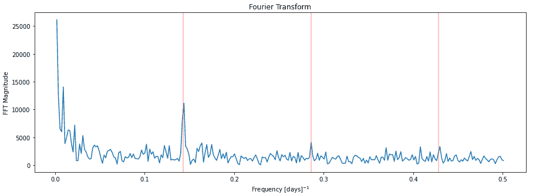
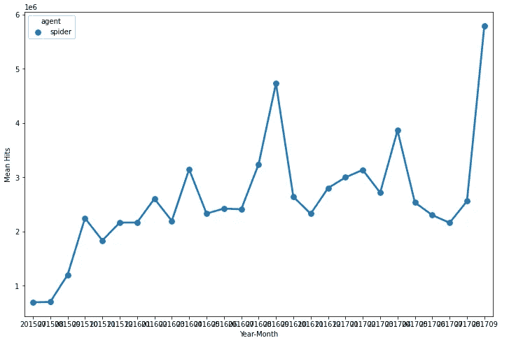

# 网络流量时间序列预测(一)

> 原文：<https://medium.com/analytics-vidhya/web-traffic-time-series-forecasting-part-1-a819b65013ec?source=collection_archive---------6----------------------->

我们将创建一个端到端的案例研究。我把这个博客分成了两个系列的博客。

1.  [介绍和探索性数据分析](https://namangupta-cs.medium.com/web-traffic-time-series-forecasting-part-1-a819b65013ec)
2.  [功能工程、建模和部署](https://namangupta-cs.medium.com/web-traffic-time-series-forecasting-part-2-400b3e0e539b)

目录-

1.  问题陈述
2.  现实世界的目标/约束
3.  数据源和概述
4.  性能指标
5.  现有解决方案
6.  首次切割方法
7.  探索性数据分析
8.  参考

# 1.问题陈述-

这是一个近 4 年前举行的 Kaggle 竞赛问题。在这个案例研究中，我们将关注一个时间序列问题。让我们快速定义时间序列。时间序列是定期记录的一组观察值。时间序列在许多领域都是有益的，如股票市场预测、天气预报。时间序列可以在许多问题上派上用场，如分析、分类和最重要的预测，在这种情况下，我们将重点研究分析和预测。

本案例研究的重点是预测多个时间序列问题的未来值。每个时间序列包含从 2015 年 7 月 1 日到 2017 年 9 月 10 日共 803 天的维基百科页面日流量。我们总共有 145，000 个时间序列，这意味着我们有 145，000 个页面的数据，我们的目标是分析这些数据，在此基础上建立一个模型，并预测从 2017 年 9 月 13 日到 2017 年 11 月 13 日的 62 天内每个页面的未来流量(嗯，这实际上不是未来，但当这个比赛举行时，它是！)

# 2.现实世界的目标/约束-

最小化实际值和预测值之间的差异。

没有特定的延迟要求，但是我们应该尝试不要花几个小时来预测特定的日期。20-30 秒应该是可以接受的。

# 3.数据概述-

训练数据集总共有 145，000 个维基百科页面的时间序列，它包含从 2015 年 7 月到 2017 年 9 月这些页面的每日流量。我们要预测 2017 年 9 月 13 日到 2017 年 11 月 13 日每个页面的日流量。我们一共给了三个文件——train . CSV，key.csv，sample_submission.csv。

Train.csv 包含大约 145k 行，每行代表一个不同的维基百科页面，它有 804 列，除了第一列每列代表一个日期，它在特定的维基百科页面上有每日流量。第一列包含页面的名称，其中包括维基百科页面的语言(例如，对于英语 es.wikipedia.org，对于西班牙语 es.wikipedia.org，zh，对于中文 wikipedia.org)，访问类型(桌面、全访问、代理(蜘蛛))。比如一个名字是- 'AKB48_zh.wikipedia。' org_all-access_spider '。

第二个文件是“key.csv ”,其行数等于我们必须做出的预测数。该文件中有两列:“页面名称”和“id”。对于“train.csv”文件中出现的每个页面名称，我们在 key.csv 文件中有 62 行，这 62 行对应于每页的 62 天预测。对于每个页面名称，都有一个对应的 id。

# 4.绩效指标-

我们将使用 SMAPE(对称平均绝对百分比误差)作为我们的性能指标。这常用于预测问题。这个范围是[0，200]。由于这不是 python 中的内置指标，我们将从头开始实现它，并将使用自定义指标来评估我们的模型。

# 5.现有解决方案-

1.  [**胜利者的方案**](https://www.kaggle.com/c/web-traffic-time-series-forecasting/discussion/43795)—

在此解决方案中，所有值都被转换为 log1p，这将有助于使每个时间序列相似，即较小的值和较大的值将相似，分布将更接近正态分布。

一个新的特征被称为“页面流行度”，这是时间序列值的中位数，这个特征将有助于理解时间序列的规模。例如，一个时间序列的值可以在 5-20 之间，其他时间序列的值可以在 50-100 之间。这个解决方案使用了基于 RNN 的注意机制。使用 RNN seq2seq 模型进行预测。模型有两个主要部分编码器和解码器使用 cuDNN GRU 在编码器，而不是通常的张量流 RNN 细胞。

2. [**统计基础解决方案**](https://www.kaggle.com/safavieh/median-estimation-by-fibonacci-et-al-lb-44-9/execution)—

在该解决方案中，使用不同窗口大小的中值进行预测。窗口大小由斐波那契数列决定，从 6，12 开始，然后是 18，30，48，78 等等。为了进行预测，先取过去 6 天、12 天、18 天……的中值，然后再取所有这些值的中值。如果我们没有足够的数据，则采用所有可用数据的中间值。这个解决方案很简单，但是执行得很好。

# 6.第一次接近-

我们将尝试专注于功能工程部分，因为我们将首先使用机器学习模型解决这个案例研究，然后我们将尝试强大到足以自行学习功能的深度学习模型，但我们可能需要为机器学习模型明确提供功能。我将尝试生成可以捕捉每周，每季度和每年的模式的功能。我们将从一个基于中位数的基本模型开始，作为我们的基线模型。之后，我们将尝试 xgboost、gbdt 等模型，因为它们已经证明自己在任何情况下都是一个很好的选择。

特征工程-

我们总共有 26 个月的训练数据，我们必须预测接下来的 62 天。我们将生成最近 15 天的要素。将生成滚动窗口要素。将尝试的其他特征工程技术如下-

(I )( t-4 个月、t-8 个月、t-12 个月、t-16 个月)的中值，其中这些值本身是值之前和之后 2 天的中值。该功能将帮助我们捕捉季度趋势。

㈡过去 5 天的中位数

(iii)过去 5 个相同工作日的中值，此功能将帮助我们捕捉每周趋势。

(iv)为了捕捉年度趋势，我们将采用 t-363、t-364、t-365、t-366、t-367 的中间值

还将使用傅立叶变换。

(vi)取斐波那契数列窗口大小的中值对我们的模型有好处，这也将被测试。

所有上述特征将在首先经历基本时间序列模型之后产生。还将采用不同的方法使时间序列更加平稳。详细的 EDA 也将完成，功能工程将相应地改变。将执行预处理，如缺失值插补。

# 7.探索性数据分析-

首先，我们将填充所有缺失的值(如果有的话)。所以，让我们检查一下数据中是否有缺失值。

上图只显示了几个日期的缺失值的计数，但从中我们可以看出数据中有很多缺失值。对于某些页面，仅显示最近几个月的数据，其余数据为空。这可能是因为这个 wiki 页面是后来创建的，所以数据只在页面创建后的几天内存在。现在我们有两种情况——一种是数据实际丢失，另一种是页面尚未创建，现在我们知道，当数据实际丢失时，它会在某些日期丢失几天，但当页面尚未创建时，我们从一开始就没有该页面的数据，而突然我们就拥有了该页面的所有数据。

为了填补第一种情况的数据缺失值，我们将使用[线性插值](https://pandas.pydata.org/pandas-docs/stable/reference/api/pandas.Series.interpolate.html)，对于第二种情况的缺失值，我们将用 0 来填补

由于我们有超过 145，000 个时间序列，单独分析它们是不可能的，我们必须找到一些方法来划分这些时间序列，然后将每个组组合起来进行分析。记住，页面的名称包含了页面的语言，我们可以用它来组合不同类型的页面，然后对它们进行分析。所以，让我们开始吧！

**页面语言会影响流量吗？**

通过使用简单的正则表达式，查找维基百科页面上可能影响数据集的不同语言。有一些非维基百科的页面，这些是维基媒体的页面，所以给他们代码“na ”,因为还没有确定他们的语言。其中许多将会是没有真正语言的图像之类的东西。

存在的语言计数

有 7 种语言加上媒体页面。这里使用的语言有:英语、日语、德语、法语、汉语、俄语和西班牙语。

为不同类型的条目创建数据框。之后，计算所有视图的总和。数据来自几个不同的来源，总和可能会重复计算一些观点。

现在，让我们看看我们得到了什么

结论:

英文页面的浏览量要高得多。这里的结构比预期的要多得多。英语和俄语图显示在第 400 天左右(2016 年 8 月左右)有非常大的峰值，在 2016 年晚些时候英语数据中还有几次峰值。我猜这是 8 月份夏季奥运会和美国大选的双重影响。

在 200 天左右的英国数据中还有一个奇怪的特征。

西班牙的数据也很有趣。那里有一个清晰的周期性结构，大约 1 周的快速周期，大约每 6 个月左右看起来会有一个明显的下降。

**周期结构和 FFT**

因为看起来这里有一些周期性的结构，所以分别画出来，这样比例更明显。除了单独的图，我还会看看快速傅立叶变换(FFT)的幅度。FFT 中的峰值显示了周期信号中最强的频率。

**英文维基百科的剧情-**

最初几个月，数据只有 1 到 2 次峰值，但在 2016 年 7 月之后，流量迅速上升，之后流量大幅下降。

在最后一个季度出现了一些小高峰

**剧情为日文维基-**

日语维基百科显示了 2016 年 1 月的一些高峰，我们可以看到 2015 年 9 月的流量大幅下降。

这与我们最初看到的曲线非常相似，峰值出现在 120 天和 230 天。

**德语维基百科的情节-**

德语维基百科是所有语言中峰值最多的。我们可以看到，这使得“M”形状的结构，向上然后向下，再向上然后再向下。

正如所料，在 120 和 230 天有峰值，但令人惊讶的是，在 340 天左右，有一个峰值。

**维基媒体的阴谋-**

此图用于图像等媒体页面。我们可以看到，直到 2016 年 4 月，数据没有显示任何峰值，此后，有规律的峰值，也有一些非常大的峰值

数据中有规则的峰值，但没有像前面图表中那样的大峰值。

**法语维基百科的情节-**

法语维基百科呈现上升趋势。峰值也可以定期看到，但在 2016 年 3 月左右有一个大峰值。

这也和之前的图很像，峰值在 120，230，340 天。每个季度末都有涨价。

**中文维基百科的剧情-**

像其他语言一样，这种语言在最初几个月也有上升趋势，我们可以在 2016 年 1 月看到非常大的峰值

非常类似于前面的语言图，除了它在 340 天有一个相对较小的峰值

**俄罗斯维基百科的剧情-**

俄语维基百科没有显示出大的上升或下降趋势，但在 2016 年第三季度出现了非常大的峰值。除此之外，它到处都有一些峰值，但没有其他语言那么多。

这在 120 天有一个峰值，但在 230 天没有看到主峰。

**西班牙语维基百科的剧情-**

我们可以在数据中看到不错的每周模式，此后 7 天会出现常规峰值，从该图中可以观察到一个有趣的现象，即流量通常在第三季度末或第四季度初上升，在 2016 年 11 月，流量会出现非常大的峰值。

该图显示了 120 天和 230 天的峰值，显示了季度周期。可以定期看到小峰，这可能是因为 7 天的滞后显示了高相关性。

结论:

看到这两个图后，西班牙语数据具有最强的周期性特征，大多数其他语言也显示出一定的周期性。出于某种原因，俄罗斯和媒体的数据似乎没有显示太多。用红线标出 1 周、1/2 周和 1/3 周的周期。看到周期性特征主要在 1 周和 1/2 周。这并不奇怪，因为与周末相比，工作日的浏览习惯可能有所不同，导致整数 n 的 FFT 在频率 n/(1 周)处出现峰值。这表明页面视图一点也不平滑。每天都有一些有规律的变化，但是也有一些大的影响会突然发生。一个模型可能无法预测突然的峰值，除非它能够获得更多关于当前正在发生的事情的信息。

# 每个项目名称具有以下格式:“名称 _ 项目 _ 访问 _ 代理”。为了更好地理解数据，将这 4 个特征分离出来是个好主意。

如我们所见，项目、访问和代理分别有 9、3 和 2 个唯一值。看看这些价值

绘制项目的月平均点击数

现在，让我们看看情节

结论:

英语维基百科项目的点击率超过任何其他项目。此外，俄语维基百科将在 2016 年 8 月和英语维基百科一样涨价。

现在英语项目都是图表，很难想象其他项目。如果可能的话，把英语项目分开并找出一些模式。

结论:

它清楚地表明，用户很少访问媒体页面，但在 2016 年 6 月的俄罗斯页面中显示了一些增长。

结论:

所有的页面都可以访问，但桌面比移动用户更严格。人们更喜欢通过桌面访问。

结论:

我们无法从上图中获得数据模式。代理只有两个值，为什么不把它们画在两个不同的图中，看看它们的行为。

结论:

“访问”和“代理”的“全部访问”和“全部代理”值是各自属性值的总和。因此，除了全接入之外的每个值都对全接入的趋势有贡献，而除了全代理之外的所有值都对全代理的趋势有贡献。

我们已经看到了我们的数据所展示的每一种模式。现在，我们将尝试根据我们的数据回答一些问题，这些数据在我们项目的后期阶段可能会有所帮助。

# 平均哪个月访问量多？

从现在开始，我们试图回答的每一个问题，它们的平均值将基于中值而不是平均值。

所以，指数 4 是五月的，它显示平均来说五月的访问量最大。与平均访客数量最少的 7 月相比，5 月显示出 25 %的显著增长。

我们可以看到，平均而言，周日的游客数量最多，但所有人都非常接近，没有太大差异。

# 假期会影响普通游客的数量吗？

因为一年的最后三个月是全世界节日最多的月份。让我们检查一下它是否影响平均访问人数。

这里有一些不同。实际上，假日期间游客的平均数量下降了 7.3 %。

结论——这确实有所不同，在节日期间，维基百科页面的流量比一年中的其他月份要少。

这是我们的 EDA 的结尾，我们已经深入分析了我们的数据，这些数据将在我们案例研究的后期阶段有用。至此，我们结束了这一部分的系列。

# 8.参考文献-

1.  [https://www . ka ggle . com/c/we B- traffic-time-series-forecasting/discussion/43795](https://www.kaggle.com/c/web-traffic-time-series-forecasting/discussion/43795)

2.[https://towards data science . com/we b-traffic-forecasting-f 6152 ca 240 CB](https://towardsdatascience.com/web-traffic-forecasting-f6152ca240cb)

3.【https://cs.adelaide.edu.au/~zbyszek/Papers/p51.pdf 

4.[https://blog . octo . com/en/time-series-features-extraction-using-Fourier-and-wavelet-transforms-on-ECG-data/](https://blog.octo.com/en/time-series-features-extraction-using-fourier-and-wavelet-transforms-on-ecg-data/)

5.[https://www.youtube.com/watch?v=mrExsjcvF4o&t = 830s](https://www.youtube.com/watch?v=mrExsjcvF4o&t=830s)

6.[https://www . Applied ai course . com/course/11/Applied-Machine-learning-course](https://www.appliedaicourse.com/course/11/Applied-Machine-learning-course)

如果您有任何疑问，请随时发表评论，或者您也可以通过 [Linkedin](https://www.linkedin.com/in/naman-gupta-ds/) 联系我。你可以在这里找到我的完整项目。