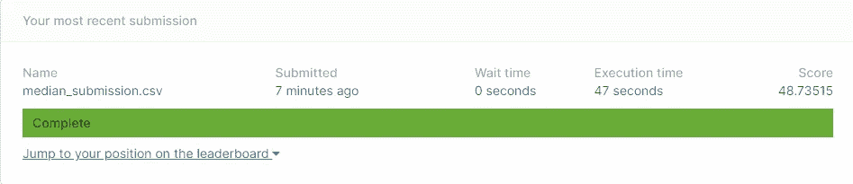
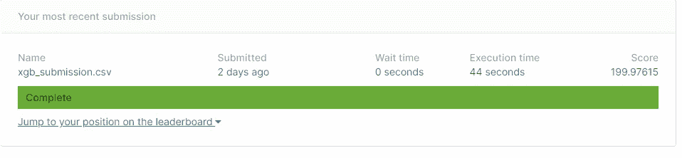
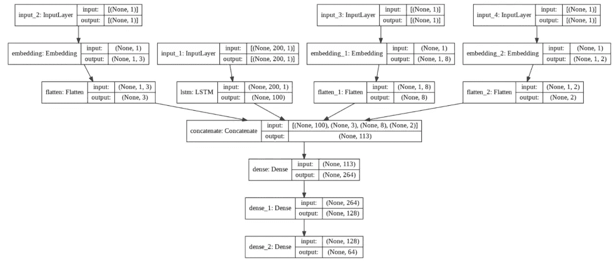
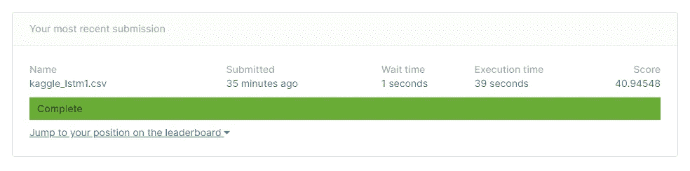
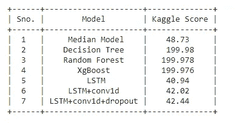
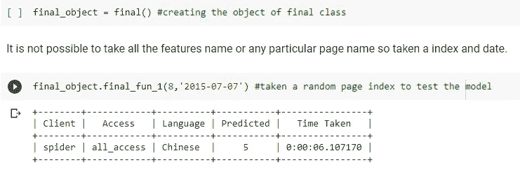

# 网络流量时间序列预测(二)

> 原文：<https://medium.com/analytics-vidhya/web-traffic-time-series-forecasting-part-2-400b3e0e539b?source=collection_archive---------8----------------------->

这是我们系列的第二部分，系列包括-

1.  [介绍和探索性数据分析](https://namangupta-cs.medium.com/web-traffic-time-series-forecasting-part-1-a819b65013ec)
2.  [功能工程、建模和部署](https://namangupta-cs.medium.com/web-traffic-time-series-forecasting-part-2-400b3e0e539b)

在之前的博客中，我们看到了对数据的详细分析。现在，是时候开始一些功能工程和构建模型了。

# 目录-

1.  基线模型
2.  特征工程
3.  建模
4.  部署
5.  未来的工作
6.  参考

# 1.基线模型-

首先，我们将仅基于数据的中位数进行预测，并将它用作我们的基线模型。

现在，我们将使用数据的中位数来进行预测，对于每一页，我们已经采用了每个工作日的中位数，并使用它来相应地预测接下来的 62 天。

我们已经计算了每个工作日每个页面的中位数，现在我们将对 Kaggle 进行预测，并根据 sample_submission 文件的格式制作一个 CSV 文件。

在 Kaggle 上提交了上述预测后，下面是我们的结果。

对于本次提交，我们目前在 1095 个团队中排名第 310 位

# 2.特征工程-

先说一些特色工程吧！。我们将为过去 15 天的数据创建特征，并通过特征工程技术，我们将尝试使用其余的数据来创建过去 15 天的特征。正如我们看到的，7 天的滞后有很高的相关性，所以我们创建的第一个特征是周-日特征。除此之外，我们将创建 3 个特征，这些特征具有前 3 天的总访问者，三天 1 将具有(d-1)+(d-2)+(d-3)天的流量，三天 2 将具有(d-4)+(d-5)+(d-6)天的流量，类似于三天 3。另一个特性是 weekday，顾名思义就是一周中的某一天。

正如我们所知，语言、访问类型和客户端类型确实会对流量产生影响，因此将这些作为特征会很有用。

lang_feat —它将包含语言特性。

agent_feat —我们为蜘蛛数据增加 1，为非蜘蛛数据增加 0。

access_feat —我们将为全访问添加 0 个，为桌面添加 1 个，为移动添加 2 个。

由于我们正在创建过去 15 天的数据，所以对于上述每个页面的功能将重复 15 次。

现在，我们将基于傅立叶变换创建特征。正如我们在分析过程中看到的，开始时有一些不必要的峰，因此，在移除一些初始值后，将取前 3 个峰并将其用作特征。

创建了我们到目前为止讨论的所有功能，将使用这些来训练模型。

# 迄今为止我们工作的总结和主要收获

首先，我们加载了所需的库和文件。处理缺失值:

我们使用线性插值来填充连续多天没有丢失的丢失值。为了填补连续缺失值，我们使用了 180 天后的数据。

## **数据分析:**

*   我发现大部分流量都在英文网页上。
*   与真人相比，机器人的流量很小。
*   五月有最多的游客。
*   工作日和周末其实没多大区别。
*   一年的最后三个月比一年中的其他月份平均有更多的游客。
*   平均来说，英语拥有最多的访问者。

## 特征工程:

使用滚动窗口技术生成特征，从每个时间序列我们使用 15 天的数据。这些是我们在一周中的某一天生成的特征

*   第 7 天的访客人数
*   3 天内最后 3 个时段的访客总数。
*   页面的语言
*   页面的客户端(全访问、移动、桌面)
*   蜘蛛或真实的人流量
*   傅立叶变换数据的前三个峰值。

**准备好数据模型-**

现在，将开始基于已创建的特征构建模型。首先，将把所有的分类特征转换成一次性编码特征，并对所有的连续特征进行归一化。

现在，将我们的数据分为训练和测试。我们将把数据分成 75 份和 25 份。

正如我们已经讨论过的，为了评估我们的模型，我们将使用 SMAPE，因为 python 中没有内置的函数，我们必须实现它，并且我们将使用自定义指标来评估我们的模型。

先说建模。

# 3.模特-

**线性回归-**

这些都不是好结果，应该尝试一个更强大的算法，看看这些如何执行。

**决策树-**

与线性回归相比，结果是好的，但总的来说，这些似乎不能让我们在排行榜上取得好位置。

**随机森林-**

这些结果比决策树好得多，但请记住，我们正在使用某些特征进行预测，我们没有未来的数据，我们必须按顺序进行预测，以便进行预测并将这些预测用作未来预测的特征，因为我们将尝试预测更远的日期，所以预测中的误差将呈指数增长。因此，我们必须从排行榜上的预期分数中获得更好的分数，因为排行榜分数会比这更高。

**XgBoost-**

分数甚至超过了随机森林和决策树算法

# 所有型号的性能总结

线性回归- 0.79

决策树- 0.40

随机森林- 0.37

XgBoost — 0.43

这里表现最好的模型是随机森林，所以我们将使用它来预测 Kaggle，希望它也能在排行榜上表现良好。

# 对 Kaggle 的预测

将为我们在要素工程期间创建的预测创建所有要素。现在，将结合所有特征并开始对 Kaggle 进行预测。尝试提交与 Xgboost 算法，尽管最高分，然后随机森林，xgb 的表现优于随机森林在 Kaggle。

这是结果-

这正是我所担心的，随着我们对未来日期的预测，误差确实呈指数增长，这个分数比我们提交的中值还要糟糕。现在，我们得想点别的。

**深度学习拯救-**

现在，我也要试试 LSTM。像以前一样，不会使用任何使用预测数据的功能，因为它会产生问题。

由于我们有超过 145，000 个时间序列，我们仅使用 50%的数据来训练模型。

为了评估我们的模型，将使用 log1p 数据的平均绝对误差(MAE)。这与原始数据上的 SMAPE 非常相似。在最终预测之后，将对数据使用 expm1 将其转换回原始形式。

随着时间序列，将使用三个特征，以及可以从页面名称中提取

上面的代码创建了我们的模型所需的所有特征，现在我们将对所有分类特征进行标签编码，将它们整形为适当的形状以提供给模型，并将数据分为训练和测试。

我们的数据准备好了，我们可以开始构建我们的模型架构。模型将有 4 个输入层(每个要素一个)，时间序列数据将通过 LSTM 层，所有标签编码的要素将通过嵌入层，然后我们将展平输出，以便我们可以连接所有这些层。之后，我们将使用一个密集层和一个输出层。

该架构如下所示:

现在，让我们看看我们模型的建筑图-

正如我们已经讨论过的，log1p 数据上的 MAE 有点类似于 SMAPE，所以我们应该在排行榜上也能获得不错的分数。

在做了预测并提交了 Kaggle 上的文件后，这里是我们的结果

分数很高，我们进入了排行榜的前 10%和 92/1095 的位置。

试图添加一个 Conv1d 层来提高准确性，但似乎 Kaggle 得分增加。也增加了一些更多的 LSTM 层，但分数还是增加了。由于模型的过度拟合，可能会克服这种增加的脱落层，但它不会对分数产生太大影响，分数仍不会进一步降低。

# 对所有尝试过的模型进行比较研究

基于树的模型不能很好地执行，它们的分数比中位数模型差，但是 LSTM 被证明是一个好的选择，可能原因是它们擅长于序列-序列预测。

# 4.部署-

如果一个模型不能到达客户手中，那么这个模型有什么用。大多数案例研究博客都跳过这一部分，但是会不遗余力。将使用 flask 进行部署，使用 Heroku 进行服务。

在建模部分，我们以这样一种方式训练模型，它们将预测未来 64 天，但这里我们只需要预测一个指定的日期。所以，我训练了 LSTM，让它将过去 5 天的数据作为输入，而不是 200 天的数据，并预测第二天的数据。代码会非常相似，但如果你还想看我的代码，你可以查看我的 GitHub 库。现在，我们必须为预处理、特征工程和预测建立一个管道。我们不能要求用户输入最近 5 天的流量和页面名称本身来做一个预测。因此，我们将索引和日期作为输入，索引将对应于数据集中提到的特定页面名称，并根据日期从 CSV 文件中获取他想要的预测数据。Heroku 给了我们 500 MB 的限制，仅 Tensorflow 模块就需要 300 MB 以上，因此我们无法使用完整的数据集。因此，我们将仅使用 10k 页面进行模型部署，而不是 145k 页面。

让我们从管道开始吧！

输出会是这样的-

好了，现在我们完成了管道，现在是使用 Flask 进行部署的时候了，我们还必须构建 HTML 页面(我会让它非常简单)。

现在，我们去赫罗库。因此，Heroku 是免费的并且非常容易使用，我们将使用 Github 在 Heroku 上部署我们的模型。所以基本上有两个额外的文件，我们必须创建 *Procfile* (没有任何扩展名)和 *Requirements.txt*

Procfile 包含需要首先运行的文件的名称，requirements.txt 包含需要安装的所有模块的名称。现在，我们只需在 Heroku 上选择“连接到 GitHub ”,搜索我们的 GitHub 库，然后点击“部署”。如果所有代码都正确，模型将被部署，并为您的应用程序生成一个链接。

完成以上所有步骤后，这里的就是我们的 app 了。打开链接可能需要一些时间，请耐心等待。

# 5.未来的工作-

1.  可以尝试基于注意机制的模型，以便使用来自遥远过去的信息来改进结果。
2.  为了改善结果，可以尝试不同类型的数据平滑和变换。
3.  正如我们在现有方法中所讨论的，很少有简单的基于统计的方法被证明是相当好的，这些方法可以用来为模型提供额外的特征以改善结果。

# 6.参考文献-

1.  [https://www . ka ggle . com/c/we B- traffic-time-series-forecasting/discussion/43795](https://www.kaggle.com/c/web-traffic-time-series-forecasting/discussion/43795)

2.[https://towards data science . com/we b-traffic-forecasting-f 6152 ca 240 CB](https://towardsdatascience.com/web-traffic-forecasting-f6152ca240cb)

3.https://cs.adelaide.edu.au/~zbyszek/Papers/p51.pdf

4.[https://blog . octo . com/en/time-series-features-extraction-using-Fourier-and-wavelet-transforms-on-ECG-data/](https://blog.octo.com/en/time-series-features-extraction-using-fourier-and-wavelet-transforms-on-ecg-data/)

5.[https://www.youtube.com/watch?v=mrExsjcvF4o&t = 830s](https://www.youtube.com/watch?v=mrExsjcvF4o&t=830s)

6.[https://www . Applied ai course . com/course/11/Applied-Machine-learning-course](https://www.appliedaicourse.com/course/11/Applied-Machine-learning-course)

如果您有任何疑问，请随时发表评论，或者您也可以通过 [Linkedin](https://www.linkedin.com/in/naman-gupta-ds/) 联系我。你可以在这里找到我的完整项目。