# 网络用户行为分析器

> 原文：<https://medium.com/analytics-vidhya/web-user-behavior-analyzer-116a83f68e29?source=collection_archive---------11----------------------->

我们知道互联网在当今社会发挥着巨大的作用。几乎每天我们都上网寻找我们需要的东西，帮助我们完成工作。网站或网页是互联网用户可以访问的最基本的互联网页面形式。根据网站的用途和目的，有各种类型的网站，如商业网站、社交媒体、教育网站等。

网站访问者的数量和种类可能会让管理员或网站所有者不知所措，不知道下一步该做什么。这就是网络用户行为分析器，一个跟踪、收集和分析某个网站访问者行为的工具。这种分析的结果对站点管理员有几个好处，其中包括从站点中搜索缺陷、开发站点上的现有功能、确保向站点访问者交付信息等等。


UBA 的一些服务

# 建造 UBA

这实际上是我第一个与数据分析相关的项目。这个项目是我实习期间大概一年前做的。我被分配到一个三人小组。然而，我们所有人都是数据分析工作的新手，所以我们决定首先对我们将要制作的这个系统做一些研究。

经过几天的研究，我们终于提出了我们的系统架构和工作流程。首先，我们需要的网站将被分析。然后，我们需要一个数据库来存储所有的系统信息。我们还需要一个脚本，能够从网站上提取和废弃信息，并将其存储到数据库中。接下来，我们还需要一个脚本从数据库中抓取数据并分析数据。最后一部分是一个包含分析结果的仪表板页面，用户可以访问它。

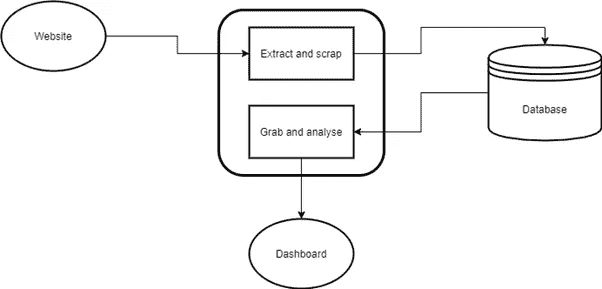

UBA 系统的架构

我们决定使用 Django，一个使用 python 语言的 web 框架作为我们的代码库。我们将使用这个框架运行一个实时服务器，包含上面所有的系统架构。我们使用 PostgreSQL 作为数据库服务，使用 pandas 库进行数据分析。出于可视化的目的，还需要一些 Javascript 包。这里有一个这个库在 [Github](https://github.com/fauzan-ragitya/web_analyzerKP) 中的链接

# 实施 Django

首先要做的是将 Django 包安装到我们的本地/开发设备上。我遵循 [Django 官方文件](https://docs.djangoproject.com/en/3.2/intro/install/)中提供的指导方针。之后，我开始使用 Django startproject 命令创建一个名为“analyzer”的项目和一个名为“webanalyzer”的应用程序。这是它现在在存储库中的样子。

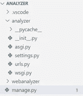

存储库概述

我们也在这个[链接](https://docs.djangoproject.com/en/3.2/intro/tutorial01/)遵循 Django 官方文档中提供的一些项目教程。

如果我们使用 Django 启动一个项目和一个应用程序，这些是默认文件。名为 settings.py 的文件包含我们项目的配置。我们在这里阐明了我们的“webanalyzer”应用程序和 Postgresql 数据库配置。名为 urls.py 的文件包含我们可以在浏览器中访问的正在运行的应用程序的根目录。名为 manage.py 的文件是我们可以用来运行实时服务器的默认文件。

在 webanalyzer 目录中，有更多默认创建的文件和子目录。下面是它的一个片段。

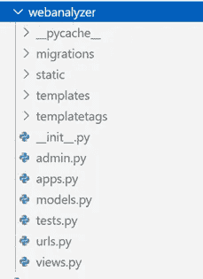

webanalyzer 子目录概述

在这个项目中，我们主要在 models.py、urls.py、views.py、static 和 templates 中使用和应用更改。

models.py 包含我们的对象定义和解释。我们定义了 3 个对象类，稍后将存储在数据库中。在数据库中初始化表模式也很重要。这三个类被称为指纹、链接和行为。指纹是访客的基本信息。它定义了正在使用的浏览器和操作系统，他们正在使用什么类型的设备，他们当前使用什么语言和时区，等等。链接有助于跟踪和统计我们的网站有多少网页。行为定义了访问者在某次访问中的特定行为。它包含诸如 IP 地址(访问者可以使用相同的设备但不同的 WiFi 连接访问互联网)、当他们进入和离开特定页面时的时间戳、他们在页面中的光标移动等信息。下面是 models.py 的代码片段

py 定义了整个应用程序的根地址模式。它还将 views.py 中声明的处理函数调用到某个路径。以下是 urls.py 的代码片段

如前所述，views.py 包含所有需要的处理功能。可以说这是最重要的文件，因为我们的大部分工作都是在这里完成的。Static 是一个目录，包含一些处理或可视化我们的分析所需的 Javascript 库。而 template 是一个包含 HTML 文件的目录，我们将把我们的分析呈现到其中。

# 数据库设置

我们的数据库管理系统采用 PostgreSQL。为了运行这个项目，我们还需要将 Postgresql 安装到我们的部署机器上(因为我们将在 localhost 中运行它)。安装后，打开 PgAdmin 并创建数据库。给你想要的名字和密码。确保将它包含在 settings.py 中，如下所示。

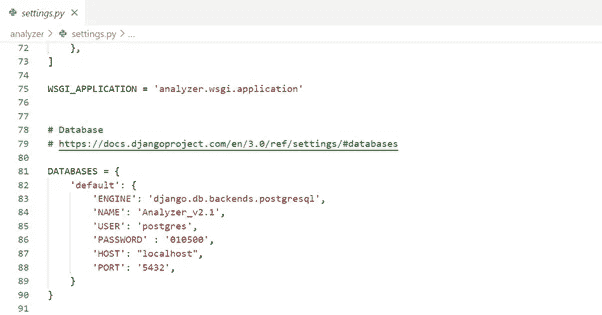

settings.py 中的数据库配置片段

在第一次运行实时服务器之前，需要迁移表来组成模式。Django 帮助我们，只要在终端中执行这两个命令就可以解决这个问题。

```
python manage.py makemigrationspython manage.py migrate
```

在进行迁移之后，空表将被初始化，我们可以在我们的 PgAdmin 页面中检查它。接下来，我们可以使用以下命令在 localhost 上启动实时服务器。

```
python manage.py runserver
```

# 提取和废弃

启动服务器后，我们可以开始测试它。我们使用随机网站模板，我们发现在互联网上。为了演示的目的，我们初始化 3 页，每一页都有相同的内容。这是它的样子。

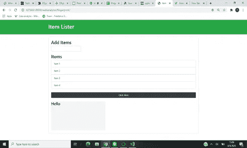

网站模板

当访问者访问和打开该页面时，系统收集访问者的数据并将其上传到数据库。我们可以在 urls.py 代码中检查它，在 webanalyzer/fingerprint 路径中，它从 views.py 调用 collect 函数。如果是 GET，系统会渲染页面，让访问者能够看到它。如果请求的方法是 POST，系统将获取所有的信息并将其发送到数据库中相应的表中。我们还需要编写几个 JS 脚本(static/fingerprint.js、static/jquery.js、static/client.js)并放在 HTML 模板中，以便稍后在 collect 函数中调用它。

以下是访问者进入网站后数据库中的表格的样子。

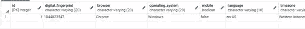

访客桌


行为表

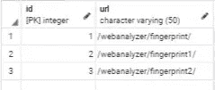

网站的 URL 表

访问者表包含访问过我们网站的访问者列表，行为表记录所有对网站的访问。用户表存储唯一的访问者，所以这意味着存储在行为表中的所有记录只由一个访问者完成。行为表中有一个外键将它连接到用户表，并向我们提供哪些用户进行了访问信息。

# 分析

我们使用 Python-pandas 库来帮助我们进行分析。之所以选择 pandas，是因为它有很多方法和功能来处理数据，而且它也适用于更大的数据。所有的分析工作都在 views.py 代码中完成。首先要做的是从数据库中获取数据，并将其转换成熊猫数据帧格式。这是在 views.py 中的 database_to_df 函数中完成的，如下所示。

数据作为数据帧导入后，我们对数据帧进行分析。然后，分析的结果将呈现到特定的 HTML 页面上进行可视化。特定的数据处理函数也在 urls.py 路径中被调用，因此它将在用户每次点击该路径时被执行。下面是 views.py 中分析函数的一个例子

这是一个分析所有网站的累计访问量和持续时间的功能。它将数据呈现到 web analyzer/session _ analisis . html 模板中，并以 python-dictionary 或 JSON 的形式传递数据。

# 仪表板视图

这是主菜单。它包含 3 个查看选项，即数据访问者、会话分析和访问者分析。

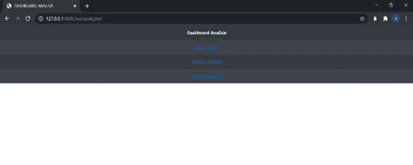

炙单

数据访问者包含网站中所有访问者的累积数据。它显示了所有访问者的人口统计分析，比如有多少人使用 Chrome 浏览器而不是 Firefox，相对于其他操作系统，Windows 的使用比例是多少，等等。它使用条形图和饼图来显示报告。

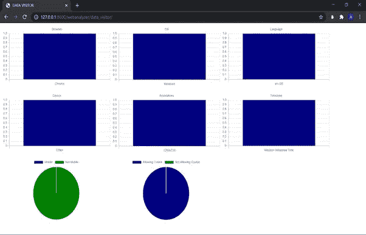

数据访问者视图

会话分析包含访问次数和持续时间的累积数据。它提供了每日访问量、URL 平均访问时间、每日唯一访问者等图表。

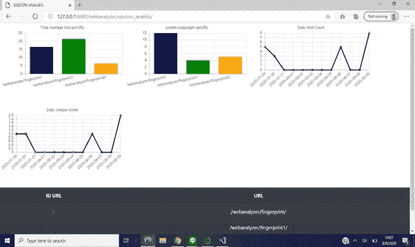

会话分析

我们还可以通过单击 URL id 来查看包含的 URL 页面分析。它显示特定页面上经常被点击的 HTML 元素的类型等信息。

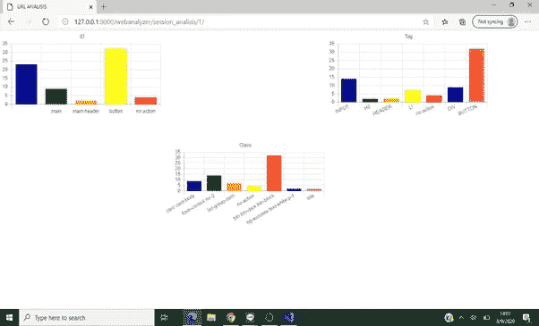

URL 分析

访问者分析包含访问者的具体信息，如浏览器、操作系统、语言，甚至是首次访问我们的网站。它还使用条形图报告其访问摘要。它还可以通过显示鼠标的移动和点击热图来报告自己的旅程。

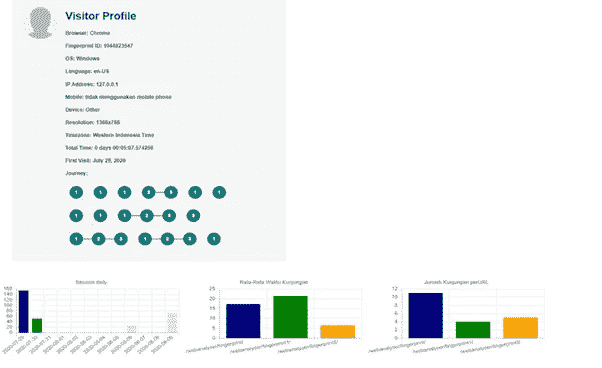

访客分析

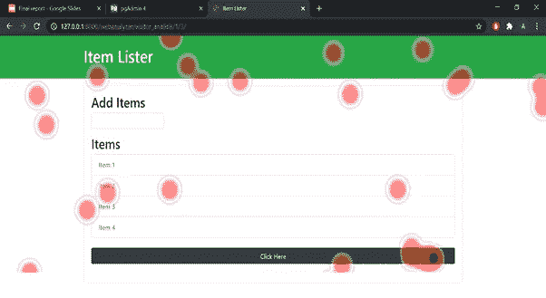

热图