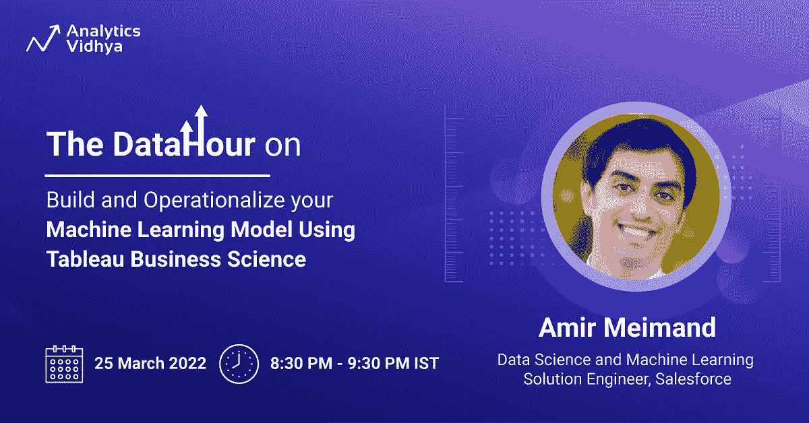

# 网络研讨会:使用 Tableau 商业科学掌握 AutoML

> 原文：<https://medium.com/analytics-vidhya/webinar-master-automl-using-tableau-business-science-54876a1ef2de?source=collection_archive---------0----------------------->

## 立即免费注册！

对于数据科学爱好者来说，

我们很高兴为您带来“[数据时间](https://www.analyticsvidhya.com/blog/2022/02/introducing-the-webinar-series-the-datahour/)”系列的另一场网络研讨会。网上研讨会基于使用 Tableau Business Science 构建和操作您的 ML 模型。本次网络研讨会将由 [Amir Meimand](https://www.linkedin.com/in/amirmeimand/) 主持，他目前是 Salesforce 战略解决方案团队的首席解决方案工程师，专注于数据科学和机器学习。

**日期**:2022 年 3 月 25 日

**时间**:IST 时间晚上 8:30 到 9:30

**主题**:使用 Tableau Business Science 构建并操作您的机器学习模型

> [**现在免费注册！**](https://datahack.analyticsvidhya.com/contest/datahour-build-and-operationalize-your-machine-lea/?utm_source=medium&utm_medium=announcement&utm_campaign=datahour)

# 关于网上研讨会

纵观应用机器学习技术为任何业务问题构建端到端解决方案的整个过程，数据与业务用户的最终决策者之间存在巨大的距离。当即时性是关键因素时，这种距离是有问题的，会增加实现价值的时间。

Tableau Business Science 通过提供指导机器学习体验，降低了障碍并缩短了价值实现时间。它使业务用户能够开发和部署他们的模型，无需任何代码，只需点击即可将该模型无缝嵌入到他们的分析工作流中，从而加快洞察速度并做出更自信的决策。

本次网络研讨会将重点讨论 AutoML 解决方案，以及它如何帮助业务用户将其数据和业务知识转化为可操作的分析。Amir 将使用 Einstein Discovery 与 Tableau 的集成来演示业务用户如何建立预测模型并将其引入 Tableau，建立不同的报告，并获得更多洞察力。他将使用一个真实世界的商业问题，并且数据集将对观众可用。

**先决条件**:对学习数据科学的热情和爱因斯坦发现的试用版以及 Tableau，可以从[注册页面](https://datahack.analyticsvidhya.com/contest/datahour-build-and-operationalize-your-machine-lea/?utm_source=medium&utm_medium=announcement&utm_campaign=datahour)免费下载！

# 为什么这对数据科学家很重要？

假设你的目标是在数据科学领域建立职业生涯。通过参加本次网络研讨会，您将对该领域有足够的了解。机器学习是数据科学最重要的子集之一；在本次网络研讨会中，您将学习一些技巧和诀窍，以便立即构建更具独创性的解决方案。听起来很刺激，不是吗？

# 本次网络研讨会面向谁？

*   希望在数据科学领域建立职业生涯的学生和新生
*   希望转向数据科学职业的工作专业人士
*   希望加快职业发展的数据科学专业人士

# 说话的人是谁？

[Amir Meimand](https://www.linkedin.com/in/amirmeimand/) 是 Salesforce 战略解决方案团队的首席解决方案工程师，专注于数据科学和机器学习。Amir 在构建、部署和应用高级分析来解决企业业务问题方面拥有 10 多年的经验。

# 结束注释

我希望您对参加本次网络研讨会感到兴奋。Amir 将从他职业生涯的整体学习中为我们提供机器学习和数据科学的全球视角。

在此注册[，抓住这个绝佳的机会。](https://datahack.analyticsvidhya.com/contest/datahour-build-and-operationalize-your-machine-lea/?utm_source=medium&utm_medium=announcement&utm_campaign=datahour)

如果您错过了我们之前举办的网络研讨会，请前往我们的 [YouTube 频道](https://www.youtube.com/playlist?list=PLdKd-j64gDcDv3qhAveXqBQQKbDktkfRX)查看视频。

如果您希望举办网上研讨会或在注册时遇到困难，请通过 editor@analyticsvidhya.com 与我们联系

*原载于 2022 年 3 月 17 日 https://www.analyticsvidhya.com**[*。*](https://www.analyticsvidhya.com/blog/2022/03/build-and-operationalize-your-machine-learning-model-using-tableau-business-science/)*