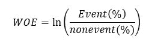
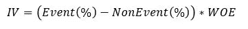

# 证据权重和信息价值

> 原文：<https://medium.com/analytics-vidhya/weight-of-evidence-and-informative-value-b9fceff0390e?source=collection_archive---------16----------------------->

谷歌照片中的照片

数据分析的一些主要概念是变量转换和选择。关于这些概念有各种方法。然而，二元分类方法是预测分析中最常见的情况。在建立二元分类模型的过程中，可以分析数据并找出数据是差的还是完全无用的。本帖下面描述的方法将有助于发现自变量对因变量的影响。

证据权重(WoE)和信息价值(IV)于 1950 年首次引入，用于筛选信用评分问题中的分类问题和价值预测变量。此外，这两种方法是从逻辑回归模型演变而来的，逻辑回归模型是解决二元分类的最流行的方法之一。

## 什么是悲哀？

证据权重显示了自变量相对于因变量的预测能力。所提出的方法研究成功和不成功事件之间的关系，这就是为什么它在信用领域更受欢迎的原因。通过 WoE，可以预测客户是否会偿还贷款，即客户是好是坏。

## 数学定义:

该方法的一般形式是

IV 的形式为:

第一个方程中的自然对数确实是我们在逻辑回归模型中试图找到的。同时，方程的右边与朴素贝叶斯模型相关。这个模型依赖于所有预测因子都是条件独立的假设，这是一个高度乐观的假设。

通过使用患有中风的人的数据集，将在下面提供 WoE 的计算。要计算男性和中风可能性之间的关系，应采用以下步骤:

1)首先，男性患中风的概率被计算为 0.439306。

2)其次，男性不患中风的概率为 0.406580。

3)将 1 除以 2，求它的自然对数，得到 0.077415

另一方面，信息值是 0.004357。因此，根据下表，很明显，性别对预测中风没有用处。

## 悲哀的优势:

1)处理缺失值和异常值；

2)不需要虚拟变量；

3)建立自变量和因变量之间的单调关系。

4)在逻辑回归自然的“逻辑”尺度上对类别进行排序；

5)可以比较转换后的变量，这有助于更好的预测；

6)当标签数量很大时，可以代替一位热码编码方法；

7)每个类别对因变量的(单变量)效应可以简单地跨类别、跨变量比较。

## 悲哀的缺点是:

1)由于宁滨造成的信息损失；

2)自变量之间没有相互关系的描述；

3)产生过度拟合。

## 转型:

机器学习模型通常在计算过程中使用数值。为此，可以通过 WoE 来替换分类值。

假设该列包含 20 个唯一标签，这意味着如果使用一键编码，将有 20 个新列。但是，用相应的值替换每个标签可以简化工作。更准确地说，在上面的例子中，男性可以替换为 0.077415。

探索性分析和变量筛选旨在了解数据并评估单变量的预测强度。通过处理缺失值和异常值，证据权重和信息值为在构建二元分类器之前执行探索性分析和变量筛选提供了一个很好的框架。

## Github 资源库:

关于建议方法的代码来自于[数据科学——Python](https://github.com/zaurrasulov/Data-Science---Python/blob/main/WOE.py)知识库。

关于单变量分析，请参见:[https://eskinkazimov 5 . medium . com/Univariate-Analysis-揭露分析技术背后的直觉-fd5a7904aff](https://esqinkazimov5.medium.com/univariate-analysis-uncovering-the-intuition-behind-analysis-techniques-fd5a7904aff)