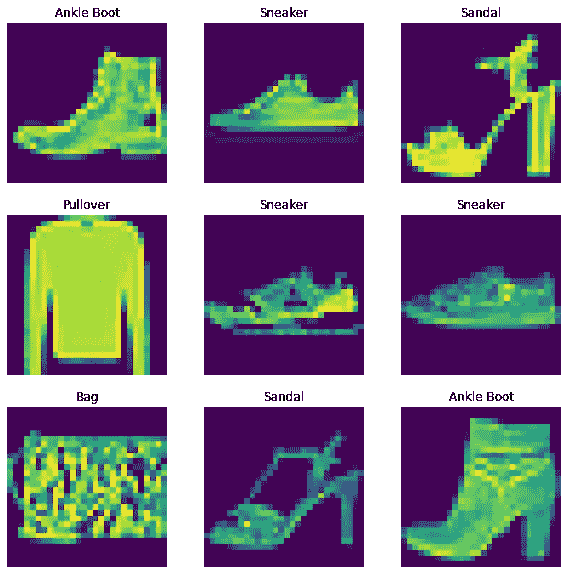
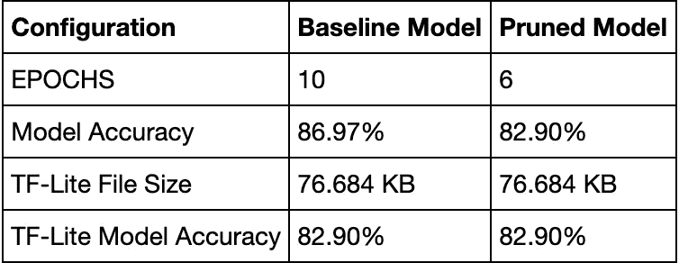

# 用 Keras 进行重量修剪

> 原文：<https://medium.com/analytics-vidhya/weight-pruning-with-keras-86f742dbdb58?source=collection_archive---------3----------------------->


在这篇博客中，我们将通过 Keras 了解权重修剪的概念。基本上，权重剪枝是一种模型优化技术。在权重剪枝中，它在训练过程中逐渐将模型权重归零，以实现模型稀疏。

这种技术通过模型压缩带来了改进。这种技术被广泛用于减少模型的延迟。

我将在时尚 MNIST 数据集中实现权重修剪，在这里我对正常方法和修剪方法进行了比较。

我将实施的例子将需要 Tensorflow 版本 2.4 以及

Tensorflow-model-optimization 我们需要安装这个包。

```
pip install -q tensorflow-model-optimization
```

# **导入必要的依赖关系**

```
import os
import time
import numpy as np
import pandas as pd
import matplotlib.pyplot as plt
import tempfile
from sklearn.metrics import accuracy_score
from sys import getsizeofimport tensorflow as tf
import tensorflow_model_optimization as tfmot
from tensorflow import keras
from tensorflow.keras.models import Sequential
from tensorflow.keras.layers import Conv2D, Dense, Flatten, MaxPooling2D, GlobalAvgPool2D, Dropout%load_ext tensorboard
```

让我们定义一些辅助函数来决定我们将要生成的模型的文件大小

```
**def** get_file_size(file_path):
    size = os.path.getsize(file_path)
    **return** size

**def** convert_bytes(size, unit=**None**):
    **if** unit == "KB":
        **return** print('File Size: ' + str(round(size/1024, 3)) + 'Kilobytes')
    **elif** unit == 'MB':
        **return** print('File Size: ' + str(round(size/(1024*1024), 3)) + 'Megabytes')
    **else**:
        **return** print('File Size: ' + str(size) + 'bytes')
```

# 加载时尚 MNIST 数据集

[**时尚 MNIST**](https://github.com/zalandoresearch/fashion-mnist) 数据集包含 10 个类别的 70000 张灰度图像。这些图像以低分辨率(28 x 28 像素)显示了单件衣服，如下所示:


时尚 MNIST 数据集

```
fashion_mnist = tf.keras.datasets.fashion_mnist
(x_train, y_train), (x_test, y_test) = fashion_mnist.load_data()

*#Storing test labels*
test_labels = y_test

x_train = x_train.astype("float32") / 255.0
x_train = np.reshape(x_train, (-1, 28, 28, 1))
y_train = tf.one_hot(y_train, 10)

x_test = x_test.astype("float32") / 255.0
x_test = np.reshape(x_test, (-1, 28, 28, 1))
y_test = tf.one_hot(y_test, 10)
```

# 定义标签

```
class_name = ['T-shirt/top', 'Trouser', 'Pullover', 'Dress', 'Coat', 'Sandal', 'Shirt', 'Sneaker', 'Bag', 'Ankle Boot']
```

## 显示训练的形状以及测试图像和标签

```
print("Training Image Shape: ",x_train.shape) 
print("Training Label Shape", y_train.shape) 
print("Testing Image Shape: ",x_test.shape) 
print("Testing Label Shape", y_test.shape)Training Image Shape:  (60000, 28, 28, 1) 
Training Label Shape (60000, 10) 
Testing Image Shape:  (10000, 28, 28, 1) 
Testing Label Shape (10000, 10)
```

# 定义超参数

```
AUTO = tf.data.AUTOTUNE
BATCH_SIZE = 64
EPOCHS = 10
NUM_CLASSES=10
```

# 创建数据管道

```
train_ds = tf.data.Dataset.from_tensor_slices((x_train, y_train))

train_ds = (
    train_ds
    .shuffle(BATCH_SIZE * 100)
    .batch(BATCH_SIZE)
)

test_ds = tf.data.Dataset.from_tensor_slices((x_test, y_test))

test_ds = (
    test_ds
    .batch(BATCH_SIZE)
)
```

***流水线*** 准备好了！

# 可视化训练图像

```
sample_images, sample_labels = next(iter(train_ds))
plt.figure(figsize=(10, 10))
**for** i, (image, label) **in** enumerate(zip(sample_images[:9], sample_labels[:9])):
    ax = plt.subplot(3, 3, i + 1)
    plt.imshow(image.numpy().squeeze())
    plt.title(class_name[np.argmax(label.numpy().tolist())])
    plt.axis("off")
```



训练图像

# 定义模型

```
def training_model():
    model = tf.keras.Sequential(
        [
            Conv2D(16, (5, 5), activation="relu", input_shape=(28, 28, 1)),
            MaxPooling2D(pool_size=(2, 2)),
            Conv2D(32, (5, 5), activation="relu"),
            MaxPooling2D(pool_size=(2, 2)),
            Dropout(0.2),
            GlobalAvgPool2D(),
            Flatten(),
            Dense(128, activation="relu"),
            Dense(NUM_CLASSES, activation="softmax"),
        ]
    )
    return model
```

为了再现性，我们将浅网络的初始随机权重序列化。

```
initial_model = training_model()
initial_model.save_weights("initial_weights.h5")
```

# 让我们编译和训练我们的模型

```
model.load_weights("initial_weights.h5")model.summary()model.compile(optimizer='adam',
              loss="categorical_crossentropy",
              metrics=['accuracy'])model.fit(train_ds, validation_data=test_ds, epochs=EPOCHS)test_loss, test_acc = model.evaluate(test_ds)
print("Baseline Test accuracy: {:.2f}%".format(test_acc * 100))
```

# 模型摘要

```
Model: "sequential_1"
_________________________________________________________________
Layer (type)                 Output Shape              Param #   
=================================================================
conv2d_2 (Conv2D)            (None, 24, 24, 16)        416       
_________________________________________________________________
max_pooling2d_2 (MaxPooling2 (None, 12, 12, 16)        0         
_________________________________________________________________
conv2d_3 (Conv2D)            (None, 8, 8, 32)          12832     
_________________________________________________________________
max_pooling2d_3 (MaxPooling2 (None, 4, 4, 32)          0         
_________________________________________________________________
dropout_1 (Dropout)          (None, 4, 4, 32)          0         
_________________________________________________________________
global_average_pooling2d_1 ( (None, 32)                0         
_________________________________________________________________
flatten_1 (Flatten)          (None, 32)                0         
_________________________________________________________________
dense_2 (Dense)              (None, 128)               4224      
_________________________________________________________________
dense_3 (Dense)              (None, 10)                1290      
=================================================================
Total params: 18,762
Trainable params: 18,762
Non-trainable params: 0
_________________________________________________________________
```

在训练我们的模型后，我们得到了 86.97%的基线准确率。

# 保存基线模型

```
_, keras_file = tempfile.mkstemp('.h5')
tf.keras.models.save_model(model, keras_file, include_optimizer=**False**)

print('Saved Baseline Model to:', keras_file)
```

# 带有修剪的微调模型

```
prune_low_magnitude = tfmot.sparsity.keras.prune_low_magnitude
```

# 定义超参数

```
VALIDATION_SPLIT = 0.1 # 10% of training set will be used for validation set.
EPOCHS=6
```

注意:我们采用了更少的纪元，在我们的基线模型中大约是 10

```
images, labels = next(iter(train_ds))

num_images = images.shape[0] * (1 - VALIDATION_SPLIT)
end_step = np.ceil(num_images / BATCH_SIZE).astype(np.int32) * EPOCHS
```

# 定义修剪模型

在本例中，模型以 50%的稀疏度开始(50%的权重为零)，以 80%的稀疏度结束。

```
# Define model for pruning
pruning_params = {
      'pruning_schedule': tfmot.sparsity.keras.PolynomialDecay(initial_sparsity=0.50,                                                              final_sparsity=0.80,                                                             begin_step=0,                                                               end_step=end_step)
}model = training_model()
model.load_weights("initial_weights.h5")

model_for_pruning = prune_low_magnitude(model, **pruning_params)
```

# 需要重新编译

```
model_for_pruning.compile(optimizer='adam',
              loss="categorical_crossentropy",
              metrics=['accuracy'])

model_for_pruning.summary()
```

# 摘要

```
Model: "sequential_2"
_________________________________________________________________
Layer (type)                 Output Shape              Param #   
=================================================================
prune_low_magnitude_conv2d_4 (None, 24, 24, 16)        818       
_________________________________________________________________
prune_low_magnitude_max_pool (None, 12, 12, 16)        1         
_________________________________________________________________
prune_low_magnitude_conv2d_5 (None, 8, 8, 32)          25634     
_________________________________________________________________
prune_low_magnitude_max_pool (None, 4, 4, 32)          1         
_________________________________________________________________
prune_low_magnitude_dropout_ (None, 4, 4, 32)          1         
_________________________________________________________________
prune_low_magnitude_global_a (None, 32)                1         
_________________________________________________________________
prune_low_magnitude_flatten_ (None, 32)                1         
_________________________________________________________________
prune_low_magnitude_dense_4  (None, 128)               8322      
_________________________________________________________________
prune_low_magnitude_dense_5  (None, 10)                2572      
=================================================================
Total params: 37,351
Trainable params: 18,762
Non-trainable params: 18,589
_________________________________________________________________
```

# 训练你的修剪模型

```
logdir = tempfile.mkdtemp()callbacks = [
  tfmot.sparsity.keras.UpdatePruningStep(),
  tfmot.sparsity.keras.PruningSummaries(log_dir=logdir),
]model_for_pruning.fit(train_ds, validation_data=test_ds, epochs=EPOCHS, callbacks=callbacks)
_, model_for_pruning_accuracy = model_for_pruning.evaluate(test_ds)
print("Pruned test accuracy: {:.2f}%".format(model_for_pruning_accuracy * 100))
```

修剪后的模型准确率为 82.90%

# 保存修剪模型

```
model_for_export = tfmot.sparsity.keras.strip_pruning(model_for_pruning)

_, pruned_keras_file = tempfile.mkstemp('.h5')
tf.keras.models.save_model(model_for_export, pruned_keras_file, include_optimizer=**False**)
print('Saved pruned Keras model to:', pruned_keras_file)
```

在保存了相应的模型之后，我将保存的模型转换为 TF-Lite 模型。将模型转换成 TF-Lite 后，我决定对 TF-Lite 模型进行推理。

注意:我是在测试图像上做出的推断。

# 结果

```
Test accuracy TFLITE Baseline Model : 0.829
Test accuracy TFLITE Pruned Model : 0.829
```

我们可以清楚地看到，在 TF-Lite 模型上进行推理时，两者的精度保持不变。



桌子

从这个表中，我们可以得出结论，剪枝模型比基线模型更好

**笔记本链接:**

 [## sayan Nath/tensor flow-笔记本

### 我的 Tensorflow 笔记本。在这些笔记本中，我实现了各种模型优化技术。…

github.com](https://github.com/sayannath/Tensorflow-Notebooks/blob/main/Weight_Pruning_in_Keras_with_Fashion_MNIST.ipynb) 

Github 简介

[](https://github.com/sayannath) [## sayannath -概述

### 我是萨彦纳特。我是 KIIT 大学本科二年级的学生。我是……的主要贡献者之一

github.com](https://github.com/sayannath) 

# 社交把手

*insta gram:*[*https://www.instagram.com/sayannath235*](https://www.instagram.com/sayannath235/)*/*

*领英:*[*https://www.linkedin.com/in/sayannath235*](https://www.linkedin.com/in/sayannath235/)*/*

*邮件:sayannath235@gmail.com*