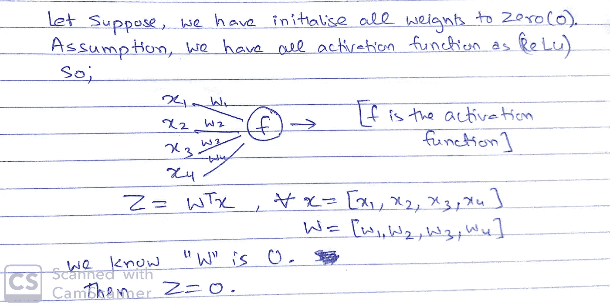
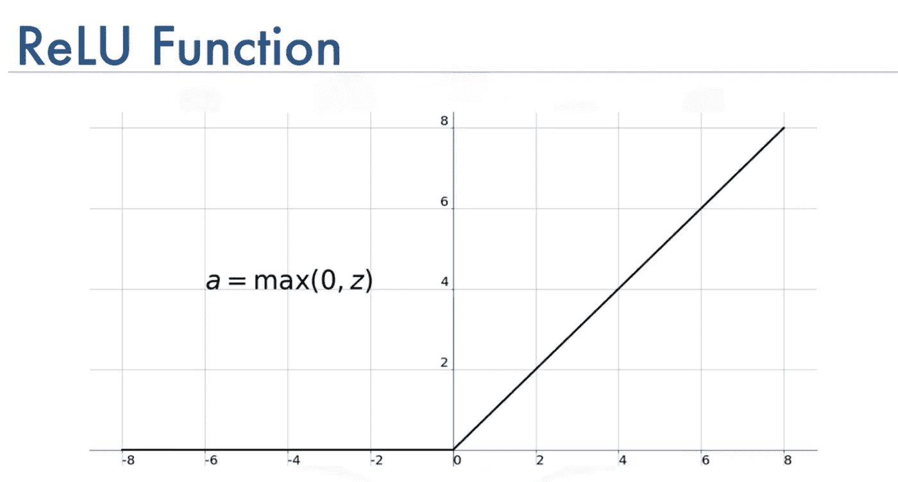
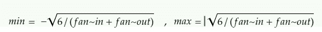

# 神经网络中的权值初始化

> 原文：<https://medium.com/analytics-vidhya/weights-initialization-in-neural-network-d962ac438bdb?source=collection_archive---------6----------------------->

在此之前，我们必须了解。

> **我们为什么要初始化权重？**

*权重初始化对深度学习的优化帮助很大。没有它，SGD 和它的变体收敛到最优权重会慢得多，也很棘手。
权重初始化的目的是防止层激活输出在正向通过深层神经网络的过程中爆炸或消失。*

现在让我们了解初始化权重的不同方法。

1.  **零点初始化**

这里我们将所有权重初始化为 0。在这种情况下，所有的神经元都会计算同样的东西。

这里我们向网络中的每个神经元发送相同的输出。
它会输出同样的东西。所以我们可以说神经元没有在学习。

**b.** 即使我们初始化恒重。那么将会有相同的梯度更新。
以上这些问题引出了“对称性”的问题。

**2。将权重初始化为大负数。** 这里我们将所有权重初始化为大负数。

这是 ReLU 的图表。所以对于负数输出为 0。

2.**情况 2** →激活功能为乙状结肠。

[https://towards data science . com/derivative-of-the-sigmoid-function-536880 cf 918 e](https://towardsdatascience.com/derivative-of-the-sigmoid-function-536880cf918e)

在这种情况下，对于非常大的负权重或正权重。梯度很小。然后我们就有了消失梯度的问题。

**权重的理想条件
*a.*** *权重不应过小* ***b .****权重不应为 0。* **c.** *权重有一些不错的方差。有了这个，每个神经元都会学到不同的东西。*

现在考虑到以上几点，我们将尝试初始化权重。

**情况 1** : **正态初始化** :
所有来自正态分布的权重，均值= 0 &方差=小值。

**优点:**
a .重量有相同的方差。b .我们有一些正的负的权重。

***一些更好的权重初始化策略。***

在继续之前，让我们理解两个术语“扇入”和“扇出”

2.**均匀初始化** 

3. **Xavier / Glorot 初始化
Xavier 的初始化有两种变化。我们现在可以检查这些变化。**

***a .变化 1:*** *所有权重将来自均值= 0 的正态分布，每个神经元的方差将为-*

这种初始化称为 Glorot Normal 或 Xavier Normal。

***b .变奏二:*** *泽维尔/格洛特制服。
在以下条件下，所有权重将来自均匀分布。*

Xavier 初始化与 Sigmoid 激活配合良好。

**4。
初始化**它也有两个变体。让我们找出答案

***a .变异 1: He-正态***
*所有权重将来自均值= 0 的正态分布，每个神经元的方差将为-*

***b .变异 2: He-均匀***
*所有的权重都将来自于均匀分布，满足以下条件。*

“He”初始化与 ReLU & Leaky ReLu 配合得相当好。

**结论** :
如果你们有任何疑问，欢迎在下面评论。我希望你们喜欢这个有趣的体重初始化之旅。

跟我连线-[https://www.linkedin.com/in/paritosh-kumar-3605a913b/](https://www.linkedin.com/in/paritosh-kumar-3605a913b/)

**参考文献:** [https://www.appliedaicourse.com/](https://www.appliedaicourse.com/)