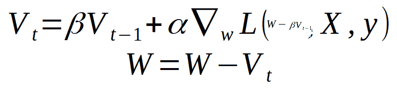

# 优化器——动量和内斯特罗夫动量算法(下)

> 原文：<https://medium.com/analytics-vidhya/welcome-to-the-second-part-on-optimisers-where-we-will-be-discussing-momentum-and-nesterov-c2698d5590e?source=collection_archive---------3----------------------->


[https://www.youtube.com/watch?v=CKLwvuKWQjo](https://www.youtube.com/watch?v=CKLwvuKWQjo)

欢迎来到乐观者的第二部分，我们将讨论动量和内斯特罗夫加速梯度。如果你想快速回顾一下普通梯度下降算法及其变体，请阅读第一部分中的内容。在本系列的第 3 部分，我将详细解释 RMSprop 和 Adam。

梯度下降使用梯度来更新权重，这有时会有噪声。在小批量梯度下降中，当我们根据给定批次中的数据更新权重时，更新方向会有一些变化。这将降低训练速度并延迟收敛。

**势头:**

动量帮助我们不走那些不会引导我们趋同的方向。在动量中，引入了可变速度‘v’和动量‘β’。β'称为动量，通常赋值为 0.9。v’被初始化为零，并且在随后的迭代中，使用以下公式来计算它，


如果学习率按(1 — β)缩放，则上述等式可以写成


基本上，我们计算 w 的导数的移动平均值，这有助于减少振荡。

具有小批量梯度下降的动量的 Python 代码

```
def minibatchsgd_momentum(X, y, lr, epochs, batch_size, momentum):
    m, b = 0.5, 0.5 # initial parameters
    log, mse = [], [] # lists to store learning process
    v_m = 0
    v_b = 0
    for epoch in range(epochs):
        total_len = len(X)
        for i in range(0, total_len, batch_size):
            Xs = X[i:i+batch_size]
            ys = y[i:i+batch_size]            
            N = len(Xs)
            f = ys - (m*Xs + b) v_m = (lr * (-2 * Xs.dot(f).sum() / N)) + (momentum * v_m)
            v_b = (lr * (-2 * f.sum() / N)) + (momentum*v_b)
            m = m - v_m
            b = b - v_b
            log.append((m, b))
            mse.append(mean_squared_error(y, (m*X + b)))        
    return m, b, log, mse
```

对于动量= 0.9，lr = 0.05 *(1-动量)，历元= 20，batch_size = 10，历元与 MSE 的关系曲线如下所示


**内斯特罗夫动量**:在动量中，我们使用`momentum * velocity`在正确的方向上推动参数，其中速度是前一时间步的更新。在内斯特罗夫动量中，不是计算参数 W 的梯度，而是计算(W - β * V t-1)的梯度。

内斯特罗夫动量的公式如下。



**内斯特罗夫势头的 Python 代码**

```
def minibatchsgd_nesterovmomentum(X, y, lr, epochs, batch_size, momentum):
    m, b = 0.5, 0.5 # initial parameters
    log, mse = [], [] # lists to store learning process
    v_m = 0
    v_b = 0
    for epoch in range(epochs):
        total_len = len(X)
        for i in range(0, total_len, batch_size):
            Xs = X[i:i+batch_size]
            ys = y[i:i+batch_size]            
            N = len(Xs) m = m - (momentum * v_m)
            b = b - (momentum * v_b)
            # Gradients are calculated for 
            f = ys - (m*Xs +b)
            v_m = (lr * (-2 * Xs.dot(f).sum() / N)) + (momentum * v_m)
            v_b = (lr * (-2 * f.sum() / N)) + (momentum*v_b)
            m = m - v_m
            b = b - v_b
            log.append((m, b))
            mse.append(mean_squared_error(y, (m*X + b)))        
    return m, b, log, mse
```

动量= 0.9、lr = 0.05 *(1-动量)、历元= 10 和 batch_size = 10 时，历元与 MSE 的关系曲线如下所示。


**注意**:由于我们的数据集只是一个用于从头开始实施的玩具数据集，因此在本例中，我们看不到用于训练的时期数量有非常显著的增加。

感谢您的阅读。在本系列的下一部分，我们将讨论 RMSprop 和 Adam。该代码可在[https://github.com/bhuvanakundumani/optimizers.git](https://github.com/bhuvanakundumani/optimizers.git)获得

**参考文献:**

[https://ruder.io/optimizing-gradient-descent/](https://ruder.io/optimizing-gradient-descent/)
[https://cs231n.github.io/neural-networks-3/#sgd](https://cs231n.github.io/neural-networks-3/#sgd)
[https://towardsdatascience . com/random-gradient-descent-with-momentum-a 84097641 a5d](https://towardsdatascience.com/stochastic-gradient-descent-with-momentum-a84097641a5d)
[https://medium . com/analytics-vid hya/momentum-a-simple-yet-efficient-efficient-ef76834 e 4423](/analytics-vidhya/momentum-a-simple-yet-efficient-optimizing-technique-ef76834e4423)
[https://towardsdatascience . com/random-gradient-descent-descent](https://towardsdatascience.com/stochastic-gradient-descent-with-momentum-a84097641a5d)