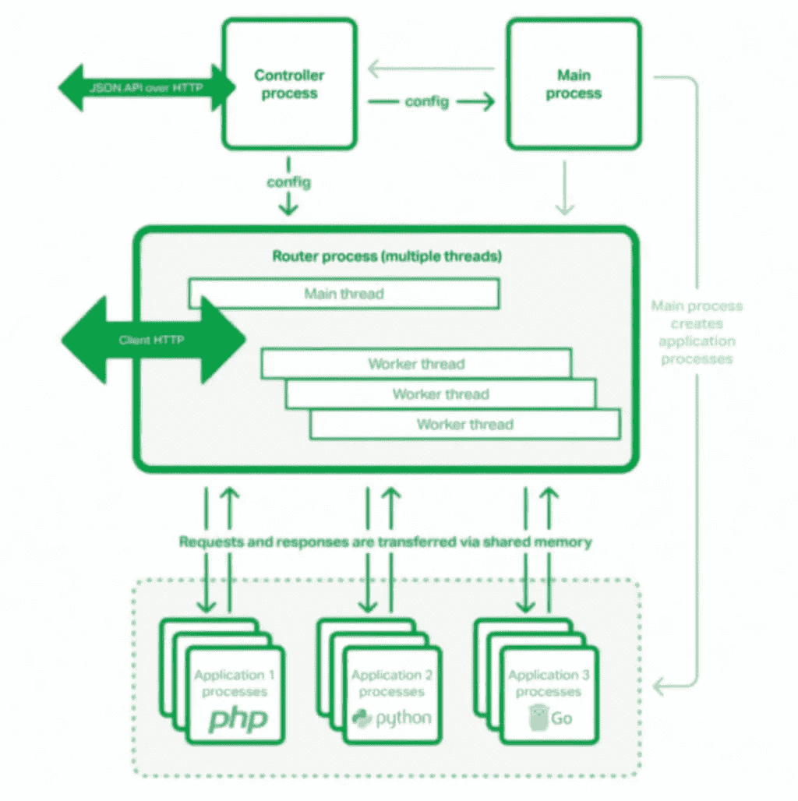

# Nginx 单位做得好

> 原文：<https://medium.com/analytics-vidhya/well-done-nginx-unit-a70960de68b7?source=collection_archive---------1----------------------->


泰勒·尼克斯在 Unsplash[拍摄的照片](https://unsplash.com?utm_source=medium&utm_medium=referral)

你好<coders>,</coders>

On my programming journey, I always felt that server configuration for an application was taking more time than expected. Sometimes, I would be entering into a recursive mode of executing a single command and updating the .conf file (when the configuration server goes wrong) 😿,.

```
while server.conf != right: vim edit server.conf sudo services server_name restart
```

A few days back, I got the chance to explore nginx unit and its features. I felt very excited that the configuration of the webserver can be handled in a **single JSON file**, supporting dynamic web applications elegantly, and *restarting the server not needed* 👏👏. Config file added below for quick insights,

> Nginx unit, is to reduce the operational complexity by providing single middleware to supporting multiple applications and update on fly without dropping connection.

## Architecture:

Nginx-unit, architecture broken into three layers,

1.  Controller process
2.  Router Process
3.  Application Process



## Controller process:

*   manages the configuration of the application(`config.json`) and router process.
*   the process can be interacted/reconfiguration of application and router process via an API interface.
*   reference: [***link***](https://unit.nginx.org/configuration/#configuration-management)

```
sudo curl --unix-socket /path/to/control.unit.sock [http://localhost/config/](http://localhost/config/){
        "listeners": {
            "127.0.0.1:8300": {
                "pass": "applications/blogs"
            }
        },

        "applications": {
            "blogs": {
                "type": "php",
                "root": "/www/blogs/scripts/"
            }
        }
    }
```

## Router process:

*   router process, will accept the incoming requests from the client, transfer to the application process and send back the application response to the client.
*   if the configuration is updated, the router process will start a new worker with the latest configuration and handle new request connection(s).
*   though configuration changed, router worker threads can serve the request without reloading the server.

## Application process:

*   each application is served by Unit is run by an isolated process or set of process.
*   the application process will be started by demand, create a new fork.
*   the router and application process will communicate via socket pairs and shared memory segments.

## Installation:

```
brew install nginx/unit/unit# To install the Java, Perl, Python, and Ruby language modulesbrew install unit-java unit-perl unit-python unit-python3 unit-ruby
```

I have provided installation steps for mac environment, for other environments and languages follow the Nginx unit official [***docs***](https://unit.nginx.org/installation/).

## Configuration ([link](https://unit.nginx.org/configuration/#matching-conditions))

**Listener**

*   To start accepting requests, add a listener object in the `config/listeners` API 部分。
*   单元将收到的请求发送到侦听器引用的目的地。
*   监听器的模式将是`host_addr:port_no`并与应用程序对象映射。

```
"listeners": { "*:8080": { "pass": "applications/flask" },
      "*:8090": { "pass": "applications/django"
     },}
```

**路由对象**

*   路由对象用于过滤/处理监听器和应用程序之间的内部请求。
*   路线步骤的数组用作**路线**属性的值，

```
{
  "listeners": {
    "*:8080": {
      "pass": "**routes**"
    },
    "**routes**": [
 *{
        "****match****": {
          "uri": [
            "!pattern1",
            "!pattern2",
            "pattern3"
          ]
        },
        "****action****": {
          "pass": "..."
        }
      }*
    ]
  }
}
```

*   如果一个请求匹配路由步骤的所有条件，那么监听器中带有`pass` 的动作部分与`pass`相同。

**代理**

*   将该单元处理的请求代理给另一个 HTTP 服务。

```
{
  "routes": [
    {
      "match": {
        "uri": "/ipv4/*"
      },
      "action": {
        "proxy": "[http://127.0.0.1:5000](http://127.0.0.1:8080)"
      }
    }
  ]
}
```

**静态文件**

*   单元能够作为一个独立的 web 服务器，从您配置的目录中为静态资产的请求提供服务；要使用该功能，在[路线](https://unit.nginx.org/configuration/#configuration-routes)步骤的`share`选项中提供目录路径。

```
{
  "listeners": {
    "127.0.0.1:8300": {
      "pass": "routes"
    }
  },
  "routes": [
    {
      "action": {
        "share": "/www/data/static/",
        "fallback": {
          "pass": "/var/app/static/"
        }
      }
    }
  ]
}
```

*   单元具有`fallback`，该属性将有助于从备用位置提供文件(如果在`share`中提到的位置没有找到静态文件)。

提到的配置通常用于所有应用程序，其他配置如限制、用户和组权限请参考本[文档](https://unit.nginx.org/configuration/#)。

**启动和关闭命令**

```
sudo /etc/init.d/unitd startsudo /etc/init.d/unitd stop
```

**样本代码**

我已经用 Nginx 单元配置和 flask 应用程序创建了样例 repo。使用 apache bench 工具，加载 *Nginx 单元+flask***(VS)***uw SGI+flask*应用程序的性能报告。

链接:[https://github.com/ibrahimsha23/nginx_performance](https://github.com/ibrahimsha23/nginx_performance)

***感谢阅读！***

请在评论中分享你的建议。非常感谢大家的反馈和掌声。

要联系我，请在 LinkedIn[上联系我](https://www.linkedin.com/in/ibrahimshak/)。