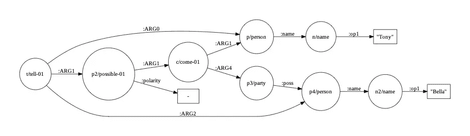
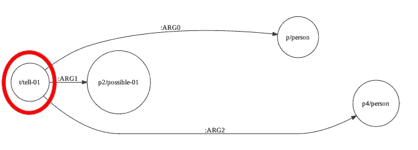
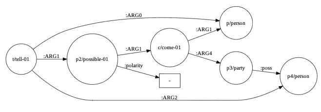

# 什么是抽象意义表示图？

> 原文：<https://medium.com/analytics-vidhya/what-are-abstract-meaning-representation-graphs-2a1149b6475a?source=collection_archive---------1----------------------->

如果您从事 NLP 工作，您可能会遇到一种称为抽象意义表示的图形语义表示。在这篇文章中，我将对抽象意义表示图(AMRs)做一个高层次的介绍。

感觉就像你在任何地方读到的 AMRs 都告诉你，图表在给定的句子中编码了“谁在对谁做什么”[1][2]。因为这是真的！AMR 是一些文本的图形表示，其中节点是概念，边表示概念之间的关系。请注意，图中的节点不一定是句子中的单词，而是句子中概念的高级抽象。让我们看看下面的示例图。具体来说，让我们浏览一下该图中一些关系的准确解释，以帮助您在将来更好地阅读 AMRs。

句子“托尼告诉贝拉他不能来参加她的聚会”的 AMR 图。该图是使用 SOTA AMR 解析器生成的。

关注完整图形中的第一个节点。

观察最左边的节点，我们看到了概念“t/tell-01”。这个符号表示这个节点的标签是“t”，代表概念“tell-01”。但什么是“tell-01”？这是 AMR 概念词汇表中的一个概念。每个概念都有自己的定义，在 [AMR 数据集](https://catalog.ldc.upenn.edu/LDC2020T02)中可以找到一个详细的列表。你需要知道的是:AMR 概念有定义，每个概念基于它们在给定句子中的使用可能有不同的定义(这就是为什么我们有 tell-01，因为确实存在 tell-02)，这些概念用于帮助从句子中的确切单词中抽象出来。

在这个例子中，我们理解 **tell** 指的是原句中的单词“tell”。让我们来分解这个图中与“tell-01”相关的第一个关系。

*   tell-01-->:arg 0--> p/人

对于不熟悉的人来说， **A - > :ARG0 - > B** 的意思是 **B 恰好发生在 A** 身上(至少我是这么想的)。这个关系表示，在这个句子中有一个人在“讲述”一些事情。请注意，在原句中，我们找不到“人”这个词。AMR 解析器已经推断出 Tony 是一个人，并且他正在讲述。这是一个很好的例子，说明 AMR 的*如何将*从像明确的名字这样的低级事物中抽象出来，并提供像“人”这样更一般的东西。

*   tell-01-->:arg 1--> p2/possible-01

这里需要注意一些事情。第一， **A - > :ARG1 - > B** 表示 **A 恰好发生在 B 身上**第二，可能被标注为 p2，因为 p 被人占用了。现在，为了充分理解这种关系，我们需要看到 p2 与什么相关。

*   p2/可能-01-->:极性-->-

这里，我们看到 possible 有一个*负修饰语*。这意味着这是**而不是**可能的。请注意，在这里使用带有否定修饰语的“可能”概念是因为原句使用了“不可能”这一语言。

*   p2/possible-01-->:arg 1--> c/come-01

在这里，这读作“这是不可能来的”，这里的*而不是*来自前面提到的否定修饰语。

接下来，让我们看看指向 p/person 的一些关系

*   p2/possible-01-->:arg 1--> c/come-01-->:arg 1--> p/人
*   t/tell-01--> arg 0--> p/person

所以这里我们有两个不同的要点。1)人是不可能来的。2)那个不能来的人在说什么。这很酷，对吧？关于托尼的行为，我们完全掌握了这句话的语义。

作为一个练习，我鼓励你浏览提供的图表中的各种关系，并准确解释它们编码的内容。

在本文中，我们讨论了如何阅读 AMR。这些图对于 NLP 中需要深入理解语义文本的各种任务非常有用。要获得更详细的信息，我建议参考[1]中的文章，该文章提供了 AMR 的低级分类。

**参考文献**

[1][https://github.com/amrisi/amr-guidelines/blob/master/amr.md](https://github.com/amrisi/amr-guidelines/blob/master/amr.md)

[https://catalog.ldc.upenn.edu/LDC2020T02](https://catalog.ldc.upenn.edu/LDC2020T02)