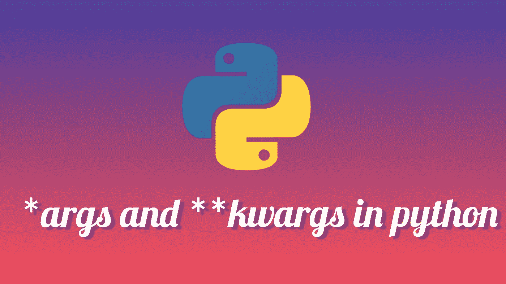

# 什么是*args 和**kwargs？我们来调试一下…

> 原文：<https://medium.com/analytics-vidhya/what-are-args-and-kwargs-lets-debug-it-fe0b430ac36c?source=collection_archive---------11----------------------->



我听很多人说，他们不明白什么时候用(单星)*，或者(双星)**。`***args**`和`****kwargs**`有什么用？难道每次都要用`**args**`**`**kwargs**`就不能用别的名字吗？在我们继续我们的旅程之前，让我们先了解一下我们是否需要`***args**` 和`****kwargs**`。**

> ****需要是发明之母。****

```
def addition(a, b):
   return a+b
```

**这个函数对于数字的相加是正确的，但是如果我们需要 3 个数字或者 4 个数字呢？我不知道，传递的参数数量只能在运行时确定。创建一个函数，不管传递给它的整数有多少，它都可以对所有整数求和，这不是很好吗？哇！！听起来很棒，图片中出现了`***args**`和`****kwargs**` ，稍等片刻我想我仍然可以不使用`***args**`和`****kwargs**` **，**我只是简单地将一个**列表**或一个**集合**中的所有参数传递给我的函数。所以对于`addition()`，我可以传递一个你需要添加的所有整数的列表:**

```
# sum_integers_list.py
def addition(numbers):
    result = 0
    for x in numbers:
        result += x
    return result

list_of_numbers = [1, 2, 3]
print(addition(list_of_numbers))  #Output: 6
```

**是的，这是一种实现方式，每当你需要调用函数时，你必须将`list`或`set`作为参数传递给函数。这可能不太方便，尤其是如果你事先不知道应该进入列表的所有值。
这就是 ***args** 发挥作用的地方，它真的很有用，因为它允许你传递不同数量的位置参数。拿下面这个例子:
**注意**那个`**args**` ***只是一个名字*。**你不需要使用名称`args`。您可以选择任何您喜欢的名称，例如`numbers`:**

```
def addition(*numbers):
  results = 0
  for each in numbers:
    results += each
  return resultsprint(addition(1,2,3))  # Output: 6
```

**这个方法非常好，你可以使用一个可迭代的对象作为一个整数。这里重要的是使用**解包操作符** ( `*****`)。

传递给加法函数的参数存储在一个元组中。因此，我们可以迭代 args 变量。为什么`tuple`不是`list`？因为`tuple`比`list`使用更少的空间，`list`是**可变的**而`tuple`是**不可变的，**比`list`更快。**

**最好理解位置参数和关键字参数之间的区别。
位置参数仅由名称声明。**

*   **位置参数仅由名称声明。**
*   **关键字参数由名称和默认值声明**

**调用函数时，必须给出位置参数的值。否则，我们会得到一个错误。**

```
def fn (a, b, c = 1):          # a/b required, c optional.
    return a * b + c

print fn (1, 2)                # returns 3, positional and default.
print fn (1, 2, 3)             # returns 5, positional.
print fn (c = 5, b = 2, a = 2) # returns 9, named.
print fn (b = 2, a = 2)        # returns 5, named and default.
print fn (5, c = 2, b = 1)     # returns 7, positional and named.
print fn (8, b = 0)            # returns 1, positional, named and default.
```

**在 Python 中， ***总是把关键字参数放在位置参数*** 之后。
`arg_printer(a=4, 2, 4, 5)`它会给出一个错误`SyntaxError: positional argument follows keyword argument`**

**到目前为止，你已经明白了`*args`是干什么的，但是`**kwargs`呢？
收集所有未明确定义的关键字参数，其工作方式与`args`类似，但接受关键字(或名为的**参数)，因为它代表**K**ey**W**ord**Arg**ument**s .******

> ****kwargs 允许函数接受任意数量的关键字参数。**

**传递给`**kwargs`的参数存储在字典中。默认情况下，`**kwargs`是一个空字典。每个未定义的关键字参数作为键值对存储在`**kwargs`字典中。**

```
def concatenate(**kwargs):
    result = ""
    # Iterating over the Python kwargs dictionary
    for arg in kwargs.values():
        result += arg
    return result

print(concatenate(a="Please", b="Like", c="And", d="Share", e="."))
#Output: PleaseLikeAndShare.
```

**您可以在`**kwargs`上执行所有可以在字典上执行的操作。**

> **我们可以在函数中同时使用*args 和**kwargs，但是*args 必须放在**kwargs 之前。**

```
def arg_printer(a, b, *args, **kwargs):
   print(a, b)
   print(args)
   print(option)
   print(kwargs)arg_printer(1, 4, 6, 5, param1=5, param2=6)**Output:**
1 4
(6, 5)
True
{'param1': 5, 'param2': 6}
```

> **单星(*)用于解包任何可迭代对象，而双星(**)用于字典。**

*****感谢阅读。如果您有任何反馈，请告诉我。
快乐学习！！！*****

**如果这篇文章有帮助，请点击拍手👏按钮几下，以示你对作者的支持👇**