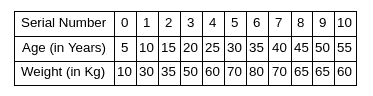
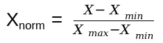
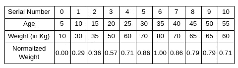
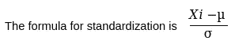
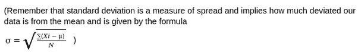
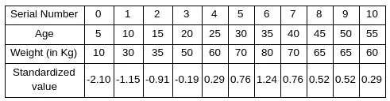

# 什么是数据标准化和数据规范化？

> 原文：<https://medium.com/analytics-vidhya/what-are-data-standardization-and-data-normalization-f880dd9e79b6?source=collection_archive---------2----------------------->

这篇文章是我的 Quora 空间 [AI Pylinux](https://aipylinux.quora.com/) 中的许多文章之一，在那里我写关于 AI、Python 和 linux 的东西。

在这篇文章中，我们将试着理解术语**【标准化】**和**【标准化】。**

**归一化:**

它是将一组数值转换成标准数值范围的过程。值的范围可以是[-1 到 1]、[0 到 1]、[1 到 10]等..这将通过下面的例子变得清楚。

原始数据

在上表中，我们可以发现这个人的最大体重是 80 公斤，最小体重是 10 公斤。现在让我们使用下面的公式(最小最大缩放)和重建表。

最小最大缩放公式

通过将上述公式用于我们的数据表，我们的表将转换如下

标准化数据

现在从上表中我们可以发现，所有的归一化权重都在范围[0 到 1]内。

**标准化:**

标准化，有时也称为 z 分数归一化，是一种类似于归一化的技术，用于重新调整值，但满足标准正态分布的属性。这意味着标准化后，我们的数据集平均值将为零，标准差将为 1。

标准化公式

在我们的原始数据集中，平均值()为 54，标准差(σ)为 20.955

标准化后，我们的表格如下所示:

标准化的价值观

现在，如果我们计算上表中标准化值的平均值和标准偏差，我们将得到平均值为 0，标准偏差为 1

当我们假设我们的数据服从标准的正态分布，我们就去标准化，否则我们就去归一化。

**为什么要规范化或标准化？**

为什么我们应该追求规范化或标准化，是因为我们从中获得的好处，比如比例因子，比如说我们正在处理专业人士的年龄和工资数据。年龄变量将保持在 1-100 左右，而工资可能在 1000-1000000 之间。如果我们在没有缩放的情况下使用这些数据，将会比我们在这篇有证据的[文章](/@urvashilluniya/why-data-normalization-is-necessary-for-machine-learning-models-681b65a05029)中提到的缩放数据花费更多的时间。

如果这对你有帮助，别忘了留下两个掌声。:)

问候，

维格内什·卡希尔卡马尔

[人工授精](https://aipylinux.quora.com/)