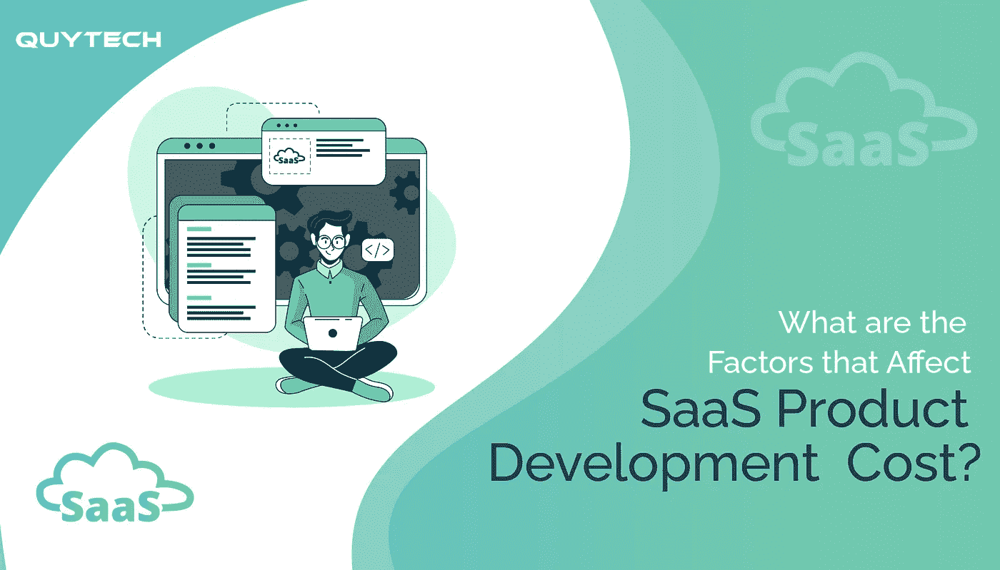

# 影响 SaaS 产品开发成本的因素有哪些？

> 原文：<https://medium.com/analytics-vidhya/what-are-the-factors-that-affect-the-saas-product-development-cost-66b01343782d?source=collection_archive---------16----------------------->

在今天的数字世界里，几乎所有的东西都被互联网所控制。这对软件工程企业家来说是个好消息。建立一个 SaaS 产品提供了一个进入市场的理想机会。

构建 SaaS 解决方案可能是贵公司发展的下一步。然而，开发软件不是一个轻率的决定，也不是在没有彻底调查的情况下做出的决定。

为了对招聘开发团队、分配现金或推广新的解决方案做出正确的判断，您必须掌握 SaaS 开发周期的来龙去脉。

每当谈到 SaaS 的产品开发，客户最常问的问题是:SaaS 的产品开发成本是多少？这是这个博客的主要组成部分。

通过为初创企业和成熟企业构建 SaaS 解决方案， [Quytech](http://url.whate.ch/1dhsl) 已经帮助众多企业和公司取得成功。这篇博客旨在帮助你解决这个问题。

在这里，我们将深入探讨影响开发 SaaS 产品最终成本的主要因素。所以，我们开始吧！

# SaaS 产品开发:什么&为什么企业和公司喜欢它？

替代离线软件的基于网络的服务被称为 SaaS 应用程序。

其基于订阅的按需性质使您的客户无需将它永久下载到他们的设备上或升级操作它所需的硬件。SaaS 商业应用程序将减少您的业务单位的预算花费在他们的 it 部门。

这意味着你可以在开发稳定和可扩展的商业应用的同时投资于其他技能。通过灵活的基于订阅的许可，SaaS 应用程序可以而且必须快速扩展，以处理来自许多来源的大量数据。

您不需要额外的设备来使用 SaaS 应用程序，因此您的 IT 架构和 VPN 访问不需要时间配置和跨多个网站推送。

继续，让我们讨论这个博客的主要内容！

# 影响 SaaS 产品开发成本的因素！

开发 SaaS 产品的成本取决于以下因素:

# #1.技术堆栈

如果您希望 SaaS 解决方案取得成功，确定您应该利用哪些技术是至关重要的。技术栈是你项目的基础，它将决定整个过程。

# #2.数据库ˌ资料库

SaaS 服务需要数据库来存储和组织数据。MySQL、PostgreSQL 和 MongoDB 等数据库是常见的选择。

首先，您必须根据您的应用需求选择是使用集中式模型还是非关系数据库。许多因素会影响您选择的数据库类型，如数据类型、可伸缩性、预期负载、读/写比、编程语言，以及最重要的成本。

# #3.API 集成

你的 SaaS 产品将包括后端功能，就像任何其他软件。问题是如何将它付诸实施。

您可以从头开始创建它，也可以使用 API 来集成它。第二种方法是建立一个 SaaS 应用程序花费较少，但是从头开发一个 SaaS 应用程序可能花费相当大。

# #4.开发团队

要创建一个应用程序，你需要招募专业的 SaaS 产品开发人员，他们可以为你的应用程序提供持续的维护。这些专家的费用将极大地影响项目的成本。

# #5.主办；主持

该网站必须托管才能在互联网上访问。你可以联系一些主机服务商，了解一下最好的主机价格是多少。

# 结论

构建 SaaS 解决方案是一个漫长的过程，其中包括许多重要的里程碑。如果您已经完成了数据分析，并且也为您的 SaaS 应用程序提供了一组功能，接下来的步骤是为其开发选择合适的技术。

开发一款 SaaS 应用的成本取决于多种标准和你雇佣的顶级移动应用开发公司。如果你提前做好研究，比较你的可能性，你可以在这方面做出明智的选择。

如果您正在寻找一家[顶级 SaaS 开发公司](http://url.whate.ch/1dhsn)来帮助您开发安全、可访问且值得信赖的云服务，请联系我们。Quytech 可以帮助您调整目标，并为应用程序的开发推荐合适的技术。

*原载于 2021 年 7 月 30 日*[*【https://www.whatech.com】*](https://www.whatech.com/mobile-apps/blog/710550-what-are-the-factors-that-affect-the-saas-product-development-cost)*。*