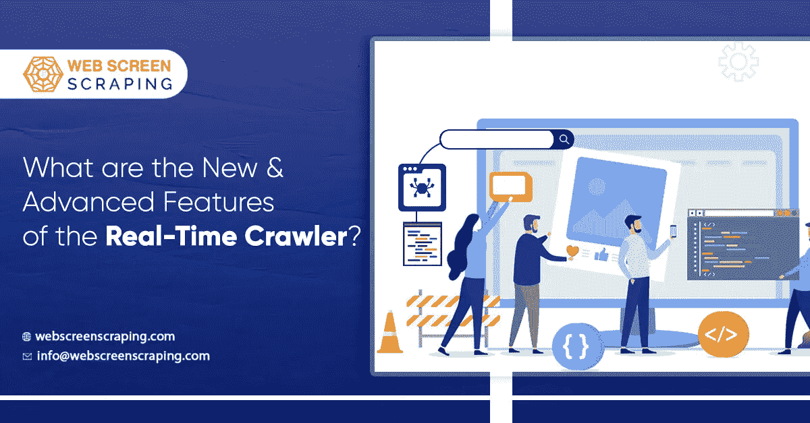

# 实时爬虫的新的和先进的特征是什么？

> 原文：<https://medium.com/analytics-vidhya/what-are-the-new-advanced-features-of-the-real-time-crawler-802d13d8938?source=collection_archive---------14----------------------->

实时爬虫是一种数据抽取软件，它帮助用户获取实时数据，因为它特别适用于价格情报等目标。系统有了许多发展，所有的改进都是为了增强功能和改进，这样你就可以有额外的用户满意度。

这也是为了提高你的数据抓取工作的能力，通过这一点，你可以说一个[实时爬虫](https://www.webscreenscraping.com/real-time-api.php)很快就会看到进一步的增强，因为他们总是准备好做一些改进。

实时爬虫带给表的特性包括能够使用 URL 传递实时请求参数。您还可以使用类似的连接以您需要的所有格式立即获得数据；原始 HTML 格式或解析的 JSON 格式。

有了这些改进，使用实时爬虫变得更加容易，并且在为各种 web 抓取需求制作实时爬虫时可以节省宝贵的时间。

它获取数据的时间并不是永久的，而是依赖于目标网站获取数据的时间。如果您仍然不确定或对程序的功能有疑问，您需要阅读官方文档或联系您的客户经理。

# 为什么你的企业应该使用实时爬虫？

网络有大量的知识，但是，它是一个复合的来源。公共数据资源经常改变它们的结构，为了获得访问权，你需要利用一个与数据源兼容的系统。

一些数据源需要访问者具备高超的技术知识，而另一些数据源通过增加步骤使收集数据成为一场噩梦，这会使整个过程变得一团糟。

这就是为什么许多人利用一个可以收集所有卷的数据并实时收集的系统，这就是实时爬虫要发挥作用的地方。

由于实时爬虫是已经可用的程序，这是一种比从头开始创建你的网络爬虫更便宜的购买方式。尽管创建一个 web 数据抓取器很划算，但你会浪费时间，还需要专业人员全职与你一起工作。

您可以通过已经准备好的程序将自己从所有的压力中解救出来，并且将您的数据收集需求转发到程序中。由于您不需要几个强大的服务器，基础设施成本也将下降，您可以将这笔钱投资于其他领域。

作为一个强大的数据抓取工具，它被设计为允许轻松地从搜索引擎以及电子商务网站等资源中抓取数据，实时爬虫可以被称为实时数据抓取解决方案。

它非常简单易用。你只需要提供数据源 URL，这将为你提供正确格式的数据，这可以很容易地被团队或应用程序框架分析。

使用实时爬虫，很容易在数据收集工作中获得 100%的保证成功率。它使用更大的 IP 池以及先进的 IP 备份，以便数据采集能够顺利进行，不会因代理休眠或被阻止的 IP 而出现延迟。利用这一点，你可以确信你每次都会成功。

实时爬虫的用户也许能够准确地识别他们需要什么，而不用写任何代码。使用实时爬虫的这种适用性是因为基于实时端点的单行组合。

因此数据将在类似的请求和连接上被直接提取。

# 实时电子商务价格智能

实时爬虫已经看到了更多的增强，还有更多，还在后面。用户正在享受从搜索引擎和电子商务网站轻松抓取大量数据的效率和速度。在设计真正的爬虫时已经考虑到了这些因素，使得它非常有效，并且保证 100%的成功。所有旨在获得类似人类行为的铲运机机器人以及实时爬虫都通过使用大 IP 池和高级备份 IP 解决了这一问题。你选择的代理是非常重要的，因为你使用的机器人，这就是为什么你需要得到一个可靠的 IP 资源。那里有许多可用的代理，你可以利用，并不是所有的都可以通过该网站的渐进代理检测算法而被忽略。因此，你需要一个可靠的服务提供商，如网络屏幕抓取，为你提供完整的性能和专用的知识产权。